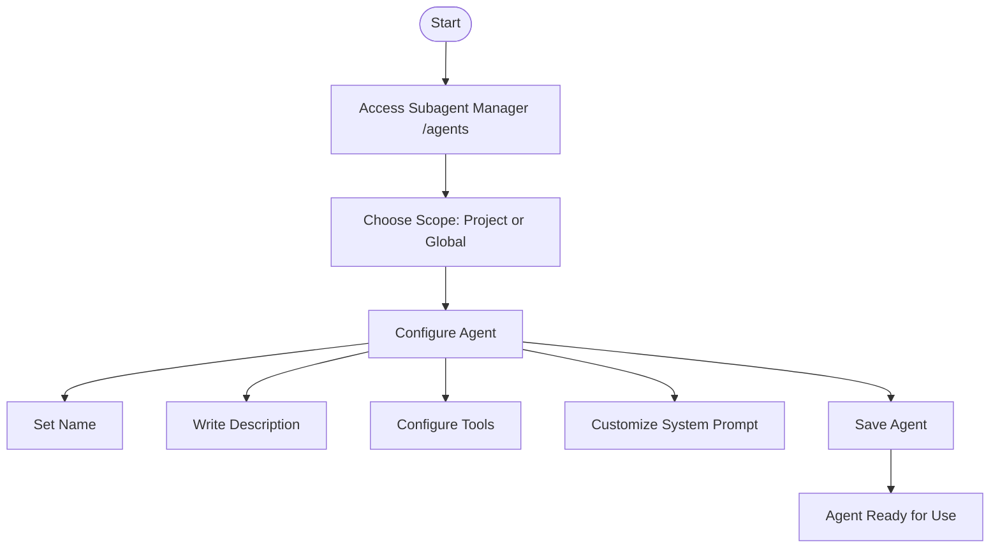
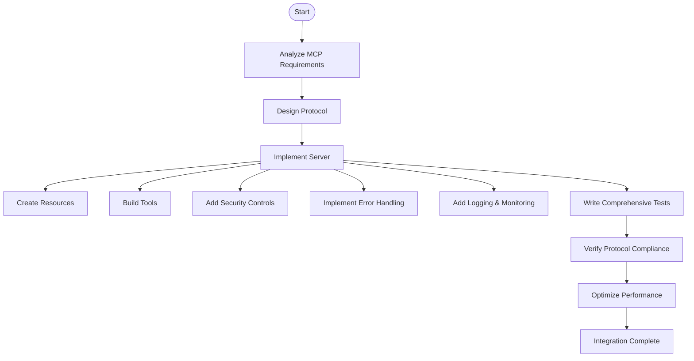

# Contribution Guidelines

<cite>
**Referenced Files in This Document**   
- [README.md](file://README.md)
- [api-designer.md](file://api-designer.md)
- [code-reviewer.md](file://code-reviewer.md)
- [mcp-developer.md](file://mcp-developer.md)
</cite>

## Table of Contents
1. [Introduction](#introduction)
2. [Creating New Subagent Definitions](#creating-new-subagent-definitions)
3. [Improving Existing Agent Definitions](#improving-existing-agent-definitions)
4. [Adding MCP Tool Integrations](#adding-mcp-tool-integrations)
5. [Writing Effective Role Definitions](#writing-effective-role-definitions)
6. [Quality Assurance Guidelines](#quality-assurance-guidelines)
7. [Version Control and Pull Request Workflow](#version-control-and-pull-request-workflow)
8. [Troubleshooting Common Issues](#troubleshooting-common-issues)
9. [Performance Considerations](#performance-considerations)
10. [Conclusion](#conclusion)

## Introduction
This document provides comprehensive guidelines for contributing to the agents repository, a collection of production-ready Claude Code subagents. The repository contains specialized AI agents designed for specific development tasks, following best practices and industry standards. Contributions are essential for maintaining the quality, relevance, and comprehensiveness of this resource. This guide details the processes for creating new subagents, improving existing ones, adding MCP tool integrations, and ensuring contributions meet the repository's high standards.

**Section sources**
- [README.md](file://README.md#L1-L50)

## Creating New Subagent Definitions
To create a new subagent definition, follow the standardized structure outlined in the repository. Begin by accessing the Subagent Manager using the `/agents` command in Claude Code. Choose whether the subagent should be project-specific (stored in `.claude/agents/`) or global (stored in `~/.claude/agents/`). Let Claude generate an initial version, then customize it according to your needs.

The subagent creation process involves several key steps:
1. Provide a comprehensive description of the agent's role and activation scenarios
2. Configure tool permissions, either granting specific access or inheriting all available tools
3. Customize the system prompt using the built-in editor (press `e` for advanced customization)
4. Save the agent, making it immediately available for use

Each subagent must follow the standardized template format with YAML front matter containing the name, description, and tools, followed by structured sections for role definition, MCP tool integration, communication protocol, and implementation workflow.

**Diagram sources**
- [README.md](file://README.md#L280-L337)

**Section sources**
- [README.md](file://README.md#L280-L337)

## Improving Existing Agent Definitions
Enhancing existing agent definitions involves refining their tool integrations, workflows, and expertise to better serve their intended purposes. When improving an agent, focus on strengthening its MCP tool integration, clarifying its workflow, and expanding its domain expertise. Review the agent's current implementation against the subagent structure standard and identify areas for enhancement.

Key improvement areas include:
- Enhancing tool integrations for better functionality
- Clarifying workflows for more predictable behavior
- Expanding expertise with additional knowledge domains
- Improving communication protocols for better inter-agent collaboration
- Optimizing performance and resource usage

When modifying an existing agent, ensure backward compatibility and document any breaking changes. Test the improved agent thoroughly before submission to verify that enhancements do not introduce regressions.

**Section sources**
- [README.md](file://README.md#L330-L337)

## Adding MCP Tool Integrations
Adding new MCP (Model Context Protocol) tool integrations requires expertise in protocol implementation and integration patterns. The MCP developer agent specializes in building servers and clients that connect AI systems with external tools and data sources. When adding a new tool integration, follow the MCP development checklist to ensure protocol compliance, security, and performance.

The integration process involves:
1. Understanding MCP requirements and architecture needs
2. Implementing core protocol handlers and resource endpoints
3. Building tool functions with proper security controls
4. Implementing comprehensive error handling and logging
5. Writing thorough tests with >90% coverage
6. Documenting the integration for other users

MCP tool integrations must comply with JSON-RPC 2.0 standards and implement proper schema validation, transport configuration, authentication handling, and rate limiting. The integration should also include health check endpoints and monitoring hooks for production readiness.

**Diagram sources**
- [mcp-developer.md](file://mcp-developer.md#L137-L241)

**Section sources**
- [mcp-developer.md](file://mcp-developer.md#L0-L102)

## Writing Effective Role Definitions
Effective role definitions are crucial for subagent functionality and should clearly articulate the agent's expertise, responsibilities, and operational parameters. A well-crafted role definition includes a comprehensive description of capabilities, specific activation scenarios, and clear boundaries for the agent's domain.

Key elements of effective role definitions:
- **Specialization**: Clearly define the agent's area of expertise
- **Activation Triggers**: Specify when the agent should be invoked
- **Tool Permissions**: Define appropriate tool access levels
- **Workflow Patterns**: Outline standard operating procedures
- **Communication Protocols**: Establish inter-agent communication standards
- **Success Metrics**: Define criteria for successful task completion

Role definitions should be concise yet comprehensive, providing enough context for the agent to operate effectively while avoiding unnecessary constraints. Use active language and specific examples to illustrate the agent's capabilities and expected behavior.

**Section sources**
- [api-designer.md](file://api-designer.md#L1-L42)
- [code-reviewer.md](file://code-reviewer.md#L1-L42)

## Quality Assurance Guidelines
Quality assurance for subagent definitions involves systematic testing and validation to ensure reliability, security, and performance. Before submitting a subagent, conduct thorough testing across multiple dimensions including functionality, security, performance, and usability.

The quality assurance process should include:
- **Functional Testing**: Verify all features work as intended
- **Security Review**: Check for vulnerabilities and ensure proper access controls
- **Performance Benchmarking**: Measure response times and resource usage
- **Compatibility Testing**: Ensure compatibility with different environments
- **Documentation Review**: Verify completeness and accuracy of documentation
- **User Experience Testing**: Assess ease of use and clarity of communication

For MCP tool integrations, additional testing requirements include protocol compliance verification, error handling robustness, and scalability testing. Test coverage should exceed 90% for production-ready implementations.

**Section sources**
- [mcp-developer.md](file://mcp-developer.md#L42-L43)
- [code-reviewer.md](file://code-reviewer.md#L8-L10)

## Version Control and Pull Request Workflow
The repository follows standard Git version control practices with a structured pull request workflow to ensure code quality and maintainability. Contributors should fork the repository, create feature branches for their changes, and submit pull requests for review.

The pull request workflow includes:
1. Fork the repository and create a descriptive branch name
2. Implement changes following the repository's coding standards
3. Test changes thoroughly and update documentation as needed
4. Submit a pull request with a clear description of changes
5. Address reviewer feedback and make necessary revisions
6. Merge after approval from maintainers

Pull requests should include detailed descriptions of changes, rationale for modifications, and any relevant testing results. Large changes should be broken into smaller, focused PRs for easier review. Contributors are expected to respond promptly to review comments and collaborate with maintainers to resolve any issues.

**Section sources**
- [README.md](file://README.md#L330-L337)

## Troubleshooting Common Issues
Common contribution issues include formatting errors, integration problems, and compatibility issues. When encountering these problems, follow systematic troubleshooting procedures to identify and resolve the root cause.

Frequent issues and solutions:
- **Formatting Errors**: Verify YAML syntax and markdown formatting against the repository standards
- **Integration Problems**: Check tool availability and configuration, verify protocol compliance
- **Compatibility Issues**: Test across different environments and configurations
- **Performance Bottlenecks**: Profile resource usage and optimize critical paths
- **Security Vulnerabilities**: Conduct thorough security reviews and penetration testing

For MCP tool integrations, specific troubleshooting steps include verifying JSON-RPC message formats, checking schema validation, and testing error handling scenarios. Use logging and monitoring tools to diagnose issues in production-like environments.

**Section sources**
- [mcp-developer.md](file://mcp-developer.md#L44-L102)
- [README.md](file://README.md#L207-L238)

## Performance Considerations
As the repository scales, maintaining performance efficiency becomes increasingly important. Performance considerations include optimizing subagent initialization times, minimizing resource usage, and ensuring responsive interactions.

Key performance optimization strategies:
- **Lazy Loading**: Load subagents only when needed
- **Caching**: Implement caching for frequently accessed resources
- **Connection Pooling**: Reuse connections to external services
- **Batch Processing**: Combine multiple operations when possible
- **Resource Cleanup**: Properly release resources after use
- **Memory Management**: Monitor and optimize memory usage
- **Profiling**: Regularly profile performance to identify bottlenecks
- **Scalability Planning**: Design for horizontal scaling when appropriate

For MCP tool integrations, performance optimization should focus on reducing latency, maximizing throughput, and ensuring reliability under load. Implement health checks and monitoring to detect performance degradation early.

**Section sources**
- [mcp-developer.md](file://mcp-developer.md#L84-L91)
- [api-designer.md](file://api-designer.md#L58-L65)

## Conclusion
Contributing to the agents repository is a valuable way to enhance the capabilities of Claude Code and support the developer community. By following these guidelines for creating subagent definitions, improving existing agents, adding MCP tool integrations, and ensuring quality through thorough testing and review processes, contributors can help maintain the repository's high standards. The structured approach to contributions, combined with attention to performance and scalability, ensures that the repository remains a valuable resource for developers worldwide.