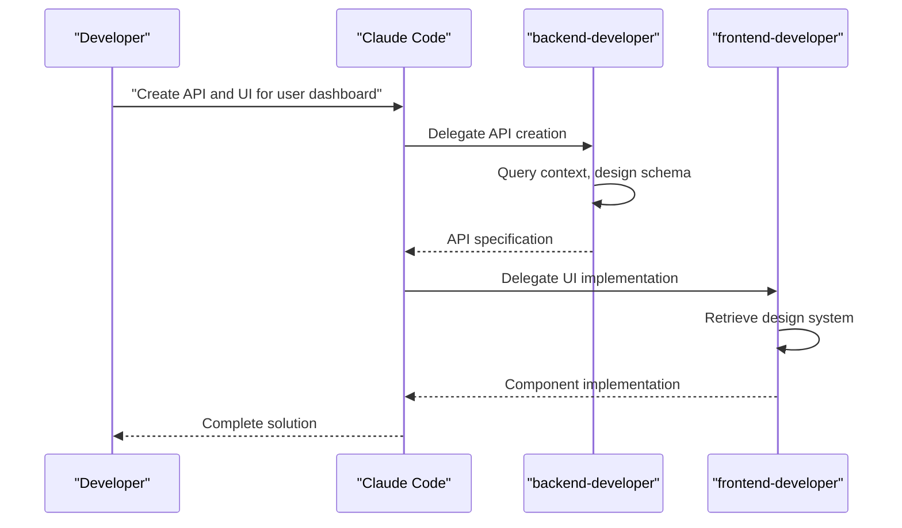
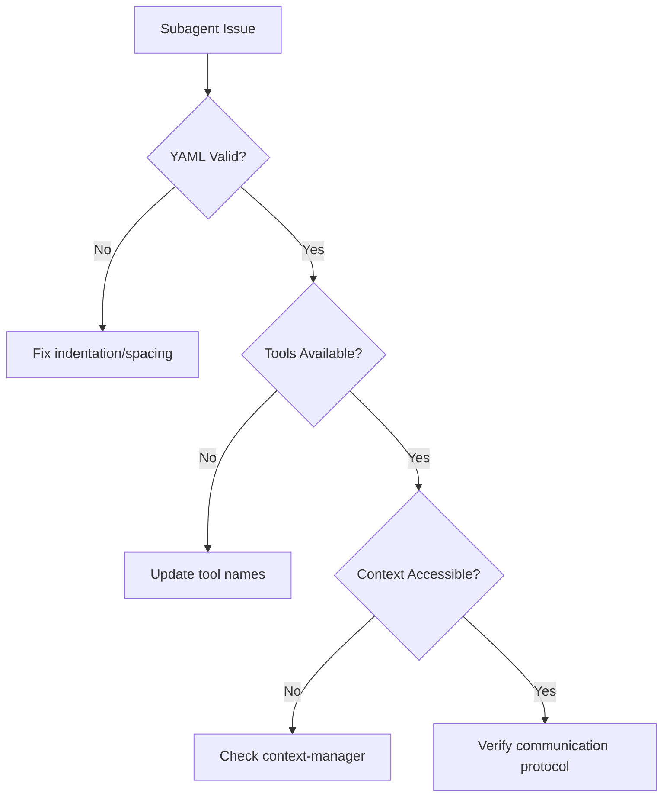
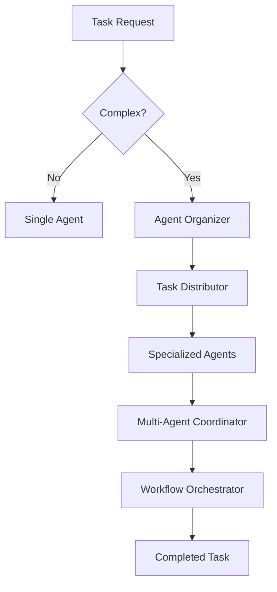

# Getting Started

<cite>
**Referenced Files in This Document**   
- [README.md](file://README.md)
- [backend-developer.md](file://backend-developer.md)
- [frontend-developer.md](file://frontend-developer.md)
- [api-designer.md](file://api-designer.md)
- [mcp-developer.md](file://mcp-developer.md)
- [context-manager.md](file://context-manager.md)
- [agent-organizer.md](file://agent-organizer.md)
- [workflow-orchestrator.md](file://workflow-orchestrator.md)
- [multi-agent-coordinator.md](file://multi-agent-coordinator.md)
- [task-distributor.md](file://task-distributor.md)
</cite>

## Table of Contents
1. [Introduction](#introduction)
2. [Prerequisites](#prerequisites)
3. [Locating and Using Subagent Definitions](#locating-and-using-subagent-definitions)
4. [Understanding Subagent Structure](#understanding-subagent-structure)
5. [Practical Examples](#practical-examples)
6. [Customizing Subagents](#customizing-subagents)
7. [Common Setup Issues and Solutions](#common-setup-issues-and-solutions)
8. [Performance Considerations](#performance-considerations)
9. [Conclusion](#conclusion)

## Introduction
This guide provides comprehensive instructions for using subagent definitions with Claude Code or compatible AI development environments. The repository contains a collection of production-ready subagents designed to enhance AI capabilities for specific development tasks. Each subagent follows best practices and industry standards, enabling users to leverage specialized expertise for various software development domains.

**Section sources**
- [README.md](file://README.md#L1-L50)

## Prerequisites
Before using subagents, ensure you have the following foundational knowledge:

- **YAML understanding**: Ability to read and modify YAML front matter (name, description, tools)
- **Basic AI prompting**: Familiarity with conversational AI interfaces and command structures
- **Software development concepts**: Understanding of common programming paradigms, architecture patterns, and development workflows

These prerequisites enable effective interaction with subagents and customization of their behavior for specific project needs.

**Section sources**
- [README.md](file://README.md#L250-L260)

## Locating and Using Subagent Definitions
To begin using subagents, follow these steps:

1. **Browse the repository**: Navigate through the categorized subagents to identify the one matching your task requirements
2. **Copy the definition**: Select the appropriate `.md` file and copy its entire content
3. **Place in project**: Save the subagent file in the `.claude/agents/` directory of your project
4. **Invoke naturally**: Use the subagent by mentioning it in conversation or allowing Claude Code to automatically engage it

Subagents are organized into categories such as Core Development, Language Specialists, Infrastructure, and more. You can locate specific agents like `backend-developer.md` for API creation or `frontend-developer.md` for UI implementation directly from the repository structure.

**Section sources**
- [README.md](file://README.md#L50-L100)

## Understanding Subagent Structure
Each subagent follows a standardized template with three main components:

### YAML Front Matter
The header contains metadata in YAML format:
- **name**: Unique identifier for the subagent
- **description**: Brief overview of capabilities and expertise
- **tools**: List of MCP (Model Context Protocol) tools the subagent can access

### Role Definition
This section defines the subagent's expertise, responsibilities, and operational guidelines. It includes:
- Domain-specific knowledge and technical stack
- Implementation checklists and quality standards
- Development methodologies and best practices
- Integration patterns with other agents

### Communication Protocol
Specifies how the subagent interacts with the system:
- Context retrieval requirements
- Status update formats
- Progress reporting mechanisms
- Inter-agent communication specifications

For example, the `backend-developer.md` subagent includes detailed requirements for API design, database architecture, security implementation, and performance optimization.

**Section sources**
- [README.md](file://README.md#L300-L320)
- [backend-developer.md](file://backend-developer.md#L1-L20)
- [frontend-developer.md](file://frontend-developer.md#L1-L20)
- [api-designer.md](file://api-designer.md#L1-L20)

## Practical Examples
### Using the Backend Developer Subagent
To create a REST API:
1. Copy `backend-developer.md` to your project's `.claude/agents/` folder
2. Request assistance: "Have the backend-developer create a user management API"
3. The subagent will:
   - Query context for existing architecture
   - Design RESTful endpoints with proper HTTP semantics
   - Implement database schema with indexing
   - Set up authentication and authorization
   - Generate OpenAPI documentation
   - Ensure 80%+ test coverage

### Using the Frontend Developer Subagent
For UI implementation:
1. Deploy `frontend-developer.md` in your agents directory
2. Request: "Ask the frontend-developer to build a dashboard component"
3. The agent will:
   - Retrieve design system context
   - Create React components with TypeScript
   - Implement responsive layouts
   - Ensure WCAG 2.1 AA accessibility compliance
   - Write comprehensive tests (>85% coverage)
   - Generate Storybook documentation

**Diagram sources**
- [backend-developer.md](file://backend-developer.md#L20-L50)
- [frontend-developer.md](file://frontend-developer.md#L20-L50)

**Section sources**
- [backend-developer.md](file://backend-developer.md#L1-L100)
- [frontend-developer.md](file://frontend-developer.md#L1-L100)

## Customizing Subagents
To adapt a subagent for specific project needs:

1. **Modify tools**: Update the tools list in the YAML front matter to grant or restrict MCP tool access
2. **Adjust expertise scope**: Edit the role definition to emphasize specific frameworks, libraries, or architectural patterns
3. **Update requirements**: Modify checklists and standards to align with project-specific quality criteria
4. **Enhance communication**: Customize the communication protocol for better integration with your workflow

For instance, to specialize the `backend-developer.md` for a Go-based microservices project:
- Add `kubernetes` and `helm` to the tools list
- Emphasize Go/Gin framework expertise in the role definition
- Update the database architecture approach to include service mesh considerations
- Modify the MCP tool integration section to include Kubernetes deployment patterns

**Section sources**
- [backend-developer.md](file://backend-developer.md#L1-L50)
- [mcp-developer.md](file://mcp-developer.md#L1-L20)

## Common Setup Issues and Solutions
### Incorrect YAML Formatting
**Issue**: Invalid YAML syntax prevents subagent loading
**Solution**: Validate YAML structure using online validators or IDE extensions, ensuring proper indentation and colon spacing

### Missing MCP Tool Access
**Issue**: Subagent cannot execute tasks due to restricted tool permissions
**Solution**: Verify tool names in the YAML front matter match available MCP tools; consult documentation for correct tool names

### Context Retrieval Failures
**Issue**: Subagents fail to retrieve necessary context from context-manager
**Solution**: Ensure context-manager is properly configured and accessible; verify communication protocol formats

### Agent Selection Conflicts
**Issue**: Multiple subagents with similar names cause invocation conflicts
**Solution**: Use project-specific subagents (in `.claude/agents/`) to override global ones; ensure unique naming conventions

**Diagram sources**
- [context-manager.md](file://context-manager.md#L20-L40)
- [agent-organizer.md](file://agent-organizer.md#L20-L40)

**Section sources**
- [README.md](file://README.md#L150-L200)
- [context-manager.md](file://context-manager.md#L1-L50)

## Performance Considerations
### Context Window Management
- **Optimize context usage**: Subagents operate in isolated contexts to prevent main conversation clutter
- **Efficient information retrieval**: Use context-manager to acquire only necessary system information
- **Progressive disclosure**: Implement phased context loading based on task requirements

### Agent Selection Strategies
- **Capability matching**: Select agents based on specific skill requirements
- **Performance history**: Consider historical success rates and response times
- **Resource utilization**: Balance workload across available agents
- **Cost optimization**: Choose agents with appropriate tool access levels

### Workflow Orchestration
Coordinate multiple agents effectively:
- Use `agent-organizer.md` for team assembly and task decomposition
- Employ `multi-agent-coordinator.md` for complex workflow orchestration
- Leverage `workflow-orchestrator.md` for state management and error handling
- Utilize `task-distributor.md` for intelligent work allocation

**Diagram sources**
- [agent-organizer.md](file://agent-organizer.md#L1-L20)
- [multi-agent-coordinator.md](file://multi-agent-coordinator.md#L1-L20)
- [workflow-orchestrator.md](file://workflow-orchestrator.md#L1-L20)
- [task-distributor.md](file://task-distributor.md#L1-L20)

**Section sources**
- [agent-organizer.md](file://agent-organizer.md#L1-L100)
- [multi-agent-coordinator.md](file://multi-agent-coordinator.md#L1-L100)
- [workflow-orchestrator.md](file://workflow-orchestrator.md#L1-L100)
- [task-distributor.md](file://task-distributor.md#L1-L100)

## Conclusion
This guide has provided comprehensive instructions for using subagent definitions with Claude Code. By following these steps, you can effectively leverage specialized AI agents for various development tasks. The repository's production-ready subagents, combined with proper customization and orchestration, enable enhanced productivity and code quality. Remember to start with the provided templates, customize as needed, and utilize the full ecosystem of coordinating agents for complex workflows.

**Section sources**
- [README.md](file://README.md#L1-L350)