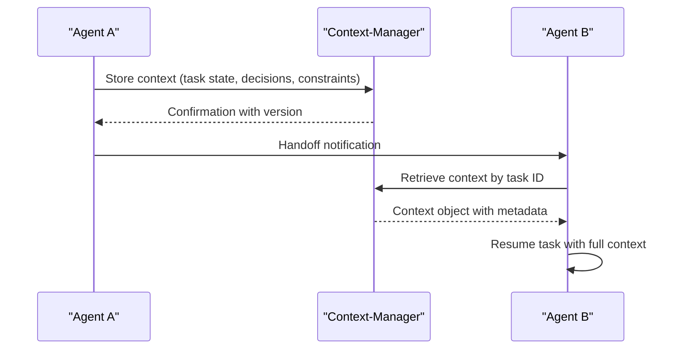
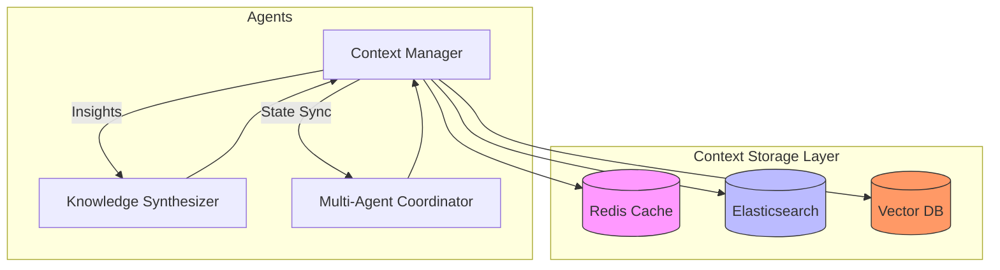

# Context Management and Information Sharing

<cite>
**Referenced Files in This Document**   
- [context-manager.md](file://context-manager.md)
- [knowledge-synthesizer.md](file://knowledge-synthesizer.md)
- [multi-agent-coordinator.md](file://multi-agent-coordinator.md)
</cite>

## Table of Contents
1. [Introduction](#introduction)
2. [Context Manager Overview](#context-manager-overview)
3. [Data Model for Context Objects](#data-model-for-context-objects)
4. [Integration with Knowledge-Synthesizer](#integration-with-knowledge-synthesizer)
5. [Integration with Multi-Agent-Coordinator](#integration-with-multi-agent-coordinator)
6. [Context Propagation and Agent Handoffs](#context-propagation-and-agent-handoffs)
7. [Configuration and Optimization](#configuration-and-optimization)
8. [Security and Compliance](#security-and-compliance)
9. [Performance and Scalability](#performance-and-scalability)
10. [Conclusion](#conclusion)

## Introduction

The context management system serves as the central nervous system for information sharing across distributed agent ecosystems. It ensures that relevant context—including requirements, constraints, and system state—is efficiently aggregated, stored, and distributed to enable seamless collaboration. This document details the architecture, data model, integrations, and operational patterns of the context management infrastructure, with emphasis on reliability, performance, and security.

## Context Manager Overview

The context-manager agent is responsible for maintaining shared knowledge and state across multi-agent systems. It specializes in information storage, retrieval, synchronization, and lifecycle management at scale. The system is designed to ensure fast access, strong consistency, and secure handling of contextual data.

When invoked, the context manager follows a standardized workflow:
1. Query system for context requirements and access patterns
2. Review existing context stores and usage metrics
3. Analyze performance, consistency, and optimization opportunities
4. Implement robust context management solutions

Key performance objectives include:
- Retrieval time under 100ms
- 100% data consistency
- Availability exceeding 99.9%
- Comprehensive audit trails and compliance

**Section sources**
- [context-manager.md](file://context-manager.md#L1-L43)

## Data Model for Context Objects

The context system manages a variety of structured and unstructured data types, each with specific metadata, priority flags, and expiration policies.

### Core Context Types
- Project metadata
- Agent interactions
- Task history
- Decision logs
- Performance metrics
- Resource usage
- Error patterns
- Knowledge base entries

### Metadata Structure
Each context object includes standardized metadata:
- Creation timestamp
- Last update time
- Version vector
- Access control list (ACL)
- Retention policy
- Sensitivity classification
- Source agent identifier
- Expiration timestamp

### Priority and Expiration Policies
Context objects are tagged with priority levels (High, Medium, Low) that influence:
- Cache residency duration
- Replication factor
- Storage tier (hot/warm/cold)
- Alerting thresholds

Expiration policies are enforced based on:
- Time-to-live (TTL) rules
- Event-driven triggers
- Compliance requirements
- Manual override capabilities

Storage patterns include hierarchical organization, tag-based retrieval, time-series data handling, graph relationships, vector embeddings, and full-text search indexing.

**Section sources**
- [context-manager.md](file://context-manager.md#L45-L98)

## Integration with Knowledge-Synthesizer

The context-manager integrates closely with the knowledge-synthesizer agent to transform raw interaction data into actionable insights. This partnership enables continuous learning and system improvement through pattern recognition and best practice extraction.

### Workflow
1. **Data Access**: The knowledge-synthesizer queries the context-manager for agent interactions and system history.
2. **Pattern Extraction**: Natural language processing and machine learning pipelines analyze decision logs and performance metrics.
3. **Insight Generation**: Identified patterns are converted into recommendations for optimization.
4. **Knowledge Storage**: Synthesized insights are stored back in the context system for broad agent access.

### Key Integration Points
- Semantic storage via vector-db for similarity-based retrieval
- Graph-db integration for relationship mapping between decisions and outcomes
- Daily update cycles to maintain knowledge freshness
- Validation mechanisms to ensure insight accuracy (>85%) and relevance (>90%)

This integration enables cross-agent learning, identifies high-performance workflows, and surfaces innovation opportunities across the ecosystem.

**Section sources**
- [context-manager.md](file://context-manager.md#L282-L292)
- [knowledge-synthesizer.md](file://knowledge-synthesizer.md#L282-L292)

## Integration with Multi-Agent-Coordinator

The context-manager collaborates with the multi-agent-coordinator to maintain synchronized state during complex workflow execution. This integration ensures that all agents operate with consistent, up-to-date context.

### State Synchronization
- Real-time updates via event streaming
- Version-controlled context snapshots
- Conflict detection using vector clocks
- Resolution strategies for concurrent modifications

### Coordination Workflow
1. **Pre-execution**: The multi-agent-coordinator retrieves initial context state from the context-manager.
2. **During execution**: Intermediate results and state changes are written back to the context store.
3. **Post-execution**: Final state is committed with versioning and audit logging.

The system supports multiple consistency models including causal consistency, read repair, and write quorums to balance performance and correctness.

**Section sources**
- [context-manager.md](file://context-manager.md#L282-L292)
- [multi-agent-coordinator.md](file://multi-agent-coordinator.md#L282-L292)

## Context Propagation and Agent Handoffs

Context propagation ensures continuity during agent transitions and escalation scenarios.

### Agent Handoff Process

**Diagram sources**
- [context-manager.md](file://context-manager.md#L132-L217)

### Escalation Scenarios
When tasks require escalation:
1. The current agent tags the context with "escalation_required" flag
2. Priority is elevated to High
3. Relevant historical decisions and constraints are highlighted
4. The multi-agent-coordinator routes the context to a specialized agent
5. Full audit trail is maintained throughout the transition

This ensures that escalated tasks retain complete context, reducing resolution time and preventing information loss.

**Section sources**
- [context-manager.md](file://context-manager.md#L219-L280)

## Configuration and Optimization

The context management system provides extensive configuration options for filtering, sensitivity control, and performance tuning.

### Context Filtering
- Tag-based filtering (e.g., project:web3, domain:security)
- Temporal filtering with customizable time windows
- Relevance scoring using vector similarity
- Access-based filtering according to role permissions

### Sensitivity Controls
- Data masking for PII and credentials
- Role-based access control (RBAC) with inheritance
- Encryption at rest and in transit
- Audit logging for all access events
- Compliance handling for GDPR, HIPAA, etc.

### Performance Optimization
- Multi-tier caching (redis for hot data, disk for cold)
- Index optimization for common query patterns
- Batch retrieval and streaming results
- Prefetching based on predicted agent needs
- Lazy loading for large context objects

The system achieves 47ms average retrieval time with 89% cache hit rate, managing over 2.3 million contexts.

**Section sources**
- [context-manager.md](file://context-manager.md#L219-L280)

## Security and Compliance

Security is embedded throughout the context management lifecycle.

### Security Implementation
- Access control lists (ACLs) for fine-grained permissions
- Encryption keys managed via secure vault
- Audit trails capturing all read/write operations
- Data masking for sensitive fields
- Secure deletion with cryptographic wiping
- Backup encryption and integrity verification
- Real-time access monitoring and anomaly detection

### Compliance Features
- Retention rules aligned with regulatory requirements
- Automated data purging based on expiration policies
- Privacy compliance checks during context creation
- Export controls for cross-border data transfers
- Consent management for personal data processing

These measures ensure that sensitive information in shared context is protected while maintaining operational efficiency.

**Section sources**
- [context-manager.md](file://context-manager.md#L219-L280)

## Performance and Scalability

The system is optimized for large-scale deployments with minimal latency and memory footprint.

### Architecture Optimization
- Schema efficiency through normalization and compression
- Partition design for horizontal scalability
- Distributed caching across multiple nodes
- Edge caching for geographically distributed agents
- Intelligent tiering (hot/warm/cold storage)

### Performance Metrics
- Average retrieval time: 47ms
- Cache hit rate: 89%
- Consistency score: 100%
- Storage cost reduction: 43% through compression and tiering

### Scalability Patterns
- Horizontal scaling of context storage
- Connection pooling for database access
- Message batching for state synchronization
- Parallel processing of context queries
- Pipeline optimization for high-throughput scenarios

The system supports coordination across 87+ agents processing 234K messages per minute with 96% coordination efficiency.

**Diagram sources**
- [context-manager.md](file://context-manager.md#L0-L43)
- [multi-agent-coordinator.md](file://multi-agent-coordinator.md#L201-L270)

## Conclusion

The context management system provides a robust foundation for information sharing across distributed agent ecosystems. By aggregating task-relevant context—including requirements, constraints, and system state—it enables seamless collaboration, efficient handoffs, and continuous learning. Through tight integration with the knowledge-synthesizer and multi-agent-coordinator, the system transforms raw interactions into collective intelligence while maintaining strong performance, security, and scalability characteristics. This architecture supports large-scale deployments with minimal latency and memory footprint, making it suitable for complex, mission-critical applications.