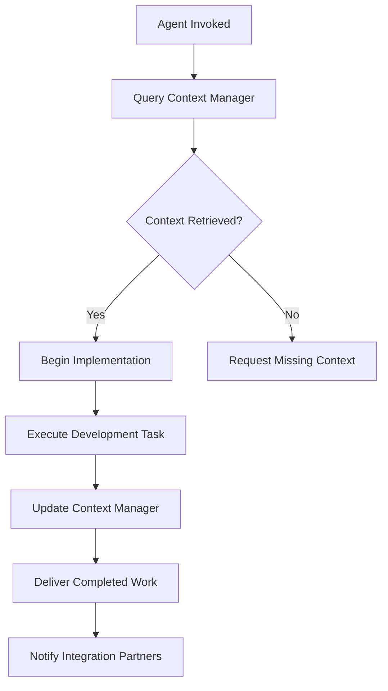
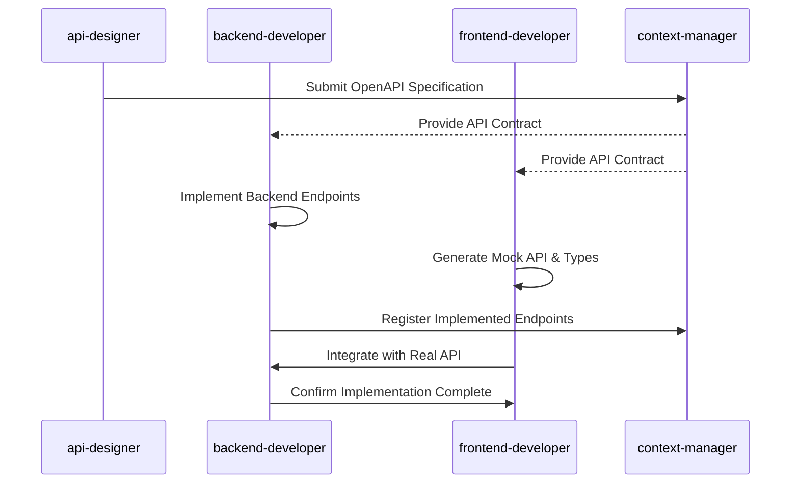
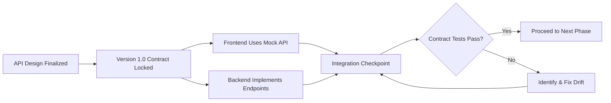
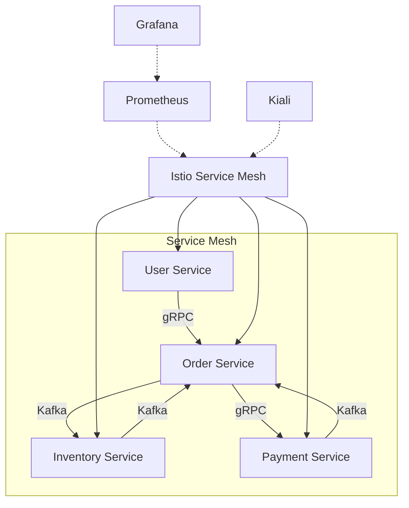
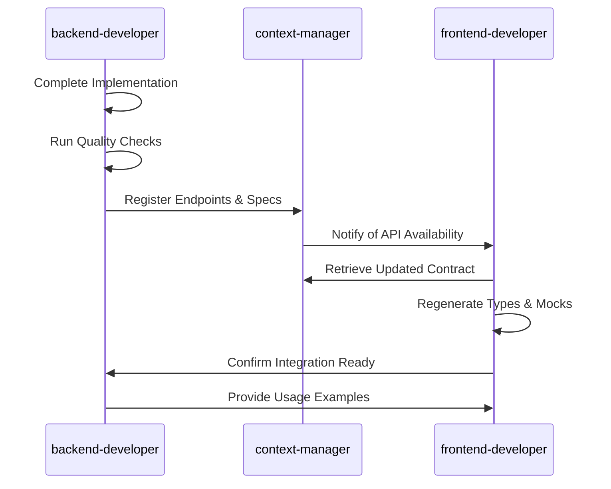
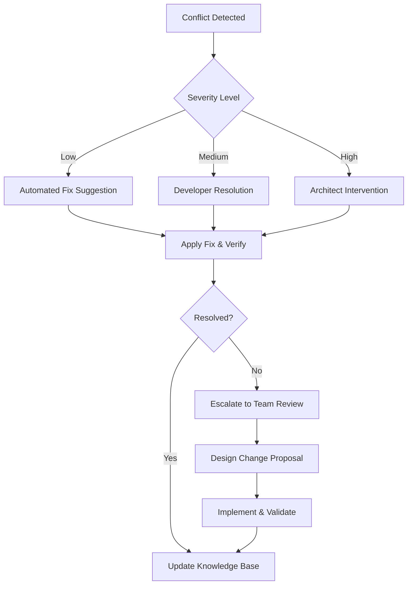

# Cross-Agent Collaboration Patterns

<cite>
**Referenced Files in This Document**   
- [frontend-developer.md](file://frontend-developer.md)
- [backend-developer.md](file://backend-developer.md)
- [microservices-architect.md](file://microservices-architect.md)
- [api-designer.md](file://api-designer.md)
- [context-manager.md](file://context-manager.md)
- [api-documenter.md](file://api-documenter.md)
</cite>

## Table of Contents
1. [Introduction](#introduction)
2. [Core Collaboration Framework](#core-collaboration-framework)
3. [Frontend-Backend Interface Contracts](#frontend-backend-interface-contracts)
4. [Synchronization Mechanisms for Parallel Development](#synchronization-mechanisms-for-parallel-development)
5. [Microservices-Architect Coordination Patterns](#microservices-architect-coordination-patterns)
6. [Handoff Protocols and Shared Context Propagation](#handoff-protocols-and-shared-context-propagation)
7. [Conflict Resolution Strategies](#conflict-resolution-strategies)
8. [Best Practices for Integration Excellence](#best-practices-for-integration-excellence)
9. [Troubleshooting Common Integration Issues](#troubleshooting-common-integration-issues)
10. [Conclusion](#conclusion)

## Introduction
This document details cross-agent collaboration patterns for coordinated development workflows in a multi-agent system. It examines how specialized agents such as frontend-developer.md and backend-developer.md collaborate on full-stack features through well-defined interface contracts and API specifications. The analysis covers synchronization mechanisms, versioning strategies, integration checkpoints, and coordination protocols across service boundaries. Real-world collaboration scenarios involving microservices-architect.md and other specialized agents are explored to illustrate effective distributed development practices.

**Section sources**
- [frontend-developer.md](file://frontend-developer.md#L1-L244)
- [backend-developer.md](file://backend-developer.md#L1-L227)

## Core Collaboration Framework

The multi-agent system operates on a structured collaboration framework where specialized agents coordinate through standardized communication protocols and shared context management. Each agent follows a three-phase execution flow: context discovery, implementation, and handoff/documentation. The context-manager.md serves as the central knowledge repository, ensuring all agents operate with consistent, up-to-date information about project requirements, architectural constraints, and integration points.

Agents initiate collaboration by querying the context-manager for relevant project context before beginning any implementation work. This mandatory context retrieval prevents redundant efforts and ensures alignment with established patterns. The framework supports both synchronous and asynchronous collaboration modes, allowing parallel development while maintaining integration integrity through versioned contracts and automated validation.

**Diagram sources**
- [context-manager.md](file://context-manager.md#L1-L293)
- [frontend-developer.md](file://frontend-developer.md#L1-L244)
- [backend-developer.md](file://backend-developer.md#L1-L227)

**Section sources**
- [context-manager.md](file://context-manager.md#L1-L293)
- [frontend-developer.md](file://frontend-developer.md#L1-L244)

## Frontend-Backend Interface Contracts

Frontend-developer.md and backend-developer.md establish interface contracts through a formalized API specification process coordinated with api-designer.md. The collaboration begins with the api-designer defining comprehensive OpenAPI 3.1 specifications that serve as the single source of truth for both frontend and backend implementations.

Frontend developers use the API specifications to generate TypeScript interfaces and mock servers, enabling parallel development without dependency on backend completion. Backend developers implement the specified endpoints with strict adherence to request/response schemas, authentication patterns, and error handling standards. The contract includes detailed documentation of endpoints, parameters, status codes, and example payloads, ensuring both parties have identical expectations.

**Diagram sources**
- [api-designer.md](file://api-designer.md#L1-L244)
- [backend-developer.md](file://backend-developer.md#L1-L227)
- [frontend-developer.md](file://frontend-developer.md#L1-L244)

**Section sources**
- [api-designer.md](file://api-designer.md#L1-L244)
- [backend-developer.md](file://backend-developer.md#L1-L227)
- [frontend-developer.md](file://frontend-developer.md#L1-L244)

## Synchronization Mechanisms for Parallel Development

The system employs multiple synchronization mechanisms to enable safe parallel development across agent boundaries. Versioning strategies, contract testing, and integration checkpoints ensure compatibility while allowing independent progress.

API versioning follows a structured approach with URI-based versioning and comprehensive deprecation policies. Each version maintains backward compatibility, with clear migration pathways documented in the API specifications. Contract testing is performed using automated tools that validate both frontend and backend implementations against the OpenAPI specification, catching drift before integration.

Integration checkpoints are established at key milestones, including API design completion, backend implementation verification, and frontend integration testing. These checkpoints trigger automated validation workflows that verify interface compatibility, performance targets, and security requirements. The context-manager tracks the status of each integration point, providing visibility into the overall progress.

**Diagram sources**
- [api-designer.md](file://api-designer.md#L1-L244)
- [api-documenter.md](file://api-documenter.md#L1-L284)
- [context-manager.md](file://context-manager.md#L1-L293)

**Section sources**
- [api-designer.md](file://api-designer.md#L1-L244)
- [api-documenter.md](file://api-documenter.md#L1-L284)

## Microservices-Architect Coordination Patterns

The microservices-architect.md coordinates with multiple backend agents across service boundaries using domain-driven design principles and service mesh technologies. The architect establishes clear service boundaries based on bounded contexts, ensuring each backend service has a well-defined responsibility and data ownership model.

Communication patterns are standardized across services, with synchronous interactions using REST/gRPC and asynchronous messaging through Kafka event streams. The architect configures Istio service mesh to manage traffic routing, enforce security policies, and provide observability across the distributed system. Each service is deployed as a Kubernetes pod with defined resource limits, health checks, and scaling rules.

The coordination process begins with domain analysis to identify aggregate roots and event boundaries. The architect then defines the service topology, data flow patterns, and failure recovery strategies. Backend developers implement services according to these architectural guidelines, with the architect providing ongoing oversight through regular integration reviews and performance monitoring.

**Diagram sources**
- [microservices-architect.md](file://microservices-architect.md#L1-L245)
- [backend-developer.md](file://backend-developer.md#L1-L227)

**Section sources**
- [microservices-architect.md](file://microservices-architect.md#L1-L245)

## Handoff Protocols and Shared Context Propagation

Handoff protocols ensure smooth transitions between agents during the development lifecycle. Each agent follows a standardized delivery process that includes updating the context-manager with completed work, documenting key decisions, and notifying dependent agents of availability.

When a backend developer completes an API implementation, they register the endpoints with the context-manager and generate updated OpenAPI specifications. The frontend developer is automatically notified and retrieves the updated contract, which triggers regeneration of TypeScript interfaces and test mocks. This propagation of shared context ensures both sides remain synchronized without manual coordination.

The handoff process includes quality gates that validate the work against predefined criteria. For backend implementations, this includes test coverage thresholds, performance benchmarks, and security scans. For frontend components, the gates verify accessibility compliance, responsive design, and test coverage. Only when all criteria are met does the handoff complete and the next phase begin.

**Diagram sources**
- [backend-developer.md](file://backend-developer.md#L1-L227)
- [context-manager.md](file://context-manager.md#L1-L293)
- [frontend-developer.md](file://frontend-developer.md#L1-L244)

**Section sources**
- [backend-developer.md](file://backend-developer.md#L1-L227)
- [context-manager.md](file://context-manager.md#L1-L293)

## Conflict Resolution Strategies

The system employs proactive and reactive conflict resolution strategies to address integration issues. Proactive measures include comprehensive contract definitions, automated validation, and early integration testing to prevent conflicts before they occur.

When conflicts arise, the resolution process follows a structured escalation path. Minor API drift issues are resolved through automated contract testing feedback loops, with developers receiving immediate notifications of specification violations. More complex conflicts involving service boundaries or data consistency are escalated to the microservices-architect for resolution.

The context-manager maintains a conflict registry that tracks recurring issues, resolution patterns, and lessons learned. This knowledge base informs future design decisions and helps prevent recurrence of similar conflicts. For timing mismatches, the system uses feature flags and canary deployments to decouple release cycles, allowing services to evolve independently while maintaining compatibility.

**Diagram sources**
- [context-manager.md](file://context-manager.md#L1-L293)
- [microservices-architect.md](file://microservices-architect.md#L1-L245)

**Section sources**
- [context-manager.md](file://context-manager.md#L1-L293)
- [microservices-architect.md](file://microservices-architect.md#L1-L245)

## Best Practices for Integration Excellence

The following best practices ensure high-quality integration across agent boundaries:

- **API-First Development**: Design contracts before implementation to enable parallel work
- **Automated Contract Testing**: Validate interfaces against specifications continuously
- **Versioned Interfaces**: Maintain backward compatibility with clear deprecation policies
- **Comprehensive Documentation**: Provide detailed examples and usage guidance
- **Performance Budgets**: Define and enforce response time and payload size limits
- **Security by Design**: Implement authentication, rate limiting, and input validation
- **Observability**: Include metrics, logging, and tracing in all services
- **Progressive Enhancement**: Build core functionality first, then add advanced features

These practices are enforced through tooling integration, with linters, generators, and validators ensuring compliance. The api-documenter.md generates interactive documentation portals with try-it-out functionality, reducing integration friction. The context-manager tracks adherence to these practices across all agents, providing visibility into overall quality metrics.

**Section sources**
- [api-designer.md](file://api-designer.md#L1-L244)
- [api-documenter.md](file://api-documenter.md#L1-L284)
- [backend-developer.md](file://backend-developer.md#L1-L227)

## Troubleshooting Common Integration Issues

### API Drift
When API implementations diverge from specifications, use the following resolution workflow:
1. Run contract validation tool against current implementation
2. Compare results with OpenAPI specification
3. Identify specific endpoints and fields with discrepancies
4. Update implementation to match specification
5. Regenerate client artifacts
6. Verify integration with updated contract

**Section sources**
- [api-designer.md](file://api-designer.md#L1-L244)
- [api-documenter.md](file://api-documenter.md#L1-L284)

### Timing Mismatches
For asynchronous development timelines:
1. Use feature flags to decouple deployment from release
2. Implement mock services for incomplete dependencies
3. Establish integration milestones with buffer time
4. Use canary deployments to validate compatibility
5. Monitor error rates during gradual rollout

**Section sources**
- [frontend-developer.md](file://frontend-developer.md#L1-L244)
- [backend-developer.md](file://backend-developer.md#L1-L227)

### Environment Inconsistencies
To resolve environment-specific issues:
1. Standardize configuration management through context-manager
2. Use containerization for consistent runtime environments
3. Implement environment validation on startup
4. Synchronize data schemas across environments
5. Use infrastructure-as-code for environment provisioning

**Section sources**
- [context-manager.md](file://context-manager.md#L1-L293)
- [backend-developer.md](file://backend-developer.md#L1-L227)

## Conclusion
Effective cross-agent collaboration requires well-defined interface contracts, robust synchronization mechanisms, and standardized handoff protocols. By establishing clear communication patterns, versioning strategies, and integration checkpoints, specialized agents can work in parallel while maintaining system integrity. The context-manager serves as the central coordination point, ensuring shared understanding and preventing integration conflicts. Proactive conflict resolution, comprehensive documentation, and automated validation enable high-quality outcomes in complex, distributed development environments.