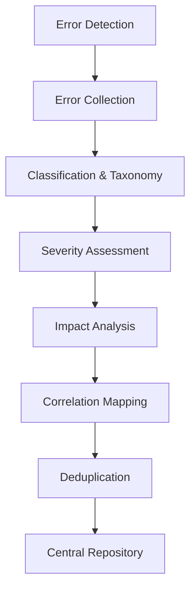
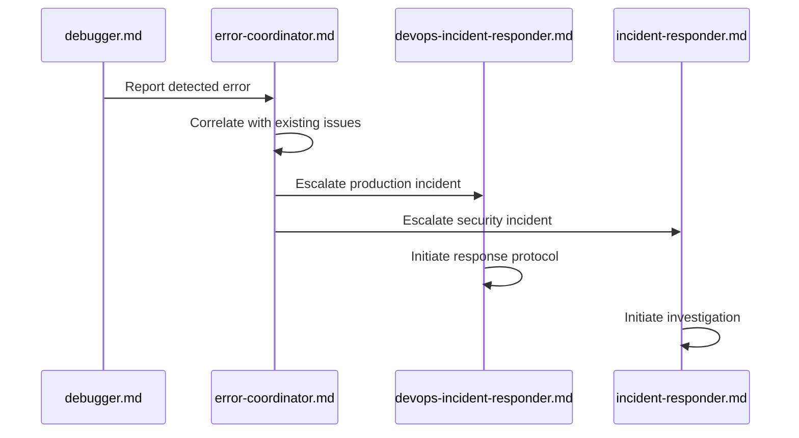
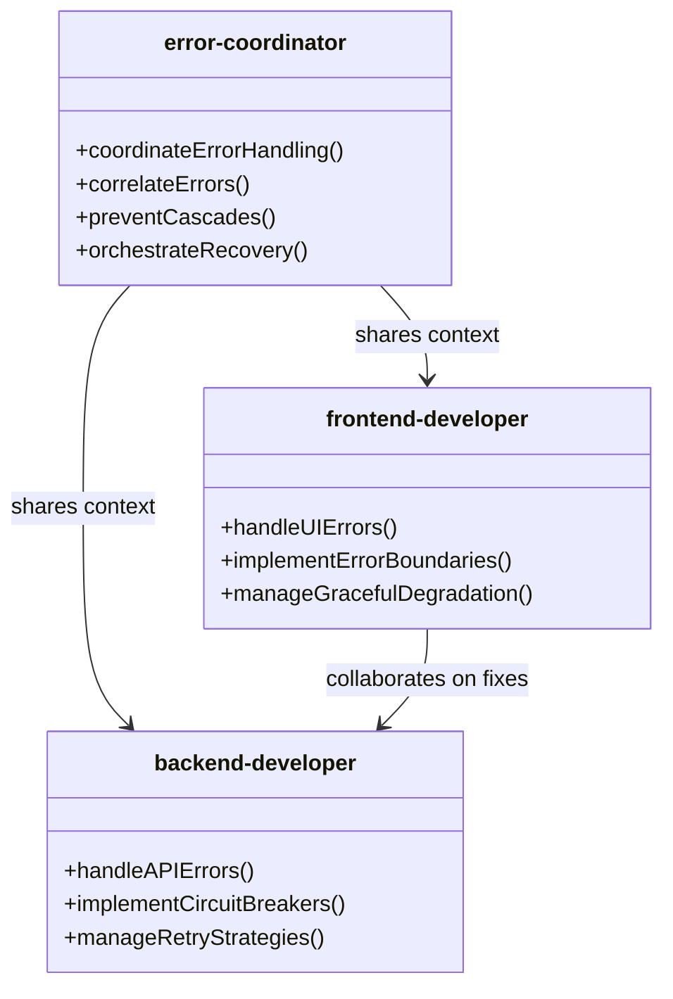
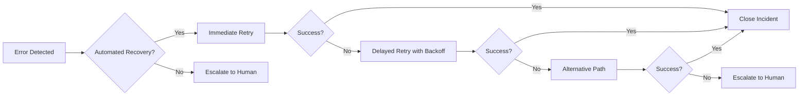

# Error Handling and Incident Response Coordination

<cite>
**Referenced Files in This Document**   
- [error-coordinator.md](file://error-coordinator.md)
- [debugger.md](file://debugger.md)
- [devops-incident-responder.md](file://devops-incident-responder.md)
- [incident-responder.md](file://incident-responder.md)
- [frontend-developer.md](file://frontend-developer.md)
- [backend-developer.md](file://backend-developer.md)
</cite>

## Table of Contents
1. [Introduction](#introduction)
2. [Error Coordination Framework](#error-coordination-framework)
3. [Incident Escalation and Response](#incident-escalation-and-response)
4. [Cross-Agent Collaboration Workflows](#cross-agent-collaboration-workflows)
5. [Configuration and Automation](#configuration-and-automation)
6. [Troubleshooting and Optimization](#troubleshooting-and-optimization)
7. [Conclusion](#conclusion)

## Introduction
This document details the collaborative error handling and incident response workflows within the multi-agent system. It explains how the error-coordinator agent centralizes error reporting, correlates issues across agents, and orchestrates diagnostic and recovery efforts. The escalation path from initial detection to resolution is documented, along with integration points for production incident management. The framework emphasizes systematic error handling, rapid response, and continuous learning to minimize downtime and improve system resilience.

## Error Coordination Framework

The error-coordinator agent serves as the central hub for distributed error handling, failure recovery, and system resilience. It specializes in error correlation, cascade prevention, and automated recovery strategies across the multi-agent ecosystem.

### Centralized Error Aggregation
The error-coordinator implements comprehensive error collection pipelines that gather issues from all agents. It classifies errors using standardized taxonomies and performs severity assessment, impact analysis, frequency tracking, and pattern detection. The system employs correlation mapping and deduplication logic to prevent redundant handling of related issues.

**Diagram sources**
- [error-coordinator.md](file://error-coordinator.md#L25-L35)

### Cross-Agent Error Correlation
The coordinator performs sophisticated cross-agent correlation using temporal analysis, causal analysis, dependency tracking, service mesh analysis, request tracing, and error propagation mapping. This enables accurate root cause identification and comprehensive impact assessment across the distributed system.

**Section sources**
- [error-coordinator.md](file://error-coordinator.md#L35-L43)

### Failure Cascade Prevention
To prevent cascading failures, the error-coordinator implements circuit breaker patterns, bulkhead isolation, timeout management, rate limiting, backpressure handling, graceful degradation, failover strategies, and load shedding. These resilience patterns ensure system stability during partial failures.

**Section sources**
- [error-coordinator.md](file://error-coordinator.md#L43-L51)

## Incident Escalation and Response

The incident response workflow follows a structured escalation path from initial detection to resolution, involving multiple specialized agents.

### Initial Detection and Escalation
The debugger agent serves as the primary detection mechanism, identifying complex issues through systematic problem-solving. When invoked, it queries the context manager for issue symptoms and system information, reviews error logs and stack traces, and analyzes code paths and environmental factors.

**Diagram sources**
- [debugger.md](file://debugger.md#L15-L25)
- [error-coordinator.md](file://error-coordinator.md#L15-L25)
- [devops-incident-responder.md](file://devops-incident-responder.md#L15-L25)
- [incident-responder.md](file://incident-responder.md#L15-L25)

### Production Incident Management
For production incidents, the system integrates with both devops-incident-responder and incident-responder agents. The devops-incident-responder handles operational issues with a focus on rapid detection, diagnosis, and automated remediation, while the incident-responder manages security and compliance incidents with emphasis on evidence preservation and forensic analysis.

The devops-incident-responder reduces MTTR through automated health checks, rollback triggers, scaling automation, and runbook automation. The incident-responder ensures thorough documentation, evidence chain preservation, and compliance with regulatory requirements.

**Section sources**
- [devops-incident-responder.md](file://devops-incident-responder.md#L15-L35)
- [incident-responder.md](file://incident-responder.md#L15-L35)

## Cross-Agent Collaboration Workflows

The system facilitates collaborative debugging sessions between frontend and backend developers through shared error context managed by the error-coordinator.

### Frontend-Backend Collaboration
When errors span the frontend-backend boundary, the error-coordinator creates shared context that enables effective collaboration. The frontend-developer and backend-developer agents can access correlated error data, reproduction steps, and system state information to diagnose and resolve issues efficiently.

**Diagram sources**
- [error-coordinator.md](file://error-coordinator.md#L15-L25)
- [frontend-developer.md](file://frontend-developer.md#L15-L25)
- [backend-developer.md](file://backend-developer.md#L15-L25)

### Shared Error Context
The error-coordinator maintains a centralized repository of error context that includes:
- Complete error logs and stack traces
- System state at time of failure
- User session data (when applicable)
- Performance metrics and resource usage
- Recent configuration changes
- Dependency status

This shared context eliminates redundant investigation and enables parallel troubleshooting by multiple agents.

**Section sources**
- [error-coordinator.md](file://error-coordinator.md#L25-L35)
- [frontend-developer.md](file://frontend-developer.md#L85-L95)
- [backend-developer.md](file://backend-developer.md#L85-L95)

## Configuration and Automation

The error handling system provides extensive configuration options for tailoring behavior to specific requirements.

### Error Severity and Notification
The system supports configurable severity thresholds that determine notification routing and escalation paths. Administrators can define:
- Error classification taxonomies
- Severity levels (Critical, High, Medium, Low)
- Notification channels (PagerDuty, Slack, Email)
- Escalation policies based on time and impact
- Alert fatigue reduction through correlation rules

The error-coordinator integrates with PagerDuty for incident management and alerting, ensuring timely response to critical issues.

**Section sources**
- [error-coordinator.md](file://error-coordinator.md#L115-L125)
- [devops-incident-responder.md](file://devops-incident-responder.md#L115-L125)
- [incident-responder.md](file://incident-responder.md#L115-L125)

### Automated Remediation
The framework supports automated recovery flows including:
- Immediate and delayed retry with exponential backoff
- Alternative path routing
- Cached fallback responses
- Manual intervention escalation
- Partial and full restoration procedures
- Preventive actions based on pattern recognition

Automated remediation reduces MTTR and ensures consistent response to common failure patterns.

**Diagram sources**
- [error-coordinator.md](file://error-coordinator.md#L75-L85)

## Troubleshooting and Optimization

The system includes comprehensive troubleshooting guidance and performance optimization strategies to minimize incident resolution time.

### Common Failure Patterns
The error-coordinator identifies and documents common failure patterns including:
- Race conditions and deadlocks
- Memory leaks and resource exhaustion
- Timeout errors and connection pool exhaustion
- Configuration drift and deployment issues
- Third-party service failures
- Data consistency problems

Pattern recognition enables proactive prevention and faster diagnosis of recurring issues.

**Section sources**
- [error-coordinator.md](file://error-coordinator.md#L145-L155)
- [debugger.md](file://debugger.md#L195-L205)

### Performance Optimization
To minimize incident resolution time, the system implements several optimization strategies:
- Pre-configured runbooks for common scenarios
- Automated evidence collection and preservation
- Standardized communication templates
- Integrated monitoring and tracing tools
- Regular chaos engineering exercises
- Continuous learning from post-mortems

The devops-incident-responder achieves sub-30 minute MTTR through comprehensive monitoring coverage, optimized alert rules, and 42% auto-remediation.

**Section sources**
- [devops-incident-responder.md](file://devops-incident-responder.md#L15-L25)
- [error-coordinator.md](file://error-coordinator.md#L190-L200)

## Conclusion
The collaborative error handling and incident response framework provides a comprehensive system for managing failures in the multi-agent environment. By centralizing error coordination through the error-coordinator agent, the system ensures consistent handling, prevents cascading failures, and enables effective collaboration between specialized agents. The integration with devops-incident-responder and incident-responder provides robust capabilities for production incident management, while shared error context facilitates efficient debugging across frontend and backend components. Configuration options and automated remediation further enhance the system's effectiveness in minimizing downtime and improving overall resilience.