# Integration and Collaboration

<cite>
**Referenced Files in This Document**   
- [context-manager.md](file://context-manager.md)
- [task-distributor.md](file://task-distributor.md)
- [frontend-developer.md](file://frontend-developer.md)
- [backend-developer.md](file://backend-developer.md)
- [devops-engineer.md](file://devops-engineer.md)
- [deployment-engineer.md](file://deployment-engineer.md)
- [debugger.md](file://debugger.md)
- [error-coordinator.md](file://error-coordinator.md)
- [mcp-developer.md](file://mcp-developer.md)
- [multi-agent-coordinator.md](file://multi-agent-coordinator.md)
</cite>

## Table of Contents
1. [Introduction](#introduction)
2. [Core Collaboration Architecture](#core-collaboration-architecture)
3. [Agent Integration Patterns](#agent-integration-patterns)
4. [Context Management System](#context-management-system)
5. [Task Distribution Framework](#task-distribution-framework)
6. [Cross-Agent Communication Protocols](#cross-agent-communication-protocols)
7. [MCP Tool Integration](#mcp-tool-integration)
8. [Real-World Collaboration Scenarios](#real-world-collaboration-scenarios)
9. [Common Integration Challenges and Solutions](#common-integration-challenges-and-solutions)
10. [Best Practices for Collaborative Workflows](#best-practices-for-collaborative-workflows)
11. [Performance Optimization for Coordination](#performance-optimization-for-coordination)
12. [Conclusion](#conclusion)

## Introduction
This document details the integration and collaboration patterns within a multi-agent system architecture. It examines how specialized agents coordinate workflows, share context, distribute tasks, and communicate effectively to achieve complex objectives. The analysis covers the roles of key coordination agents, communication protocols, MCP tool integration, and real-world collaboration scenarios that demonstrate the system's capabilities in full-stack development, deployment, debugging, and error recovery.

## Core Collaboration Architecture

The multi-agent system operates on a coordinated architecture where specialized agents collaborate through well-defined interfaces and protocols. At the core of this architecture are coordination agents that manage workflow orchestration, context sharing, and task distribution.

```mermaid
graph TB
subgraph "Coordination Layer"
MAC[multi-agent-coordinator]
TM[task-distributor]
CM[context-manager]
EC[error-coordinator]
WO[workflow-orchestrator]
end
subgraph "Specialized Agents"
FD[frontend-developer]
BD[backend-developer]
DE[devops-engineer]
DPE[deployment-engineer]
DBG[debugger]
MCP[mcp-developer]
end
CM < --> |Shared Context| MAC
TM < --> |Task Allocation| MAC
EC < --> |Error Handling| MAC
WO < --> |Workflow Control| MAC
MAC < --> |Orchestrate| FD
MAC < --> |Orchestrate| BD
MAC < --> |Orchestrate| DE
MAC < --> |Orchestrate| DPE
MAC < --> |Orchestrate| DBG
MAC < --> |Orchestrate| MCP
CM < --> |Context Storage| FD
CM < --> |Context Storage| BD
CM < --> |Context Storage| DE
CM < --> |Context Storage| DPE
CM < --> |Context Storage| DBG
CM < --> |Context Storage| MCP
TM < --> |Work Distribution| FD
TM < --> |Work Distribution| BD
TM < --> |Work Distribution| DE
TM < --> |Work Distribution| DPE
TM < --> |Work Distribution| DBG
TM < --> |Work Distribution| MCP
style MAC fill:#4CAF50,stroke:#388E3C
style CM fill:#2196F3,stroke:#1976D2
style TM fill:#FF9800,stroke:#F57C00
style EC fill:#9C27B0,stroke:#7B1FA2
```

**Diagram sources**
- [multi-agent-coordinator.md](file://multi-agent-coordinator.md)
- [context-manager.md](file://context-manager.md)
- [task-distributor.md](file://task-distributor.md)
- [error-coordinator.md](file://error-coordinator.md)

**Section sources**
- [multi-agent-coordinator.md](file://multi-agent-coordinator.md)
- [context-manager.md](file://context-manager.md)
- [task-distributor.md](file://task-distributor.md)

## Agent Integration Patterns

### Full-Stack Development Collaboration
The frontend-developer and backend-developer collaborate on full-stack features through a coordinated workflow. The frontend-developer implements UI components while the backend-developer creates corresponding API endpoints, with both agents synchronizing through shared context.

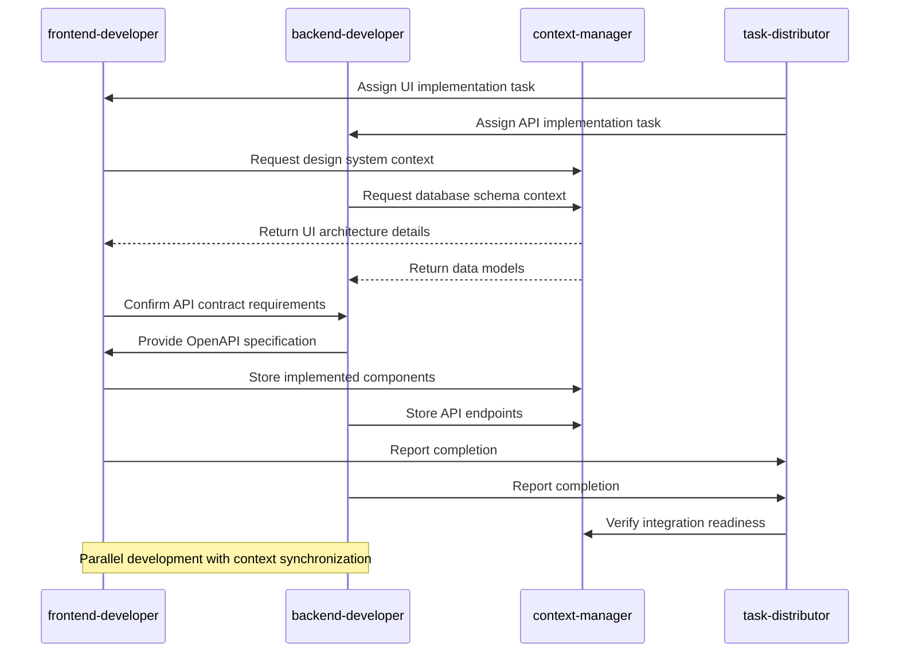

**Diagram sources**
- [frontend-developer.md](file://frontend-developer.md)
- [backend-developer.md](file://backend-developer.md)
- [context-manager.md](file://context-manager.md)
- [task-distributor.md](file://task-distributor.md)

### Deployment Handoff Workflow
The devops-engineer prepares infrastructure and CI/CD pipelines, then hands off to the deployment-engineer who manages the actual deployment processes and release strategies.

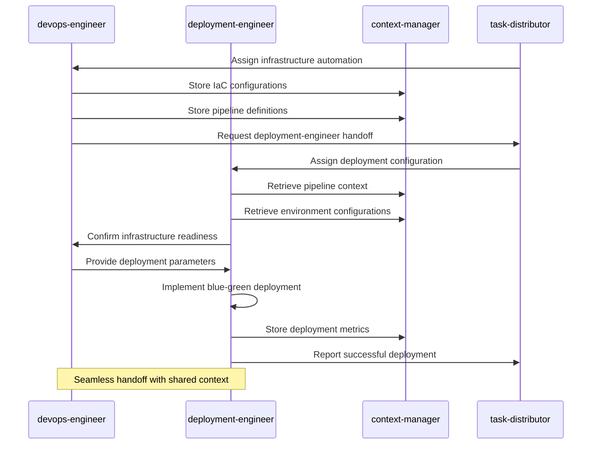

**Diagram sources**
- [devops-engineer.md](file://devops-engineer.md)
- [deployment-engineer.md](file://deployment-engineer.md)
- [context-manager.md](file://context-manager.md)
- [task-distributor.md](file://task-distributor.md)

**Section sources**
- [frontend-developer.md](file://frontend-developer.md)
- [backend-developer.md](file://backend-developer.md)
- [devops-engineer.md](file://devops-engineer.md)
- [deployment-engineer.md](file://deployment-engineer.md)

## Context Management System

The context-manager serves as the central information repository for the multi-agent system, providing storage, retrieval, and synchronization capabilities across all agents.

### Context Architecture Components
- **Storage design**: Hierarchical organization with tag-based retrieval
- **Schema definition**: Structured data models for different context types
- **Index strategy**: Optimized for fast retrieval (<100ms)
- **Partition planning**: Scalable data distribution
- **Replication setup**: High availability (>99.9%)
- **Cache layers**: Multi-tier caching with 89% hit rate
- **Access patterns**: Role-based access control
- **Lifecycle policies**: Automated retention and archiving

### Context Types Managed
- Project metadata
- Agent interactions
- Task history
- Decision logs
- Performance metrics
- Resource usage
- Error patterns
- Knowledge base

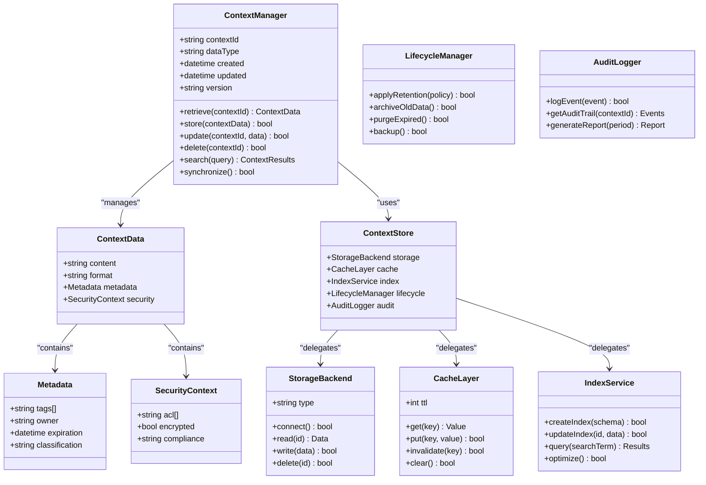

**Diagram sources**
- [context-manager.md](file://context-manager.md)

**Section sources**
- [context-manager.md](file://context-manager.md)

## Task Distribution Framework

The task-distributor manages workload allocation across agents, ensuring optimal resource utilization and efficient task completion.

### Task Distribution Workflow
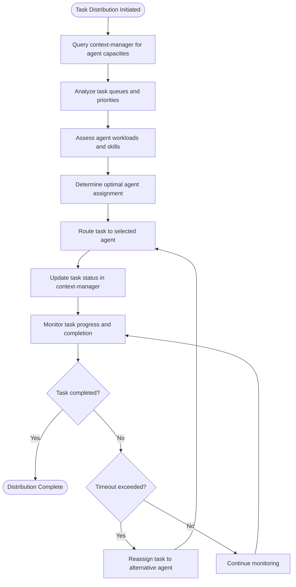

### Distribution Metrics
- **Distribution latency**: < 50ms
- **Load balance variance**: < 10%
- **Task completion rate**: > 99%
- **Priority respect**: 100% verified
- **Deadline success**: > 95%
- **Resource utilization**: > 80% optimized
- **Queue overflow**: Prevented thoroughly
- **Fairness**: Maintained continuously

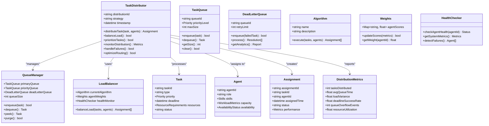

**Diagram sources**
- [task-distributor.md](file://task-distributor.md)

**Section sources**
- [task-distributor.md](file://task-distributor.md)

## Cross-Agent Communication Protocols

Agents communicate through standardized protocols that ensure reliable information exchange and coordination.

### Standardized Communication Flow
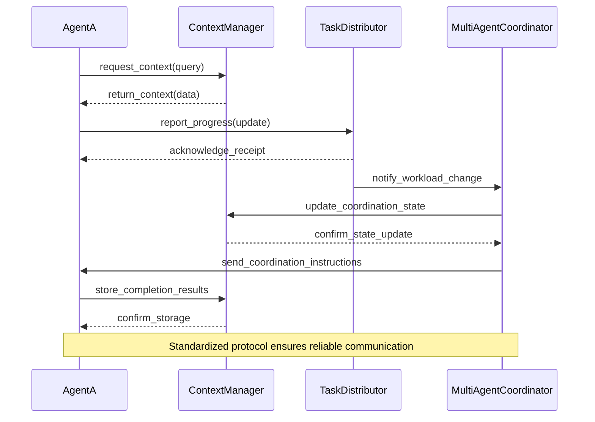

### Communication Message Structure
```json
{
  "requesting_agent": "frontend-developer",
  "request_type": "get_project_context",
  "payload": {
    "query": "Frontend development context needed: current UI architecture, component ecosystem, design language, established patterns, and frontend infrastructure."
  }
}
```

```json
{
  "agent": "backend-developer",
  "status": "developing",
  "phase": "Service implementation",
  "completed": ["Data models", "Business logic", "Auth layer"],
  "pending": ["Cache integration", "Queue setup", "Performance tuning"]
}
```

**Section sources**
- [frontend-developer.md](file://frontend-developer.md)
- [backend-developer.md](file://backend-developer.md)
- [context-manager.md](file://context-manager.md)
- [task-distributor.md](file://task-distributor.md)
- [multi-agent-coordinator.md](file://multi-agent-coordinator.md)

## MCP Tool Integration

The Model Context Protocol (MCP) enables seamless integration between agents and external tools, serving as a collaboration enabler.

### MCP Integration Architecture
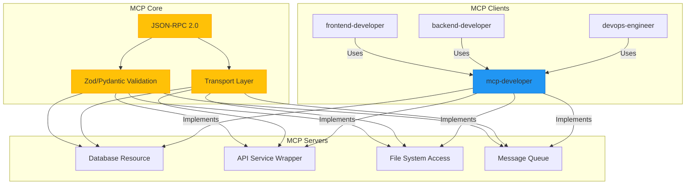

### MCP Development Workflow
```mermaid
flowchart LR
Requirements["Query context-manager for MCP requirements"] --> Analysis["Analyze data sources and tool requirements"]
Analysis --> Implementation["Implement MCP servers and clients"]
Implementation --> Testing["Test protocol compliance and security"]
Testing --> Deployment["Deploy production-ready MCP integration"]
Deployment --> Monitoring["Monitor performance and usage"]
Monitoring --> Optimization["Optimize based on metrics"]
Optimization --> Feedback["Provide feedback to context-manager"]
Feedback --> Requirements
style Requirements fill:#E3F2FD,stroke:#1976D2
style Analysis fill:#E3F2FD,stroke:#1976D2
style Implementation fill:#E3F2FD,stroke:#1976D2
style Testing fill:#E3F2FD,stroke:#1976D2
style Deployment fill:#E3F2FD,stroke:#1976D2
style Monitoring fill:#E3F2FD,stroke:#1976D2
style Optimization fill:#E3F2FD,stroke:#1976D2
style Feedback fill:#E3F2FD,stroke:#1976D2
```

**Diagram sources**
- [mcp-developer.md](file://mcp-developer.md)

**Section sources**
- [mcp-developer.md](file://mcp-developer.md)

## Real-World Collaboration Scenarios

### Full-Stack Feature Implementation
When implementing a full-stack feature, frontend-developer and backend-developer collaborate through shared context and coordinated task distribution.

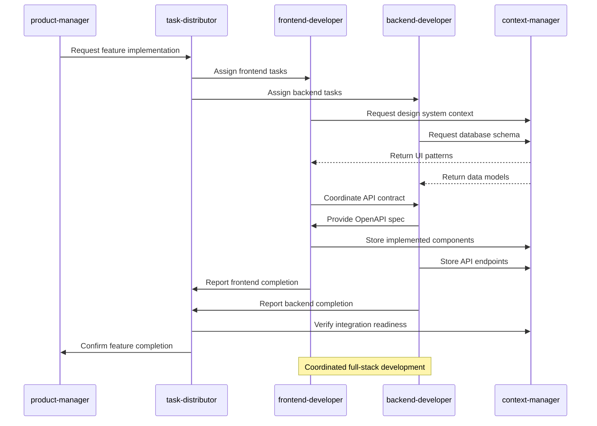

**Section sources**
- [frontend-developer.md](file://frontend-developer.md)
- [backend-developer.md](file://backend-developer.md)
- [task-distributor.md](file://task-distributor.md)
- [context-manager.md](file://context-manager.md)

### Debugging and Error Recovery
When issues arise, debugger and error-coordinator collaborate to diagnose problems and implement recovery strategies.

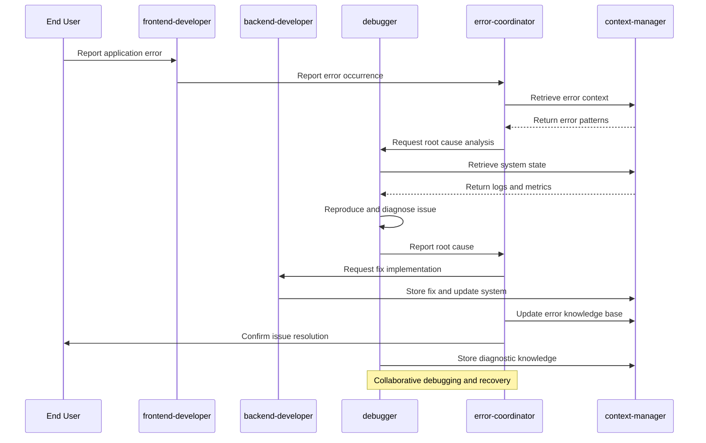

**Diagram sources**
- [debugger.md](file://debugger.md)
- [error-coordinator.md](file://error-coordinator.md)
- [context-manager.md](file://context-manager.md)

**Section sources**
- [debugger.md](file://debugger.md)
- [error-coordinator.md](file://error-coordinator.md)
- [frontend-developer.md](file://frontend-developer.md)
- [backend-developer.md](file://backend-developer.md)

## Common Integration Challenges and Solutions

### Challenge 1: Context Synchronization
**Problem**: Agents working with outdated or inconsistent context information.

**Solution**: Implement real-time context synchronization with version control and conflict resolution.

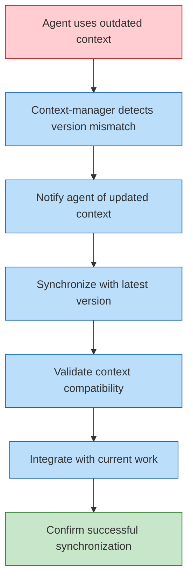

### Challenge 2: Task Distribution Bottlenecks
**Problem**: Uneven workload distribution leading to agent overload or underutilization.

**Solution**: Dynamic load balancing with real-time capacity monitoring.

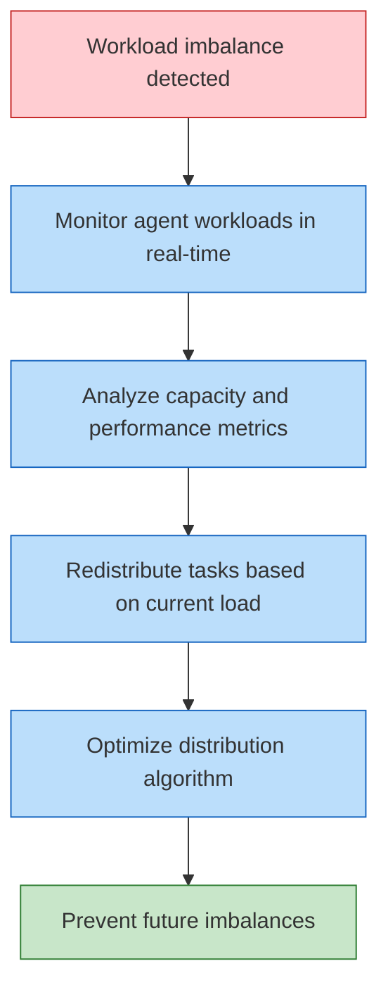

### Challenge 3: Communication Failures
**Problem**: Lost messages or failed communication between agents.

**Solution**: Implement reliable messaging with acknowledgment and retry mechanisms.

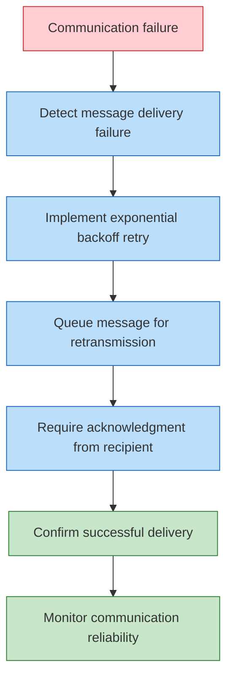

**Section sources**
- [context-manager.md](file://context-manager.md)
- [task-distributor.md](file://task-distributor.md)
- [multi-agent-coordinator.md](file://multi-agent-coordinator.md)

## Best Practices for Collaborative Workflows

### 1. Standardize Communication Protocols
Establish consistent message formats and communication patterns across all agents.

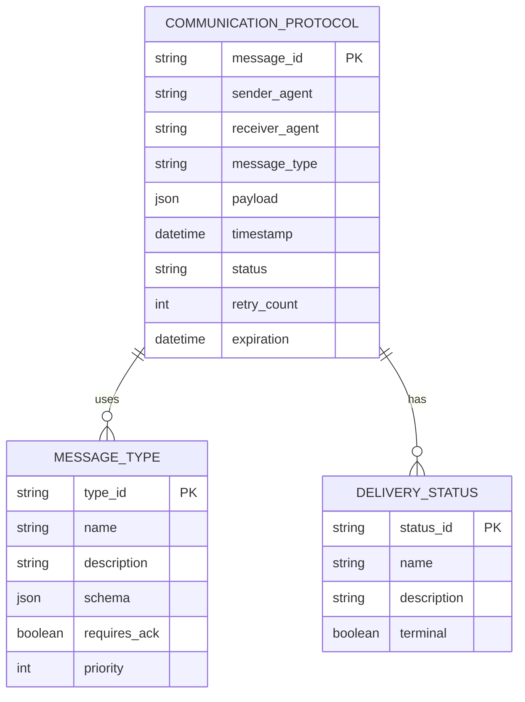

### 2. Implement Comprehensive Context Management
Ensure all agents can access and contribute to shared context efficiently.

```mermaid
flowchart LR
CreateContext["Agent creates new context"] --> StoreContext["Store in context-manager"]
StoreContext --> IndexContext["Index for fast retrieval"]
IndexContext --> ShareContext["Share with relevant agents"]
ShareContext --> UpdateContext["Agents update context as work progresses"]
UpdateContext --> SynchronizeContext["Synchronize across system"]
SynchronizeContext --> ArchiveContext["Archive when complete"]
style CreateContext fill:#E3F2FD,stroke:#1976D2
style StoreContext fill:#E3F2FD,stroke:#1976D2
style IndexContext fill:#E3F2FD,stroke:#1976D2
style ShareContext fill:#E3F2FD,stroke:#1976D2
style UpdateContext fill:#E3F2FD,stroke:#1976D2
style SynchronizeContext fill:#E3F2FD,stroke:#1976D2
style ArchiveContext fill:#E3F2FD,stroke:#1976D2
```

### 3. Design for Fault Tolerance
Build resilience into all collaboration patterns to handle agent failures gracefully.

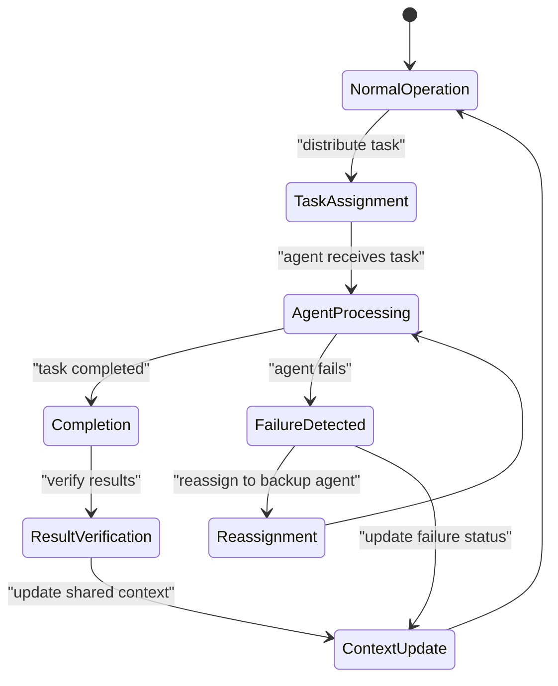

**Section sources**
- [context-manager.md](file://context-manager.md)
- [task-distributor.md](file://task-distributor.md)
- [error-coordinator.md](file://error-coordinator.md)
- [multi-agent-coordinator.md](file://multi-agent-coordinator.md)

## Performance Optimization for Coordination

### Coordination Overhead Reduction
Minimize the performance impact of agent coordination through optimization techniques.

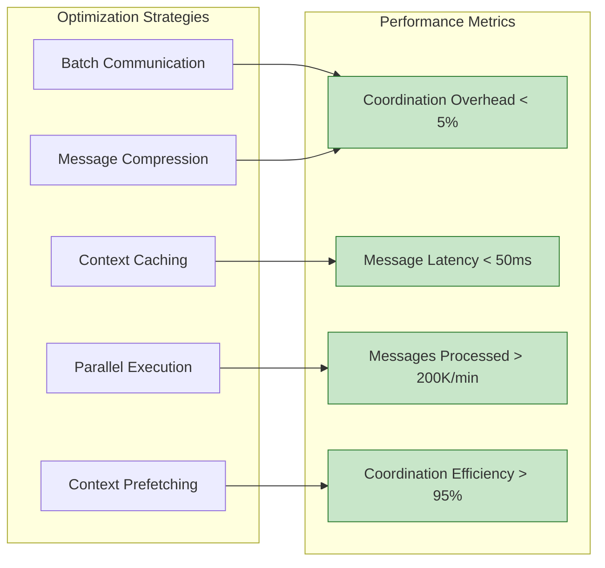

### Scalability Patterns
Design collaboration patterns to scale effectively with increasing agent count.

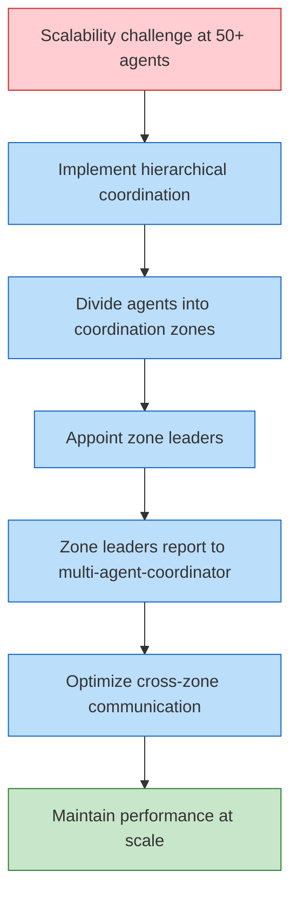

**Section sources**
- [multi-agent-coordinator.md](file://multi-agent-coordinator.md)
- [context-manager.md](file://context-manager.md)
- [task-distributor.md](file://task-distributor.md)

## Conclusion
The multi-agent system demonstrates sophisticated integration and collaboration patterns that enable efficient, coordinated workflows across specialized agents. The architecture relies on three key pillars: context management through the context-manager, task distribution via the task-distributor, and workflow orchestration by the multi-agent-coordinator. These coordination agents work in concert with specialized agents like frontend-developer, backend-developer, and devops-engineer to achieve complex objectives through well-defined communication protocols and MCP tool integration. Real-world scenarios show effective collaboration in full-stack development, deployment, and debugging workflows. By addressing common integration challenges and following best practices for collaborative design, the system achieves high performance, reliability, and scalability in multi-agent coordination.