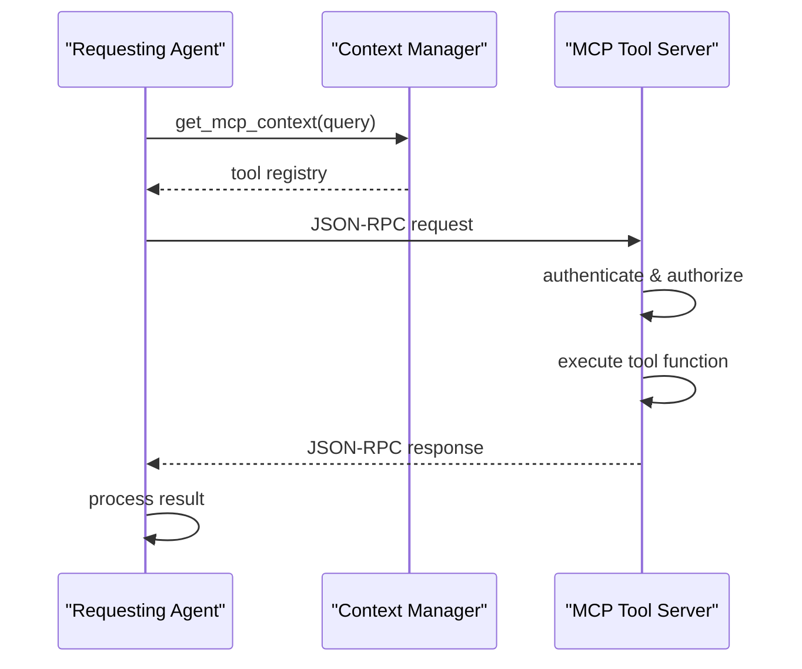
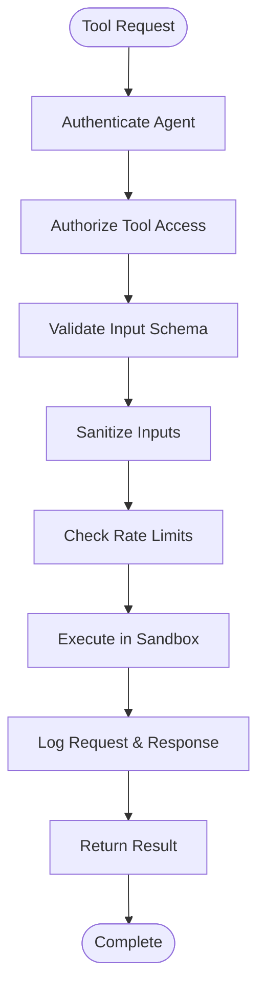
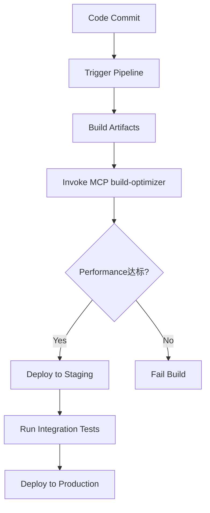
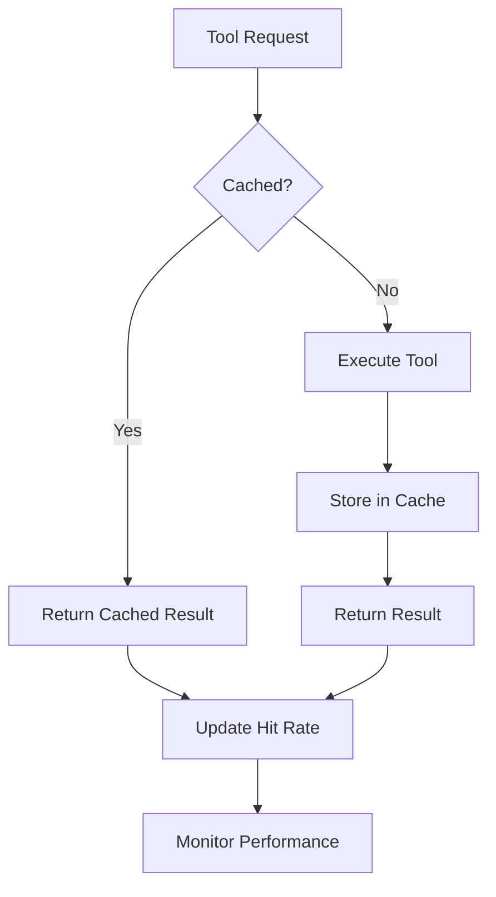

# MCP Tool Integration for Collaborative Capabilities

<cite>
**Referenced Files in This Document**   
- [mcp-developer.md](file://mcp-developer.md)
- [tooling-engineer.md](file://tooling-engineer.md)
- [devops-engineer.md](file://devops-engineer.md)
</cite>

## Table of Contents
1. [Introduction](#introduction)
2. [MCP Tool Registration and Discovery](#mcp-tool-registration-and-discovery)
3. [Tool Invocation Across Agent Boundaries](#tool-invocation-across-agent-boundaries)
4. [Security Models and Sandboxing](#security-models-and-sandboxing)
5. [Case Study: Tooling-Engineer and DevOps Integration](#case-study-tooling-engineer-and-devops-integration)
6. [Best Practices for Interoperable Tool Design](#best-practices-for-interoperable-tool-design)
7. [Versioning and Backward Compatibility](#versioning-and-backward-compatibility)
8. [Performance Implications and Caching Strategies](#performance-implications-and-caching-strategies)
9. [Conclusion](#conclusion)

## Introduction
The Model Context Protocol (MCP) enables collaborative capabilities by allowing multiple AI agents to share and leverage common tools. This document details how MCP facilitates cross-agent tool integration, focusing on the roles of mcp-developer, tooling-engineer, and devops-engineer in creating, managing, and utilizing shared tooling infrastructure. The protocol supports seamless interoperability, secure execution, and efficient resource utilization across distributed agent ecosystems.

**Section sources**
- [mcp-developer.md](file://mcp-developer.md#L1-L42)
- [tooling-engineer.md](file://tooling-engineer.md#L1-L40)
- [devops-engineer.md](file://devops-engineer.md#L1-L40)

## MCP Tool Registration and Discovery

MCP tools are registered through standardized server implementations that expose resources and tool functions via JSON-RPC 2.0 compliant endpoints. The mcp-developer is responsible for defining tool schemas, implementing resource endpoints, and configuring transport mechanisms.

Tool registration involves:
- Defining resource schemas using Zod (TypeScript) or Pydantic (Python)
- Creating tool functions with clear input/output contracts
- Configuring transport abstraction layers (HTTP, WebSocket, etc.)
- Implementing health checks and service discovery hooks
- Publishing metadata for tool discovery

Discovery is achieved through context queries to the context-manager, which maintains a registry of available tools and their capabilities. Agents initiate discovery by sending structured requests:

```json
{
  "requesting_agent": "mcp-developer",
  "request_type": "get_mcp_context",
  "payload": {
    "query": "MCP context needed: data sources, tool requirements, client applications, transport preferences, security needs, and performance targets."
  }
}
```

This enables dynamic discovery of tools based on functional requirements, security policies, and performance constraints.

**Section sources**
- [mcp-developer.md](file://mcp-developer.md#L137-L163)
- [mcp-developer.md](file://mcp-developer.md#L44-L102)
- [context-manager.md](file://context-manager.md#L93-L125)

## Tool Invocation Across Agent Boundaries

Tool invocation follows a client-server pattern where agents act as MCP clients that connect to tool servers. The mcp-sdk provides language-specific implementations for TypeScript and Python, enabling consistent invocation patterns across platforms.

The invocation workflow includes:
- Server discovery through context manager
- Connection establishment with authentication
- Request formatting according to JSON-RPC 2.0
- Transmission over configured transport
- Response handling with error recovery
- Session state management

Clients implement retry logic, connection pooling, and performance monitoring to ensure reliable tool usage. The protocol supports batch requests, notifications, and asynchronous processing to optimize communication efficiency.



**Diagram sources**
- [mcp-developer.md](file://mcp-developer.md#L172-L241)
- [mcp-developer.md](file://mcp-developer.md#L44-L102)

**Section sources**
- [mcp-developer.md](file://mcp-developer.md#L172-L241)
- [mcp-developer.md](file://mcp-developer.md#L44-L102)

## Security Models and Sandboxing

MCP implements comprehensive security controls to protect both tool providers and consumers. Security is enforced at multiple levels:

- **Authentication**: Token-based or certificate-based authentication
- **Authorization**: Role-based access control (RBAC) for tool access
- **Input Validation**: Schema validation using Zod/Pydantic
- **Output Sanitization**: Data filtering and encoding
- **Rate Limiting**: Per-agent and per-tool quotas
- **Audit Logging**: Comprehensive request logging
- **Request Filtering**: Content inspection and policy enforcement

Sandboxing is achieved through containerization and execution environment isolation. Tools run in restricted environments with limited system access, preventing privilege escalation and resource exhaustion attacks. The devops-engineer configures security scanning, vulnerability detection, and compliance automation as part of the CI/CD pipeline.



**Diagram sources**
- [mcp-developer.md](file://mcp-developer.md#L44-L102)
- [devops-engineer.md](file://devops-engineer.md#L44-L102)

**Section sources**
- [mcp-developer.md](file://mcp-developer.md#L44-L102)
- [devops-engineer.md](file://devops-engineer.md#L44-L102)

## Case Study: Tooling-Engineer and DevOps Integration

The tooling-engineer creates custom MCP tools for cross-cutting concerns such as code quality analysis, build optimization, and dependency management. These tools are then consumed by the devops-engineer to automate CI/CD pipelines.

For example, a tooling-engineer might develop a performance analysis tool using Node.js and Webpack, exposing it via MCP:

```json
{
  "tool_name": "build-optimizer",
  "version": "1.2.0",
  "endpoints": [
    {
      "method": "analyzeBundle",
      "params": ["bundlePath", "thresholdKB"],
      "returns": "OptimizationReport"
    }
  ]
}
```

The devops-engineer integrates this tool into Jenkins pipelines:



This integration enables automated performance gates in the deployment process, ensuring only optimized builds reach production.

**Diagram sources**
- [tooling-engineer.md](file://tooling-engineer.md#L92-L127)
- [devops-engineer.md](file://devops-engineer.md#L44-L102)

**Section sources**
- [tooling-engineer.md](file://tooling-engineer.md#L1-L40)
- [devops-engineer.md](file://devops-engineer.md#L1-L40)

## Best Practices for Interoperable Tool Design

To ensure tools are widely usable across agents, follow these design principles:

- **Standardized Interfaces**: Use consistent parameter naming and data types
- **Clear Documentation**: Provide comprehensive usage examples and error descriptions
- **Error Handling**: Return meaningful error codes and recovery suggestions
- **Extensibility**: Support plugin architectures and middleware patterns
- **Configuration Management**: Allow customization through config files
- **Cross-Platform Support**: Ensure compatibility across operating systems
- **Backward Compatibility**: Maintain API stability across versions
- **Performance Optimization**: Minimize startup time and memory usage

The tooling-engineer applies these principles when creating developer tools, while the mcp-developer ensures protocol compliance and integration readiness.

**Section sources**
- [tooling-engineer.md](file://tooling-engineer.md#L44-L102)
- [mcp-developer.md](file://mcp-developer.md#L44-L102)

## Versioning and Backward Compatibility

MCP tools follow semantic versioning (MAJOR.MINOR.PATCH) to manage compatibility:

- **MAJOR**: Breaking changes to tool interface
- **MINOR**: Backward-compatible feature additions
- **PATCH**: Backward-compatible bug fixes

The mcp-developer implements version negotiation during connection setup, allowing clients to request specific tool versions. Servers maintain multiple versions simultaneously and provide migration paths for deprecated features.

Backward compatibility is ensured through:
- Maintaining legacy endpoints during transition periods
- Providing deprecation warnings
- Supporting version aliases
- Implementing adapter layers for interface translation
- Comprehensive regression testing

Version metadata is published in the tool registry, enabling clients to make informed decisions about tool selection based on version compatibility requirements.

**Section sources**
- [mcp-developer.md](file://mcp-developer.md#L44-L102)
- [tooling-engineer.md](file://tooling-engineer.md#L92-L127)

## Performance Implications and Caching Strategies

Remote tool invocation introduces latency and resource overhead. The mcp-developer optimizes performance through:

- **Connection Pooling**: Reusing established connections
- **Batch Processing**: Combining multiple requests
- **Lazy Loading**: Delaying initialization until needed
- **Resource Cleanup**: Proper disposal of connections and handles

Caching strategies include:

- **Client-Side Caching**: Storing frequent responses locally
- **Server-Side Caching**: Caching expensive computations
- **Distributed Caching**: Using shared cache infrastructure
- **TTL Management**: Configuring appropriate expiration times
- **Cache Invalidation**: Ensuring data consistency

The context-manager implements distributed caching with hit rate optimization and memory allocation controls. Performance monitoring tracks latency, throughput, and error rates to identify bottlenecks.



**Diagram sources**
- [mcp-developer.md](file://mcp-developer.md#L44-L102)
- [context-manager.md](file://context-manager.md#L93-L125)

**Section sources**
- [mcp-developer.md](file://mcp-developer.md#L44-L102)
- [context-manager.md](file://context-manager.md#L93-L125)

## Conclusion
MCP tool integration enables powerful collaborative capabilities by allowing agents to share and leverage common tooling infrastructure. The mcp-developer, tooling-engineer, and devops-engineer play complementary roles in creating, maintaining, and utilizing these shared tools. Through standardized registration, secure invocation, and performance optimization, MCP facilitates efficient cross-agent collaboration while maintaining security and reliability. By following best practices for interoperability, versioning, and caching, organizations can build robust multi-agent systems that leverage shared capabilities effectively.