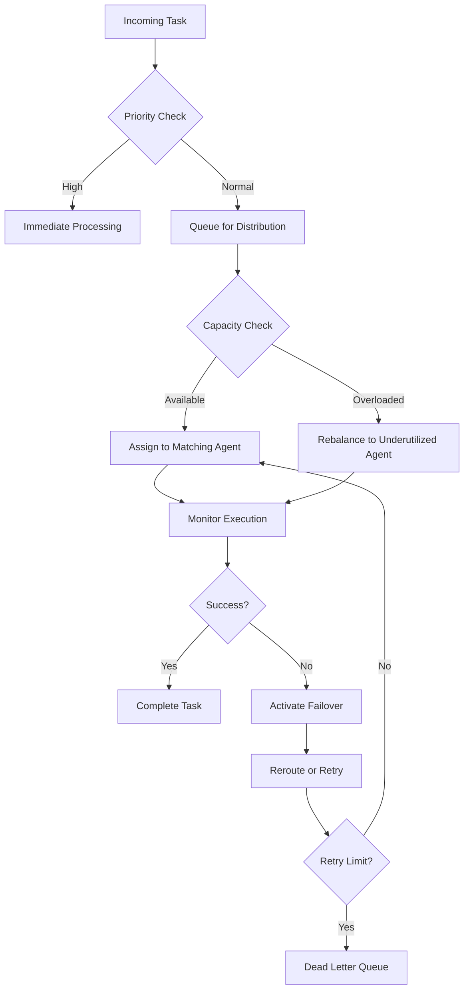
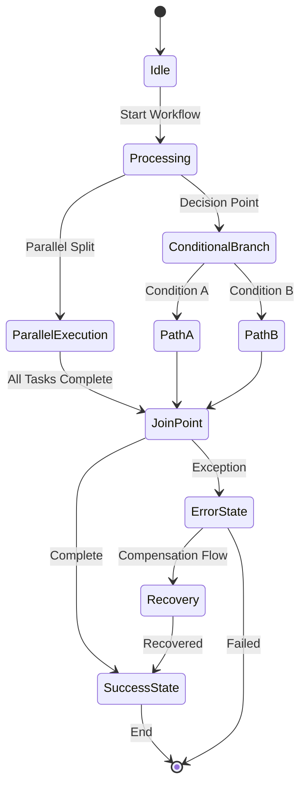
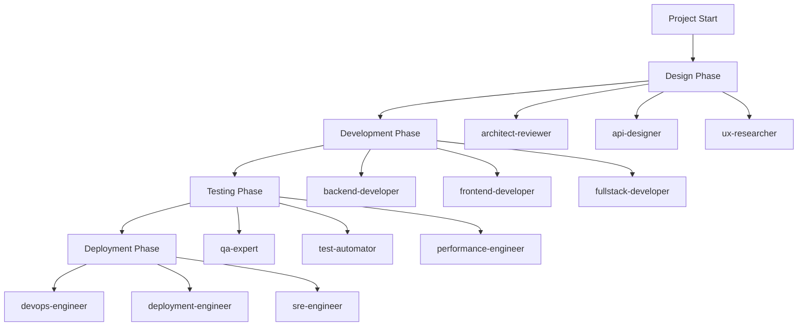
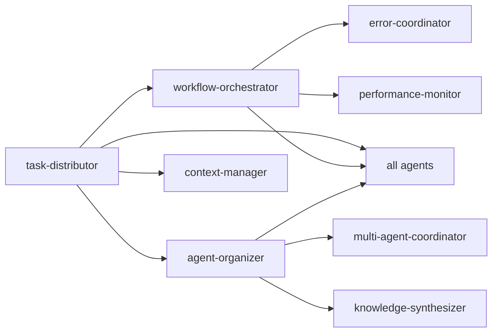

# Task Distribution and Workflow Orchestration

<cite>
**Referenced Files in This Document**   
- [task-distributor.md](file://task-distributor.md)
- [workflow-orchestrator.md](file://workflow-orchestrator.md)
- [agent-organizer.md](file://agent-organizer.md)
</cite>

## Table of Contents
1. [Introduction](#introduction)
2. [Task Distribution Mechanism](#task-distribution-mechanism)
3. [Workflow Orchestration Framework](#workflow-orchestration-framework)
4. [Agent Team Restructuring](#agent-team-restructuring)
5. [Configuration Parameters](#configuration-parameters)
6. [Error Handling and Recovery](#error-handling-and-recovery)
7. [Performance Optimization](#performance-optimization)
8. [Integration and Coordination](#integration-and-coordination)
9. [Conclusion](#conclusion)

## Introduction
This document details the architecture and operation of a multi-agent system designed for intelligent task distribution and complex workflow orchestration. The system leverages specialized agents to manage workload allocation, process automation, and team coordination across distributed environments. Central components include the task-distributor, workflow-orchestrator, and agent-organizer, which work in concert to ensure efficient, reliable, and scalable execution of tasks.

The system is designed to handle high-throughput scenarios with strict SLAs, employing dynamic load balancing, priority-based scheduling, and fault-tolerant workflows. It supports complex business processes with conditional branching, parallel execution, and human-in-the-loop interactions, while maintaining observability and auditability.

**Section sources**
- [task-distributor.md](file://task-distributor.md#L1-L20)
- [workflow-orchestrator.md](file://workflow-orchestrator.md#L1-L20)
- [agent-organizer.md](file://agent-organizer.md#L1-L20)

## Task Distribution Mechanism

The task-distributor agent serves as the central intelligence for work allocation across the agent ecosystem. Upon invocation, it initiates a context assessment by querying the context-manager for task volumes, agent capacities, priority schemes, and performance targets.

### Decision Logic for Agent Selection
Agent selection is determined through a multi-dimensional evaluation:
- **Skill mapping**: Tasks are matched to agents based on specialization areas
- **Workload monitoring**: Current agent workloads are assessed to prevent overload
- **Performance history**: Historical success rates influence assignment decisions
- **Cost factors**: Resource efficiency and operational cost are optimized
- **Availability status**: Only active and ready agents are considered

The distributor supports multiple routing strategies including capacity-based, performance-based, and affinity routing, allowing for flexible distribution patterns tailored to specific task requirements.

### Load Balancing and Failover
Load balancing is achieved through real-time capacity tracking and dynamic adjustment. The system maintains load balance variance below 10% and ensures distribution latency under 50ms. Health checking mechanisms continuously monitor agent status, enabling automatic failover to backup agents when failures are detected.

Failover strategies include:
- Immediate rerouting to secondary agents
- Dead letter queue handling for persistent failures
- Automatic escalation for high-priority tasks
- Retry mechanisms with exponential backoff

**Diagram sources**
- [task-distributor.md](file://task-distributor.md#L45-L97)
- [task-distributor.md](file://task-distributor.md#L132-L217)

**Section sources**
- [task-distributor.md](file://task-distributor.md#L1-L292)

## Workflow Orchestration Framework

The workflow-orchestrator manages complex, multi-phase workflows with dependencies and conditional branching. It implements state machines to track process execution and ensure consistency across distributed operations.

### Workflow Patterns and Execution
The orchestrator supports multiple process patterns:
- Sequential flow with checkpointing
- Parallel split/join for concurrent execution
- Exclusive choice for conditional branching
- Loops and iterations with termination conditions
- Event-based gateways for asynchronous triggers

Each workflow maintains state persistence and supports version control, enabling rollback and migration when needed. The system ensures state consistency at 100% and achieves recovery times under 30 seconds.

### Transaction Management
For workflows requiring data consistency, the orchestrator implements saga patterns and compensation logic. This allows for distributed transactions without requiring two-phase commit, maintaining ACID properties through idempotent operations and rollback procedures.

Critical transaction features include:
- Idempotency guarantees
- Compensation flows for partial failures
- Circuit breaking for fault isolation
- Audit logging for compliance

**Diagram sources**
- [workflow-orchestrator.md](file://workflow-orchestrator.md#L45-L96)
- [workflow-orchestrator.md](file://workflow-orchestrator.md#L219-L280)

**Section sources**
- [workflow-orchestrator.md](file://workflow-orchestrator.md#L1-L292)

## Agent Team Restructuring

The agent-organizer dynamically restructures agent teams based on project phase requirements and task characteristics. This enables optimal team composition for different stages of project execution.

### Dynamic Team Assembly
Team assembly follows a systematic approach:
1. Task decomposition into subtasks
2. Dependency mapping between subtasks
3. Agent capability matching
4. Role assignment and communication setup
5. Timeline synchronization

The organizer maintains a capability matrix that maps agent skills, performance history, and availability, allowing for data-driven team formation.

### Phase-Based Restructuring
For multi-phase projects, the organizer can reconfigure teams as follows:
- **Design phase**: Assembles architecture-focused agents (architect-reviewer, api-designer)
- **Development phase**: Forms implementation teams (backend-developer, frontend-developer)
- **Testing phase**: Creates QA-focused groups (qa-expert, test-automator)
- **Deployment phase**: Organizes operations teams (devops-engineer, deployment-engineer)

This dynamic restructuring ensures that each project phase is supported by the most appropriate agent composition.

**Diagram sources**
- [agent-organizer.md](file://agent-organizer.md#L146-L181)
- [agent-organizer.md](file://agent-organizer.md#L282-L292)

**Section sources**
- [agent-organizer.md](file://agent-organizer.md#L1-L292)

## Configuration Parameters

The system supports extensive configuration for fine-tuning performance and behavior.

### Priority Scheduling
Priority schemes allow for differentiated treatment of tasks based on business importance:
- Emergency handling for critical issues
- Preemption rules for high-priority tasks
- Resource reservation for SLA-critical workloads
- Starvation prevention to ensure fairness

### Timeout Handling
Timeout management includes:
- Task-level timeouts with configurable durations
- Retry policies with exponential backoff
- Circuit breaking after repeated failures
- Graceful degradation when resources are constrained

### Resource Constraints
Resource allocation is governed by:
- Capacity planning with predictive modeling
- Elastic scaling based on demand
- Resource pooling for efficient utilization
- Quota management to prevent overconsumption

Configuration targets include:
- Resource utilization > 80%
- Response time < 5 seconds
- Deadline success rate > 95%
- Task completion rate > 99%

**Section sources**
- [task-distributor.md](file://task-distributor.md#L45-L97)
- [workflow-orchestrator.md](file://workflow-orchestrator.md#L45-L96)
- [agent-organizer.md](file://agent-organizer.md#L45-L97)

## Error Handling and Recovery

The system addresses common distributed system challenges through comprehensive error handling mechanisms.

### Challenge Mitigation
**Deadlocks**: Prevented through timeout-based resource release and dependency cycle detection
**Race conditions**: Addressed via idempotent operations and state validation
**Partial failures**: Handled through compensation logic and saga patterns

### Monitoring and Recovery
Recovery procedures include:
- Automated retry distribution coordinated with error-coordinator
- Dead letter queue processing for failed tasks
- State restoration from persistent storage
- Manual override capabilities for exceptional cases

Monitoring systems track:
- Error rates and patterns
- Recovery success rates
- System throughput under failure conditions
- SLA compliance during incidents

The system achieves 99.9% workflow reliability and ensures audit trails are complete for all processes.

**Section sources**
- [workflow-orchestrator.md](file://workflow-orchestrator.md#L45-L96)
- [task-distributor.md](file://task-distributor.md#L282-L292)
- [workflow-orchestrator.md](file://workflow-orchestrator.md#L219-L280)

## Performance Optimization

To reduce coordination overhead in high-throughput scenarios, the system employs several optimization strategies.

### Throughput Enhancement
- Batch processing with optimized batch sizing
- Pipeline optimization for sequential tasks
- Parallel processing of independent subtasks
- Cache utilization for frequently accessed data

### Latency Reduction
- Predictive routing based on historical patterns
- Preemptive resource allocation
- Connection pooling for agent communication
- Asynchronous processing patterns

### Resource Efficiency
- Dynamic rebalancing to eliminate bottlenecks
- Predictive capacity planning
- Energy-efficient algorithm selection
- Cost-aware routing decisions

Performance targets include:
- System throughput maximization
- Response time minimization
- Cost per task optimization
- Energy consumption reduction

The system has demonstrated 67% reduction in task wait time and 23% performance improvement through these optimizations.

**Section sources**
- [task-distributor.md](file://task-distributor.md#L219-L280)
- [agent-organizer.md](file://agent-organizer.md#L230-L250)
- [workflow-orchestrator.md](file://workflow-orchestrator.md#L219-L280)

## Integration and Coordination

The agents form a cohesive ecosystem through well-defined integration points.

### Inter-Agent Collaboration
Key integration patterns include:
- task-distributor working with workflow-orchestrator on task dependencies
- agent-organizer collaborating with task-distributor on capacity planning
- workflow-orchestrator guiding context-manager on process state
- error-coordinator coordinating with all agents on recovery flows

### Communication Protocol
Standardized communication includes:
- JSON-based context queries
- Progress tracking with standardized metrics
- Delivery notifications with performance data
- Context assessment requests with structured payloads

The integration framework ensures that all agents can coordinate effectively while maintaining their specialized functions.

**Diagram sources**
- [task-distributor.md](file://task-distributor.md#L282-L292)
- [workflow-orchestrator.md](file://workflow-orchestrator.md#L282-L292)
- [agent-organizer.md](file://agent-organizer.md#L282-L292)

**Section sources**
- [task-distributor.md](file://task-distributor.md#L282-L292)
- [workflow-orchestrator.md](file://workflow-orchestrator.md#L282-L292)
- [agent-organizer.md](file://agent-organizer.md#L282-L292)

## Conclusion
The multi-agent system for task distribution and workflow orchestration provides a robust framework for managing complex, distributed workloads. By combining the specialized capabilities of task-distributor, workflow-orchestrator, and agent-organizer, the system achieves high reliability, efficiency, and adaptability.

Key strengths include intelligent agent selection, dynamic team restructuring, and comprehensive error handling. The system meets stringent performance targets while maintaining flexibility to adapt to changing requirements. Through continuous monitoring and optimization, it delivers exceptional value in high-throughput, mission-critical environments.