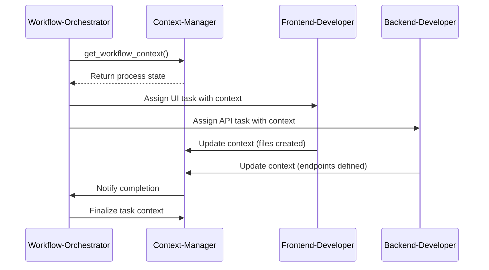
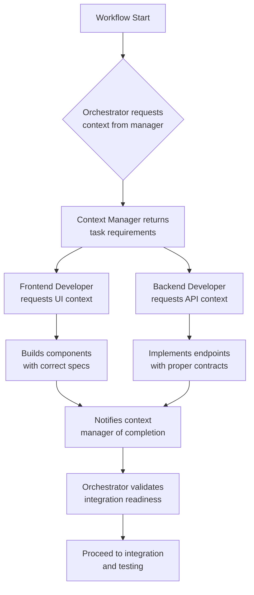

# Context-Aware Communication

<cite>
**Referenced Files in This Document**   
- [context-manager.md](file://context-manager.md)
- [workflow-orchestrator.md](file://workflow-orchestrator.md)
- [frontend-developer.md](file://frontend-developer.md)
- [backend-developer.md](file://backend-developer.md)
</cite>

## Table of Contents
1. [Introduction](#introduction)
2. [Context Management System](#context-management-system)
3. [Workflow Orchestration and Context Flow](#workflow-orchestration-and-context-flow)
4. [Context Object Structure](#context-object-structure)
5. [Communication Protocols and Message Formats](#communication-protocols-and-message-formats)
6. [Inter-Agent Collaboration Example](#inter-agent-collaboration-example)
7. [State Tracking and Consistency Mechanisms](#state-tracking-and-consistency-mechanisms)
8. [Challenges in Context Management](#challenges-in-context-management)
9. [Best Practices for Communication Design](#best-practices-for-communication-design)
10. [Conclusion](#conclusion)

## Introduction
This document details the context-aware communication protocols implemented across the multi-agent system, focusing on how contextual information is gathered, structured, distributed, and synchronized. The system enables seamless collaboration between specialized agents such as frontend-developer, backend-developer, and workflow-orchestrator by maintaining a shared understanding of tasks, constraints, and success criteria through the context-manager. This ensures coherent, efficient, and consistent execution of complex workflows.

## Context Management System

The context-manager serves as the central hub for information storage, retrieval, and synchronization across all agents. It ensures that relevant context is available to participating agents with high consistency, availability, and performance.

Key responsibilities of the context-manager include:
- Gathering context requirements from requesting agents
- Structuring and storing context data using optimized storage patterns
- Enforcing access control and privacy compliance
- Managing data lifecycle and versioning
- Providing fast retrieval (<100ms) and high availability (>99.9%)

The system supports multiple storage backends including Redis for caching, Elasticsearch for full-text search, and vector databases for semantic retrieval, enabling flexible and scalable access to contextual data.

**Section sources**
- [context-manager.md](file://context-manager.md#L1-L50)

## Workflow Orchestration and Context Flow

The workflow-orchestrator coordinates complex processes by leveraging context from the context-manager to guide execution. It initiates communication by querying for workflow context, ensuring alignment with existing state and requirements.

When a new task begins, the workflow-orchestrator:
1. Requests workflow context from the context-manager
2. Analyzes process complexity, integration points, and error handling needs
3. Designs state machines and transition logic
4. Orchestrates agent participation based on task requirements

This coordination ensures that each agent receives the precise context needed for their role, reducing redundancy and miscommunication.



**Diagram sources**
- [workflow-orchestrator.md](file://workflow-orchestrator.md#L20-L40)
- [context-manager.md](file://context-manager.md#L130-L150)

## Context Object Structure

Context objects contain structured metadata that define the parameters of a task. Each context includes:

- **Requirements**: Functional and non-functional specifications
- **Constraints**: Technical, temporal, or resource limitations
- **Success Criteria**: Measurable outcomes and quality benchmarks
- **Agent Roles**: Assigned participants and responsibilities
- **Dependencies**: Inter-task or inter-service requirements
- **Timeline**: Deadlines and milestones
- **Compliance Rules**: Security, privacy, and regulatory standards

These objects are versioned and stored with audit trails to ensure traceability and accountability throughout the task lifecycle.

**Section sources**
- [context-manager.md](file://context-manager.md#L60-L90)

## Communication Protocols and Message Formats

All agents follow standardized communication protocols when interacting with the context-manager and each other. Messages are formatted in JSON and include metadata for routing, tracking, and processing.

### Context Request Format
```json
{
  "requesting_agent": "frontend-developer",
  "request_type": "get_project_context",
  "payload": {
    "query": "Frontend development context needed: current UI architecture, component ecosystem, design language, established patterns, and frontend infrastructure."
  }
}
```

### Progress Update Format
```json
{
  "agent": "backend-developer",
  "status": "developing",
  "phase": "Service implementation",
  "completed": ["Data models", "Business logic", "Auth layer"],
  "pending": ["Cache integration", "Queue setup", "Performance tuning"]
}
```

### Completion Notification
```json
{
  "agent": "frontend-developer",
  "update_type": "completion",
  "deliverables": ["/src/components/Dashboard/"],
  "test_coverage": "90%",
  "next_steps": ["Backend API integration"]
}
```

Metadata conventions include:
- `requesting_agent`: Originating agent identity
- `request_type`: Purpose of the message
- `correlation_id`: For tracking related messages
- `timestamp`: For ordering and freshness
- `version`: Context schema version

**Section sources**
- [context-manager.md](file://context-manager.md#L132-L150)
- [frontend-developer.md](file://frontend-developer.md#L170-L180)
- [backend-developer.md](file://backend-developer.md#L110-L120)

## Inter-Agent Collaboration Example

During a full-stack feature implementation, the frontend-developer and backend-developer collaborate through shared context managed by the context-manager.

### Workflow:
1. **Context Initialization**: workflow-orchestrator requests context for a new feature
2. **Task Assignment**: Both developers receive task-specific context
3. **Development Phase**:
   - frontend-developer queries for UI patterns and design tokens
   - backend-developer retrieves API contracts and database schemas
4. **Synchronization**:
   - frontend-developer documents component APIs
   - backend-developer publishes endpoint specifications
5. **Integration Readiness**: Both notify context-manager upon completion
6. **Handoff**: workflow-orchestrator verifies integration points and proceeds

This ensures both agents work with aligned assumptions and up-to-date information, minimizing integration issues.



**Diagram sources**
- [frontend-developer.md](file://frontend-developer.md#L150-L200)
- [backend-developer.md](file://backend-developer.md#L110-L140)

## State Tracking and Consistency Mechanisms

The system maintains state consistency through several mechanisms:

- **Version Vectors**: Track causal relationships between context updates
- **Distributed Locks**: Prevent concurrent modifications to critical context
- **Event Sourcing**: Log all context changes for audit and replay
- **Read Repair**: Detect and correct stale reads
- **Write Quorums**: Ensure majority agreement on updates

The context-manager reports real-time metrics including:
- `contexts_stored`: Total number of active contexts
- `avg_retrieval_time`: Performance benchmark
- `cache_hit_rate`: Efficiency of caching layer
- `consistency_score`: Measure of data integrity

These metrics ensure the system operates within defined SLAs and enables proactive optimization.

**Section sources**
- [context-manager.md](file://context-manager.md#L200-L220)

## Challenges in Context Management

Despite robust design, several challenges arise in practice:

### Context Consistency
Ensuring all agents operate on the same version of truth requires careful synchronization. The system addresses this through version vectors and conflict detection algorithms.

### Versioning
Multiple iterations of context objects must coexist during transitions. The system uses semantic versioning and backward compatibility checks to manage evolution.

### Conflict Resolution
When parallel updates occur, the system applies resolution strategies such as:
- Last-write-wins (with audit trail)
- Manual review escalation
- Automated merging based on conflict-free replicated data types (CRDTs)

### Information Overload
To prevent cognitive overload, agents receive only task-relevant context subsets. The context-manager applies filtering based on agent role, task scope, and priority.

**Section sources**
- [context-manager.md](file://context-manager.md#L80-L100)

## Best Practices for Communication Design

To maximize effectiveness of context-aware communication:

### For Agents:
- Always query context-manager before starting work
- Validate assumptions against current context
- Update context immediately after making changes
- Use standardized message formats consistently
- Include correlation IDs in all communications

### For System Design:
- Implement hierarchical context organization
- Use tagging for multi-dimensional retrieval
- Enable partial context updates
- Support both synchronous and asynchronous queries
- Provide caching with proper invalidation

### For Performance:
- Optimize retrieval paths with indexing
- Preload likely-needed context
- Use delta synchronization where possible
- Monitor and tune cache hit rates
- Implement circuit breakers for failed dependencies

These practices ensure reliable, efficient, and scalable communication across the agent ecosystem.

**Section sources**
- [context-manager.md](file://context-manager.md#L220-L250)

## Conclusion
The context-aware communication system enables effective collaboration across specialized agents by providing a shared, consistent, and high-performance context management layer. Through standardized protocols, structured context objects, and robust synchronization mechanisms, agents can work in parallel while maintaining alignment on requirements, constraints, and success criteria. The integration between context-manager, workflow-orchestrator, and domain-specific agents like frontend-developer and backend-developer demonstrates a scalable model for complex task execution in multi-agent systems.