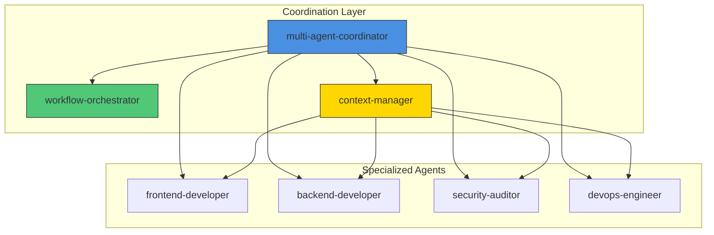
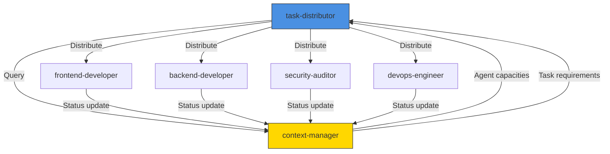
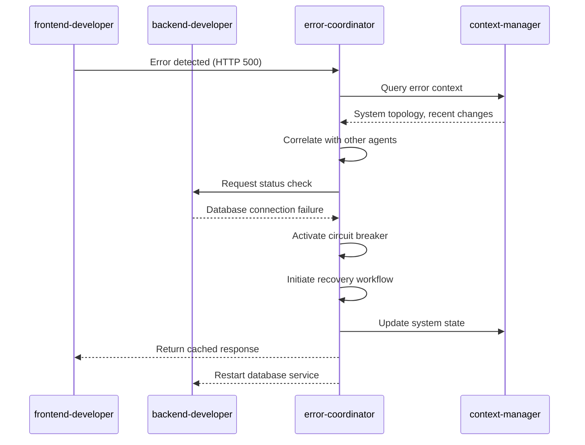
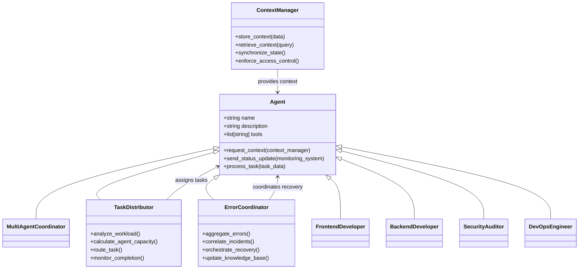
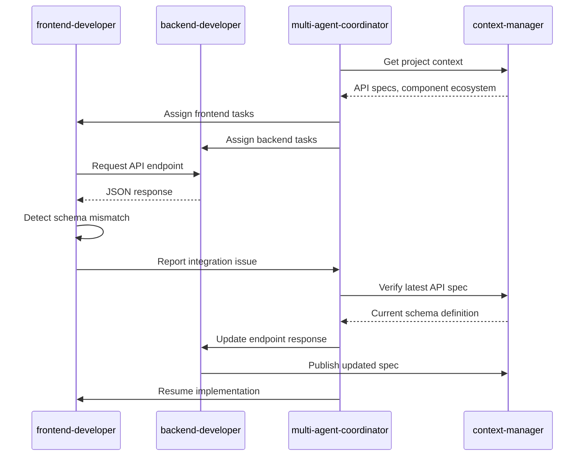
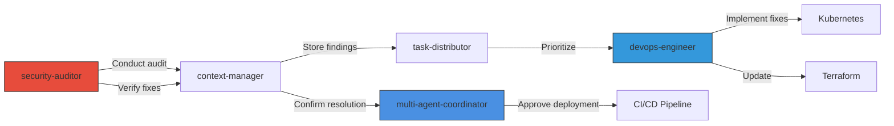
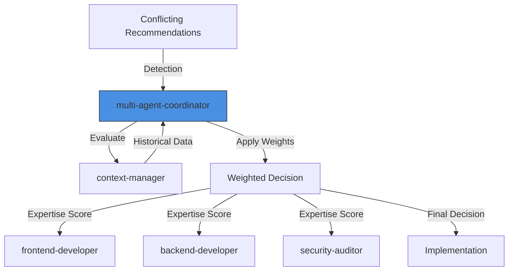

# Cross-Agent Collaboration

<cite>
**Referenced Files in This Document**   
- [multi-agent-coordinator.md](file://multi-agent-coordinator.md)
- [task-distributor.md](file://task-distributor.md)
- [error-coordinator.md](file://error-coordinator.md)
- [frontend-developer.md](file://frontend-developer.md)
- [backend-developer.md](file://backend-developer.md)
- [security-auditor.md](file://security-auditor.md)
- [devops-engineer.md](file://devops-engineer.md)
- [context-manager.md](file://context-manager.md)
- [workflow-orchestrator.md](file://workflow-orchestrator.md)
</cite>

## Table of Contents
1. [Introduction](#introduction)
2. [Meta-Agent Coordination Framework](#meta-agent-coordination-framework)
3. [Task Delegation and Distribution](#task-delegation-and-distribution)
4. [Error Coordination and Recovery](#error-coordination-and-recovery)
5. [Inter-Agent Communication Protocols](#inter-agent-communication-protocols)
6. [Real-World Collaboration Scenarios](#real-world-collaboration-scenarios)
7. [Coordination Challenges and Mitigation](#coordination-challenges-and-mitigation)
8. [Best Practices for Collaboration Networks](#best-practices-for-collaboration-networks)
9. [Conclusion](#conclusion)

## Introduction
This document details the cross-agent collaboration patterns within the agents ecosystem, focusing on how meta-agents coordinate specialized agents during complex projects. It examines the roles of multi-agent-coordinator.md, task-distributor.md, and error-coordinator.md in enabling seamless handoffs, resolving issues, and maintaining system resilience. The analysis covers communication protocols, task delegation mechanisms, and status synchronization methods that support efficient collaboration across diverse agent types.

**Section sources**
- [multi-agent-coordinator.md](file://multi-agent-coordinator.md#L1-L292)
- [task-distributor.md](file://task-distributor.md#L1-L292)
- [error-coordinator.md](file://error-coordinator.md#L1-L291)

## Meta-Agent Coordination Framework

The multi-agent-coordinator.md serves as the central orchestrator for complex workflows, managing inter-agent communication, dependency resolution, and fault tolerance. It ensures coordination overhead remains below 5%, prevents deadlocks, and guarantees message delivery across distributed systems. The coordinator integrates with context-manager.md to retrieve workflow requirements and agent states, enabling informed decision-making.

Key coordination patterns include master-worker, peer-to-peer, publish-subscribe, and scatter-gather models. The coordinator employs DAG execution, state machines, and saga patterns to manage workflow orchestration, while implementing circuit breakers, retry mechanisms, and compensation logic for fault tolerance.

**Diagram sources**
- [multi-agent-coordinator.md](file://multi-agent-coordinator.md#L1-L292)
- [context-manager.md](file://context-manager.md#L1-L292)
- [workflow-orchestrator.md](file://workflow-orchestrator.md#L1-L292)

**Section sources**
- [multi-agent-coordinator.md](file://multi-agent-coordinator.md#L1-L292)
- [context-manager.md](file://context-manager.md#L1-L292)
- [workflow-orchestrator.md](file://workflow-orchestrator.md#L1-L292)

## Task Delegation and Distribution

The task-distributor.md specializes in intelligent work allocation, load balancing, and queue management. It queries context-manager.md for task requirements and agent capacities, then applies priority scheduling and capacity tracking to optimize distribution. The system maintains load balance variance below 10% and ensures task completion rates exceed 99%.

Distribution strategies include round-robin, weighted distribution, least connections, and capacity-based routing. The distributor implements batch optimization, predictive routing, and dynamic rebalancing to enhance throughput. It integrates with multi-agent-coordinator.md to align task allocation with overall workflow objectives.

**Diagram sources**
- [task-distributor.md](file://task-distributor.md#L1-L292)
- [context-manager.md](file://context-manager.md#L1-L292)

**Section sources**
- [task-distributor.md](file://task-distributor.md#L1-L292)
- [context-manager.md](file://context-manager.md#L1-L292)

## Error Coordination and Recovery

The error-coordinator.md manages distributed error handling, failure recovery, and system resilience. It correlates errors across agents using temporal correlation, causal analysis, and request tracing to identify root causes. The coordinator implements circuit breaker patterns, bulkhead isolation, and graceful degradation to prevent failure cascades.

When an agent detects an issue, it notifies error-coordinator.md, which orchestrates recovery flows including automated rollbacks, state restoration, and data reconciliation. The system maintains MTTR below 5 minutes and achieves over 90% recovery success through exponential backoff, retry budgets, and alternative execution paths.

**Diagram sources**
- [error-coordinator.md](file://error-coordinator.md#L1-L291)
- [context-manager.md](file://context-manager.md#L1-L292)
- [frontend-developer.md](file://frontend-developer.md#L1-L243)
- [backend-developer.md](file://backend-developer.md#L1-L226)

**Section sources**
- [error-coordinator.md](file://error-coordinator.md#L1-L291)
- [context-manager.md](file://context-manager.md#L1-L292)

## Inter-Agent Communication Protocols

Agents communicate through standardized JSON-based protocols that include requesting_agent, request_type, and payload fields. Each agent queries context-manager.md for relevant context before executing tasks, ensuring alignment with current system state.

The communication framework supports multiple patterns:
- Request-reply for synchronous operations
- Publish-subscribe for event distribution
- Message queues for asynchronous processing
- REST APIs and GraphQL for data exchange

All agents implement progress tracking with standardized status updates that include agent identifier, status type, and detailed progress metrics. This enables transparent monitoring and facilitates handoffs between specialized agents.

**Diagram sources**
- [multi-agent-coordinator.md](file://multi-agent-coordinator.md#L1-L292)
- [task-distributor.md](file://task-distributor.md#L1-L292)
- [error-coordinator.md](file://error-coordinator.md#L1-L291)
- [context-manager.md](file://context-manager.md#L1-L292)

**Section sources**
- [multi-agent-coordinator.md](file://multi-agent-coordinator.md#L1-L292)
- [task-distributor.md](file://task-distributor.md#L1-L292)
- [error-coordinator.md](file://error-coordinator.md#L1-L291)
- [context-manager.md](file://context-manager.md#L1-L292)

## Real-World Collaboration Scenarios

### Frontend-Backend API Integration
During API integration, frontend-developer.md collaborates with backend-developer.md through multi-agent-coordinator.md. The coordinator ensures both agents have aligned specifications by synchronizing through context-manager.md. When the frontend developer encounters an unexpected response format, they notify error-coordinator.md, which verifies the issue and coordinates a resolution.

**Diagram sources**
- [frontend-developer.md](file://frontend-developer.md#L1-L243)
- [backend-developer.md](file://backend-developer.md#L1-L226)
- [multi-agent-coordinator.md](file://multi-agent-coordinator.md#L1-L292)
- [context-manager.md](file://context-manager.md#L1-L292)

**Section sources**
- [frontend-developer.md](file://frontend-developer.md#L1-L243)
- [backend-developer.md](file://backend-developer.md#L1-L226)

### Security Hardening and Deployment
Security-auditor.md works with devops-engineer.md to harden deployments. The security auditor conducts assessments using tools like nessus and qualys, then shares findings with the DevOps engineer through context-manager.md. The multi-agent-coordinator.md ensures priority vulnerabilities are addressed before deployment.

**Diagram sources**
- [security-auditor.md](file://security-auditor.md#L1-L295)
- [devops-engineer.md](file://devops-engineer.md#L1-L293)
- [context-manager.md](file://context-manager.md#L1-L292)
- [task-distributor.md](file://task-distributor.md#L1-L292)
- [multi-agent-coordinator.md](file://multi-agent-coordinator.md#L1-L292)

**Section sources**
- [security-auditor.md](file://security-auditor.md#L1-L295)
- [devops-engineer.md](file://devops-engineer.md#L1-L293)

## Coordination Challenges and Mitigation

### Coordination Overhead
With numerous agents involved, coordination overhead can impact performance. The multi-agent-coordinator.md maintains overhead below 5% through message batching, compression strategies, and optimized routing. The system uses connection pooling and async patterns to minimize latency.

### Conflicting Recommendations
Different agents may provide conflicting recommendations. The meta-coordinator resolves conflicts by:
1. Evaluating recommendations against project goals
2. Consulting historical performance data from context-manager.md
3. Applying weighted decision-making based on agent expertise
4. Escalating unresolved conflicts to human stakeholders

### Priority Management
The task-distributor.md implements priority scheduling with SLA enforcement, preemption rules, and resource reservation. Critical security issues identified by security-auditor.md automatically receive highest priority, while feature development tasks are scheduled based on business impact.

**Diagram sources**
- [multi-agent-coordinator.md](file://multi-agent-coordinator.md#L1-L292)
- [context-manager.md](file://context-manager.md#L1-L292)

**Section sources**
- [multi-agent-coordinator.md](file://multi-agent-coordinator.md#L1-L292)
- [context-manager.md](file://context-manager.md#L1-L292)

## Best Practices for Collaboration Networks

### Designing Effective Collaboration Networks
1. **Clear Role Definition**: Each agent has well-defined responsibilities and expertise areas
2. **Standardized Communication**: All agents use consistent protocols and data formats
3. **Centralized Context Management**: context-manager.md serves as the single source of truth
4. **Automated Handoffs**: Transitions between agents are triggered by system events
5. **Comprehensive Monitoring**: Progress tracking enables visibility across all workflows

### Optimizing Team Composition
Team composition should be optimized based on project objectives:
- **Feature Development**: frontend-developer.md, backend-developer.md, qa-expert.md
- **Security Projects**: security-auditor.md, penetration-tester.md, devops-engineer.md
- **Performance Optimization**: performance-engineer.md, database-optimizer.md, devops-engineer.md
- **Compliance Audits**: compliance-auditor.md, legal-advisor.md, security-auditor.md

The agent-organizer.md (not detailed here) works with multi-agent-coordinator.md to assemble optimal teams, considering agent availability, expertise, and workload.

**Section sources**
- [multi-agent-coordinator.md](file://multi-agent-coordinator.md#L1-L292)
- [task-distributor.md](file://task-distributor.md#L1-L292)
- [context-manager.md](file://context-manager.md#L1-L292)

## Conclusion
The agents ecosystem demonstrates sophisticated cross-agent collaboration patterns enabled by meta-agents like multi-agent-coordinator.md, task-distributor.md, and error-coordinator.md. These coordination mechanisms allow specialized agents to work together seamlessly on complex projects, with proper handoffs, conflict resolution, and error recovery. The integration of context-manager.md ensures all agents operate with consistent, up-to-date information, while standardized communication protocols enable efficient collaboration. By following the best practices outlined in this document, organizations can design effective collaboration networks that leverage the strengths of specialized agents while minimizing coordination overhead and resolving conflicts efficiently.