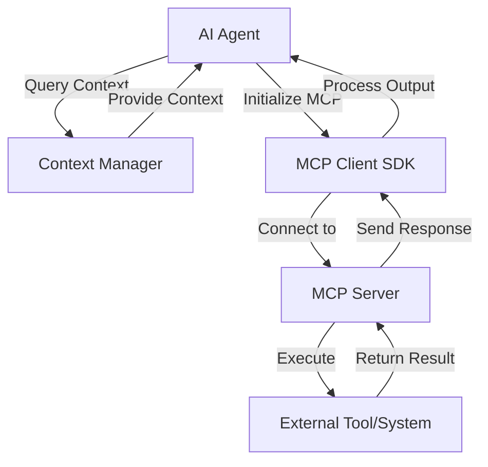
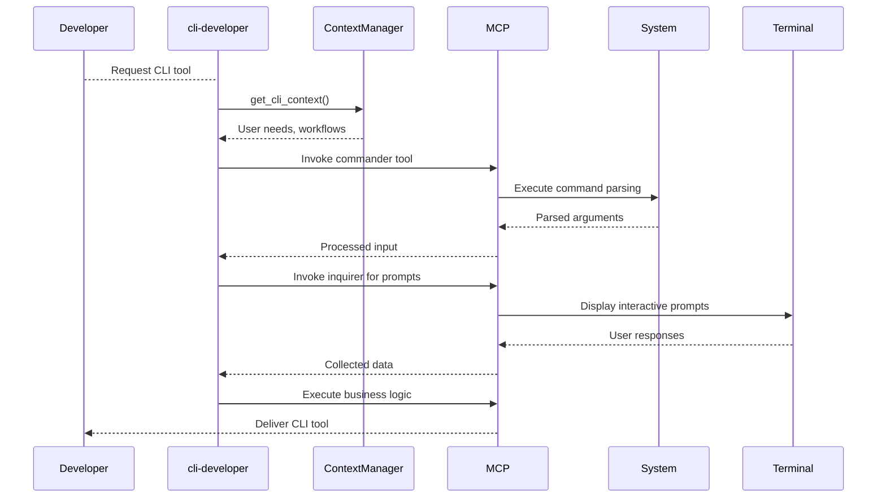
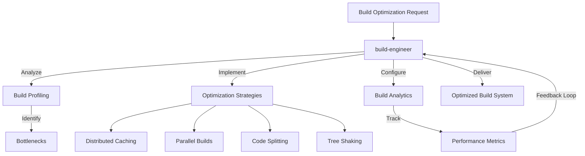
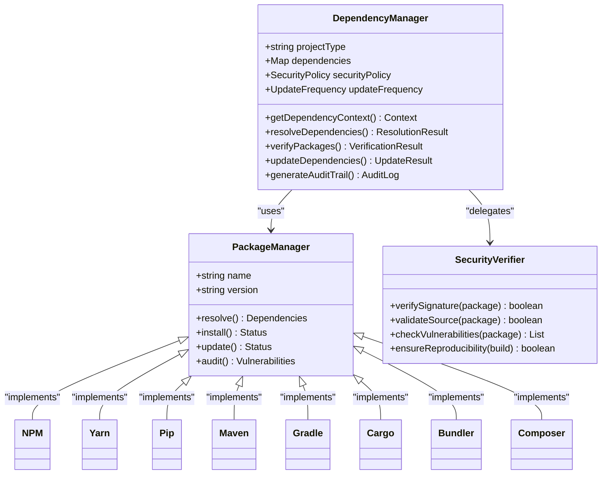

# MCP Tool Integration

<cite>
**Referenced Files in This Document**   
- [mcp-developer.md](file://mcp-developer.md)
- [cli-developer.md](file://cli-developer.md)
- [build-engineer.md](file://build-engineer.md)
- [test-automator.md](file://test-automator.md)
- [dependency-manager.md](file://dependency-manager.md)
- [agent-organizer.md](file://agent-organizer.md)
</cite>

## Table of Contents
1. [Introduction](#introduction)
2. [MCP Tool Integration Overview](#mcp-tool-integration-overview)
3. [Agent-Specific MCP Integration](#agent-specific-mcp-integration)
4. [Configuration Syntax and Permissions](#configuration-syntax-and-permissions)
5. [Security Model and Execution Boundaries](#security-model-and-execution-boundaries)
6. [Context Preservation and Output Processing](#context-preservation-and-output-processing)
7. [Common Issues and Troubleshooting](#common-issues-and-troubleshooting)
8. [Optimization Strategies](#optimization-strategies)
9. [Conclusion](#conclusion)

## Introduction
The Model Context Protocol (MCP) enables seamless integration between AI agents and external tools, systems, and services. This document details how various subagents leverage MCP to execute commands, access system resources, and interact with external environments. The protocol provides a standardized framework for tool invocation, context management, and secure execution across diverse agent types with specialized capabilities.

**Section sources**
- [mcp-developer.md](file://mcp-developer.md#L0-L42)

## MCP Tool Integration Overview
MCP serves as the foundational protocol connecting AI agents with external tools and data sources. Agents use MCP to execute system commands, manage dependencies, automate testing, and perform build operations through a standardized JSON-RPC 2.0 interface. The protocol ensures type safety through schema validation (using Zod/Pydantic), implements robust error handling, and supports various transport mechanisms for reliable communication.

Agents initiate MCP integration by querying the context-manager to understand their operational requirements and constraints. This context assessment determines the appropriate tools, permissions, and execution parameters for each agent's specific domain. The MCP SDK provides client libraries in multiple languages, enabling consistent implementation patterns across different technology stacks.

**Diagram sources**
- [mcp-developer.md](file://mcp-developer.md#L0-L42)
- [mcp-developer.md](file://mcp-developer.md#L44-L102)

**Section sources**
- [mcp-developer.md](file://mcp-developer.md#L0-L102)

## Agent-Specific MCP Integration

### CLI Developer Integration
The cli-developer agent leverages MCP to create and manage command-line interfaces with exceptional developer experience. Using tools like commander, yargs, and inquirer, this agent implements sophisticated argument parsing, interactive prompts, and terminal UI components. The agent optimizes CLI performance with startup times under 50ms and ensures cross-platform compatibility across major operating systems and shells.

The cli-developer integrates with MCP to implement shell completions for Bash, Zsh, Fish, and PowerShell, providing intelligent command suggestions and option hints. Progress indicators using ora and visual layouts with blessed enhance user feedback during long-running operations. Configuration management supports multiple sources including config files, environment variables, and command-line overrides.

**Diagram sources**
- [cli-developer.md](file://cli-developer.md#L0-L42)
- [cli-developer.md](file://cli-developer.md#L104-L138)

**Section sources**
- [cli-developer.md](file://cli-developer.md#L0-L138)

### Build Engineer Integration
The build-engineer agent utilizes MCP to optimize build systems and compilation pipelines. With tools including webpack, vite, esbuild, and turbo, this agent reduces build times significantly while maintaining high cache hit rates. The implementation focuses on incremental compilation, parallel processing, and sophisticated caching strategies to achieve rebuild times under 5 seconds.

MCP integration enables the build-engineer to analyze dependency graphs, implement code splitting, and configure tree shaking for optimal bundle sizes. The agent establishes comprehensive monitoring for build performance metrics, including cold start times, hot reload speed, memory usage, and CPU utilization. Distributed caching across development teams ensures consistent build outputs and eliminates redundant compilation.

**Diagram sources**
- [build-engineer.md](file://build-engineer.md#L0-L42)
- [build-engineer.md](file://build-engineer.md#L104-L138)

**Section sources**
- [build-engineer.md](file://build-engineer.md#L0-L138)

### Test Automator Implementation
The test-automator agent employs MCP to create comprehensive test automation solutions across multiple platforms and technologies. Leveraging tools such as selenium, cypress, playwright, and pytest, this agent implements end-to-end testing, performance testing, and cross-browser automation. The integration supports various testing frameworks for different technology stacks, ensuring comprehensive coverage.

MCP enables the test-automator to manage test execution environments, process test results, and generate detailed analytics. The agent implements parallel test execution to reduce feedback cycles and incorporates flaky test detection to improve reliability. Integration with CI/CD systems like Jenkins ensures automated testing in development pipelines, while performance testing with k6 validates system behavior under load.

**Section sources**
- [test-automator.md](file://test-automator.md#L0-L42)

### Dependency Manager Implementation
The dependency-manager agent uses MCP to manage software dependencies across multiple ecosystems. With support for npm, yarn, pip, maven, gradle, cargo, bundler, and composer, this agent handles dependency resolution, version management, and supply chain security. The implementation ensures consistent dependency updates while maintaining compatibility across project components.

MCP integration enables the dependency-manager to verify package integrity through signature checking and source validation. The agent implements dependency pinning and audit trails to enhance security, while managing vendor dependencies and ensuring build reproducibility. Automated update mechanisms balance the need for current dependencies with stability requirements.

**Diagram sources**
- [dependency-manager.md](file://dependency-manager.md#L0-L42)
- [dependency-manager.md](file://dependency-manager.md#L104-L138)

**Section sources**
- [dependency-manager.md](file://dependency-manager.md#L0-L138)

## Configuration Syntax and Permissions
MCP tool configuration follows a standardized syntax defined in agent definition files. Each agent declares its required tools in the tools field, specifying the exact tool names and versions needed for operation. The configuration includes both direct execution tools and supporting utilities for development and debugging.

Permission scoping is implemented through a least-privilege model, where agents receive only the permissions necessary for their specific functions. The context-manager evaluates each agent's requirements and grants appropriate access levels to system resources, external services, and data sources. This approach minimizes security risks while enabling effective tool utilization.

Agent configurations include metadata that defines execution boundaries, resource limits, and timeout parameters. These constraints prevent resource exhaustion and ensure system stability. The MCP server validates all tool invocations against the agent's declared permissions, rejecting requests that exceed authorized capabilities.

**Section sources**
- [mcp-developer.md](file://mcp-developer.md#L0-L42)
- [agent-organizer.md](file://agent-organizer.md#L0-L42)

## Security Model and Execution Boundaries
The MCP security model implements multiple layers of protection to ensure safe tool execution. Input validation using Zod and Pydantic schemas prevents injection attacks and malformed data processing. Output sanitization protects against malicious content propagation, while authentication mechanisms verify agent identity before tool access.

Authorization controls enforce role-based access to tools and resources, with rate limiting preventing abuse and denial-of-service scenarios. Request filtering blocks potentially dangerous operations, and audit logging provides comprehensive tracking of all tool invocations for security analysis. Secure configuration management prevents exposure of sensitive credentials and keys.

Execution boundaries isolate agent operations through containerization and sandboxing, particularly for CLI tools and build processes. Resource limits constrain memory usage, CPU consumption, and network access to prevent system destabilization. The security-engineer agent collaborates with other agents to implement and verify these controls, ensuring compliance with organizational policies.

**Section sources**
- [mcp-developer.md](file://mcp-developer.md#L44-L102)
- [mcp-developer.md](file://mcp-developer.md#L104-L138)

## Context Preservation and Output Processing
MCP maintains context integrity throughout tool invocation cycles using session state management and prompt processing. When an agent invokes a tool, the MCP client preserves the conversation context, ensuring that subsequent operations maintain continuity. This context includes conversation history, intermediate results, and relevant metadata.

Output processing transforms raw tool results into structured data that agents can interpret and act upon. The MCP server normalizes responses from different tools into a consistent format, handling various data types and error conditions. Response parsing extracts relevant information while filtering out noise, and error recovery mechanisms handle partial failures gracefully.

The context-manager plays a crucial role in synchronizing state across agents, particularly in multi-agent workflows orchestrated by the agent-organizer. Cache optimization and delta synchronization ensure efficient context updates, while conflict detection and merge strategies maintain data consistency in collaborative environments.

**Section sources**
- [mcp-developer.md](file://mcp-developer.md#L0-L42)
- [context-manager.md](file://context-manager.md#L0-L42)

## Common Issues and Troubleshooting

### Tool Permission Errors
Tool permission errors occur when agents attempt to access tools outside their authorized scope. These errors are typically resolved by updating the agent's configuration to include the required tools or adjusting permission policies through the context-manager. The security-engineer agent assists in evaluating permission requests against security policies.

### Timeout Handling
Timeout issues arise when tool operations exceed their allocated execution time. The multi-agent-coordinator implements circuit breakers and fallback strategies to handle timeouts gracefully. Agents optimize their operations to complete within time limits, and the devops-engineer adjusts timeout parameters based on performance requirements.

### Output Parsing Failures
Output parsing failures happen when tool responses don't match expected formats. Agents implement robust error handling with fallback parsing strategies and validation rules. The mcp-developer agent ensures schema compliance through comprehensive testing, while the qa-expert verifies output consistency across different scenarios.

**Section sources**
- [multi-agent-coordinator.md](file://multi-agent-coordinator.md#L0-L42)
- [mcp-developer.md](file://mcp-developer.md#L44-L102)
- [security-engineer.md](file://security-engineer.md#L0-L42)

## Optimization Strategies
Optimizing MCP tool integration focuses on minimizing invocation overhead and maximizing effectiveness. Connection pooling reduces the latency of repeated tool access, while caching strategies store frequently accessed results to avoid redundant executions. Batch processing combines multiple tool invocations into single requests when possible, reducing network overhead.

Lazy loading defers tool initialization until needed, conserving system resources. Resource cleanup ensures proper disposal of connections and temporary files after tool execution. Memory management techniques prevent leaks in long-running agent processes, and profiling integration identifies performance bottlenecks for targeted optimization.

The performance-engineer agent collaborates with other agents to implement these optimizations, conducting regular benchmarks and load testing. Scalability planning anticipates future growth, ensuring that tool integration remains efficient as the system expands.

**Section sources**
- [mcp-developer.md](file://mcp-developer.md#L44-L102)
- [performance-engineer.md](file://performance-engineer.md#L0-L42)

## Conclusion
MCP tool integration provides a robust framework for connecting AI agents with external systems and services. Through standardized protocols, secure execution boundaries, and optimized performance, agents like cli-developer, build-engineer, test-automator, and dependency-manager effectively leverage MCP to enhance their capabilities. The architecture balances flexibility with security, enabling powerful integrations while maintaining system stability and data protection.

The ecosystem of MCP tools continues to evolve, with new capabilities added through collaboration between specialized agents. As demonstrated by the mcp-developer's implementation of 12 tools and 8 resources with 94% test coverage, the protocol supports production-ready solutions that achieve high performance and reliability standards.