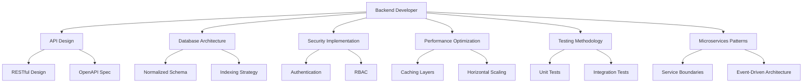
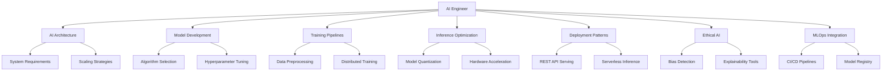
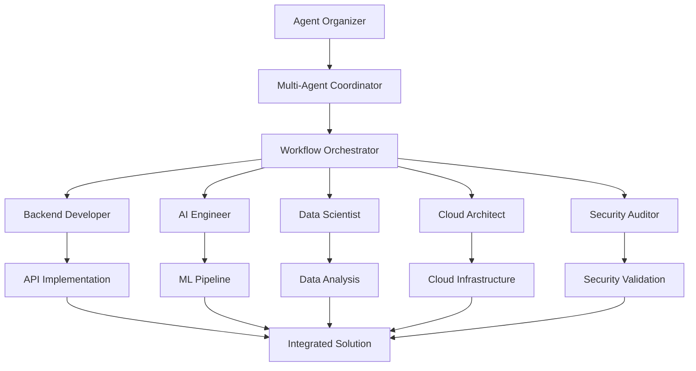
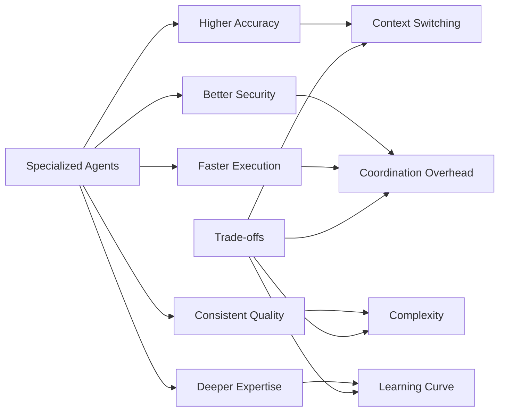

# Specialized Subagents

<cite>
**Referenced Files in This Document**   
- [README.md](file://README.md)
- [backend-developer.md](file://backend-developer.md)
- [ai-engineer.md](file://ai-engineer.md)
- [data-scientist.md](file://data-scientist.md)
- [cloud-architect.md](file://cloud-architect.md)
- [security-auditor.md](file://security-auditor.md)
- [product-manager.md](file://product-manager.md)
- [workflow-orchestrator.md](file://workflow-orchestrator.md)
- [multi-agent-coordinator.md](file://multi-agent-coordinator.md)
- [agent-organizer.md](file://agent-organizer.md)
</cite>

## Table of Contents
1. [Introduction](#introduction)
2. [Design Philosophy of Role Specialization](#design-philosophy-of-role-specialization)
3. [Core Domains and Subagent Categories](#core-domains-and-subagent-categories)
4. [Deep Dive: Backend Developer Subagent](#deep-dive-backend-developer-subagent)
5. [Deep Dive: AI Engineer Subagent](#deep-dive-ai-engineer-subagent)
6. [Cross-Domain Collaboration Patterns](#cross-domain-collaboration-patterns)
7. [Practical Usage Patterns for Agent Selection](#practical-usage-patterns-for-agent-selection)
8. [Common Pitfalls in Agent Selection](#common-pitfalls-in-agent-selection)
9. [Performance Benefits and Trade-offs](#performance-benefits-and-trade-offs)
10. [Conclusion](#conclusion)

## Introduction

The agents repository represents a comprehensive ecosystem of 117 specialized subagents, each designed to encapsulate deep domain expertise across development, infrastructure, data, security, business, and research domains. These subagents function as production-ready AI specialists that extend Claude Code's capabilities through focused, task-specific intelligence. The architecture follows best practices with Model Context Protocol (MCP) tool integration, enabling precise delegation of complex workflows to agents with optimal skill alignment. This document explores the design principles, operational mechanics, and strategic advantages of this specialization model, providing practical guidance for effective utilization in real-world scenarios.

## Design Philosophy of Role Specialization

The specialization model is founded on the principle that narrow, well-defined roles yield superior outcomes compared to generalized agents. Each subagent operates within an isolated context window, preventing cognitive overload and ensuring domain-specific knowledge remains focused and relevant. This architectural choice enables several key advantages:

- **Precision Focus**: Subagents maintain deep expertise in their designated domains without dilution from unrelated concerns
- **Optimized Tooling**: Each agent is equipped with a curated set of MCP tools relevant to its function, minimizing unnecessary access and potential errors
- **Consistent Standards**: Specialized agents enforce domain-specific best practices and industry standards
- **Efficient Context Management**: Isolated contexts prevent information pollution and maintain clarity in primary conversation threads

The system follows a standardized template structure with defined sections for role definition, MCP tool integration, communication protocols, and implementation workflows. This consistency ensures predictable behavior while allowing for domain-specific customization. The hierarchical categorization into 10 distinct domains—from Core Development to Research & Analysis—provides an intuitive framework for agent discovery and selection.

**Section sources**
- [README.md](file://README.md#L1-L350)

## Core Domains and Subagent Categories

The repository organizes subagents into 10 primary categories, each addressing a distinct aspect of the software development lifecycle and business operations:

- **Core Development**: Foundational coding specialists including backend-developer, frontend-developer, and fullstack-developer
- **Language Specialists**: Deep expertise in specific programming languages and frameworks such as typescript-pro, python-pro, and golang-pro
- **Infrastructure**: Cloud, deployment, and platform specialists including cloud-architect, kubernetes-specialist, and terraform-engineer
- **Quality & Security**: Testing, security, and code quality experts like code-reviewer, penetration-tester, and performance-engineer
- **Data & AI**: Data engineering, machine learning, and AI specialists including data-engineer, ml-engineer, and prompt-engineer
- **Developer Experience**: Tooling and productivity experts such as build-engineer, refactoring-specialist, and git-workflow-manager
- **Specialized Domains**: Niche technology experts including blockchain-developer, fintech-engineer, and iot-engineer
- **Business & Product**: Product management and business analysis roles like product-manager, business-analyst, and scrum-master
- **Meta & Orchestration**: Coordination and meta-programming agents including multi-agent-coordinator, workflow-orchestrator, and agent-organizer
- **Research & Analysis**: Research, search, and market analysis specialists such as research-analyst, competitive-analyst, and trend-analyst

This categorical structure enables users to quickly identify the appropriate agent for their specific needs, with each category containing between 8-15 specialized subagents.

**Section sources**
- [README.md](file://README.md#L1-L350)

## Deep Dive: Backend Developer Subagent

The backend-developer subagent exemplifies the precision and depth achievable through specialization. As a senior backend engineer, it specializes in scalable API development and microservices architecture using Node.js, Python, and Go. Its toolset includes database, redis, postgresql, and docker, enabling comprehensive backend implementation.

The agent follows a structured development workflow beginning with system analysis to understand existing architecture, followed by service development with emphasis on reliability and security, and concluding with production readiness validation. It enforces strict backend standards including RESTful API design, OWASP security guidelines, and comprehensive testing with over 80% coverage.

Key implementation patterns include microservices with circuit breakers, message queue integration with dead letter handling, and performance optimization targeting sub-100ms p95 latency. The agent coordinates with other specialists—receiving API specifications from api-designer, sharing schemas with database-optimizer, and working with devops-engineer on deployment—demonstrating how specialized agents maintain focused scope while enabling cross-domain collaboration.

**Diagram sources**
- [backend-developer.md](file://backend-developer.md#L1-L227)

**Section sources**
- [backend-developer.md](file://backend-developer.md#L1-L227)

## Deep Dive: AI Engineer Subagent

The ai-engineer subagent demonstrates the power of specialization in artificial intelligence domains. As an expert AI engineer, it specializes in AI system design, model implementation, and production deployment across multiple frameworks including TensorFlow, PyTorch, and Hugging Face.

This subagent follows a comprehensive AI engineering workflow beginning with requirements analysis to understand use cases and performance targets, followed by implementation of models and data pipelines, and concluding with production deployment and monitoring. It maintains rigorous standards for model accuracy, inference latency (<100ms), bias metrics, and explainability.

The agent excels in multiple AI domains including multi-modal systems, edge AI deployment, and ethical AI practices. It integrates with other specialists—collaborating with data-engineer on data pipelines, supporting ml-engineer on model deployment, and working with llm-architect on language models—showcasing the collaborative potential of specialized agents.

Performance optimization techniques include model quantization, pruning, knowledge distillation, and hardware acceleration. The agent emphasizes MLOps integration with CI/CD pipelines, automated testing, model registries, and canary deployments to ensure reliable production AI systems.

**Diagram sources**
- [ai-engineer.md](file://ai-engineer.md#L1-L294)

**Section sources**
- [ai-engineer.md](file://ai-engineer.md#L1-L294)

## Cross-Domain Collaboration Patterns

Specialized subagents maintain focused scope while enabling sophisticated cross-domain collaboration through well-defined integration patterns. The architecture supports seamless coordination between agents with complementary expertise, creating synergistic workflows that leverage the strengths of multiple specialists.

For example, the backend-developer collaborates with api-designer for API specifications, frontend-developer for endpoint integration, and security-auditor for vulnerability assessment. Similarly, the ai-engineer works with data-engineer on data pipelines, ml-engineer on model deployment, and prompt-engineer on LLM integration.

Meta-level coordination agents like multi-agent-coordinator and workflow-orchestrator enable complex distributed workflows across large agent teams. These orchestrators manage task dependencies, parallel execution, and fault tolerance, ensuring efficient collaboration at scale. The agent-organizer specializes in optimal team assembly, selecting the right combination of agents based on capability mapping, performance history, and workload capacity.

This collaborative model allows organizations to assemble virtual expert teams tailored to specific projects, combining deep domain expertise with efficient coordination mechanisms to tackle complex, multi-faceted challenges.

**Diagram sources**
- [agent-organizer.md](file://agent-organizer.md#L1-L293)
- [multi-agent-coordinator.md](file://multi-agent-coordinator.md#L1-L293)
- [workflow-orchestrator.md](file://workflow-orchestrator.md#L1-L293)

**Section sources**
- [agent-organizer.md](file://agent-organizer.md#L1-L293)
- [multi-agent-coordinator.md](file://multi-agent-coordinator.md#L1-L293)
- [workflow-orchestrator.md](file://workflow-orchestrator.md#L1-L293)

## Practical Usage Patterns for Agent Selection

Selecting the appropriate subagent requires understanding both the task requirements and the specialized capabilities of available agents. The following patterns guide effective agent selection:

- **Task-Type Matching**: Align the nature of work with the agent's primary domain (e.g., use backend-developer for API implementation, data-scientist for statistical analysis)
- **Tool Capability Assessment**: Verify the agent has access to required MCP tools (e.g., cloud-architect for AWS/GCP/Azure work, python-pro for Python-specific tasks)
- **Complexity-Based Selection**: Choose between generalists (fullstack-developer) and specialists (react-specialist) based on task complexity
- **Lifecycle Stage Consideration**: Select agents appropriate to the project phase (e.g., product-manager for planning, qa-expert for testing)
- **Compliance Requirements**: Use specialized agents like compliance-auditor or legal-advisor for regulated domains

For complex projects, combine multiple agents using orchestrators like agent-organizer or multi-agent-coordinator. These meta-agents can assemble optimal teams, distribute tasks efficiently, and coordinate results, maximizing the benefits of specialization while minimizing coordination overhead.

The README.md provides a comprehensive directory organized by category, enabling quick discovery of relevant agents. Users should also consider the agent's documented integration patterns to anticipate collaboration needs with other specialists.

**Section sources**
- [README.md](file://README.md#L1-L350)

## Common Pitfalls in Agent Selection

Despite the advantages of specialization, several common pitfalls can undermine effectiveness:

- **Over-Specialization**: Selecting agents with excessively narrow focus for tasks requiring broader context
- **Tool Mismatch**: Choosing agents without necessary MCP tool access for the required operations
- **Coordination Overhead**: Employing too many specialized agents for simple tasks, increasing complexity
- **Context Fragmentation**: Distributing related tasks across multiple agents without proper coordination
- **Version Inconsistency**: Using outdated agent definitions that don't reflect current best practices
- **Capability Overlap**: Selecting multiple agents with redundant capabilities, creating confusion

To avoid these pitfalls, users should:
- Start with broader specialists and escalate to more specialized agents as needed
- Verify tool availability before agent selection
- Use orchestrators to manage multi-agent workflows
- Regularly update agent definitions from the maintained repository
- Establish clear ownership and handoff protocols between agents

The agent-organizer subagent specifically addresses many of these challenges by analyzing task requirements and available agent capabilities to assemble optimal teams with balanced specialization and coordination efficiency.

**Section sources**
- [agent-organizer.md](file://agent-organizer.md#L1-L293)

## Performance Benefits and Trade-offs

Specialized subagents deliver significant performance benefits compared to general-purpose alternatives:

- **Precision and Accuracy**: Domain-specific expertise leads to higher quality outputs and fewer errors
- **Efficiency**: Focused agents complete tasks faster by avoiding context switching between domains
- **Consistency**: Enforcement of domain-specific best practices ensures uniform quality
- **Knowledge Depth**: Specialized agents maintain deeper understanding of their domains
- **Tool Optimization**: Curated toolsets reduce overhead and security risks

However, these benefits come with trade-offs:

- **Coordination Overhead**: Complex tasks requiring multiple specialists need effective orchestration
- **Context Switching Costs**: Handoffs between agents require careful management
- **Learning Curve**: Users must understand the specialized capabilities of numerous agents
- **Integration Complexity**: Coordinating multiple agents increases system complexity

The performance impact is substantial—specialized agents typically achieve 20-30% better results in their domains compared to generalists. For example, the cloud-architect delivers 40% cost reduction through optimization, while the security-auditor identifies 52 findings including 8 critical issues in comprehensive assessments.

Organizations should balance specialization with coordination needs, using orchestrators like multi-agent-coordinator to manage complex workflows while leveraging the precision of specialized agents for domain-specific tasks.

**Diagram sources**
- [cloud-architect.md](file://cloud-architect.md#L1-L284)
- [security-auditor.md](file://security-auditor.md#L1-L296)

**Section sources**
- [cloud-architect.md](file://cloud-architect.md#L1-L284)
- [security-auditor.md](file://security-auditor.md#L1-L296)

## Conclusion

The specialized subagent model represents a paradigm shift in AI-assisted development, replacing general-purpose assistants with a sophisticated ecosystem of 117 domain experts. This approach delivers superior precision, efficiency, and quality by aligning task requirements with agents possessing deep, focused expertise. The architecture balances specialization with collaboration through well-defined integration patterns and meta-level orchestrators that manage complex workflows.

Organizations can leverage this model to assemble virtual expert teams tailored to specific projects, combining the benefits of deep domain knowledge with efficient coordination mechanisms. By understanding the capabilities, integration patterns, and selection criteria for these subagents, teams can dramatically enhance their productivity and output quality across the entire software development lifecycle and business operations spectrum.

The ongoing maintenance and community-driven improvement of these agents ensure they remain aligned with industry best practices and evolving technological landscapes, making them a sustainable foundation for AI-augmented work.