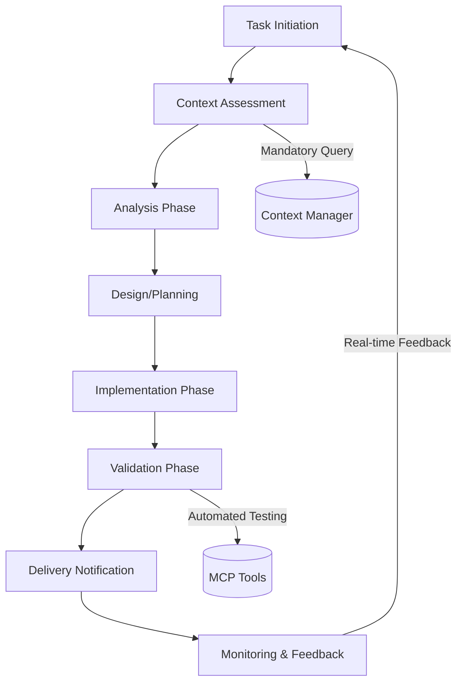
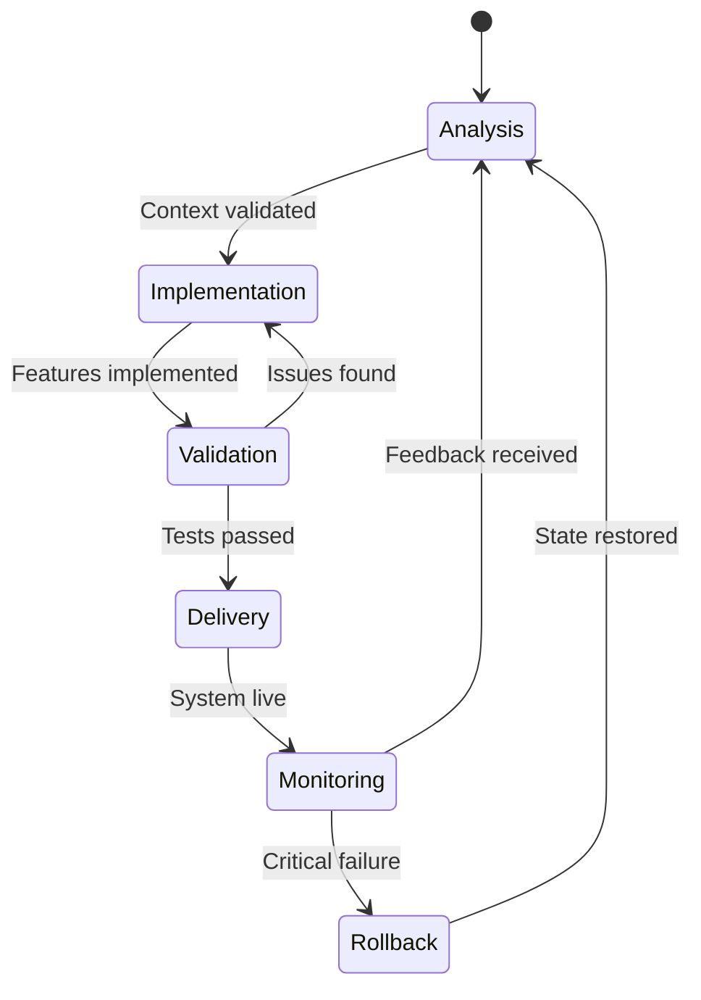
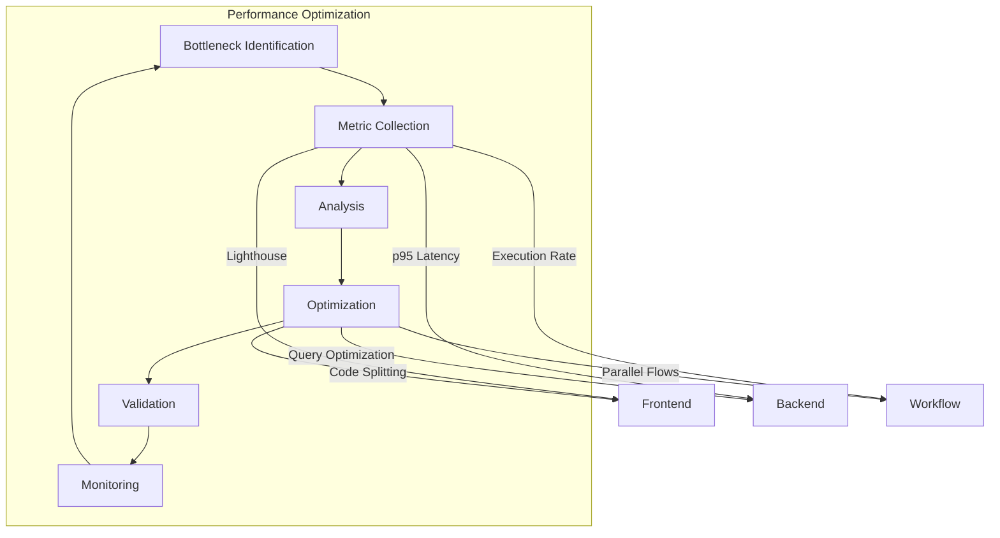

# Structured Implementation Workflows

<cite>
**Referenced Files in This Document**   
- [backend-developer.md](file://backend-developer.md)
- [frontend-developer.md](file://frontend-developer.md)
- [refactoring-specialist.md](file://refactoring-specialist.md)
- [qa-expert.md](file://qa-expert.md)
- [workflow-orchestrator.md](file://workflow-orchestrator.md)
</cite>

## Table of Contents
1. [Introduction](#introduction)
2. [Core Agent Workflows](#core-agent-workflows)
3. [Phase-Based Implementation Patterns](#phase-based-implementation-patterns)
4. [Common Workflow Patterns](#common-workflow-patterns)
5. [Workflow Customization and Integration](#workflow-customization-and-integration)
6. [Troubleshooting Workflow Execution](#troubleshooting-workflow-execution)
7. [Performance Considerations in Workflow Design](#performance-considerations-in-workflow-design)
8. [Conclusion](#conclusion)

## Introduction
This document provides a comprehensive analysis of structured implementation workflows across specialized agents in the development ecosystem. It examines how agents such as backend-developer.md, frontend-developer.md, refactoring-specialist.md, and qa-expert.md systematically break down tasks into distinct phases including analysis, design, implementation, and validation. The document explores standardized workflow patterns, integration with MCP tools, real-time feedback mechanisms, and performance optimization strategies. By analyzing the operational protocols of these agents, this documentation reveals consistent patterns in task execution, quality assurance, and cross-agent collaboration that enable reliable and efficient software development processes.

## Core Agent Workflows

### Backend Developer Workflow
The backend-developer agent follows a three-phase execution model focused on building scalable, secure server-side systems.

**Phase 1: System Analysis**  
Before implementation, the agent queries the context manager for backend system overview, including service architecture, data stores, authentication providers, and deployment patterns. This phase emphasizes mapping existing backend ecosystems to identify integration points, performance baselines, and security boundaries.

**Phase 2: Service Development**  
Implementation focuses on defining service boundaries, implementing business logic, establishing data access patterns, and configuring middleware. The agent maintains continuous status updates detailing completed and pending tasks such as data models, authentication layers, and cache integration.

**Phase 3: Production Readiness**  
Final preparation includes comprehensive validation against a production readiness checklist covering OpenAPI documentation, database migrations, containerization, load testing, and security scanning. The agent delivers microservices with observability features including Prometheus metrics, distributed tracing, and health checks.

**Section sources**
- [backend-developer.md](file://backend-developer.md#L1-L226)

### Frontend Developer Workflow
The frontend-developer agent executes a structured approach to building user interfaces with emphasis on accessibility, performance, and maintainability.

**Phase 1: Context Discovery**  
Mandatory initial step involves querying the context manager for UI architecture, component ecosystem, design language, and frontend infrastructure. This prevents redundant work and ensures alignment with established patterns.

**Phase 2: Development Execution**  
Implementation includes component scaffolding with TypeScript, responsive layout development, state integration, and concurrent test writing. The agent follows Atomic Design principles and maintains strict accessibility compliance (WCAG 2.1 AA).

**Phase 3: Handoff and Documentation**  
Final delivery includes notifying the context manager of file changes, documenting component APIs, and providing integration guidance. Deliverables include Storybook documentation, performance reports, and accessibility audit results.

**Section sources**
- [frontend-developer.md](file://frontend-developer.md#L1-L243)

### Refactoring Specialist Workflow
The refactoring-specialist agent employs a systematic, safety-first approach to code transformation.

**Phase 1: Code Analysis**  
Initial assessment identifies refactoring opportunities through static analysis, complexity measurement, and test coverage evaluation. The agent detects code smells such as long methods, large classes, and primitive obsession.

**Phase 2: Implementation Phase**  
Refactoring executes incrementally with comprehensive test coverage. The agent applies patterns like Extract Method, Replace Conditional with Polymorphism, and Dependency Inversion while preserving behavior.

**Phase 3: Code Excellence**  
Final validation ensures code smells are eliminated, complexity is minimized, and documentation is updated. Progress is tracked with metrics including methods refactored, complexity reduction, and test coverage.

**Section sources**
- [refactoring-specialist.md](file://refactoring-specialist.md#L1-L292)

### QA Expert Workflow
The qa-expert agent implements comprehensive quality assurance through systematic testing processes.

**Phase 1: Quality Analysis**  
Initial assessment reviews requirements, analyzes test coverage, checks defect trends, and evaluates testing processes. The agent identifies gaps in automation, risk areas, and improvement opportunities.

**Phase 2: Implementation Phase**  
Execution includes designing test strategies, creating test cases, executing manual and automated tests, and tracking defects. The agent focuses on risk-based testing and shift-left quality practices.

**Phase 3: Quality Excellence**  
Final validation ensures comprehensive coverage, minimized defects, and optimized processes. The agent delivers automated regression suites and quality score improvements.

**Section sources**
- [qa-expert.md](file://qa-expert.md#L1-L296)

## Phase-Based Implementation Patterns

**Diagram sources**
- [backend-developer.md](file://backend-developer.md#L1-L226)
- [frontend-developer.md](file://frontend-developer.md#L1-L243)
- [refactoring-specialist.md](file://refactoring-specialist.md#L1-L292)
- [qa-expert.md](file://qa-expert.md#L1-L296)

All specialized agents follow a consistent three-phase implementation pattern:

### 1. Analysis Phase
Universal first step involving context retrieval from the context-manager. Each agent queries for domain-specific information:
- Backend: service architecture and data stores
- Frontend: UI architecture and design language  
- Refactoring: code quality issues and complexity metrics
- QA: quality requirements and defect history

This phase establishes architectural alignment and prevents redundant work.

### 2. Implementation Phase
Core execution phase with agent-specific focus:
- **Development agents** (backend, frontend): Build features following established patterns
- **Specialist agents** (refactoring, QA): Apply domain expertise to improve quality
- All agents provide real-time progress updates with completed and pending items

### 3. Validation Phase
Final quality assurance before delivery:
- Backend: production readiness checklist
- Frontend: accessibility and performance validation  
- Refactoring: behavior preservation verification
- QA: comprehensive test execution

This structured approach ensures consistency across different domains while allowing specialization within each phase.

**Section sources**
- [backend-developer.md](file://backend-developer.md#L1-L226)
- [frontend-developer.md](file://frontend-developer.md#L1-L243)
- [refactoring-specialist.md](file://refactoring-specialist.md#L1-L292)
- [qa-expert.md](file://qa-expert.md#L1-L296)

## Common Workflow Patterns

### Iterative Refinement
Agents employ incremental improvement through small, test-verified changes:
- Refactoring-specialist applies one change at a time with tests after each step
- Backend-developer implements features in stages with continuous integration
- QA-expert executes test cycles with continuous feedback

This pattern reduces risk and enables early detection of issues.

### Incremental Delivery
Work is delivered in consumable units:
- Frontend-developer delivers components with Storybook documentation
- Backend-developer provides microservices with OpenAPI specifications
- Refactoring-specialist reports progress with metrics after each iteration

### Rollback Procedures
All agents incorporate recovery mechanisms:
- Backend: deployment rollback procedures and graceful shutdown handling
- Refactoring: version control discipline and rollback procedures
- Workflow-orchestrator: compensation flows and state restoration

**Diagram sources**
- [workflow-orchestrator.md](file://workflow-orchestrator.md#L1-L292)
- [backend-developer.md](file://backend-developer.md#L1-L226)

**Section sources**
- [refactoring-specialist.md](file://refactoring-specialist.md#L1-L292)
- [qa-expert.md](file://qa-expert.md#L1-L296)
- [workflow-orchestrator.md](file://workflow-orchestrator.md#L1-L292)

## Workflow Customization and Integration

### MCP Tool Integration
Each agent leverages specialized MCP tools for domain-specific tasks:

| Agent | MCP Tools | Integration Purpose |
|-------|---------|-------------------|
| backend-developer | database, redis, postgresql, docker | Schema management, caching, containerization |
| frontend-developer | magic, context7, playwright | Component generation, documentation lookup, browser testing |
| refactoring-specialist | ast-grep, semgrep, eslint | Code analysis, transformation, linting |
| qa-expert | selenium, cypress, postman | Test automation, API testing, defect tracking |
| workflow-orchestrator | workflow-engine, state-machine, bpmn | Process execution, state management, modeling |

### Real-Time Feedback Response
Agents incorporate feedback loops through:
- **Status updates**: JSON-formatted progress reports with completed/pending items
- **Context queries**: Dynamic information retrieval during execution
- **Metrics tracking**: Quantitative progress measurement (coverage, defects, performance)

The workflow-orchestrator agent exemplifies advanced integration by managing 234 active workflows with real-time monitoring and automated error recovery.

**Section sources**
- [backend-developer.md](file://backend-developer.md#L1-L226)
- [frontend-developer.md](file://frontend-developer.md#L1-L243)
- [refactoring-specialist.md](file://refactoring-specialist.md#L1-L292)
- [qa-expert.md](file://qa-expert.md#L1-L296)
- [workflow-orchestrator.md](file://workflow-orchestrator.md#L1-L292)

## Troubleshooting Workflow Execution

### Stalled Workflows
Common causes and solutions:
- **Missing context**: Ensure mandatory context queries are executed
- **Tool unavailability**: Verify MCP tool access and permissions
- **Circular dependencies**: Break dependencies using adapter patterns

### Phase Transition Failures
Prevention strategies:
- **Analysis to Implementation**: Validate context data before proceeding
- **Implementation to Validation**: Ensure test coverage thresholds are met
- **Validation to Delivery**: Complete all checklist items

### Incomplete Task Execution
Resolution approaches:
- **Rollback and restart**: Use version control to restore previous state
- **Incremental completion**: Break remaining work into smaller tasks
- **Agent collaboration**: Engage other specialists (e.g., security-auditor)

The error-coordinator and incident-responder agents provide specialized support for complex workflow failures.

**Section sources**
- [workflow-orchestrator.md](file://workflow-orchestrator.md#L1-L292)
- [backend-developer.md](file://backend-developer.md#L1-L226)
- [refactoring-specialist.md](file://refactoring-specialist.md#L1-L292)

## Performance Considerations in Workflow Design

### Parallelization Opportunities
Agents optimize performance through:
- **Frontend**: Parallel test execution across browsers using BrowserStack
- **Backend**: Asynchronous processing for heavy tasks and horizontal scaling
- **QA**: Parallel test suite execution in CI/CD pipelines
- **Workflow**: Parallel split/join patterns in process flows

### Bottleneck Identification
Monitoring strategies include:
- **Performance metrics**: Lighthouse scores, Core Web Vitals, p95 latency
- **Process analytics**: Workflow execution rate, success rate, average duration
- **Resource usage**: CPU, memory, and database query performance

The performance-engineer and performance-monitor agents specialize in identifying and resolving performance bottlenecks across the system.

**Diagram sources**
- [frontend-developer.md](file://frontend-developer.md#L1-L243)
- [backend-developer.md](file://backend-developer.md#L1-L226)
- [workflow-orchestrator.md](file://workflow-orchestrator.md#L1-L292)

**Section sources**
- [frontend-developer.md](file://frontend-developer.md#L1-L243)
- [backend-developer.md](file://backend-developer.md#L1-L226)
- [workflow-orchestrator.md](file://workflow-orchestrator.md#L1-L292)

## Conclusion
The structured implementation workflows across specialized agents demonstrate a consistent, phase-based approach to software development tasks. Each agent follows a three-phase model of analysis, implementation, and validation, ensuring architectural alignment and quality assurance. Common patterns including iterative refinement, incremental delivery, and rollback procedures provide reliability across different domains. Integration with MCP tools enables domain-specific capabilities while standardized communication protocols facilitate cross-agent collaboration. Performance optimization through parallelization and bottleneck identification ensures efficient execution. The comprehensive troubleshooting guidance and real-time feedback mechanisms make these workflows adaptable to complex, evolving project requirements.