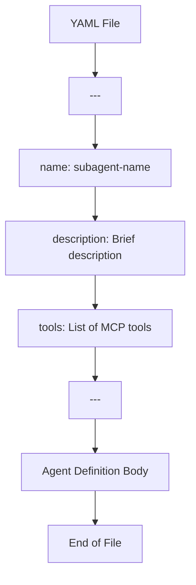
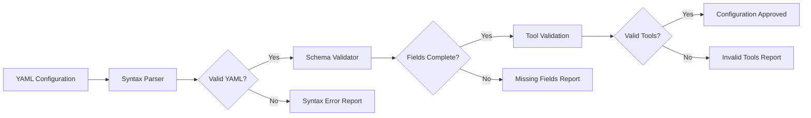
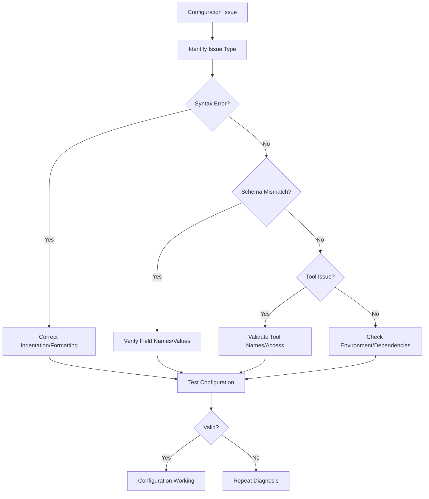

# YAML Configuration Standard

<cite>
**Referenced Files in This Document**   
- [backend-developer.md](file://backend-developer.md)
- [devops-engineer.md](file://devops-engineer.md)
- [README.md](file://README.md)
</cite>

## Table of Contents
1. [Introduction](#introduction)
2. [Standardized YAML Front Matter Structure](#standardized-yaml-front-matter-structure)
3. [Core Configuration Fields](#core-configuration-fields)
4. [Schema Implementation Examples](#schema-implementation-examples)
5. [Tooling Support and Validation](#tooling-support-and-validation)
6. [Best Practices for Configuration Extension](#best-practices-for-configuration-extension)
7. [Troubleshooting Common Issues](#troubleshooting-common-issues)
8. [Interoperability and Adoption Benefits](#interoperability-and-adoption-benefits)
9. [Conclusion](#conclusion)

## Introduction
The YAML configuration standard provides a consistent structure for defining subagents across the VoltAgent ecosystem. This standardized format ensures uniformity in agent definitions, enabling seamless integration, automated processing, and reliable tooling support. By adhering to a common schema, subagents maintain interoperability across different environments and workflows while simplifying adoption and maintenance.

**Section sources**
- [README.md](file://README.md#L300-L305)

## Standardized YAML Front Matter Structure
All subagent configuration files follow a standardized YAML front matter structure enclosed by triple dashes (`---`). This structure defines essential metadata and capabilities at the beginning of each agent definition file. The consistent placement and format enable automated parsing and validation across the entire agent collection.

The front matter serves as a machine-readable header that specifies the agent's identity, purpose, and tool access, while the subsequent content provides detailed behavioral instructions and operational protocols.



**Diagram sources**
- [README.md](file://README.md#L300-L304)

**Section sources**
- [README.md](file://README.md#L300-L305)

## Core Configuration Fields
The standardized YAML configuration includes three essential fields that define each subagent's fundamental characteristics.

### name
The `name` field specifies the unique identifier for the subagent, used for invocation and reference within the system. This value must be lowercase, hyphen-separated, and globally unique across all agents.

**Section sources**
- [backend-developer.md](file://backend-developer.md#L1)
- [devops-engineer.md](file://devops-engineer.md#L1)

### description
The `description` field provides a concise summary of the subagent's capabilities and specialization. It follows a consistent pattern: "Expert [role] specializing in [primary focus]. Masters [key technologies] with focus on [value proposition]."

**Section sources**
- [backend-developer.md](file://backend-developer.md#L2)
- [devops-engineer.md](file://devops-engineer.md#L2)

### tools
The `tools` field lists the MCP (Model Context Protocol) tools accessible to the subagent, determining its operational capabilities. Tools are specified as a comma-separated list, with capitalization preserved as defined in the MCP specification.

**Section sources**
- [backend-developer.md](file://backend-developer.md#L3)
- [devops-engineer.md](file://devops-engineer.md#L3)

## Schema Implementation Examples
The consistency of the YAML schema is demonstrated through real-world examples from the agent collection.

### backend-developer Configuration
```yaml
---
name: backend-developer
description: Senior backend engineer specializing in scalable API development and microservices architecture. Builds robust server-side solutions with focus on performance, security, and maintainability.
tools: Read, Write, MultiEdit, Bash, Docker, database, redis, postgresql
---
```

### devops-engineer Configuration
```yaml
---
name: devops-engineer
description: Expert DevOps engineer bridging development and operations with comprehensive automation, monitoring, and infrastructure management. Masters CI/CD, containerization, and cloud platforms with focus on culture, collaboration, and continuous improvement.
tools: Read, Write, MultiEdit, Bash, docker, kubernetes, terraform, ansible, prometheus, jenkins
---
```

Both configurations follow the identical structure, demonstrating the standardized schema implementation across different domains.

**Section sources**
- [backend-developer.md](file://backend-developer.md#L1-L4)
- [devops-engineer.md](file://devops-engineer.md#L1-L4)

## Tooling Support and Validation
The standardized YAML structure enables robust tooling support and automated validation processes.

### Automated Processing
The consistent schema allows for automated extraction of agent metadata, enabling:
- Dynamic agent registry generation
- Capability-based agent discovery
- Tool usage analytics
- Cross-agent dependency mapping
- Automated documentation generation

### Validation Mechanisms
Validation tools can verify configuration integrity by checking for:
- Required fields presence
- Proper YAML syntax
- Valid tool names against MCP specification
- Naming convention compliance
- Description format consistency



**Diagram sources**
- [README.md](file://README.md#L300-L304)

**Section sources**
- [README.md](file://README.md#L300-L305)

## Best Practices for Configuration Extension
When extending configurations, maintain backward compatibility and adhere to established patterns.

### Safe Extension Patterns
- Add new fields after the standard front matter
- Use consistent naming conventions
- Document new fields in the agent body
- Maintain backward compatibility
- Follow the same formatting rules

### Versioning Strategy
For significant changes, implement versioning through:
- Optional fields with default values
- Backward-compatible additions
- Clear deprecation notices
- Migration guides in documentation

**Section sources**
- [README.md](file://README.md#L300-L305)

## Troubleshooting Common Issues
Address common configuration problems with systematic approaches.

### YAML Syntax Errors
Common syntax issues include:
- Improper indentation (use spaces, not tabs)
- Missing or extra colons in key-value pairs
- Unquoted special characters
- Improper list formatting
- Unclosed quotes

### Schema Mismatches
Prevent schema mismatches by:
- Verifying field names against the standard
- Ensuring required fields are present
- Validating tool names against MCP specification
- Checking case sensitivity in tool names
- Confirming proper separator usage

### Tool Integration Failures
Resolve tool integration issues by:
- Verifying tool availability in the MCP environment
- Checking tool name spelling and case
- Ensuring proper tool configuration
- Validating agent permissions
- Testing tool access in isolated environment



**Diagram sources**
- [README.md](file://README.md#L300-L304)

**Section sources**
- [README.md](file://README.md#L300-L305)

## Interoperability and Adoption Benefits
The standardized YAML configuration delivers significant benefits for interoperability and adoption.

### Cross-Environment Compatibility
The consistent format ensures agents work seamlessly across:
- Different development environments
- Various deployment platforms
- Multiple team workflows
- Diverse project requirements

### Ease of Adoption
Standardization simplifies onboarding by:
- Reducing learning curve for new users
- Providing clear examples and patterns
- Enabling copy-and-modify workflows
- Facilitating knowledge sharing
- Supporting automated setup

### Ecosystem Integration
The uniform structure enhances integration with:
- Agent management tools
- Development environments
- Continuous integration systems
- Documentation generators
- Monitoring and analytics platforms

**Section sources**
- [README.md](file://README.md#L300-L305)

## Conclusion
The standardized YAML configuration structure provides a robust foundation for the VoltAgent ecosystem. By enforcing consistency in agent definitions, this standard enables reliable tooling support, automated validation, and seamless interoperability across diverse environments and workflows. The demonstrated implementation in agents like backend-developer and devops-engineer showcases the practical benefits of schema uniformity. Adhering to best practices for extension and addressing common issues ensures long-term maintainability and ease of adoption. This standardization ultimately enhances developer productivity and system reliability across the entire agent collection.