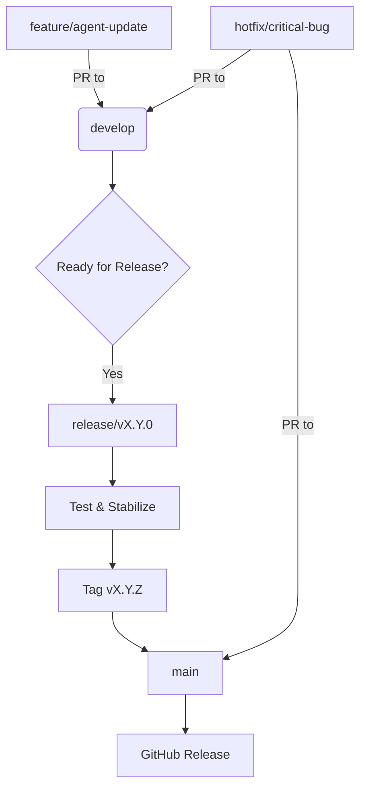
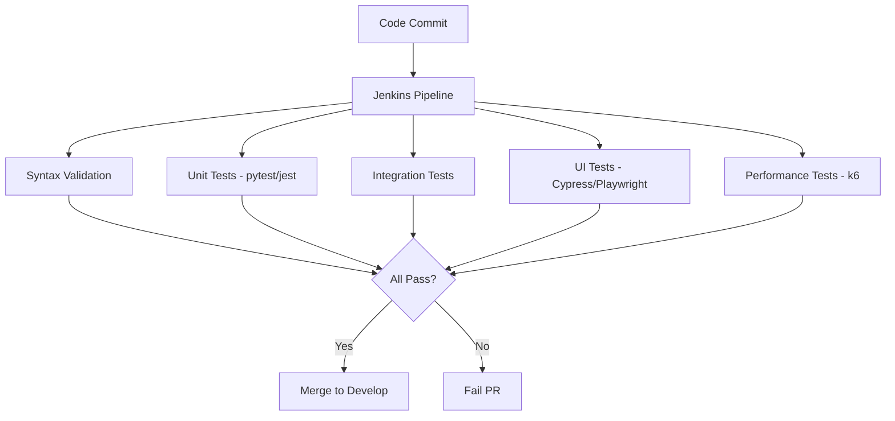
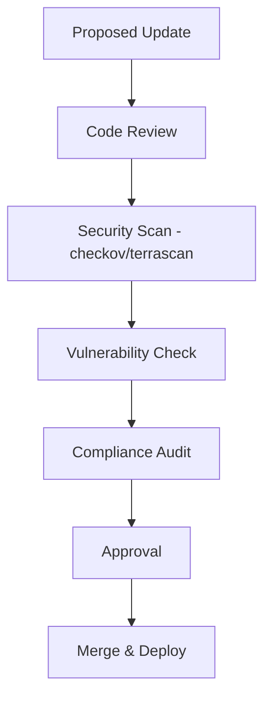
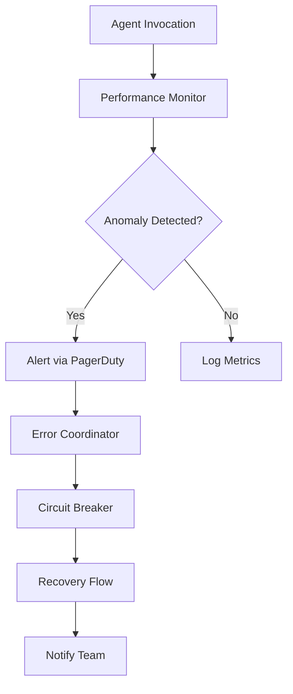

# Maintenance and Updates

<cite>
**Referenced Files in This Document**   
- [README.md](file://README.md)
- [git-workflow-manager.md](file://git-workflow-manager.md)
- [test-automator.md](file://test-automator.md)
- [performance-monitor.md](file://performance-monitor.md)
- [compliance-auditor.md](file://compliance-auditor.md)
- [error-coordinator.md](file://error-coordinator.md)
</cite>

## Table of Contents
1. [Introduction](#introduction)
2. [Version Control Strategy](#version-control-strategy)
3. [Testing Framework for Subagents](#testing-framework-for-subagents)
4. [Usage Analytics Collection](#usage-analytics-collection)
5. [Community Feedback Process](#community-feedback-process)
6. [Deprecation Policies and Migration Paths](#deprecation-policies-and-migration-paths)
7. [Security Considerations in Agent Updates](#security-considerations-in-agent-updates)
8. [Performance Monitoring and Optimization](#performance-monitoring-and-optimization)
9. [Conclusion](#conclusion)

## Introduction
This document provides a comprehensive guide to the maintenance and update processes for the agents repository. It outlines strategies for version control, testing, analytics, community engagement, deprecation, security, and performance monitoring. The repository hosts a wide range of specialized AI subagents designed for various development, infrastructure, quality assurance, and business tasks. Each agent is maintained to ensure production readiness, adherence to best practices, and integration with the Model Context Protocol (MCP) tools.

**Section sources**
- [README.md](file://README.md#L1-L50)

## Version Control Strategy

The repository employs a structured Git workflow managed by the **git-workflow-manager** subagent, which ensures efficient, scalable, and auditable version control practices across the project.

### Branching Model
The repository follows a hybrid branching strategy combining elements of **Git Flow** and **Trunk-Based Development**, tailored to support both rapid iteration and stable releases:

- **main**: Protected branch representing the latest stable state; all merges require pull requests and CI validation
- **develop**: Integration branch for ongoing development; serves as the default target for feature branches
- **feature/\***: Short-lived branches for new agent definitions or enhancements
- **release/\***: Branches created from `develop` for final testing and version stabilization
- **hotfix/\***: Emergency fixes branched from `main` and merged into both `main` and `develop`

Branch protection rules enforce:
- Mandatory code reviews
- Status checks (CI, linting, testing)
- Linear history via rebase-only merges
- Signed commits using GPG

### Release Cycle
Releases are versioned using **Semantic Versioning (SemVer)** and follow a quarterly cadence with optional patch releases for critical fixes. The process includes:
1. Feature freeze on `develop`
2. Creation of a `release/vX.Y.0` branch
3. Automated changelog generation
4. Final QA and documentation updates
5. Tagging and publishing of the release
6. Post-release monitoring via performance and error tracking agents

Automation is implemented through pre-commit hooks, CI/CD pipelines, and PR templates to ensure consistency and reduce manual errors.

**Diagram sources**
- [git-workflow-manager.md](file://git-workflow-manager.md#L1-L50)

**Section sources**
- [git-workflow-manager.md](file://git-workflow-manager.md#L1-L300)

## Testing Framework for Subagents

The **test-automator** subagent oversees a comprehensive testing framework that ensures the reliability and correctness of all subagent definitions through both automated and manual validation processes.

### Automated Testing
Automated tests are executed via CI/CD pipelines using a combination of tools:
- **selenium**, **cypress**, **playwright**: UI and interaction logic testing
- **pytest**, **jest**: Unit and integration testing of agent logic
- **appium**: Mobile agent behavior validation
- **k6**: Performance and load testing of agent invocation
- **jenkins**: Orchestration of test execution and reporting

Each subagent undergoes:
- **Syntax validation** of YAML structure
- **Tool compatibility checks** against declared MCP integrations
- **Behavioral testing** in simulated environments
- **Regression testing** on every change

### Manual Testing
Manual validation includes:
- Peer review of agent prompts and capabilities
- Real-world scenario testing in sandboxed environments
- Cross-agent interaction verification
- Documentation completeness checks

Test coverage targets exceed 80%, with execution times optimized to under 30 minutes. Flaky tests are monitored and addressed immediately.

**Diagram sources**
- [test-automator.md](file://test-automator.md#L1-L50)

**Section sources**
- [test-automator.md](file://test-automator.md#L1-L300)

## Usage Analytics Collection

Usage analytics are collected to understand which agents are most frequently used and how they are being utilized in practice. This data informs prioritization of updates, improvements, and deprecation decisions.

### Data Collection Methods
The **performance-monitor** subagent collects metrics using:
- **prometheus**: Time-series collection of agent invocation frequency, duration, and success rates
- **grafana**: Visualization of usage trends and dashboards
- **datadog**: Full-stack monitoring and alerting
- **elasticsearch**: Log analysis for contextual usage patterns
- **statsd**: Aggregation of custom metrics

Key metrics tracked:
- **Invocation count per agent**
- **Average response time**
- **Error rate and failure types**
- **Tool usage patterns**
- **User session duration**
- **Cross-agent collaboration frequency**

### Privacy and Compliance
All data collection adheres to GDPR, CCPA, and SOC 2 standards, enforced by the **compliance-auditor** agent. Data is anonymized, stored securely, and retention policies limit logs to 90 days.

Analytics are used to:
- Identify underutilized agents for potential deprecation
- Detect performance bottlenecks
- Guide feature development based on actual usage
- Optimize resource allocation

**Section sources**
- [performance-monitor.md](file://performance-monitor.md#L1-L300)
- [compliance-auditor.md](file://compliance-auditor.md#L1-L300)

## Community Feedback Process

The repository leverages community input to identify improvement areas and prioritize updates. Feedback is gathered through multiple channels and integrated into the development lifecycle.

### Feedback Channels
- **GitHub Issues**: For bug reports, feature requests, and discussions
- **Discord Community**: Real-time discussions and user support
- **Twitter/X**: Announcements and engagement
- **Pull Requests**: Direct contributions from the community

### Prioritization Workflow
Feedback is triaged by maintainers and evaluated based on:
- Impact on user experience
- Frequency of request
- Alignment with project goals
- Technical feasibility

The **git-workflow-manager** ensures that community contributions follow the same rigorous review and testing processes as internal changes.

**Section sources**
- [README.md](file://README.md#L1-L350)

## Deprecation Policies and Migration Paths

Outdated agents are deprecated following a clear policy to ensure users have time to transition.

### Deprecation Process
1. **Announcement**: A deprecation notice is added to the agent’s documentation and README
2. **Maintenance Mode**: No new features, only critical bug fixes
3. **Migration Guide**: Provided with alternatives or updated agents
4. **Removal**: After a 6-month window, the agent is removed from the main distribution

### Migration Support
- Automated detection of deprecated agent usage
- Suggested replacements based on functionality
- Compatibility layers where feasible
- Documentation updates with migration steps

This ensures a smooth transition while maintaining repository quality.

**Section sources**
- [README.md](file://README.md#L1-L350)

## Security Considerations in Agent Updates

Security is a top priority during agent updates, especially concerning tool integrations and data handling.

### Security Review Process
Each update undergoes:
- **Static analysis** using **checkov**, **terrascan**, and **prowler**
- **Vulnerability scanning** of dependencies
- **Access control review** for MCP tool permissions
- **Secret detection** to prevent credential leaks

The **compliance-auditor** and **security-auditor** agents validate that all changes meet regulatory and security standards (GDPR, HIPAA, PCI DSS).

### Secure Update Practices
- All commits are GPG-signed
- Protected branches with mandatory reviews
- Automated security scanning in CI
- Regular dependency updates
- Least privilege principle for tool access

Agents with elevated permissions undergo additional scrutiny.

**Diagram sources**
- [compliance-auditor.md](file://compliance-auditor.md#L1-L50)

**Section sources**
- [compliance-auditor.md](file://compliance-auditor.md#L1-L300)

## Performance Monitoring and Optimization

The repository employs continuous performance monitoring to ensure agent efficiency and system health.

### Monitoring Practices
The **performance-monitor** agent collects over 2,800 metrics across the agent ecosystem, including:
- Latency (<1s target)
- Resource utilization (CPU, memory, I/O)
- Anomaly detection (<5-minute response)
- System availability (99.99% SLA)

Dashboards in **Grafana** and **Datadog** provide real-time visibility into agent performance.

### Optimization Techniques
- **Caching strategies** for frequently accessed agent definitions
- **Parallel execution** of independent agent workflows
- **Resource throttling** to prevent overload
- **Auto-scaling** of monitoring infrastructure
- **Query optimization** for log and metric retrieval

The **error-coordinator** agent prevents cascading failures using circuit breakers, bulkheads, and automated recovery flows, reducing MTTR to under 5 minutes.

**Diagram sources**
- [performance-monitor.md](file://performance-monitor.md#L1-L50)
- [error-coordinator.md](file://error-coordinator.md#L1-L50)

**Section sources**
- [performance-monitor.md](file://performance-monitor.md#L1-L300)
- [error-coordinator.md](file://error-coordinator.md#L1-L300)

## Conclusion
The agents repository is maintained through a robust set of practices covering version control, testing, analytics, community engagement, deprecation, security, and performance monitoring. These processes ensure that all subagents remain production-ready, secure, and aligned with user needs. The integration of specialized agents like **git-workflow-manager**, **test-automator**, **performance-monitor**, and **compliance-auditor** enables automated, scalable, and auditable maintenance workflows. Continuous improvement is driven by data, community feedback, and a commitment to best practices in software engineering and AI agent development.