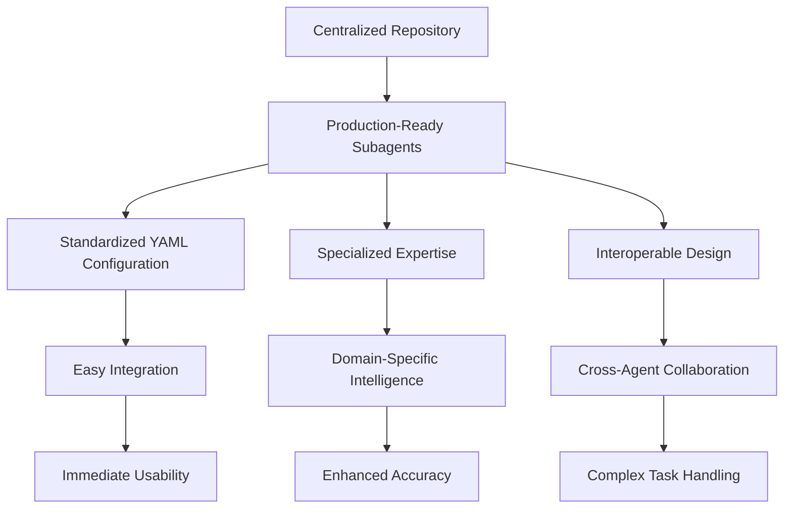
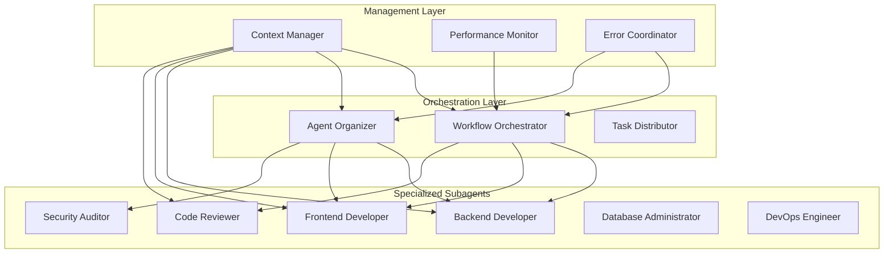
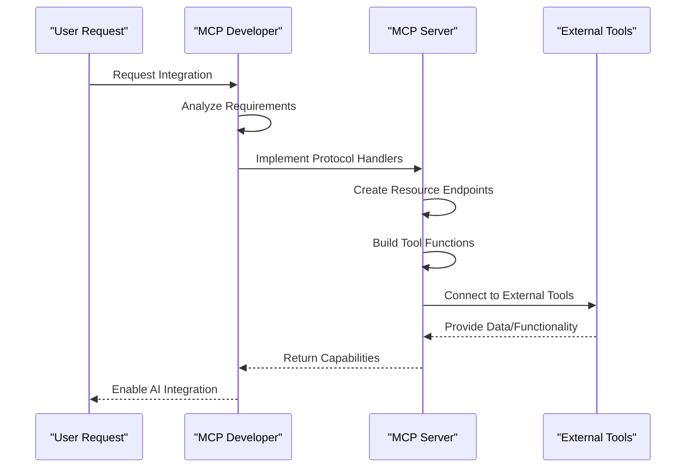
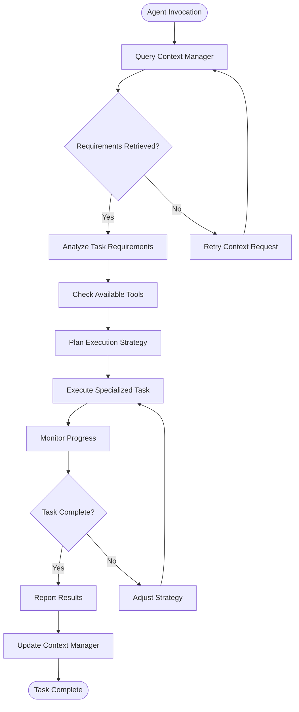
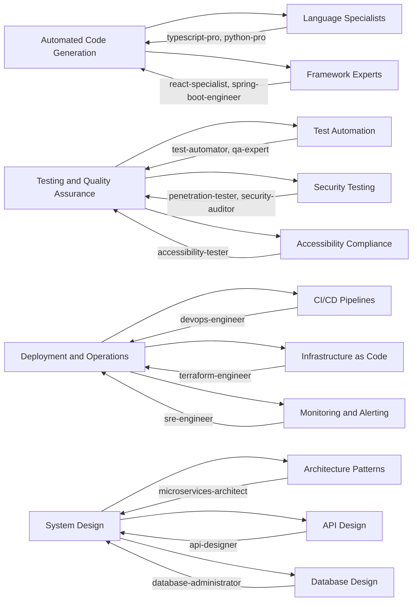
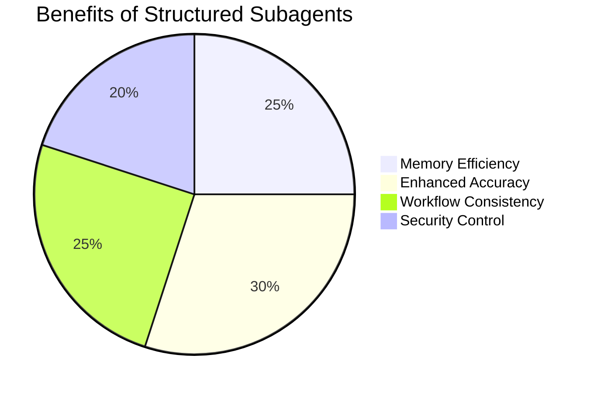

# Project Overview

<cite>
**Referenced Files in This Document**   
- [README.md](file://README.md)
- [context-manager.md](file://context-manager.md)
- [workflow-orchestrator.md](file://workflow-orchestrator.md)
- [agent-organizer.md](file://agent-organizer.md)
- [mcp-developer.md](file://mcp-developer.md)
</cite>

## Table of Contents
1. [Introduction](#introduction)
2. [Core Purpose and Vision](#core-purpose-and-vision)
3. [Subagent Architecture Overview](#subagent-architecture-overview)
4. [Model Context Protocol Integration](#model-context-protocol-integration)
5. [Agent Interaction Patterns](#agent-interaction-patterns)
6. [Real-World Use Cases](#real-world-use-cases)
7. [Benefits of Structured Subagents](#benefits-of-structured-subagents)
8. [Scalability and Extensibility](#scalability-and-extensibility)
9. [Community Contribution Model](#community-contribution-model)

## Introduction

The agents repository represents a comprehensive collection of production-ready AI subagents designed specifically for software development roles. This centralized repository enables AI-assisted development through specialized, interoperable agents that follow standardized YAML-based configurations. The system leverages Model Context Protocol (MCP) integration to facilitate context-aware communication and cross-agent collaboration, creating a powerful ecosystem for automated software engineering tasks.

**Section sources**
- [README.md](file://README.md#L1-L50)

## Core Purpose and Vision

The primary purpose of this repository is to provide a standardized framework for AI-assisted software development through specialized subagents. Each subagent is designed as a production-ready component that follows industry best practices and can be immediately utilized in real-world development scenarios. The vision centers on creating an ecosystem where AI subagents work together seamlessly to handle specific development tasks, from code generation and testing to deployment and system design.

Subagents are organized into ten distinct categories spanning core development, language specialization, infrastructure, quality assurance, data and AI, developer experience, specialized domains, business and product management, meta-orchestration, and research analysis. This categorization enables developers to quickly locate the appropriate subagent for their specific needs, whether they require a backend-developer for API implementation or a security-auditor for vulnerability assessment.

The repository is maintained by the VoltAgent open-source AI agent framework community, ensuring continuous updates and improvements based on real-world usage and community feedback. All subagents are designed to be shared across projects, promoting workflow consistency and team alignment in development practices.

**Diagram sources**
- [README.md](file://README.md#L51-L100)

**Section sources**
- [README.md](file://README.md#L51-L150)

## Subagent Architecture Overview

The architecture of the subagent system is built around three core components: subagents, orchestrators, and context managers. Each subagent operates within its own isolated context window, preventing cross-contamination between different tasks while maintaining clarity in the primary conversation thread. This design ensures memory efficiency by keeping task-specific details contained within their respective subagents.

Workflow orchestrators manage complex processes by coordinating multiple subagents through defined workflows, state machines, and business process automation. These orchestrators handle workflow patterns, error compensation, and transaction management to ensure reliable execution of multi-step processes. The agent-organizer subagent specializes in multi-agent orchestration, team assembly, and workflow optimization by decomposing tasks, mapping agent capabilities, and assembling optimal agent teams for maximum efficiency.

Context managers play a critical role in maintaining shared knowledge and state across distributed agent systems. They handle information architecture, retrieval optimization, synchronization protocols, and data governance to ensure fast, consistent, and secure access to contextual information. The context-manager subagent manages various context types including project metadata, agent interactions, task history, decision logs, and performance metrics.

**Diagram sources**
- [workflow-orchestrator.md](file://workflow-orchestrator.md#L1-L50)
- [agent-organizer.md](file://agent-organizer.md#L1-L50)
- [context-manager.md](file://context-manager.md#L1-L50)

**Section sources**
- [workflow-orchestrator.md](file://workflow-orchestrator.md#L1-L100)
- [agent-organizer.md](file://agent-organizer.md#L1-L100)
- [context-manager.md](file://context-manager.md#L1-L100)

## Model Context Protocol Integration

Model Context Protocol (MCP) integration is a fundamental aspect of the subagent architecture, enabling seamless communication between AI systems and external tools or data sources. The MCP developer subagent specializes in building servers and clients that connect AI systems with external resources, implementing protocol specifications, SDKs, and production-ready integrations.

MCP tool integration provides subagents with specific capabilities tailored to their domain expertise. For example, the backend-developer subagent integrates with database, redis, postgresql, and docker tools to handle data storage, caching, container orchestration, and deployment tasks. The context-manager subagent utilizes read, write, redis, elasticsearch, and vector-db tools for comprehensive context management across distributed systems.

The MCP architecture follows a standardized development workflow that begins with protocol analysis to understand integration needs, followed by implementation of core protocol handlers, resource endpoints, and tool functions. Security controls, error handling, logging, and monitoring are implemented throughout the development process to ensure production readiness. The protocol compliance verification includes JSON-RPC 2.0 standards, schema validation, transport abstraction, and protocol versioning.

**Diagram sources**
- [mcp-developer.md](file://mcp-developer.md#L1-L50)
- [backend-developer.md](file://backend-developer.md#L86-L117)

**Section sources**
- [mcp-developer.md](file://mcp-developer.md#L1-L150)

## Agent Interaction Patterns

The subagent ecosystem operates through well-defined interaction patterns that enable context-aware communication and cross-agent collaboration. When a subagent is invoked, it follows a standardized communication protocol that begins with querying the context manager for relevant requirements and available resources. This initial context assessment ensures that each subagent has the necessary information to perform its specialized task effectively.

The workflow-orchestrator subagent coordinates complex processes by managing state persistence, transaction support, rollback capabilities, and checkpoint/restart functionality. It implements advanced orchestration patterns including sequential flow, parallel split/join, exclusive choice, loops, event-based gateways, and compensation logic. Error handling mechanisms include exception catching, retry strategies, compensation flows, fallback procedures, and circuit breaking to ensure reliable execution.

Agent-organizer facilitates multi-agent coordination by decomposing tasks into subtasks, mapping dependencies, and assembling optimal agent teams based on capability matching, performance history, and availability. The organizer implements orchestration patterns such as sequential execution, parallel processing, pipeline patterns, map-reduce workflows, and event-driven coordination to maximize efficiency and success rates.

Context-aware communication is maintained through standardized JSON requests that include the requesting agent type, request type, and specific payload requirements. This structured communication protocol ensures consistency across different subagents while allowing for domain-specific variations in the information requested.

**Diagram sources**
- [workflow-orchestrator.md](file://workflow-orchestrator.md#L146-L181)
- [agent-organizer.md](file://agent-organizer.md#L146-L181)

**Section sources**
- [workflow-orchestrator.md](file://workflow-orchestrator.md#L146-L200)
- [agent-organizer.md](file://agent-organizer.md#L146-L200)

## Real-World Use Cases

The subagent repository supports numerous real-world use cases across the software development lifecycle. For automated code generation, developers can leverage language-specific subagents such as typescript-pro, python-pro, or java-architect to generate production-ready code following industry best practices. These subagents understand framework-specific patterns and can generate code that adheres to established conventions within each technology stack.

In testing scenarios, quality assurance subagents like qa-expert, test-automator, and accessibility-tester can create comprehensive test suites, implement automated testing frameworks, and ensure compliance with accessibility standards. The penetration-tester and security-auditor subagents perform vulnerability assessments and security reviews to identify potential risks in the codebase.

For deployment and infrastructure management, the devops-engineer, deployment-engineer, and kubernetes-specialist subagents handle CI/CD pipeline configuration, deployment automation, and container orchestration. These subagents can generate infrastructure-as-code configurations, manage cloud resources, and implement monitoring solutions to ensure system reliability.

System design tasks are supported by architecture-focused subagents such as microservices-architect, cloud-architect, and api-designer. These specialists can create comprehensive system designs, define API contracts, and recommend appropriate technology stacks based on project requirements. The database-administrator and database-optimizer subagents handle data modeling, query optimization, and performance tuning for various database systems.

**Section sources**
- [README.md](file://README.md#L151-L206)

## Benefits of Structured Subagents

Using structured subagents offers significant advantages over generic prompts, particularly in terms of consistency, reusability, and team alignment. The isolated context windows of subagents prevent memory clutter in the main conversation thread, enhancing memory efficiency and maintaining focus on primary tasks. This architectural separation ensures that task-specific details remain contained within their respective subagents.

Domain-specific intelligence is embedded within each subagent through carefully crafted instructions and configurations, leading to enhanced accuracy in specialized domains. Unlike generic prompts that may produce inconsistent results, structured subagents follow standardized templates and best practices, ensuring reliable performance across different use cases and projects.

The reusability of subagents across multiple projects promotes workflow consistency and reduces the need to recreate specialized expertise for each new development effort. Teams can share subagent definitions to ensure uniform approaches to common tasks, fostering collaboration and knowledge sharing. This standardization also facilitates onboarding of new team members who can immediately leverage existing subagents rather than developing their own prompt strategies.

Granular tool permissions allow for fine-grained control over subagent capabilities, enhancing security by restricting access based on subagent type and purpose. Project-specific subagents stored in `.claude/agents/` take precedence over global subagents in `~/.claude/agents/`, enabling customization while maintaining a consistent baseline of capabilities.

**Section sources**
- [README.md](file://README.md#L207-L278)

## Scalability and Extensibility

The subagent architecture is designed for scalability and extensibility, supporting the addition of new subagents and capabilities as development needs evolve. The standardized YAML-based configuration format allows for easy creation and modification of subagents, while the MCP integration framework enables seamless connection to new tools and data sources.

The repository's categorization system supports horizontal scaling by allowing new subagents to be added within existing categories or through the creation of new categories for emerging technology domains. The agent-organizer and workflow-orchestrator subagents can automatically incorporate new subagents into their coordination patterns, ensuring that expanded capabilities are immediately available for complex task execution.

Extensibility is further enhanced by the modular design of MCP servers and clients, which can be extended to support additional resources and tool functions. The protocol's support for JSON-RPC 2.0, schema validation with Zod/Pydantic, and various transport mechanisms provides flexibility in implementing new integrations while maintaining compatibility with existing systems.

Performance monitoring and optimization capabilities built into subagents like performance-monitor and performance-engineer ensure that the system can scale efficiently, identifying bottlenecks and optimizing resource utilization as the number of subagents and their interactions grow.

**Section sources**
- [README.md](file://README.md#L279-L350)
- [mcp-developer.md](file://mcp-developer.md#L172-L241)

## Community Contribution Model

The agents repository operates as a community-driven project that welcomes contributions to expand and improve the collection of subagents. The contribution model encourages developers to submit new subagents, enhance existing definitions, add MCP tool integrations, share usage examples, and report issues or bugs.

Contributions follow a standardized process beginning with forking the repository, making changes, and submitting pull requests for review. New subagents should adhere to the established YAML template format and include comprehensive descriptions of capabilities, tool integrations, and usage patterns. The community review process ensures that all contributions meet production-ready standards and align with the repository's best practices.

The dual storage system for project-specific and global subagents supports community sharing while allowing for project-specific customization. Global subagents in `~/.claude/agents/` can be shared across all projects, creating a personal library of commonly used subagents, while project-specific subagents in `.claude/agents/` can be version-controlled and shared with team members.

Regular updates and maintenance by the VoltAgent community ensure that subagents remain current with evolving technologies and development practices. The open-source nature of the repository fosters collaboration and innovation, enabling developers worldwide to benefit from shared expertise and collective improvements.

**Section sources**
- [README.md](file://README.md#L300-L350)