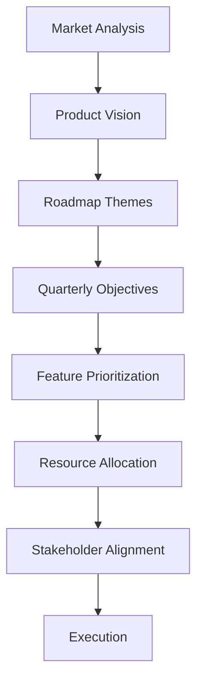
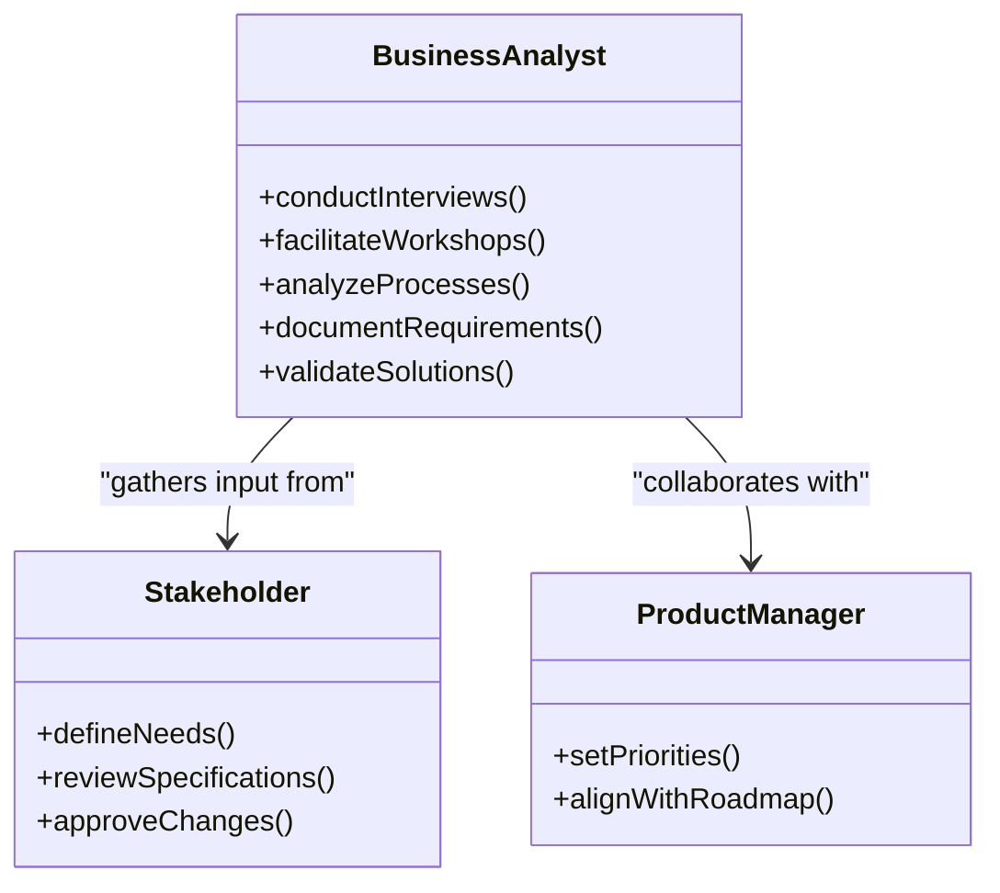
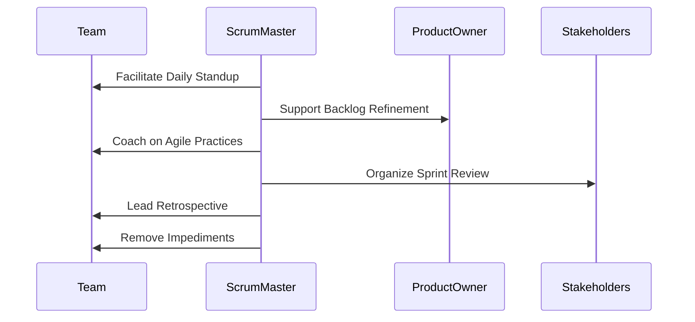
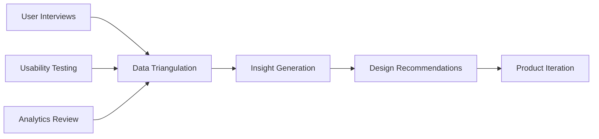
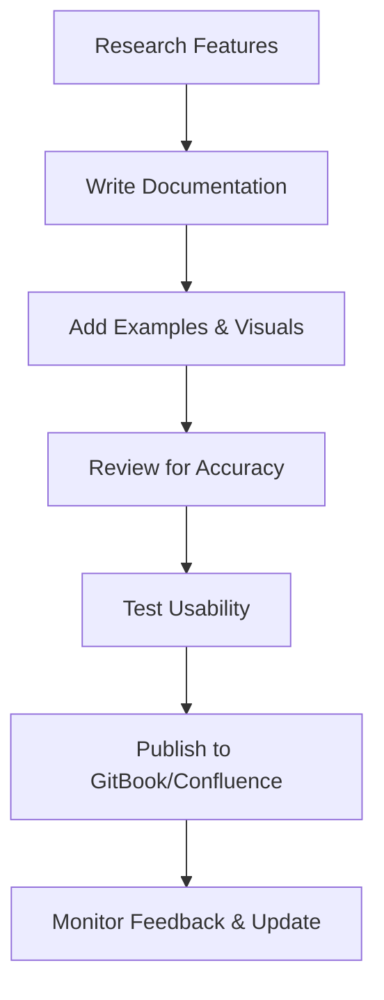
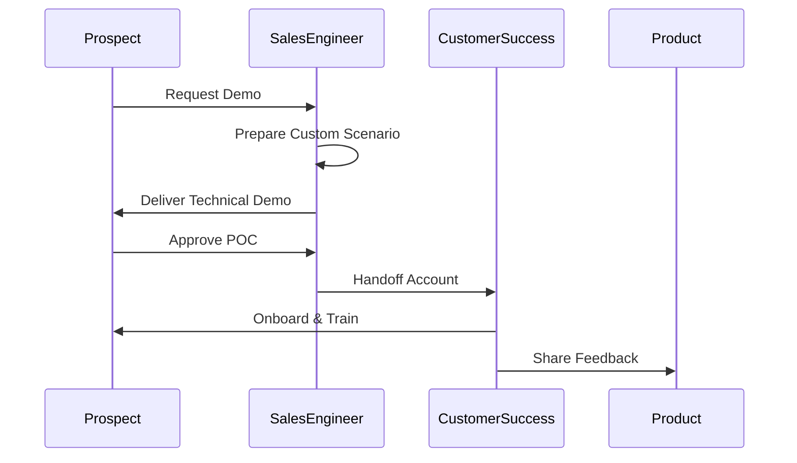
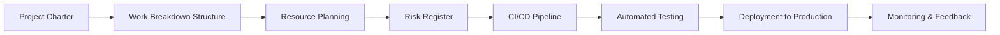
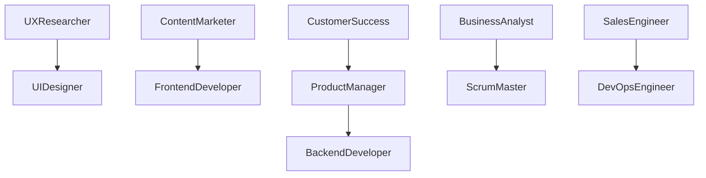
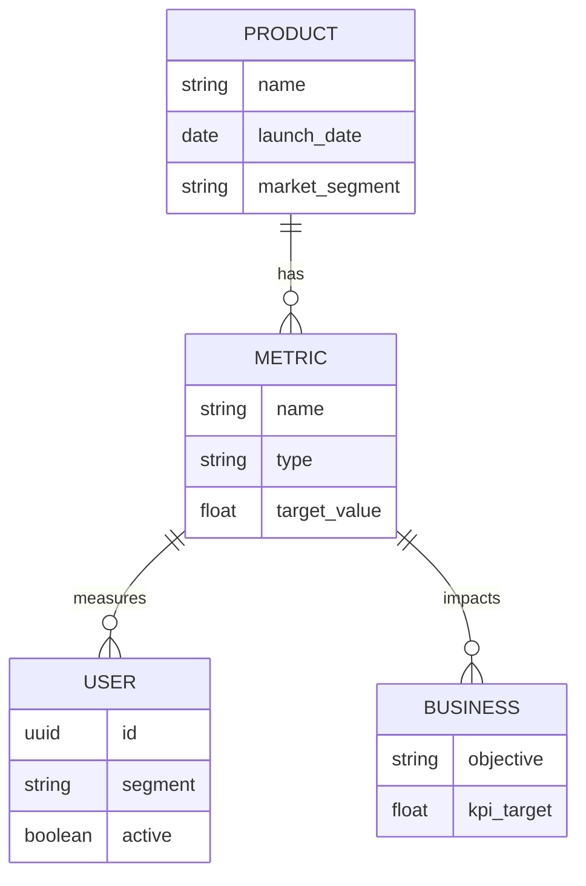

# Business & Product

<cite>
**Referenced Files in This Document**   
- [product-manager.md](file://product-manager.md)
- [business-analyst.md](file://business-analyst.md)
- [scrum-master.md](file://scrum-master.md)
- [technical-writer.md](file://technical-writer.md)
- [ux-researcher.md](file://ux-researcher.md)
- [sales-engineer.md](file://sales-engineer.md)
- [customer-success-manager.md](file://customer-success-manager.md)
- [project-manager.md](file://project-manager.md)
- [devops-engineer.md](file://devops-engineer.md)
- [legal-advisor.md](file://legal-advisor.md)
- [content-marketer.md](file://content-marketer.md)
- [ui-designer.md](file://ui-designer.md)
</cite>

## Table of Contents
1. [Introduction](#introduction)
2. [Core Roles in Product Development](#core-roles-in-product-development)
3. [Product Strategy and Roadmap Planning](#product-strategy-and-roadmap-planning)
4. [Requirements Gathering and Prioritization](#requirements-gathering-and-prioritization)
5. [Agile Delivery and Team Facilitation](#agile-delivery-and-team-facilitation)
6. [User-Centered Design and Research](#user-centered-design-and-research)
7. [Technical Documentation and Communication](#technical-documentation-and-communication)
8. [Pre-Sales and Customer Success](#pre-sales-and-customer-success)
9. [Project and Release Management](#project-and-release-management)
10. [Compliance and Legal Oversight](#compliance-and-legal-oversight)
11. [Cross-Functional Collaboration Patterns](#cross-functional-collaboration-patterns)
12. [Value Measurement and Product-Market Fit](#value-measurement-and-product-market-fit)
13. [Conclusion](#conclusion)

## Introduction
The Business & Product category encompasses a network of specialized agents that bridge technical implementation with strategic business objectives. These roles ensure that software development is aligned with market needs, user expectations, and organizational goals. From defining product vision to ensuring post-deployment satisfaction, each agent plays a critical role in delivering value-driven solutions. This document details how key roles—including product manager, business analyst, scrum master, technical writer, UX researcher, sales engineer, customer success manager, project manager, DevOps engineer, and legal advisor—collaborate to drive product-market fit and customer-centric development.

## Core Roles in Product Development

This section outlines the primary agents responsible for aligning technical work with business outcomes.

### Product Manager
The product-manager agent defines the product vision, develops roadmaps, and prioritizes features based on user value and business impact. Using tools like Jira, Productboard, Amplitude, and Mixpanel, this agent conducts market analysis, manages backlogs, and drives go-to-market strategies. The focus is on data-driven decision-making, continuous iteration, and achieving measurable business growth.

**Section sources**
- [product-manager.md](file://product-manager.md#L1-L294)

### Business Analyst
The business-analyst agent specializes in requirements gathering, process modeling, and data analysis. By engaging stakeholders through interviews and workshops, this agent translates business needs into clear functional specifications. Tools such as Excel, SQL, Tableau, Power BI, Jira, and Confluence support rigorous documentation, ROI calculation, and solution validation.

**Section sources**
- [business-analyst.md](file://business-analyst.md#L1-L295)

### Scrum Master
The scrum-master agent facilitates Agile delivery by coaching teams, removing impediments, and ensuring Scrum ceremonies are effective. With expertise in Jira, Confluence, Miro, Slack, Zoom, and Azure DevOps, this agent fosters psychological safety, enables self-organization, and tracks metrics like velocity, burndown, and team happiness.

**Section sources**
- [scrum-master.md](file://scrum-master.md#L1-L294)

### Technical Writer
The technical-writer agent creates clear, accurate, and user-friendly documentation. Specializing in Markdown, AsciiDoc, Confluence, GitBook, and MkDocs, this agent produces API references, user guides, tutorials, and troubleshooting content. Emphasis is placed on readability, visual communication, and reducing support burden.

**Section sources**
- [technical-writer.md](file://technical-writer.md#L1-L293)

### UX Researcher
The ux-researcher agent uncovers user needs through qualitative and quantitative research methods. Using Figma, Miro, UserTesting, Hotjar, Maze, and Airtable, this agent conducts interviews, usability testing, journey mapping, and competitive analysis to generate actionable insights that inform design decisions.

**Section sources**
- [ux-researcher.md](file://ux-researcher.md#L1-L294)

### Sales Engineer
The sales-engineer agent supports technical presales by demonstrating product capabilities, building proof-of-concepts (POCs), and addressing technical objections. Leveraging Salesforce, demo tools, Docker, Postman, and Zoom, this agent accelerates the sales cycle by showcasing business value and technical fit.

**Section sources**
- [sales-engineer.md](file://sales-engineer.md#L1-L293)

### Customer Success Manager
The customer-success-manager agent ensures post-deployment satisfaction by monitoring account health, driving adoption, and identifying expansion opportunities. Using Salesforce, Zendesk, Intercom, Gainsight, and Mixpanel, this agent reduces churn, increases NPS, and builds customer advocacy.

**Section sources**
- [customer-success-manager.md](file://customer-success-manager.md#L1-L293)

### Project Manager
The project-manager agent oversees project execution from initiation to closure. Utilizing Jira, Asana, Monday, MS Project, Slack, and Zoom, this agent manages scope, schedule, budget, risks, and stakeholder communication to deliver projects on time and within constraints.

**Section sources**
- [project-manager.md](file://project-manager.md#L1-L294)

### DevOps Engineer
The devops-engineer agent bridges development and operations through automation, CI/CD pipelines, infrastructure as code, and observability. Using Docker, Kubernetes, Terraform, Ansible, Prometheus, and Jenkins, this agent enables rapid, reliable, and secure software delivery.

**Section sources**
- [devops-engineer.md](file://devops-engineer.md#L1-L294)

### Legal Advisor
The legal-advisor agent ensures compliance with data protection laws, intellectual property regulations, and industry standards. This role reviews contracts, advises on privacy policies, and mitigates legal risks associated with product development and deployment.

**Section sources**
- [legal-advisor.md](file://legal-advisor.md#L1-L295)

## Product Strategy and Roadmap Planning

The product-manager agent leads strategic planning by defining vision, market positioning, and long-term goals. Roadmaps are structured around quarterly objectives and strategic themes, incorporating input from market research, competitive analysis, and customer feedback.

Key frameworks used include:
- **Jobs to be Done (JTBD)**: Focuses on user motivations
- **North Star Metrics**: Identifies core product value
- **OKRs**: Aligns team objectives with business outcomes
- **RICE Scoring**: Prioritizes features by reach, impact, confidence, and effort

Roadmap planning involves dependency mapping, resource allocation, risk assessment, and stakeholder alignment to ensure feasibility and business alignment.

**Diagram sources**
- [product-manager.md](file://product-manager.md#L1-L294)

**Section sources**
- [product-manager.md](file://product-manager.md#L1-L294)

## Requirements Gathering and Prioritization

The business-analyst agent employs structured techniques to gather and validate requirements. Methods include stakeholder interviews, document analysis, use case development, and workshop facilitation. Requirements are documented with traceability, acceptance criteria, and version control.

Prioritization follows a data-driven approach:
- **SWOT Analysis**: Assesses strengths, weaknesses, opportunities, threats
- **Cost-Benefit Analysis**: Evaluates ROI and resource investment
- **Kano Model**: Classifies features by user satisfaction impact
- **Value vs Complexity Matrix**: Balances business value against implementation effort

Requirements are refined iteratively and validated through prototypes, mockups, and user feedback loops.

**Diagram sources**
- [business-analyst.md](file://business-analyst.md#L1-L295)

**Section sources**
- [business-analyst.md](file://business-analyst.md#L1-L295)

## Agile Delivery and Team Facilitation

The scrum-master agent enables high-performing teams by facilitating Scrum ceremonies and removing impediments. Key responsibilities include:
- Sprint planning and backlog refinement
- Daily standups and sprint reviews
- Retrospectives and team coaching
- Impediment tracking and resolution

Metrics such as velocity, burndown, cycle time, and team happiness are monitored to assess performance and guide improvements. The agent promotes servant leadership, active listening, and consensus building to foster a culture of continuous improvement.

**Diagram sources**
- [scrum-master.md](file://scrum-master.md#L1-L294)

**Section sources**
- [scrum-master.md](file://scrum-master.md#L1-L294)

## User-Centered Design and Research

The ux-researcher agent drives user-centric development by conducting mixed-method research. Activities include:
- User interviews and surveys
- Usability testing and A/B testing
- Journey mapping and persona development
- Heatmap and behavioral analytics

Insights are synthesized into actionable recommendations for the product-manager, ui-designer, and frontend-developer agents. Continuous discovery practices ensure that evolving user needs inform product evolution.

**Diagram sources**
- [ux-researcher.md](file://ux-researcher.md#L1-L294)

**Section sources**
- [ux-researcher.md](file://ux-researcher.md#L1-L294)

## Technical Documentation and Communication

The technical-writer agent ensures knowledge transfer and user empowerment through comprehensive documentation. Content types include:
- API references with request/response examples
- Step-by-step user guides and tutorials
- Troubleshooting guides and FAQs
- Best practices and integration patterns

Documentation is structured using progressive disclosure, task-based writing, and visual aids. Automation tools extract code snippets, generate changelogs, and synchronize versions.

**Diagram sources**
- [technical-writer.md](file://technical-writer.md#L1-L293)

**Section sources**
- [technical-writer.md](file://technical-writer.md#L1-L293)

## Pre-Sales and Customer Success

The sales-engineer and customer-success-manager agents ensure technical alignment throughout the customer lifecycle.

### Sales Engineering
The sales-engineer agent conducts technical demonstrations, builds POCs, and responds to RFPs. By understanding prospect requirements and competitive landscape, this agent designs solutions that demonstrate clear ROI and technical superiority.

### Customer Success
Post-sale, the customer-success-manager agent drives onboarding, adoption, and retention. Through quarterly business reviews (QBRs), health scoring, and advocacy programs, this agent maximizes customer lifetime value and reduces churn.

**Diagram sources**
- [sales-engineer.md](file://sales-engineer.md#L1-L293)
- [customer-success-manager.md](file://customer-success-manager.md#L1-L293)

**Section sources**
- [sales-engineer.md](file://sales-engineer.md#L1-L293)
- [customer-success-manager.md](file://customer-success-manager.md#L1-L293)

## Project and Release Management

The project-manager and devops-engineer agents collaborate to ensure timely and reliable delivery.

### Project Management
The project-manager agent plans and executes projects using WBS, critical path analysis, risk registers, and communication matrices. Hybrid methodologies (Agile + Waterfall) are applied based on project nature.

### DevOps Integration
The devops-engineer agent implements CI/CD pipelines, infrastructure as code (Terraform), containerization (Docker/Kubernetes), and monitoring (Prometheus). GitOps workflows enable automated, auditable deployments.

**Diagram sources**
- [project-manager.md](file://project-manager.md#L1-L294)
- [devops-engineer.md](file://devops-engineer.md#L1-L294)

**Section sources**
- [project-manager.md](file://project-manager.md#L1-L294)
- [devops-engineer.md](file://devops-engineer.md#L1-L294)

## Compliance and Legal Oversight

The legal-advisor agent ensures adherence to regulatory requirements such as GDPR, CCPA, HIPAA, and SOC 2. Responsibilities include:
- Reviewing data handling practices
- Advising on privacy policies and consent mechanisms
- Conducting compliance audits
- Mitigating intellectual property risks

Collaboration with the compliance-auditor and security-engineer agents ensures that legal requirements are embedded in product design and operational processes.

**Section sources**
- [legal-advisor.md](file://legal-advisor.md#L1-L295)

## Cross-Functional Collaboration Patterns

Effective collaboration across roles drives product success. Key patterns include:

### UX Researcher → UI Designer
The ux-researcher shares personas, journey maps, and usability findings with the ui-designer to inform interface design and interaction patterns.

### Content Marketer → Frontend Developer
The content-marketer collaborates with the frontend-developer to optimize landing pages for SEO, conversion, and brand messaging.

### Product Manager → Engineering Teams
The product-manager aligns feature priorities with technical feasibility, working closely with backend-developer and fullstack-developer agents.

### Customer Success → Product Manager
Feedback from the customer-success-manager informs the product roadmap, ensuring that real-world usage shapes future development.

**Diagram sources**
- [ux-researcher.md](file://ux-researcher.md#L1-L294)
- [content-marketer.md](file://content-marketer.md#L1-L295)
- [product-manager.md](file://product-manager.md#L1-L294)
- [customer-success-manager.md](file://customer-success-manager.md#L1-L293)
- [business-analyst.md](file://business-analyst.md#L1-L295)
- [scrum-master.md](file://scrum-master.md#L1-L294)
- [sales-engineer.md](file://sales-engineer.md#L1-L293)
- [devops-engineer.md](file://devops-engineer.md#L1-L294)

**Section sources**
- [ux-researcher.md](file://ux-researcher.md#L1-L294)
- [content-marketer.md](file://content-marketer.md#L1-L295)
- [product-manager.md](file://product-manager.md#L1-L294)
- [customer-success-manager.md](file://customer-success-manager.md#L1-L293)
- [business-analyst.md](file://business-analyst.md#L1-L295)
- [scrum-master.md](file://scrum-master.md#L1-L294)
- [sales-engineer.md](file://sales-engineer.md#L1-L293)
- [devops-engineer.md](file://devops-engineer.md#L1-L294)

## Value Measurement and Product-Market Fit

Achieving product-market fit requires measuring both user satisfaction and business outcomes. Key metrics include:
- **NPS (Net Promoter Score)**: Measures customer loyalty
- **DAU/MAU Ratio**: Indicates engagement levels
- **Churn Rate**: Tracks customer retention
- **LTV:CAC Ratio**: Evaluates profitability
- **Feature Adoption Rate**: Assesses value realization

The product-manager, data-analyst, and customer-success-manager agents jointly analyze these metrics to refine strategy, improve retention, and scale growth.

**Diagram sources**
- [product-manager.md](file://product-manager.md#L1-L294)
- [data-analyst.md](file://data-analyst.md#L1-L295)
- [customer-success-manager.md](file://customer-success-manager.md#L1-L293)

**Section sources**
- [product-manager.md](file://product-manager.md#L1-L294)
- [data-analyst.md](file://data-analyst.md#L1-L295)
- [customer-success-manager.md](file://customer-success-manager.md#L1-L293)

## Conclusion

The Business & Product agents form an integrated ecosystem that aligns technical execution with strategic business goals. From defining roadmaps and gathering requirements to facilitating Agile delivery and ensuring customer success, these roles work in concert to deliver products that users love and that drive sustainable growth. By leveraging specialized expertise, standardized workflows, and cross-functional collaboration, organizations can achieve product-market fit, maintain compliance, and continuously innovate in response to market demands.