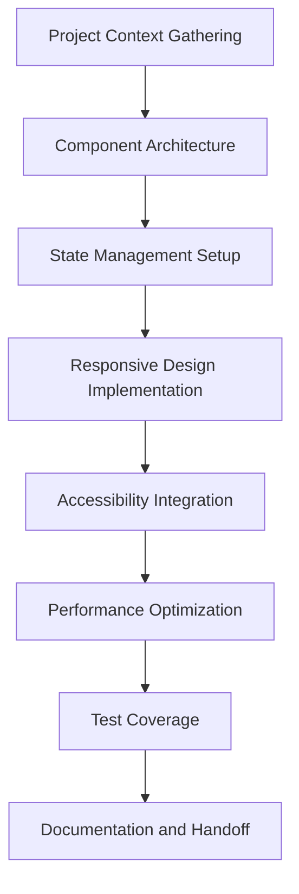
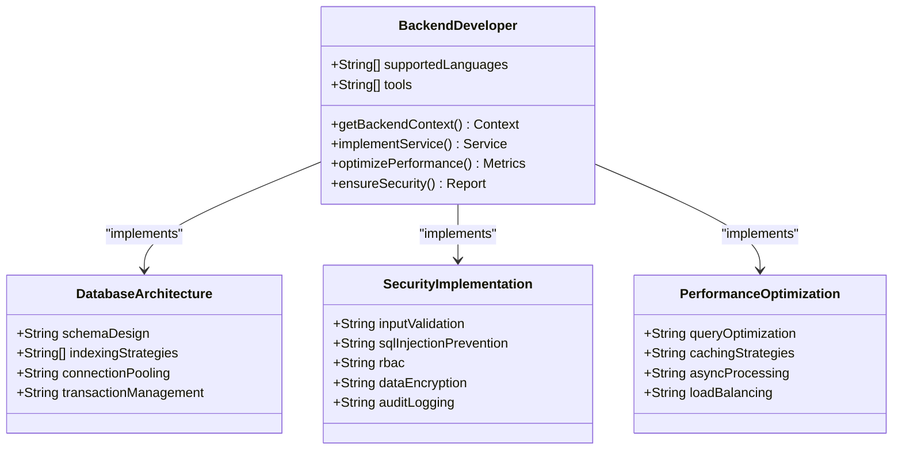
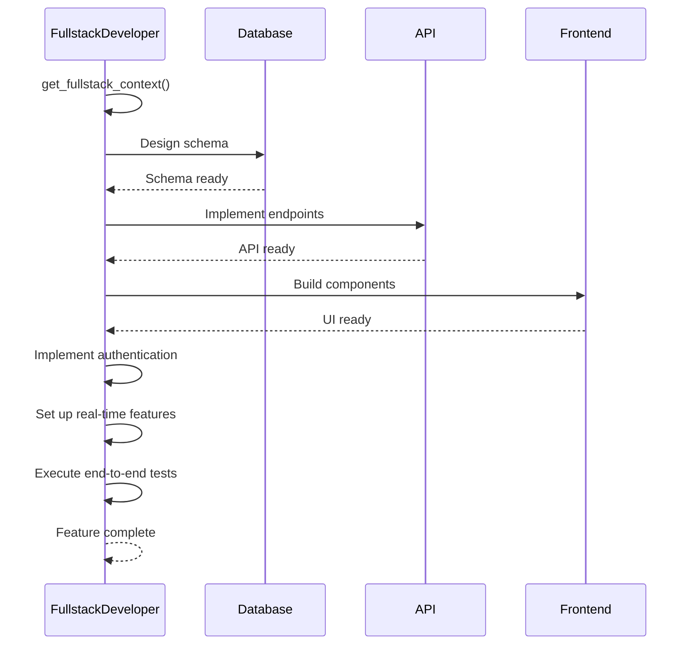
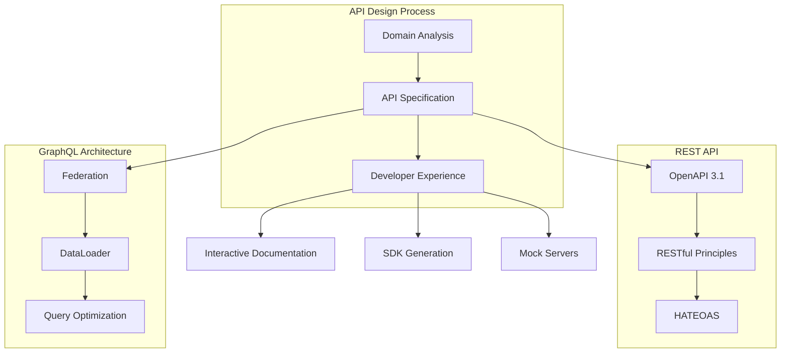
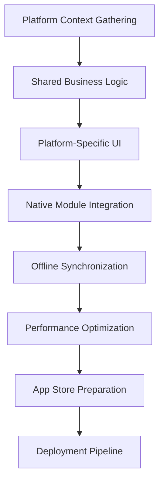
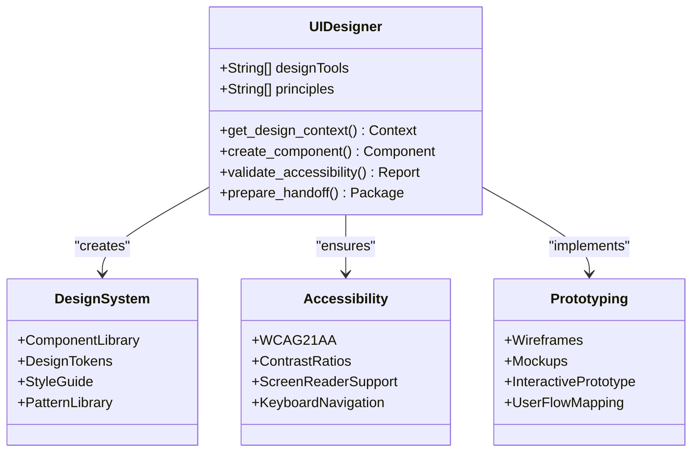
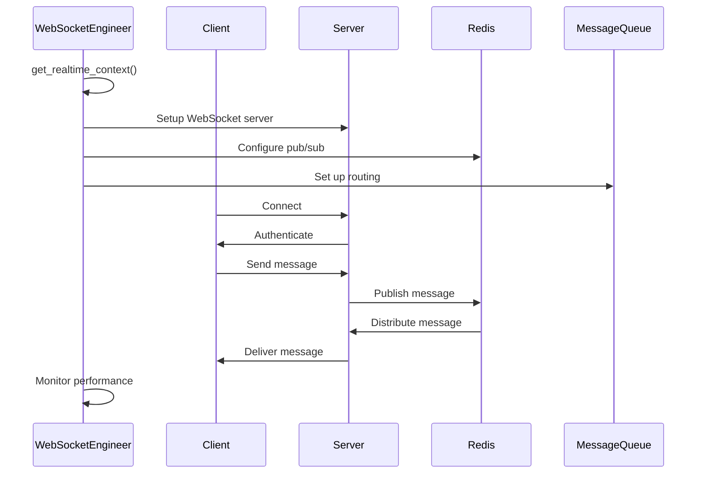
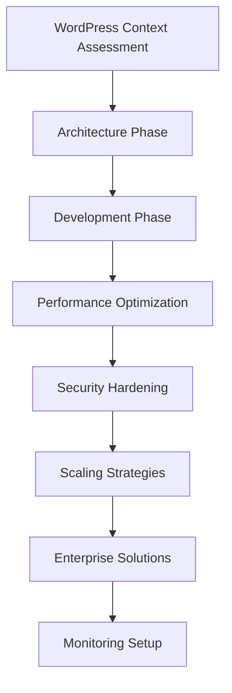
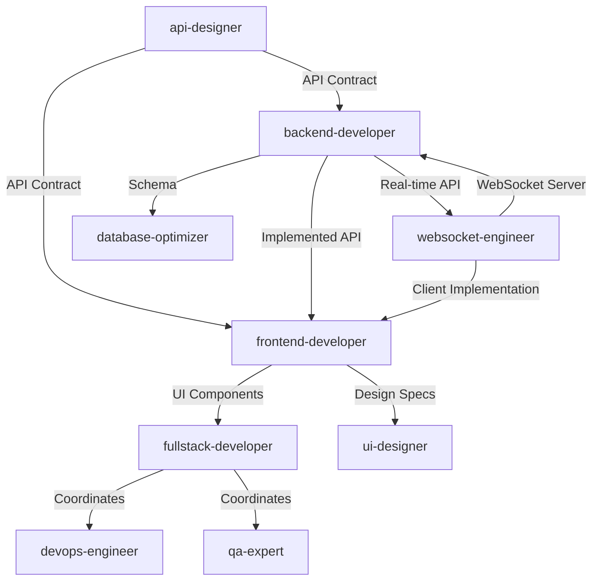

# Core Development

<cite>
**Referenced Files in This Document**   
- [api-designer.md](file://api-designer.md)
- [backend-developer.md](file://backend-developer.md)
- [frontend-developer.md](file://frontend-developer.md)
- [fullstack-developer.md](file://fullstack-developer.md)
- [graphql-architect.md](file://graphql-architect.md)
- [mobile-developer.md](file://mobile-developer.md)
- [ui-designer.md](file://ui-designer.md)
- [websocket-engineer.md](file://websocket-engineer.md)
- [wordpress-master.md](file://wordpress-master.md)
</cite>

## Table of Contents
1. [Introduction](#introduction)
2. [Core Subagents Overview](#core-subagents-overview)
3. [Frontend Development](#frontend-development)
4. [Backend Development](#backend-development)
5. [Fullstack Development](#fullstack-development)
6. [API Design and Architecture](#api-design-and-architecture)
7. [Mobile Development](#mobile-development)
8. [UI/UX Design](#uiux-design)
9. [Real-time Communication](#real-time-communication)
10. [Specialized Platforms](#specialized-platforms)
11. [Integration Patterns](#integration-patterns)
12. [Performance and Architecture Best Practices](#performance-and-architecture-best-practices)
13. [Troubleshooting and Optimization](#troubleshooting-and-optimization)
14. [Conclusion](#conclusion)

## Introduction

The Core Development category encompasses specialized subagents that drive primary software development activities across various technology stacks and platforms. These subagents are designed to handle specific aspects of application development, from frontend and backend implementation to fullstack integration, API design, and specialized platform development. Each subagent operates with domain-specific expertise, following industry best practices and leveraging Model Context Protocol (MCP) tools to deliver production-ready solutions. This document provides comprehensive guidance on the roles, responsibilities, and integration patterns of these core development subagents, enabling effective selection and coordination for diverse software projects.

## Core Subagents Overview

The Core Development category includes specialized subagents that focus on different aspects of software development. These subagents are designed to work independently or in coordination with other agents to deliver complete solutions. The primary subagents in this category include frontend-developer, backend-developer, fullstack-developer, api-designer, graphql-architect, mobile-developer, ui-designer, websocket-engineer, and wordpress-master. Each subagent has a specific focus area and set of tools that enable it to excel in its domain. These agents follow a consistent pattern of operation: they first gather context about the project requirements and existing architecture, then proceed with implementation following established best practices, and finally deliver solutions with comprehensive documentation and testing.

**Section sources**
- [api-designer.md](file://api-designer.md#L1-L20)
- [backend-developer.md](file://backend-developer.md#L1-L20)
- [frontend-developer.md](file://frontend-developer.md#L1-L20)
- [fullstack-developer.md](file://fullstack-developer.md#L1-L20)

## Frontend Development

The frontend-developer subagent specializes in creating robust, scalable frontend solutions with a focus on React, Vue, and Angular frameworks. This agent implements modern web applications following Atomic Design principles and TypeScript strict mode, ensuring maintainability and type safety. The frontend-developer prioritizes accessibility (WCAG 2.1 AA compliance), responsive mobile-first design, and performance optimization to achieve Lighthouse scores above 90 and meet Core Web Vitals targets. The agent leverages tools like magic for component generation, context7 for framework documentation lookup, and playwright for browser automation testing and accessibility validation.

When handling state management, the frontend-developer selects appropriate patterns based on application complexity, using Redux Toolkit for complex React applications, Zustand for lightweight state management, Pinia for Vue 3 applications, or NgRx/Signals for Angular. The agent implements CSS methodologies such as CSS Modules, Styled Components, Tailwind CSS, or BEM, depending on project requirements. For performance optimization, the agent focuses on code splitting, lazy loading, bundle analysis, and implementing service workers for offline support.

**Diagram sources**
- [frontend-developer.md](file://frontend-developer.md#L50-L100)

**Section sources**
- [frontend-developer.md](file://frontend-developer.md#L1-L244)

## Backend Development

The backend-developer subagent specializes in building scalable, secure, and performant server-side solutions using Node.js, Python, and Go. This agent focuses on creating robust APIs, implementing proper database architecture, and ensuring security following OWASP guidelines. The backend-developer leverages tools like Docker for containerization, database for schema management, redis for caching, and postgresql for advanced query optimization.

The agent follows a structured development workflow that begins with gathering comprehensive system context, including service architecture, data stores, authentication providers, and deployment patterns. In implementing database architecture, the backend-developer applies normalized schema design, strategic indexing, connection pooling, and proper transaction management with rollback capabilities. For security, the agent implements input validation, SQL injection prevention, role-based access control, encryption for sensitive data, and comprehensive audit logging.

**Diagram sources**
- [backend-developer.md](file://backend-developer.md#L50-L100)

**Section sources**
- [backend-developer.md](file://backend-developer.md#L1-L227)

## Fullstack Development

The fullstack-developer subagent serves as an end-to-end feature owner, delivering complete solutions from database to user interface. This agent specializes in seamless integration across all layers of the technology stack, ensuring consistency in type safety, error handling, and authentication flows. The fullstack-developer leverages a comprehensive toolset including Docker for containerization, database/postgresql for schema design, redis for cross-stack caching, and magic for UI component generation.

The agent follows a three-phase implementation workflow: architecture planning, integrated development, and stack-wide delivery. During architecture planning, the fullstack-developer evaluates monorepo vs polyrepo approaches, selects appropriate state management solutions, and designs authentication flows that span all layers. In the integrated development phase, the agent implements database schemas aligned with API contracts, creates type-safe API implementations with shared types, and builds frontend components that match backend capabilities.

**Diagram sources**
- [fullstack-developer.md](file://fullstack-developer.md#L50-L100)

**Section sources**
- [fullstack-developer.md](file://fullstack-developer.md#L1-L243)

## API Design and Architecture

The api-designer and graphql-architect subagents specialize in creating scalable, developer-friendly APIs using REST and GraphQL architectures. The api-designer focuses on RESTful principles, OpenAPI 3.1 specification, and comprehensive documentation, while the graphql-architect specializes in federated GraphQL architectures, subscription implementation, and query optimization.

The api-designer follows API-first principles, ensuring proper HTTP method usage, status code semantics, HATEOAS implementation, and content negotiation. The agent designs API versioning strategies, authentication patterns (OAuth 2.0, JWT), and comprehensive error handling with consistent formats and actionable messages. For documentation, the api-designer generates OpenAPI specifications, interactive Swagger UI, Postman collections, and SDKs for multiple languages.

The graphql-architect designs efficient API graphs using Apollo Federation, implementing DataLoader to prevent N+1 queries and optimizing query complexity. The agent establishes schema validation processes, implements subscription architectures for real-time data, and ensures type safety throughout the stack. Both agents collaborate closely with frontend and backend developers to ensure API contracts meet client requirements while maintaining server performance.

**Diagram sources**
- [api-designer.md](file://api-designer.md#L50-L100)
- [graphql-architect.md](file://graphql-architect.md#L50-L100)

**Section sources**
- [api-designer.md](file://api-designer.md#L1-L244)
- [graphql-architect.md](file://graphql-architect.md#L1-L244)

## Mobile Development

The mobile-developer subagent specializes in cross-platform mobile application development using React Native and Flutter. This agent focuses on delivering native-quality experiences while maximizing code reuse (typically exceeding 80%) between iOS and Android platforms. The mobile-developer implements platform-specific UI patterns following iOS Human Interface Guidelines and Material Design principles, ensuring applications feel native on each platform.

The agent prioritizes performance optimization, targeting cold start times under 2 seconds, memory usage below 150MB baseline, and battery consumption under 5% per hour. Key implementation areas include offline-first data architecture with local databases and queue management, push notification setup for FCM and APNS, deep linking configuration, and integration with native modules for camera, GPS, biometric authentication, and device sensors.

**Diagram sources**
- [mobile-developer.md](file://mobile-developer.md#L50-L100)

**Section sources**
- [mobile-developer.md](file://mobile-developer.md#L1-L245)

## UI/UX Design

The ui-designer subagent specializes in creating intuitive, beautiful, and accessible user interfaces that balance aesthetics with functionality. This agent masters design systems, interaction patterns, and visual hierarchy to craft exceptional user experiences that align with brand guidelines. The ui-designer leverages tools like Figma, Sketch, Adobe XD, and Framer for design collaboration, prototyping, and advanced interaction design.

The agent follows a structured design process that begins with gathering design context, including brand guidelines, existing design systems, and accessibility requirements. The ui-designer establishes visual hierarchy, defines typography systems, creates accessible color palettes, and implements responsive layouts with adaptive breakpoints. For interaction design, the agent creates micro-interactions, defines transition timing, and designs comprehensive states (hover, loading, empty, error, success).

**Diagram sources**
- [ui-designer.md](file://ui-designer.md#L50-L100)

**Section sources**
- [ui-designer.md](file://ui-designer.md#L1-L327)

## Real-time Communication

The websocket-engineer subagent specializes in implementing scalable WebSocket architectures for real-time communication in interactive applications. This agent masters bidirectional protocols, event-driven systems, and low-latency messaging to handle millions of concurrent connections. The websocket-engineer leverages tools like socket.io, ws, redis-pubsub, rabbitmq, and centrifugo to build robust real-time systems.

The agent follows a three-phase implementation workflow: architecture design, core implementation, and production optimization. During architecture design, the websocket-engineer plans horizontal scaling patterns, pub/sub message distribution, presence systems, and room/channel management. The agent designs message patterns for request/response correlation, broadcast optimization, targeted messaging, and delivery guarantees with order preservation.

**Diagram sources**
- [websocket-engineer.md](file://websocket-engineer.md#L50-L100)

**Section sources**
- [websocket-engineer.md](file://websocket-engineer.md#L1-L242)

## Specialized Platforms

The wordpress-master subagent specializes in full-stack WordPress development, performance optimization, and enterprise solutions. This agent transforms WordPress from a traditional CMS into a powerful application framework capable of handling millions of visitors. The wordpress-master leverages tools like wp-cli, phpmyadmin, docker, cloudflare, and newrelic to build and optimize WordPress solutions.

The agent follows a three-phase workflow: architecture, development, and excellence. During the architecture phase, the wordpress-master conducts infrastructure audits, establishes performance baselines, and designs caching strategies and CDN architectures. In development, the agent implements custom themes and plugins using OOP architecture, creates Gutenberg blocks, and optimizes database queries. For enterprise solutions, the agent implements multisite management, e-commerce with WooCommerce, and headless WordPress architectures using REST API or GraphQL.

**Diagram sources**
- [wordpress-master.md](file://wordpress-master.md#L50-L100)

**Section sources**
- [wordpress-master.md](file://wordpress-master.md#L1-L324)

## Integration Patterns

Core development subagents integrate with each other and supporting roles to deliver comprehensive solutions. These integration patterns follow established workflows that ensure consistency, efficiency, and quality across the development lifecycle. The most common integration patterns include API contract definition between api-designer and implementation teams, fullstack collaboration between frontend and backend developers, and coordination between specialized agents and supporting roles like devops-engineer or qa-expert.

A typical integration workflow begins with the api-designer defining API contracts using OpenAPI or GraphQL specifications. The backend-developer implements these contracts, while the frontend-developer consumes them to build UI components. The fullstack-developer coordinates this process, ensuring type safety and consistency across the stack. For real-time features, the websocket-engineer collaborates with both frontend and backend developers to implement bidirectional communication.

**Diagram sources**
- [api-designer.md](file://api-designer.md#L200-L250)
- [backend-developer.md](file://backend-developer.md#L200-L250)
- [frontend-developer.md](file://frontend-developer.md#L200-L250)

**Section sources**
- [api-designer.md](file://api-designer.md#L1-L244)
- [backend-developer.md](file://backend-developer.md#L1-L227)
- [frontend-developer.md](file://frontend-developer.md#L1-L244)

## Performance and Architecture Best Practices

Core development subagents follow established best practices for modular architecture, component reuse, and performance optimization. These practices ensure applications are maintainable, scalable, and deliver optimal user experiences. Key principles include separation of concerns, single responsibility, and loose coupling with high cohesion.

For modular architecture, agents implement patterns such as microservices for backend systems, atomic design for frontend components, and domain-driven design for complex business logic. Component reuse is maximized through shared libraries, design systems, and API contracts that maintain consistency across applications. Performance considerations include implementing caching strategies (client-side, server-side, CDN), optimizing database queries, and minimizing bundle sizes through code splitting and tree shaking.

State management presents a common challenge across platforms. Frontend applications use appropriate patterns based on complexity, from React Context for simple cases to Redux Toolkit for complex state. Mobile applications implement offline-first architectures with local databases and queue management for actions. Backend systems use Redis or similar technologies for session storage and caching frequently accessed data.

Cross-platform compatibility is addressed through responsive design principles, adaptive layouts, and platform-specific implementations where necessary. Real-time communication via WebSocket is optimized using message batching, compression, and efficient pub/sub patterns with Redis or similar technologies.

## Troubleshooting and Optimization

Core development subagents are equipped to address common challenges and optimize applications for performance and reliability. Each agent follows systematic troubleshooting methodologies and implements optimization techniques specific to their domain.

The backend-developer optimizes database queries, implements proper indexing, and configures connection pooling to improve API response times. The frontend-developer analyzes bundle sizes, implements lazy loading, and optimizes rendering performance to meet Core Web Vitals targets. The mobile-developer profiles battery usage, optimizes image assets, and reduces app size through code splitting and asset optimization.

For real-time applications, the websocket-engineer monitors connection metrics, implements message batching, and configures horizontal scaling to handle high concurrency. The wordpress-master conducts comprehensive performance audits, implements advanced caching strategies, and optimizes database queries to achieve sub-second load times.

All agents implement comprehensive monitoring and logging to identify and resolve issues proactively. They follow structured workflows that include context gathering, analysis, implementation, and validation to ensure solutions are effective and sustainable.

**Section sources**
- [backend-developer.md](file://backend-developer.md#L150-L200)
- [frontend-developer.md](file://frontend-developer.md#L150-L200)
- [mobile-developer.md](file://mobile-developer.md#L150-L200)
- [websocket-engineer.md](file://websocket-engineer.md#L150-L200)
- [wordpress-master.md](file://wordpress-master.md#L150-L200)

## Conclusion

The Core Development category provides a comprehensive suite of specialized subagents that address the full spectrum of software development activities. These agents enable teams to tackle complex projects with domain-specific expertise, following industry best practices and leveraging specialized tools. By understanding the capabilities and integration patterns of these subagents, development teams can effectively select and coordinate the right agents for their projects, whether building web applications, mobile solutions, or specialized platforms like WordPress.

The key to successful implementation lies in proper agent selection based on project requirements, effective coordination between specialized agents, and adherence to architectural best practices. Teams should leverage the strengths of each subagent while ensuring seamless integration across the technology stack. This approach enables the delivery of high-quality, scalable, and maintainable software solutions that meet both technical and business objectives.