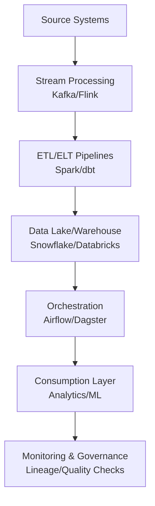
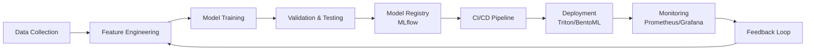
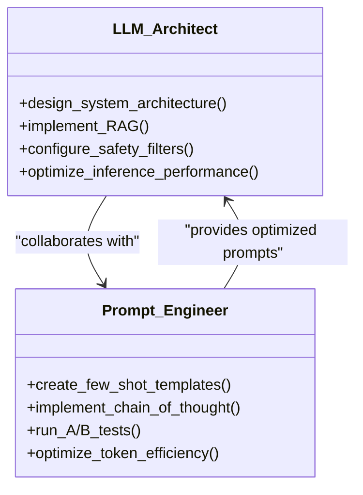
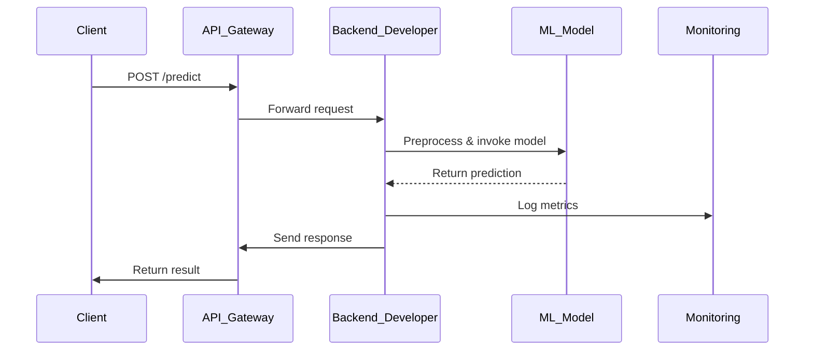
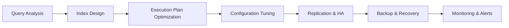

# Data & AI

<cite>
**Referenced Files in This Document**   
- [data-engineer.md](file://data-engineer.md)
- [data-scientist.md](file://data-scientist.md)
- [mlops-engineer.md](file://mlops-engineer.md)
- [llm-architect.md](file://llm-architect.md)
- [prompt-engineer.md](file://prompt-engineer.md)
- [machine-learning-engineer.md](file://machine-learning-engineer.md)
- [backend-developer.md](file://backend-developer.md)
- [database-optimizer.md](file://database-optimizer.md)
- [postgres-pro.md](file://postgres-pro.md)
- [data-analyst.md](file://data-analyst.md)
</cite>

## Table of Contents
1. [Introduction](#introduction)
2. [Core Roles and Responsibilities](#core-roles-and-responsibilities)
3. [Data Pipeline Architecture](#data-pipeline-architecture)
4. [Machine Learning Lifecycle](#machine-learning-lifecycle)
5. [LLM System Design and Prompt Engineering](#llm-system-design-and-prompt-engineering)
6. [Model Deployment and API Integration](#model-deployment-and-api-integration)
7. [Database Optimization and PostgreSQL Tuning](#database-optimization-and-postgresql-tuning)
8. [Data Governance and Compliance](#data-governance-and-compliance)
9. [Integration Patterns and Collaboration](#integration-patterns-and-collaboration)
10. [Challenges and Best Practices](#challenges-and-best-practices)

## Introduction

The Data & AI ecosystem integrates specialized roles to build, manage, and scale data-driven systems. This document details the responsibilities of key agents involved in data pipelines, analytics, machine learning, and large language model systems. It outlines collaboration patterns, technical workflows, and best practices for ensuring data quality, model reliability, and regulatory compliance across the AI lifecycle.

## Core Roles and Responsibilities

### Data Engineer
Responsible for building scalable ETL/ELT workflows, data lakes, and stream processing pipelines using tools like Spark, Airflow, Kafka, and Snowflake. Ensures data freshness (<1 hour), zero data loss, and cost-optimized storage through partitioning, compaction, and lifecycle policies.

**Section sources**
- [data-engineer.md](file://data-engineer.md#L1-L294)

### Data Scientist
Focuses on statistical modeling, feature engineering, and deriving actionable insights using Python, pandas, scikit-learn, and Jupyter. Applies hypothesis testing, regression analysis, and machine learning to solve business problems with measurable ROI.

**Section sources**
- [data-scientist.md](file://data-scientist.md#L1-L294)

### MLOps Engineer
Builds CI/CD pipelines for ML, manages model versioning via MLflow, and orchestrates workflows with Kubeflow and Airflow. Implements monitoring, security scanning, and automated rollback procedures to ensure 99.9% platform uptime.

**Section sources**
- [mlops-engineer.md](file://mlops-engineer.md#L1-L294)

### LLM Architect
Designs production LLM systems using transformers, LangChain, and vLLM. Implements fine-tuning (LoRA/QLoRA), RAG, and safety filters while optimizing for low latency (<200ms) and high throughput (>100 tokens/s).

**Section sources**
- [llm-architect.md](file://llm-architect.md#L1-L293)

### Prompt Engineer
Optimizes prompt strategies using few-shot learning, chain-of-thought reasoning, and A/B testing. Reduces token usage by up to 38% while maintaining >90% accuracy through template design and dynamic selection.

**Section sources**
- [prompt-engineer.md](file://prompt-engineer.md#L1-L293)

### Machine Learning Engineer
Deploys models into production using TensorFlow, PyTorch, Triton, and BentoML. Achieves sub-100ms inference latency through quantization, batching, and GPU optimization.

**Section sources**
- [machine-learning-engineer.md](file://machine-learning-engineer.md#L1-L285)

### Backend Developer
Develops scalable APIs in Go, Python, or Node.js with PostgreSQL, Redis, and Docker. Implements authentication, rate limiting, and caching to support real-time inference endpoints.

**Section sources**
- [backend-developer.md](file://backend-developer.md#L1-L227)

### Database Optimizer
Tunes query performance across databases using EXPLAIN, pgbench, and mysqltuner. Achieves <100ms query times through index optimization, schema design, and I/O tuning.

**Section sources**
- [database-optimizer.md](file://database-optimizer.md#L1-L293)

### PostgreSQL Pro
Specializes in PostgreSQL internals, replication, backup (PITR), and advanced features like JSONB, PostGIS, and logical replication. Maintains <50ms query latency and 99.97% uptime.

**Section sources**
- [postgres-pro.md](file://postgres-pro.md#L1-L293)

### Data Analyst
Translates business needs into SQL queries, dashboards (Tableau, Power BI), and statistical analyses. Delivers self-service BI solutions that reduce report generation time from days to minutes.

**Section sources**
- [data-analyst.md](file://data-analyst.md#L1-L285)

## Data Pipeline Architecture

**Diagram sources**
- [data-engineer.md](file://data-engineer.md#L1-L294)

**Section sources**
- [data-engineer.md](file://data-engineer.md#L1-L294)

## Machine Learning Lifecycle

**Diagram sources**
- [mlops-engineer.md](file://mlops-engineer.md#L1-L294)
- [machine-learning-engineer.md](file://machine-learning-engineer.md#L1-L285)

**Section sources**
- [mlops-engineer.md](file://mlops-engineer.md#L1-L294)
- [machine-learning-engineer.md](file://machine-learning-engineer.md#L1-L285)

## LLM System Design and Prompt Engineering

**Diagram sources**
- [llm-architect.md](file://llm-architect.md#L1-L293)
- [prompt-engineer.md](file://prompt-engineer.md#L1-L293)

**Section sources**
- [llm-architect.md](file://llm-architect.md#L1-L293)
- [prompt-engineer.md](file://prompt-engineer.md#L1-L293)

## Model Deployment and API Integration

**Diagram sources**
- [machine-learning-engineer.md](file://machine-learning-engineer.md#L1-L285)
- [backend-developer.md](file://backend-developer.md#L1-L227)

**Section sources**
- [machine-learning-engineer.md](file://machine-learning-engineer.md#L1-L285)
- [backend-developer.md](file://backend-developer.md#L1-L227)

## Database Optimization and PostgreSQL Tuning

**Diagram sources**
- [database-optimizer.md](file://database-optimizer.md#L1-L293)
- [postgres-pro.md](file://postgres-pro.md#L1-L293)

**Section sources**
- [database-optimizer.md](file://database-optimizer.md#L1-L293)
- [postgres-pro.md](file://postgres-pro.md#L1-L293)

## Data Governance and Compliance

Data governance is led by data analysts in collaboration with compliance auditors and security engineers. Key practices include:

- **Data Lineage Tracking**: Documenting data flow from source to consumption
- **Access Control**: Implementing RBAC and row-level security
- **Audit Logging**: Recording data access and modifications
- **Privacy Compliance**: Ensuring GDPR, CCPA adherence through anonymization
- **Retention Policies**: Automating data lifecycle management

**Section sources**
- [data-analyst.md](file://data-analyst.md#L1-L285)

## Integration Patterns and Collaboration

Agents collaborate through well-defined integration patterns:

- **Data Engineer ↔ Data Scientist**: Share transformed datasets for modeling
- **ML Engineer ↔ Backend Developer**: Wrap models in REST APIs
- **MLOps Engineer ↔ DevOps Engineer**: Automate deployment pipelines
- **Database Optimizer ↔ Backend Developer**: Tune critical queries
- **LLM Architect ↔ Prompt Engineer**: Co-design prompt strategies

These collaborations ensure seamless data flow from ingestion to inference.

**Section sources**
- [data-engineer.md](file://data-engineer.md#L1-L294)
- [data-scientist.md](file://data-scientist.md#L1-L294)
- [mlops-engineer.md](file://mlops-engineer.md#L1-L294)
- [machine-learning-engineer.md](file://machine-learning-engineer.md#L1-L285)
- [backend-developer.md](file://backend-developer.md#L1-L227)

## Challenges and Best Practices

### Key Challenges
- **Data Quality**: Incomplete, inconsistent, or stale data
- **Model Drift**: Performance degradation over time
- **Real-Time Inference**: Meeting low-latency requirements
- **Scalability**: Handling increasing data volumes and user loads

### Best Practices
- **Data Versioning**: Track dataset changes using DVC or lakehouse metadata
- **Model Monitoring**: Detect drift with statistical tests and alerting
- **Scalable Feature Stores**: Use Feast or Tecton for consistent feature delivery
- **Automated Testing**: Validate data quality, model performance, and API contracts
- **Cost Optimization**: Apply storage tiering, spot instances, and query pruning

**Section sources**
- [data-engineer.md](file://data-engineer.md#L1-L294)
- [mlops-engineer.md](file://mlops-engineer.md#L1-L294)
- [machine-learning-engineer.md](file://machine-learning-engineer.md#L1-L285)
- [database-optimizer.md](file://database-optimizer.md#L1-L293)