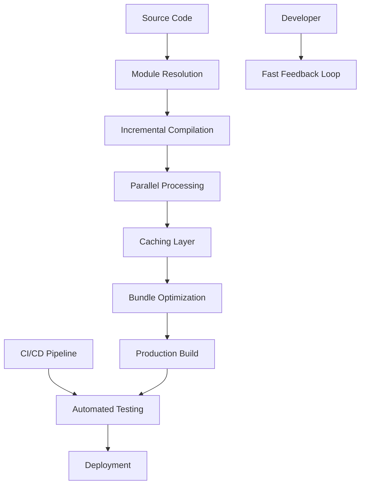
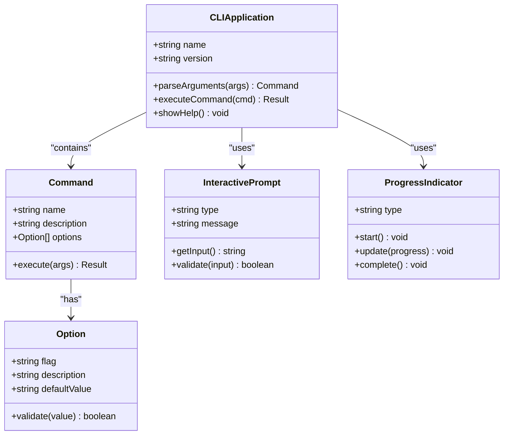
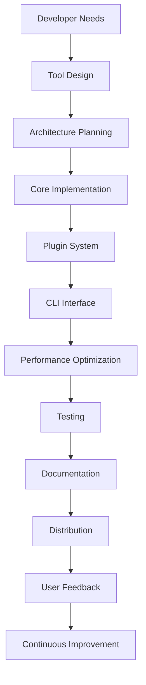
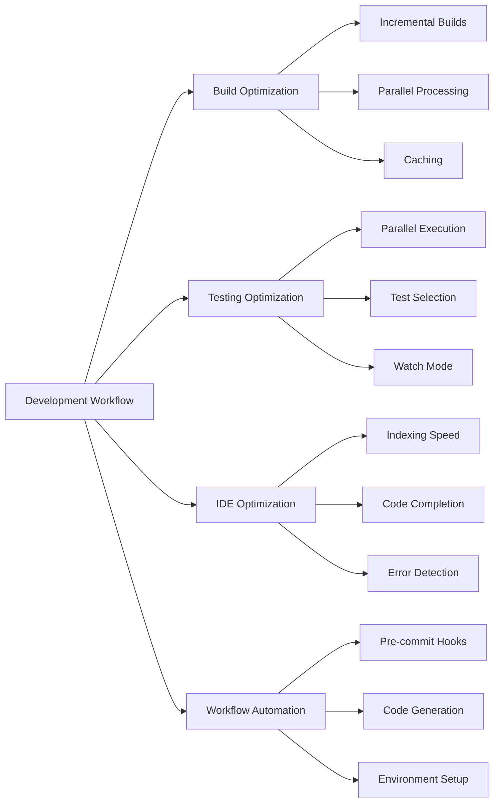
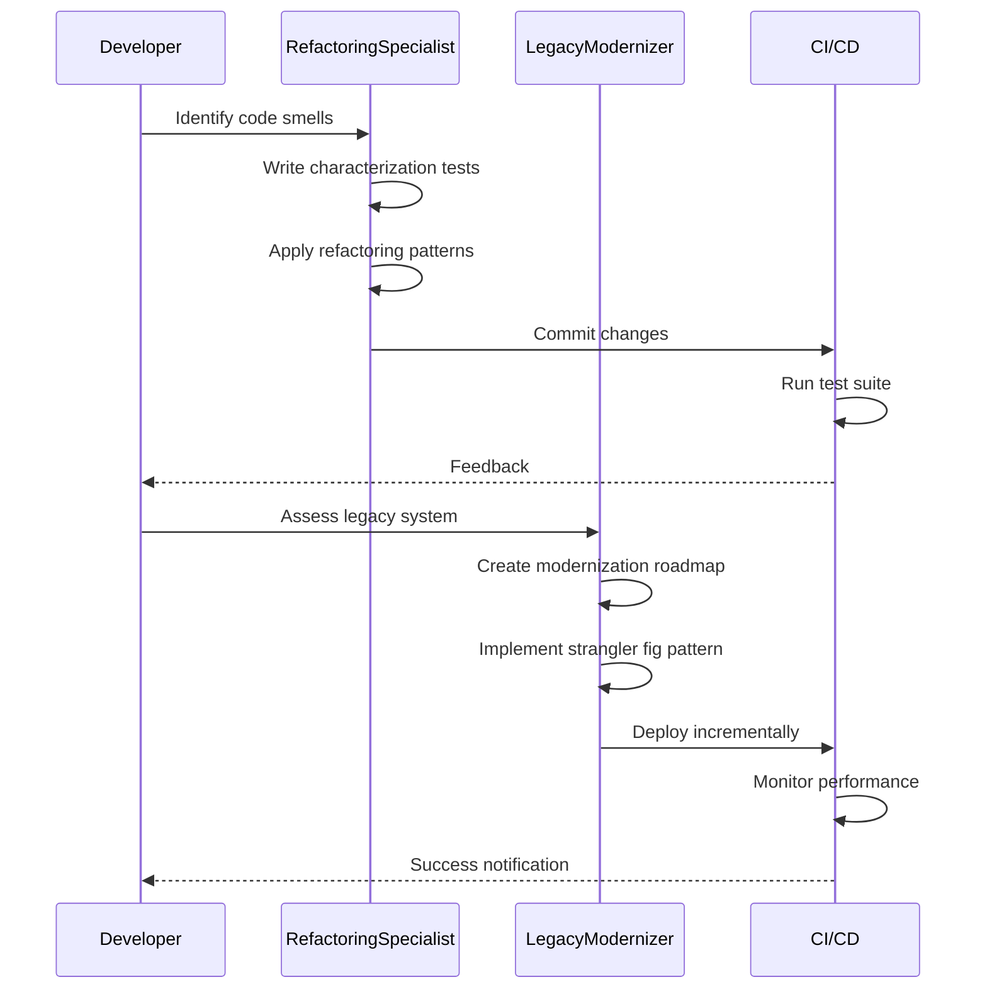
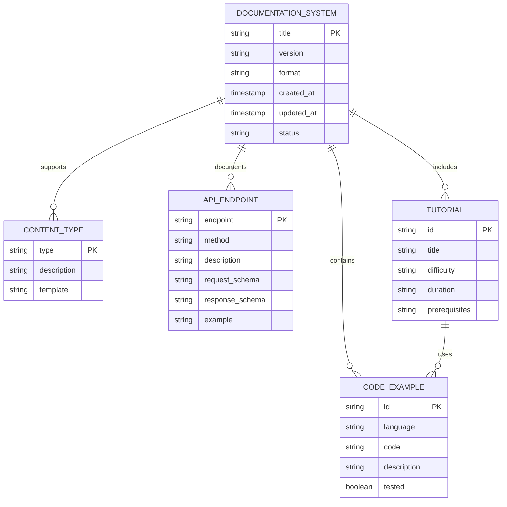
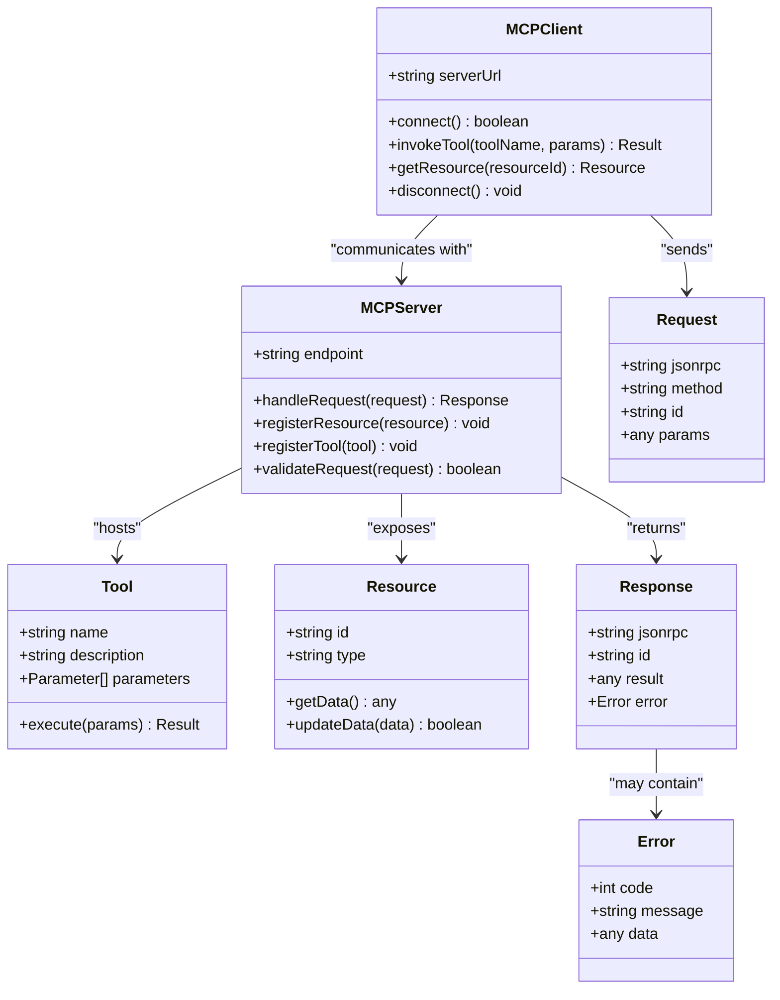
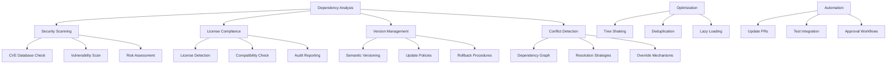

# Developer Experience

<cite>
**Referenced Files in This Document**   
- [build-engineer.md](file://build-engineer.md)
- [cli-developer.md](file://cli-developer.md)
- [tooling-engineer.md](file://tooling-engineer.md)
- [dx-optimizer.md](file://dx-optimizer.md)
- [git-workflow-manager.md](file://git-workflow-manager.md)
- [refactoring-specialist.md](file://refactoring-specialist.md)
- [legacy-modernizer.md](file://legacy-modernizer.md)
- [documentation-engineer.md](file://documentation-engineer.md)
- [mcp-developer.md](file://mcp-developer.md)
- [dependency-manager.md](file://dependency-manager.md)
</cite>

## Table of Contents
1. [Introduction](#introduction)
2. [Core Subagents and Their Roles](#core-subagents-and-their-roles)
3. [Build Optimization and Compilation Pipelines](#build-optimization-and-compilation-pipelines)
4. [Command-Line Tool Development](#command-line-tool-development)
5. [Internal Developer Tools and Automation](#internal-developer-tools-and-automation)
6. [Developer Workflow Optimization](#developer-workflow-optimization)
7. [Code Quality and Modernization](#code-quality-and-modernization)
8. [API Documentation and Technical Content](#api-documentation-and-technical-content)
9. [MCP Tool Development](#mcp-tool-development)
10. [Dependency Management Strategies](#dependency-management-strategies)
11. [Metrics for Developer Experience](#metrics-for-developer-experience)
12. [Integration with CI/CD and IDEs](#integration-with-cicd-and-ides)
13. [Best Practices for Tool Standardization](#best-practices-for-tool-standardization)
14. [Conclusion](#conclusion)

## Introduction
The Developer Experience (DX) category encompasses a suite of specialized agents designed to enhance productivity, maintainability, and workflow efficiency across software development lifecycles. These subagents operate synergistically to optimize build systems, streamline version control, modernize legacy systems, automate documentation, and improve tooling ecosystems. This document details the roles, capabilities, and integration patterns of key DX agents, providing a comprehensive overview of how they collectively elevate developer productivity and satisfaction.

## Core Subagents and Their Roles

The Developer Experience ecosystem is composed of specialized agents, each focusing on distinct aspects of development workflows:

- **build-engineer**: Optimizes compilation pipelines and build performance
- **cli-developer**: Designs and implements command-line interfaces and developer tools
- **tooling-engineer**: Builds internal developer tools and productivity enhancements
- **dx-optimizer**: Improves overall developer workflows and feedback loops
- **git-workflow-manager**: Standardizes version control practices and Git workflows
- **refactoring-specialist**: Enhances code quality through systematic refactoring
- **legacy-modernizer**: Migrates outdated systems to modern architectures
- **documentation-engineer**: Generates API documentation and technical guides
- **mcp-developer**: Develops MCP tools to extend agent capabilities
- **dependency-manager**: Manages dependencies across multiple ecosystems

These agents collaborate through standardized communication protocols and shared tooling to create cohesive, efficient development environments.

**Section sources**
- [build-engineer.md](file://build-engineer.md)
- [cli-developer.md](file://cli-developer.md)
- [tooling-engineer.md](file://tooling-engineer.md)
- [dx-optimizer.md](file://dx-optimizer.md)
- [git-workflow-manager.md](file://git-workflow-manager.md)
- [refactoring-specialist.md](file://refactoring-specialist.md)
- [legacy-modernizer.md](file://legacy-modernizer.md)
- [documentation-engineer.md](file://documentation-engineer.md)
- [mcp-developer.md](file://mcp-developer.md)
- [dependency-manager.md](file://dependency-manager.md)

## Build Optimization and Compilation Pipelines

The **build-engineer** specializes in optimizing build systems to achieve fast, reliable, and scalable compilation pipelines. Key optimization strategies include incremental compilation, parallel processing, and advanced caching mechanisms using tools like webpack, vite, esbuild, turbo, nx, and bazel.

Critical performance targets include:
- Build time < 30 seconds
- Rebuild time < 5 seconds
- Cache hit rate > 90%
- Zero flaky builds
- Reproducible builds

The build-engineer implements monorepo support with workspace configuration, task dependencies, affected detection, and shared caching. Production builds are optimized with code splitting, tree shaking, minification, and asset optimization to minimize bundle sizes and improve load times.

Integration with CI/CD systems ensures consistent build environments and automated performance tracking. The build-engineer collaborates with dx-optimizer to enhance developer feedback loops and with dependency-manager to optimize package resolution.

**Diagram sources**
- [build-engineer.md](file://build-engineer.md#L1-L295)

**Section sources**
- [build-engineer.md](file://build-engineer.md#L1-L295)

## Command-Line Tool Development

The **cli-developer** creates intuitive, efficient command-line interfaces that integrate seamlessly into developer workflows. Using frameworks like commander, yargs, inquirer, chalk, ora, and blessed, the cli-developer builds tools with excellent user experience, cross-platform compatibility, and high performance.

Key development principles include:
- Startup time < 50ms
- Memory usage < 50MB
- Cross-platform compatibility
- Shell completions for major shells
- Clear, actionable error messages
- Offline capability
- Self-documenting design

The cli-developer implements interactive prompts, progress indicators, and configuration management to enhance usability. Distribution strategies include NPM packages, Homebrew formulas, Scoop manifests, and binary releases to ensure wide accessibility.

**Diagram sources**
- [cli-developer.md](file://cli-developer.md#L1-L294)

**Section sources**
- [cli-developer.md](file://cli-developer.md#L1-L294)

## Internal Developer Tools and Automation

The **tooling-engineer** designs and builds internal developer tools that significantly improve productivity. These tools span CLI applications, build utilities, code generators, IDE extensions, and automation scripts.

Key tool categories include:
- Build tools (webpack, rollup, esbuild)
- Linters and formatters
- Code generation tools
- Migration utilities
- Documentation generators
- Testing frameworks
- Debugging tools
- Performance analyzers

The tooling-engineer emphasizes performance (startup < 100ms), cross-platform support, and extensibility through plugin architectures. Tools are distributed via NPM, Homebrew, Docker, and binary releases with auto-update capabilities.

Collaboration with other agents ensures tools integrate seamlessly into existing workflows. The tooling-engineer works with cli-developer on CLI patterns, build-engineer on build tools, and dx-optimizer on workflow enhancements.

**Diagram sources**
- [tooling-engineer.md](file://tooling-engineer.md#L1-L295)

**Section sources**
- [tooling-engineer.md](file://tooling-engineer.md#L1-L295)

## Developer Workflow Optimization

The **dx-optimizer** enhances developer productivity by reducing friction and accelerating feedback loops. This agent focuses on build performance, development server optimization, IDE configuration, and workflow automation.

Key optimization targets:
- Build time < 30 seconds
- Hot Module Replacement (HMR) < 100ms
- Test execution < 2 minutes
- Fast IDE indexing
- Zero false positives
- Instant feedback

The dx-optimizer leverages tools like vite, turbo, nx, rush, lerna, and bazel to implement incremental builds, parallel processing, and distributed caching. Monorepo tooling includes workspace setup, task orchestration, and remote caching.

Workflow automation targets include pre-commit hooks, code generation, boilerplate reduction, and environment setup. The dx-optimizer collaborates with build-engineer on compilation optimization and with git-workflow-manager on version control automation.

**Diagram sources**
- [dx-optimizer.md](file://dx-optimizer.md#L1-L295)

**Section sources**
- [dx-optimizer.md](file://dx-optimizer.md#L1-L295)

## Code Quality and Modernization

The **refactoring-specialist** and **legacy-modernizer** work in tandem to improve code quality and modernize outdated systems. The refactoring-specialist focuses on safe, incremental code transformations, while the legacy-modernizer handles large-scale system migrations.

The refactoring-specialist applies systematic refactoring patterns:
- Extract Method/Function
- Replace Conditional with Polymorphism
- Introduce Parameter Object
- Extract Interface
- Form Template Method

Safety practices include comprehensive test coverage, small incremental changes, and continuous integration. Automated refactoring uses AST transformations with tools like ast-grep, semgrep, eslint, prettier, and jscodeshift.

The legacy-modernizer employs incremental migration strategies:
- Strangler fig pattern
- Branch by abstraction
- Parallel run approach
- Event interception

Modernization includes technology updates, security vulnerability fixes, and performance optimization. The legacy-modernizer ensures zero production disruption and maintains business continuity throughout the migration process.

**Diagram sources**
- [refactoring-specialist.md](file://refactoring-specialist.md#L1-L293)
- [legacy-modernizer.md](file://legacy-modernizer.md#L1-L293)

**Section sources**
- [refactoring-specialist.md](file://refactoring-specialist.md#L1-L293)
- [legacy-modernizer.md](file://legacy-modernizer.md#L1-L293)

## API Documentation and Technical Content

The **documentation-engineer** creates comprehensive, maintainable, and developer-friendly documentation systems. This agent specializes in API documentation, tutorials, architecture guides, and automated content generation.

Key documentation components:
- API documentation with 100% coverage
- Tested code examples
- Search functionality
- Version management
- Mobile-responsive design
- Accessibility compliance (WCAG AA)
- Analytics tracking

The documentation-engineer uses tools like markdown, asciidoc, sphinx, mkdocs, docusaurus, and swagger to implement documentation-as-code practices. API documentation is automated through OpenAPI/Swagger integration and code annotation parsing.

Tutorials follow progressive complexity with hands-on exercises and code playgrounds. Reference documentation includes component guides, configuration references, CLI documentation, and architecture diagrams.

The documentation-engineer ensures code examples are validated and tested, with syntax highlighting and copy functionality. Multi-version documentation supports version switching, migration guides, and deprecation notices.

**Diagram sources**
- [documentation-engineer.md](file://documentation-engineer.md#L1-L284)

**Section sources**
- [documentation-engineer.md](file://documentation-engineer.md#L1-L284)

## MCP Tool Development

The **mcp-developer** specializes in building Model Context Protocol (MCP) servers and clients that connect AI systems with external tools and data sources. This agent implements production-ready integrations following strict protocol specifications.

Key development requirements:
- JSON-RPC 2.0 compliance
- Schema validation with Zod/Pydantic
- Secure authentication and authorization
- Comprehensive error handling
- Testing coverage > 90%
- Performance benchmarking

The mcp-developer implements both server and client components:
- Server: Resource implementation, tool functions, authentication
- Client: Server discovery, connection management, error recovery

Integration patterns include database connections, API service wrappers, file system access, and legacy system adapters. Security controls include input validation, output sanitization, rate limiting, and audit logging.

The mcp-developer uses TypeScript, Python, nodejs, json-rpc, and mcp-sdk to build robust, scalable solutions. Deployment practices include container configuration, health monitoring, and rollback procedures.

**Diagram sources**
- [mcp-developer.md](file://mcp-developer.md#L1-L284)

**Section sources**
- [mcp-developer.md](file://mcp-developer.md#L1-L284)

## Dependency Management Strategies

The **dependency-manager** ensures secure, stable, and efficient dependency management across multiple language ecosystems. This agent specializes in package management, security auditing, and version conflict resolution.

Key management priorities:
- Zero critical vulnerabilities
- Update lag < 30 days
- 100% license compliance
- Optimized build times
- Strategic version pinning

The dependency-manager uses ecosystem-specific tools:
- npm/yarn for JavaScript
- pip for Python
- maven/gradle for Java
- cargo for Rust
- bundler for Ruby
- composer for PHP

Security scanning includes CVE database checking, supply chain analysis, and SBOM generation. License compliance ensures legal requirements are met with automated audits and reporting.

Monorepo handling includes workspace configuration, shared dependencies, and version synchronization. Optimization strategies reduce bundle sizes through tree shaking, deduplication, and lazy loading.

Automation workflows create pull requests for updates, run test suites, and handle breaking change detection. The dependency-manager collaborates with security-auditor on vulnerability management and with dx-optimizer on performance improvements.

**Diagram sources**
- [dependency-manager.md](file://dependency-manager.md#L1-L296)

**Section sources**
- [dependency-manager.md](file://dependency-manager.md#L1-L296)

## Metrics for Developer Experience

Measuring Developer Experience improvements requires tracking both quantitative and qualitative metrics across multiple dimensions:

**Build Performance Metrics**
- Build time reduction percentage
- Cache hit rate
- Bundle size reduction
- Incremental rebuild time
- Memory usage during builds

**Developer Productivity Metrics**
- Task completion time reduction
- Onboarding time for new developers
- Number of repetitive tasks automated
- Time saved per developer per week
- Developer satisfaction rating

**Code Quality Metrics**
- Cyclomatic complexity reduction
- Code duplication elimination
- Test coverage percentage
- Number of code smells eliminated
- Pull request review time

**Workflow Efficiency Metrics**
- Merge conflict frequency reduction
- CI/CD pipeline success rate
- Deployment frequency
- Lead time for changes
- Change failure rate

**Tool Adoption Metrics**
- Percentage of team using new tools
- Frequency of tool usage
- Reduction in manual processes
- Support ticket reduction
- Documentation search success rate

These metrics are tracked continuously and used to measure the impact of DX improvements. Regular reporting and analysis enable continuous optimization of development workflows.

**Section sources**
- [build-engineer.md](file://build-engineer.md#L1-L295)
- [cli-developer.md](file://cli-developer.md#L1-L294)
- [dx-optimizer.md](file://dx-optimizer.md#L1-L295)

## Integration with CI/CD and IDEs

Seamless integration with CI/CD systems and IDEs is critical for maximizing Developer Experience. DX agents are designed to work within existing development environments and automation pipelines.

**CI/CD Integration**
- Build-engineer optimizes pipeline execution time
- Dependency-manager automates security scanning and updates
- Git-workflow-manager configures automated PR checks
- Dx-optimizer implements performance monitoring
- Refactoring-specialist ensures test coverage in pipelines

**IDE Integration**
- Tooling-engineer develops IDE extensions and language servers
- Cli-developer ensures shell completion and integration
- Documentation-engineer provides inline documentation
- Refactoring-specialist enables IDE refactoring tools
- Dx-optimizer optimizes IDE indexing and performance

Integration patterns include:
- Pre-commit hooks for code quality checks
- Automated pull request creation for dependency updates
- Real-time error detection and code completion
- Inline documentation and code examples
- Performance profiling within development environments

These integrations create a cohesive development experience where tools work together seamlessly, reducing context switching and improving productivity.

**Section sources**
- [build-engineer.md](file://build-engineer.md#L1-L295)
- [tooling-engineer.md](file://tooling-engineer.md#L1-L295)
- [dx-optimizer.md](file://dx-optimizer.md#L1-L295)
- [git-workflow-manager.md](file://git-workflow-manager.md#L1-L293)

## Best Practices for Tool Standardization

Effective tool standardization requires a strategic approach that balances consistency with flexibility. The following best practices ensure successful adoption and maintenance:

**Selection Criteria**
- Performance benchmarks and feature comparison
- Ecosystem compatibility and community support
- Learning curve and documentation quality
- Maintenance status and long-term viability
- Migration path from existing tools

**Implementation Strategy**
- Start with pilot teams to validate tool effectiveness
- Provide comprehensive training and documentation
- Establish clear usage guidelines and best practices
- Implement gradual rollout with feedback loops
- Create migration paths for existing projects

**Governance and Maintenance**
- Designate tool owners and maintainers
- Establish update and deprecation policies
- Monitor usage and gather feedback
- Regularly evaluate alternatives
- Maintain backward compatibility

**Automation and Enforcement**
- Automate tool installation and configuration
- Integrate with CI/CD for consistent enforcement
- Implement pre-commit hooks for standards
- Use configuration as code for consistency
- Monitor compliance and address deviations

**Collaboration and Communication**
- Involve stakeholders in selection process
- Document rationale for tool choices
- Share success stories and metrics
- Provide channels for feedback and suggestions
- Foster community around tool usage

These practices ensure that tool standardization enhances productivity without creating unnecessary constraints.

**Section sources**
- [tooling-engineer.md](file://tooling-engineer.md#L1-L295)
- [dx-optimizer.md](file://dx-optimizer.md#L1-L295)
- [build-engineer.md](file://build-engineer.md#L1-L295)

## Conclusion

The Developer Experience category represents a comprehensive ecosystem of specialized agents working together to enhance productivity, maintainability, and workflow efficiency. From build optimization and command-line tools to code quality improvement and documentation automation, these subagents address critical aspects of the development lifecycle.

Key success factors include:
- Specialization with clear ownership of domains
- Standardized communication protocols
- Shared tooling and integration patterns
- Focus on measurable improvements
- Collaboration across agent boundaries

By implementing these DX agents, organizations can achieve significant improvements in build times, developer satisfaction, code quality, and deployment frequency. The systematic approach to optimization, automation, and standardization creates development environments where engineers can focus on high-value work rather than infrastructure concerns.

The future of Developer Experience lies in further integration, intelligent automation, and proactive optimization—ensuring that development workflows continue to evolve with the needs of modern software teams.