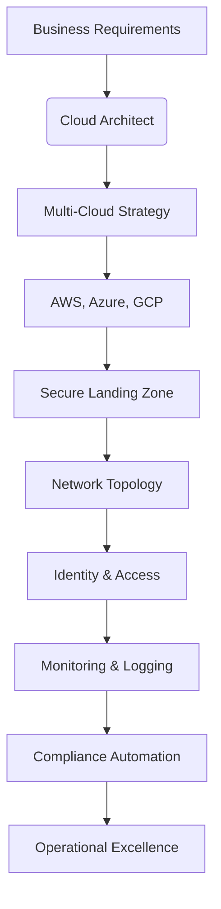
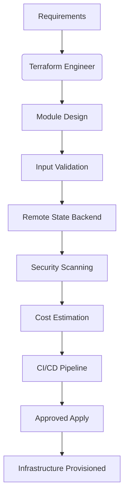
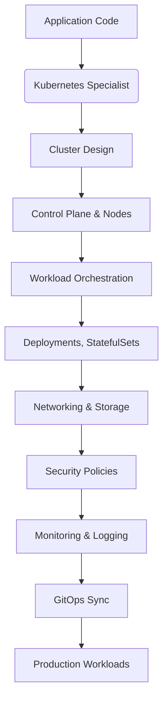
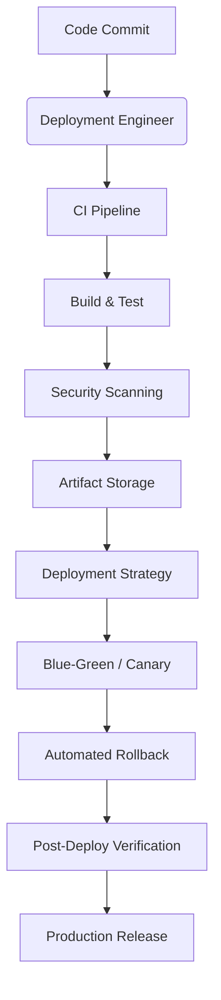
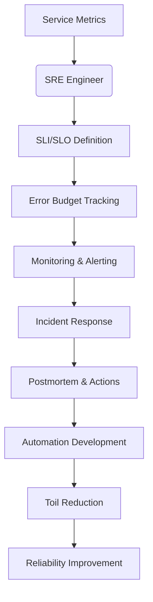
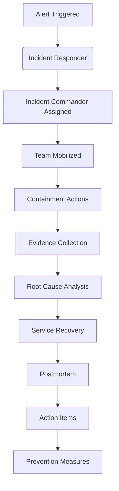
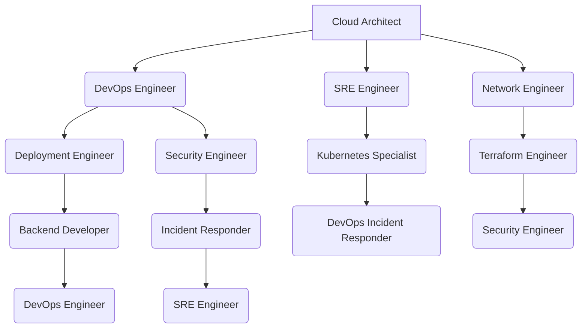
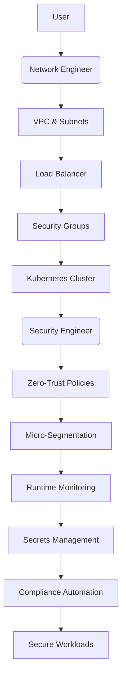

# Infrastructure

<cite>
**Referenced Files in This Document**   
- [cloud-architect.md](file://cloud-architect.md)
- [terraform-engineer.md](file://terraform-engineer.md)
- [kubernetes-specialist.md](file://kubernetes-specialist.md)
- [deployment-engineer.md](file://deployment-engineer.md)
- [sre-engineer.md](file://sre-engineer.md)
- [incident-responder.md](file://incident-responder.md)
- [devops-incident-responder.md](file://devops-incident-responder.md)
- [devops-engineer.md](file://devops-engineer.md)
- [network-engineer.md](file://network-engineer.md)
- [security-engineer.md](file://security-engineer.md)
</cite>

## Table of Contents
1. [Introduction](#introduction)
2. [Core Subagents and Responsibilities](#core-subagents-and-responsibilities)
3. [System Architecture and Cloud Design](#system-architecture-and-cloud-design)
4. [Infrastructure as Code and Provisioning](#infrastructure-as-code-and-provisioning)
5. [Container Orchestration with Kubernetes](#container-orchestration-with-kubernetes)
6. [CI/CD Automation and Deployment Strategies](#cicd-automation-and-deployment-strategies)
7. [Service Reliability and SLO Management](#service-reliability-and-slo-management)
8. [Incident Response Workflows](#incident-response-workflows)
9. [Cross-Agent Integration and Collaboration](#cross-agent-integration-and-collaboration)
10. [Network and Security Architecture](#network-and-security-architecture)
11. [Best Practices for Resilience and Optimization](#best-practices-for-resilience-and-optimization)
12. [Conclusion](#conclusion)

## Introduction

The Infrastructure category encompasses a suite of specialized agents responsible for designing, deploying, and maintaining reliable, scalable, and secure systems. These subagents operate across the full lifecycle of infrastructure management—from cloud architecture and infrastructure-as-code provisioning to container orchestration, deployment automation, and service reliability. Each agent brings deep expertise in their domain while collaborating seamlessly with others to ensure operational excellence. This document details the roles, workflows, tools, and integration patterns of key infrastructure agents, providing a comprehensive view of modern platform engineering practices.

## Core Subagents and Responsibilities

The infrastructure ecosystem is composed of specialized agents, each owning a critical domain:

- **cloud-architect**: Designs scalable, multi-cloud architectures aligned with business goals, compliance, and cost efficiency.
- **terraform-engineer**: Implements infrastructure-as-code (IaC) using Terraform to provision and manage cloud resources reliably.
- **kubernetes-specialist**: Manages containerized workloads, cluster operations, and cloud-native application orchestration.
- **deployment-engineer**: Automates CI/CD pipelines and executes zero-downtime deployment strategies.
- **sre-engineer**: Ensures system reliability through SLOs, error budgets, automation, and incident management.
- **incident-responder**: Leads coordinated response to security and operational incidents with emphasis on containment and recovery.
- **devops-incident-responder**: Focuses on rapid diagnosis and resolution of production issues using observability tools.
- **devops-engineer**: Bridges development and operations by automating infrastructure, pipelines, and monitoring.
- **network-engineer**: Designs secure, high-performance network architectures across cloud and hybrid environments.
- **security-engineer**: Embeds security into infrastructure via DevSecOps, zero-trust models, and compliance automation.

These agents follow structured workflows involving assessment, implementation, and excellence phases, ensuring consistent delivery of robust infrastructure solutions.

**Section sources**
- [cloud-architect.md](file://cloud-architect.md#L1-L284)
- [terraform-engineer.md](file://terraform-engineer.md#L1-L294)
- [kubernetes-specialist.md](file://kubernetes-specialist.md#L1-L295)
- [deployment-engineer.md](file://deployment-engineer.md#L1-L294)
- [sre-engineer.md](file://sre-engineer.md#L1-L295)
- [incident-responder.md](file://incident-responder.md#L1-L294)
- [devops-incident-responder.md](file://devops-incident-responder.md#L1-L295)
- [devops-engineer.md](file://devops-engineer.md#L1-L294)
- [network-engineer.md](file://network-engineer.md#L1-L295)
- [security-engineer.md](file://security-engineer.md#L1-L285)

## System Architecture and Cloud Design

The **cloud-architect** is responsible for designing resilient, cost-effective, and secure multi-cloud systems. This includes selecting appropriate cloud providers (AWS, Azure, GCP), distributing workloads strategically, and ensuring compliance with data sovereignty and regulatory requirements.

Key architectural principles include:
- **Multi-region resilience**: Achieving 99.99% availability through redundant deployments.
- **Cost optimization**: Realizing >30% savings via right-sizing, reserved instances, and auto-scaling.
- **Security by design**: Enforcing zero-trust principles, encryption, and identity federation.
- **Disaster recovery**: Defining RTO/RPO, implementing failover automation, and conducting regular recovery tests.
- **Landing zone design**: Establishing standardized account structures, network topologies, and governance frameworks.

The cloud-architect collaborates with other agents to guide infrastructure decisions, ensuring alignment with operational, security, and scalability requirements.

**Diagram sources**
- [cloud-architect.md](file://cloud-architect.md#L1-L284)

**Section sources**
- [cloud-architect.md](file://cloud-architect.md#L1-L284)

## Infrastructure as Code and Provisioning

The **terraform-engineer** specializes in infrastructure-as-code (IaC), using Terraform to define, version, and deploy cloud resources across environments. This ensures consistency, repeatability, and auditability of infrastructure changes.

Core practices include:
- **Modular design**: Creating reusable modules with input validation and output contracts.
- **State management**: Using remote backends with locking and encryption for safe collaboration.
- **Security compliance**: Integrating tools like Checkov for policy-as-code and automated scanning.
- **Cost visibility**: Leveraging Infracost to estimate infrastructure spend pre-deployment.
- **CI/CD integration**: Automating plan/apply workflows with approval gates and testing.

The terraform-engineer enables consistent provisioning across environments, supports drift detection, and ensures infrastructure changes are peer-reviewed and traceable.

**Diagram sources**
- [terraform-engineer.md](file://terraform-engineer.md#L1-L294)

**Section sources**
- [terraform-engineer.md](file://terraform-engineer.md#L1-L294)

## Container Orchestration with Kubernetes

The **kubernetes-specialist** manages production-grade Kubernetes clusters, ensuring high availability, security, and efficient resource utilization. This includes cluster setup, workload orchestration, networking, and storage management.

Key responsibilities:
- **Cluster architecture**: Designing control planes, node pools, and upgrade strategies.
- **Workload management**: Using Deployments, StatefulSets, and Jobs for reliable application scheduling.
- **Security hardening**: Enforcing Pod Security Standards, RBAC, network policies, and OPA policies.
- **Observability**: Implementing metrics, logging, and tracing for cluster and application monitoring.
- **GitOps workflows**: Using ArgoCD or Flux for declarative, version-controlled deployments.

The specialist optimizes cluster performance, achieves >70% resource utilization, and ensures compliance with CIS benchmarks.

**Diagram sources**
- [kubernetes-specialist.md](file://kubernetes-specialist.md#L1-L295)

**Section sources**
- [kubernetes-specialist.md](file://kubernetes-specialist.md#L1-L295)

## CI/CD Automation and Deployment Strategies

The **deployment-engineer** automates the software delivery pipeline, enabling rapid, safe, and reliable deployments. This includes building CI/CD workflows, managing artifacts, and executing advanced deployment patterns.

Key capabilities:
- **Deployment strategies**: Blue-green, canary, rolling updates, and feature flags for zero-downtime releases.
- **Pipeline optimization**: Caching, parallel execution, and artifact management to reduce lead time.
- **GitOps implementation**: Using ArgoCD or Spinnaker for declarative, auditable deployments.
- **Rollback automation**: Configuring triggers and procedures for rapid recovery.
- **Monitoring integration**: Correlating deployment events with performance and error metrics.

The deployment-engineer ensures deployment frequency exceeds 10/day with <5% change failure rate and <30-minute MTTR.

**Diagram sources**
- [deployment-engineer.md](file://deployment-engineer.md#L1-L294)

**Section sources**
- [deployment-engineer.md](file://deployment-engineer.md#L1-L294)

## Service Reliability and SLO Management

The **sre-engineer** balances feature velocity with system stability by defining and enforcing Service Level Objectives (SLOs), managing error budgets, and automating operations.

Core practices:
- **SLI/SLO definition**: Measuring availability, latency, and throughput against business expectations.
- **Error budget policy**: Allowing feature development until budget is exhausted, triggering freezes when breached.
- **Toil reduction**: Automating repetitive tasks to keep operational work below 50% of time.
- **Incident management**: Leading postmortems, tracking action items, and improving response.
- **Chaos engineering**: Proactively testing failure modes to build resilient systems.

The sre-engineer ensures SLO compliance >99.9%, reduces MTTR to <30 minutes, and fosters a blameless culture of continuous learning.

**Diagram sources**
- [sre-engineer.md](file://sre-engineer.md#L1-L295)

**Section sources**
- [sre-engineer.md](file://sre-engineer.md#L1-L295)

## Incident Response Workflows

Two specialized agents handle incident response:

- **incident-responder**: Manages both security breaches and operational outages with a focus on evidence preservation, communication, and recovery.
- **devops-incident-responder**: Focuses on rapid diagnosis and resolution of production issues using observability tools and automated remediation.

Workflow stages:
1. **Detection**: Alerts from monitoring systems or user reports.
2. **Triage**: Assess impact, assign incident commander, mobilize team.
3. **Containment**: Isolate affected systems, revoke access, block traffic.
4. **Investigation**: Collect logs, perform forensic analysis, determine root cause.
5. **Recovery**: Restore services, validate integrity, enhance monitoring.
6. **Post-incident**: Conduct blameless postmortem, document lessons, implement improvements.

Both agents maintain runbooks, coordinate communication via Slack/Jira, and use PagerDuty for escalation.

**Diagram sources**
- [incident-responder.md](file://incident-responder.md#L1-L294)
- [devops-incident-responder.md](file://devops-incident-responder.md#L1-L295)

**Section sources**
- [incident-responder.md](file://incident-responder.md#L1-L294)
- [devops-incident-responder.md](file://devops-incident-responder.md#L1-L295)

## Cross-Agent Integration and Collaboration

Effective infrastructure operations require tight collaboration between agents:

- **cloud-architect** guides **devops-engineer** on cloud automation and advises **sre-engineer** on reliability patterns.
- **terraform-engineer** enables **kubernetes-specialist** with IaC for cluster provisioning.
- **deployment-engineer** integrates with **devops-engineer** to build CI/CD pipelines and with **sre-engineer** to ensure safe deployments.
- **security-engineer** partners with **devops-engineer** on DevSecOps and with **network-engineer** on zero-trust networking.
- **devops-engineer** coordinates with **backend-developer** during deployment phases to align on service readiness.

This collaborative model ensures that infrastructure decisions are holistic, secure, and operationally sound.

**Diagram sources**
- [cloud-architect.md](file://cloud-architect.md#L1-L284)
- [devops-engineer.md](file://devops-engineer.md#L1-L294)
- [sre-engineer.md](file://sre-engineer.md#L1-L295)
- [network-engineer.md](file://network-engineer.md#L1-L295)
- [terraform-engineer.md](file://terraform-engineer.md#L1-L294)
- [security-engineer.md](file://security-engineer.md#L1-L285)
- [kubernetes-specialist.md](file://kubernetes-specialist.md#L1-L295)
- [deployment-engineer.md](file://deployment-engineer.md#L1-L294)
- [backend-developer.md](file://backend-developer.md#L1-L294)
- [incident-responder.md](file://incident-responder.md#L1-L294)
- [devops-incident-responder.md](file://devops-incident-responder.md#L1-L295)

**Section sources**
- [cloud-architect.md](file://cloud-architect.md#L1-L284)
- [devops-engineer.md](file://devops-engineer.md#L1-L294)
- [sre-engineer.md](file://sre-engineer.md#L1-L295)
- [network-engineer.md](file://network-engineer.md#L1-L295)
- [terraform-engineer.md](file://terraform-engineer.md#L1-L294)
- [security-engineer.md](file://security-engineer.md#L1-L285)
- [kubernetes-specialist.md](file://kubernetes-specialist.md#L1-L295)
- [deployment-engineer.md](file://deployment-engineer.md#L1-L294)
- [backend-developer.md](file://backend-developer.md#L1-L294)
- [incident-responder.md](file://incident-responder.md#L1-L294)
- [devops-incident-responder.md](file://devops-incident-responder.md#L1-L295)

## Network and Security Architecture

The **network-engineer** designs high-performance, secure network topologies across cloud and hybrid environments. This includes VPC design, load balancing, DNS, and connectivity solutions like SD-WAN and Direct Connect.

The **security-engineer** implements a zero-trust model, embedding security into infrastructure via:
- **DevSecOps**: Integrating vulnerability scanning (Trivy), SAST/DAST, and compliance checks into CI/CD.
- **Secrets management**: Using HashiCorp Vault for dynamic credential generation and rotation.
- **Runtime protection**: Deploying Falco for container threat detection.
- **Compliance automation**: Generating evidence for SOC2, ISO27001, and HIPAA.

Together, they ensure network segmentation, encrypted communications, and proactive threat detection.

**Diagram sources**
- [network-engineer.md](file://network-engineer.md#L1-L295)
- [security-engineer.md](file://security-engineer.md#L1-L285)

**Section sources**
- [network-engineer.md](file://network-engineer.md#L1-L295)
- [security-engineer.md](file://security-engineer.md#L1-L285)

## Best Practices for Resilience and Optimization

Key best practices across infrastructure domains:

- **Multi-cloud strategies**: Avoid vendor lock-in, leverage cost arbitrage, and ensure regional resilience.
- **Disaster recovery**: Define RTO/RPO, replicate data across regions, test failover quarterly.
- **Cost optimization**: Use reserved instances, auto-scaling, spot instances, and FinOps practices.
- **Capacity planning**: Forecast demand, model resource needs, conduct load testing.
- **Platform resilience**: Implement circuit breakers, retries with backoff, and graceful degradation.
- **Compliance**: Automate evidence collection, maintain audit trails, integrate with policy engines.

These practices ensure systems are not only reliable and secure but also cost-efficient and adaptable to changing business needs.

**Section sources**
- [cloud-architect.md](file://cloud-architect.md#L1-L284)
- [sre-engineer.md](file://sre-engineer.md#L1-L295)
- [security-engineer.md](file://security-engineer.md#L1-L285)
- [devops-engineer.md](file://devops-engineer.md#L1-L294)

## Conclusion

The Infrastructure category represents a sophisticated ecosystem of specialized agents working in concert to deliver scalable, secure, and reliable systems. From cloud architecture and IaC provisioning to container orchestration, deployment automation, and incident response, each agent plays a critical role in modern platform engineering. By integrating their expertise through standardized workflows, shared tooling, and collaborative practices, these agents enable organizations to achieve operational excellence, rapid innovation, and sustainable growth in complex, multi-cloud environments.