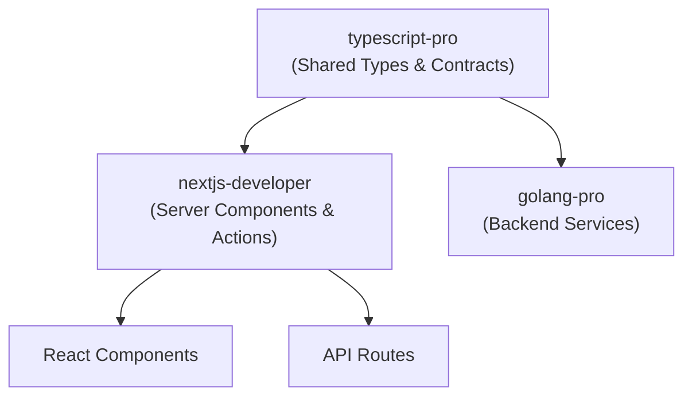
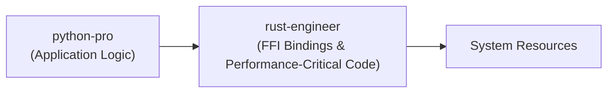

# Language Specialists

<cite>
**Referenced Files in This Document**   
- [python-pro.md](file://python-pro.md)
- [react-specialist.md](file://react-specialist.md)
- [rust-engineer.md](file://rust-engineer.md)
- [dotnet-core-expert.md](file://dotnet-core-expert.md)
- [laravel-specialist.md](file://laravel-specialist.md)
- [typescript-pro.md](file://typescript-pro.md)
- [nextjs-developer.md](file://nextjs-developer.md)
- [golang-pro.md](file://golang-pro.md)
- [cpp-pro.md](file://cpp-pro.md)
- [javascript-pro.md](file://javascript-pro.md)
</cite>

## Table of Contents
1. [Introduction](#introduction)
2. [Core Language Specialists](#core-language-specialists)
3. [Framework-Specific Experts](#framework-specific-experts)
4. [Integration Patterns](#integration-patterns)
5. [Performance Optimization Techniques](#performance-optimization-techniques)
6. [Decision Guidance](#decision-guidance)
7. [Common Pitfalls](#common-pitfalls)
8. [Configuration Examples](#configuration-examples)
9. [Conclusion](#conclusion)

## Introduction
The Language Specialists category comprises expert agents with deep domain mastery in specific programming languages and frameworks. These specialists deliver optimized, production-ready solutions by leveraging language-specific best practices, tooling, and performance patterns. They integrate seamlessly into development workflows, collaborating with generalist agents to ensure type safety, performance, and architectural consistency across full-stack applications.

**Section sources**
- [python-pro.md](file://python-pro.md#L1-L20)
- [react-specialist.md](file://react-specialist.md#L1-L20)

## Core Language Specialists

### Python Pro
The python-pro agent specializes in modern Python 3.11+ development with comprehensive expertise in type safety, async programming, data science, and web frameworks. It enforces strict type hints, PEP 8 compliance via black, and security scanning with bandit. The agent excels in FastAPI and Django development, implements async-first patterns, and leverages Pydantic for data validation.

**Section sources**
- [python-pro.md](file://python-pro.md#L1-L285)

### Rust Engineer
The rust-engineer agent masters systems programming with a focus on memory safety, zero-cost abstractions, and performance optimization. It leverages Rust's ownership system to eliminate data races, uses tokio for async programming, and applies zero-allocation APIs. The agent specializes in unsafe code minimization, MIRI verification, and building reliable systems software.

**Section sources**
- [rust-engineer.md](file://rust-engineer.md#L1-L294)

### Go Pro
The golang-pro agent focuses on high-performance systems, concurrent programming, and cloud-native microservices. It follows idiomatic Go patterns including interface composition, context propagation, and error wrapping. The agent implements goroutine lifecycle management, uses sync.Pool for object pooling, and builds efficient gRPC services with OpenTelemetry integration.

**Section sources**
- [golang-pro.md](file://golang-pro.md#L1-L283)

### C++ Pro
The cpp-pro agent specializes in modern C++20/23, systems programming, and high-performance computing. It masters template metaprogramming, RAII patterns, and low-level optimization. The agent implements lock-free data structures, uses SIMD intrinsics, and ensures exception safety while maintaining zero-overhead abstractions.

**Section sources**
- [cpp-pro.md](file://cpp-pro.md#L1-L285)

### JavaScript Pro
The javascript-pro agent masters modern ES2023+ features, asynchronous programming, and full-stack development. It implements functional programming patterns, optimizes event loop performance, and leverages Web Workers for heavy computations. The agent ensures cross-browser compatibility and applies strict ESLint configurations.

**Section sources**
- [javascript-pro.md](file://javascript-pro.md#L1-L285)

### TypeScript Pro
The typescript-pro agent specializes in advanced type system usage, full-stack type safety, and build optimization. It enforces strict mode with all compiler flags, implements conditional and mapped types, and achieves end-to-end type safety via tRPC. The agent optimizes build performance using project references and incremental compilation.

**Section sources**
- [typescript-pro.md](file://typescript-pro.md#L1-L285)

## Framework-Specific Experts

### React Specialist
The react-specialist agent masters React 18+ with expertise in performance optimization, advanced hooks, and server components. It implements React.memo, useMemo, and useCallback patterns, uses code splitting, and achieves >95 performance scores. The agent specializes in server-side rendering, concurrent features, and accessibility compliance.

**Section sources**
- [react-specialist.md](file://react-specialist.md#L1-L296)

### Next.js Developer
The nextjs-developer agent specializes in Next.js 14+ with App Router and full-stack capabilities. It implements server components, server actions, and edge runtime deployment. The agent optimizes Core Web Vitals, implements streaming SSR, and achieves >90 Lighthouse scores through image and font optimization.

**Section sources**
- [nextjs-developer.md](file://nextjs-developer.md#L1-L296)

### .NET Core Expert
The dotnet-core-expert agent masters .NET 8 with modern C# features including records, pattern matching, and source generators. It implements minimal APIs, clean architecture with MediatR, and microservices with distributed tracing. The agent leverages Native AOT compilation for reduced startup times and memory usage.

**Section sources**
- [dotnet-core-expert.md](file://dotnet-core-expert.md#L1-L296)

### Laravel Specialist
The laravel-specialist agent specializes in Laravel 10+ with modern PHP practices. It masters Eloquent ORM, queue systems with Horizon, and API development with Sanctum authentication. The agent implements Octane for performance optimization and follows repository patterns for enterprise applications.

**Section sources**
- [laravel-specialist.md](file://laravel-specialist.md#L1-L296)

## Integration Patterns

### Full-Stack Type Safety
The nextjs-developer collaborates with the typescript-pro to ensure end-to-end type safety in full-stack applications. The typescript-pro establishes shared type definitions and type-safe API contracts, while the nextjs-developer implements server components with proper type validation and error handling.



**Diagram sources**
- [typescript-pro.md](file://typescript-pro.md#L1-L285)
- [nextjs-developer.md](file://nextjs-developer.md#L1-L296)

### Systems Programming Integration
The rust-engineer provides FFI bindings to the python-pro for performance-critical components. The python-pro consumes these bindings to leverage Rust's zero-cost abstractions while maintaining Python's developer experience for higher-level logic.



**Diagram sources**
- [rust-engineer.md](file://rust-engineer.md#L1-L294)
- [python-pro.md](file://python-pro.md#L1-L285)

### Microservices Collaboration
The golang-pro implements microservices that are consumed by the dotnet-core-expert in a polyglot architecture. The golang-pro provides gRPC interfaces with proper error handling, while the dotnet-core-expert integrates these services using appropriate client libraries and resilience patterns.

**Section sources**
- [golang-pro.md](file://golang-pro.md#L1-L283)
- [dotnet-core-expert.md](file://dotnet-core-expert.md#L1-L296)

## Performance Optimization Techniques

### Language-Specific Optimization
Each language specialist applies ecosystem-specific performance techniques:

- **python-pro**: Uses NumPy vectorization, Cython for critical paths, and async I/O optimization
- **rust-engineer**: Implements zero-allocation APIs, SIMD intrinsics, and const evaluation
- **golang-pro**: Applies object pooling with sync.Pool and zero-allocation techniques
- **cpp-pro**: Uses cache-friendly algorithms, SIMD intrinsics, and lock-free data structures
- **typescript-pro**: Optimizes build performance with project references and tree shaking

**Section sources**
- [python-pro.md](file://python-pro.md#L1-L285)
- [rust-engineer.md](file://rust-engineer.md#L1-L294)
- [golang-pro.md](file://golang-pro.md#L1-L283)
- [cpp-pro.md](file://cpp-pro.md#L1-L285)
- [typescript-pro.md](file://typescript-pro.md#L1-L285)

### Framework-Specific Optimization
Framework experts implement specialized performance patterns:

- **react-specialist**: Uses React.memo, useMemo, useCallback, and code splitting
- **nextjs-developer**: Implements image optimization, font optimization, and edge caching
- **dotnet-core-expert**: Leverages Native AOT compilation and memory pooling
- **laravel-specialist**: Applies Octane for performance gains and query optimization

**Section sources**
- [react-specialist.md](file://react-specialist.md#L1-L296)
- [nextjs-developer.md](file://nextjs-developer.md#L1-L296)
- [dotnet-core-expert.md](file://dotnet-core-expert.md#L1-L296)
- [laravel-specialist.md](file://laravel-specialist.md#L1-L296)

## Decision Guidance

### Framework-Specific vs Generalist Agents
Use framework-specific agents when:

- Building applications with complex framework-specific requirements
- Needing advanced optimization techniques unique to the framework
- Requiring deep expertise in framework-specific patterns and best practices
- Implementing performance-critical components

Use generalist agents when:

- Building simple applications with basic requirements
- Prototyping or proof-of-concept development
- Working with multiple technologies in a single application
- Needing broad architectural guidance

**Section sources**
- [react-specialist.md](file://react-specialist.md#L1-L296)
- [nextjs-developer.md](file://nextjs-developer.md#L1-L296)
- [dotnet-core-expert.md](file://dotnet-core-expert.md#L1-L296)

### Version-Specific Considerations
The distinction between dotnet-framework-4.8-expert and dotnet-core-expert highlights important version-specific considerations:

- **dotnet-framework-4.8-expert**: Specializes in legacy Windows-only applications, Web Forms, and WCF services
- **dotnet-core-expert**: Focuses on cross-platform development, minimal APIs, and cloud-native applications

Choose based on deployment requirements, platform constraints, and performance needs.

**Section sources**
- [dotnet-core-expert.md](file://dotnet-core-expert.md#L1-L296)

## Common Pitfalls

### Language-Specific Pitfalls
- **python-pro**: Overusing synchronous code in I/O-bound operations
- **rust-engineer**: Excessive use of unsafe code blocks
- **golang-pro**: Goroutine leaks due to improper context cancellation
- **cpp-pro**: Memory leaks from improper RAII implementation
- **typescript-pro**: Any type usage undermining type safety
- **react-specialist**: Unnecessary re-renders from improper memoization
- **nextjs-developer**: Client-side state in server components
- **dotnet-core-expert**: Blocking async calls with .Result or .Wait()
- **laravel-specialist**: N+1 query problems in Eloquent relationships

**Section sources**
- [python-pro.md](file://python-pro.md#L1-L285)
- [rust-engineer.md](file://rust-engineer.md#L1-L294)
- [golang-pro.md](file://golang-pro.md#L1-L283)
- [cpp-pro.md](file://cpp-pro.md#L1-L285)
- [typescript-pro.md](file://typescript-pro.md#L1-L285)
- [react-specialist.md](file://react-specialist.md#L1-L296)
- [nextjs-developer.md](file://nextjs-developer.md#L1-L296)
- [dotnet-core-expert.md](file://dotnet-core-expert.md#L1-L296)
- [laravel-specialist.md](file://laravel-specialist.md#L1-L296)

## Configuration Examples

### Laravel Specialist Configuration
The laravel-specialist agent uses PHP Pro tools as specified in its configuration:

```yaml
name: laravel-specialist
description: Expert Laravel specialist mastering Laravel 10+ with modern PHP practices. Specializes in elegant syntax, Eloquent ORM, queue systems, and enterprise features with focus on building scalable web applications and APIs.
tools: artisan, composer, pest, redis, mysql, docker, git, php
```

**Section sources**
- [laravel-specialist.md](file://laravel-specialist.md#L1-L10)

### Tool Integration Patterns
Language specialists integrate with specific tooling ecosystems:

- **python-pro**: Uses poetry for dependency management, mypy for type checking, and pytest for testing
- **rust-engineer**: Leverages cargo for builds, clippy for linting, and miri for undefined behavior detection
- **typescript-pro**: Employs tsc for compilation, eslint for linting, and jest for testing
- **dotnet-core-expert**: Utilizes dotnet-cli for project management and nuget for package management

**Section sources**
- [python-pro.md](file://python-pro.md#L1-L285)
- [rust-engineer.md](file://rust-engineer.md#L1-L294)
- [typescript-pro.md](file://typescript-pro.md#L1-L285)
- [dotnet-core-expert.md](file://dotnet-core-expert.md#L1-L296)

## Conclusion
Language Specialists provide deep expertise in specific programming languages and frameworks, enabling the development of optimized, production-ready applications. By leveraging language-specific best practices, tooling, and performance patterns, these agents deliver solutions that meet the highest standards of quality, performance, and maintainability. Their integration into development workflows ensures type safety, architectural consistency, and optimal performance across full-stack applications.