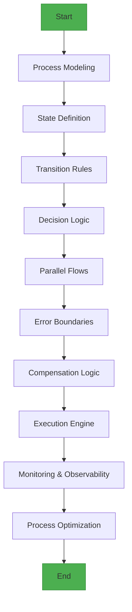
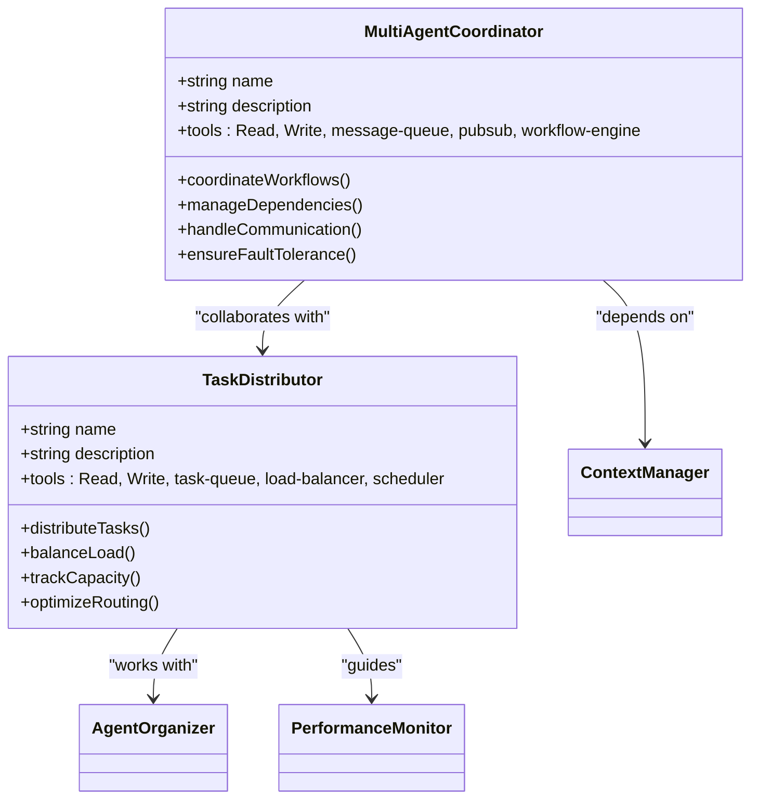
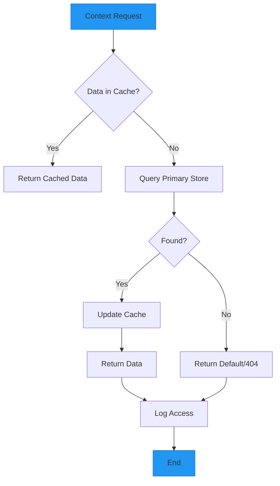
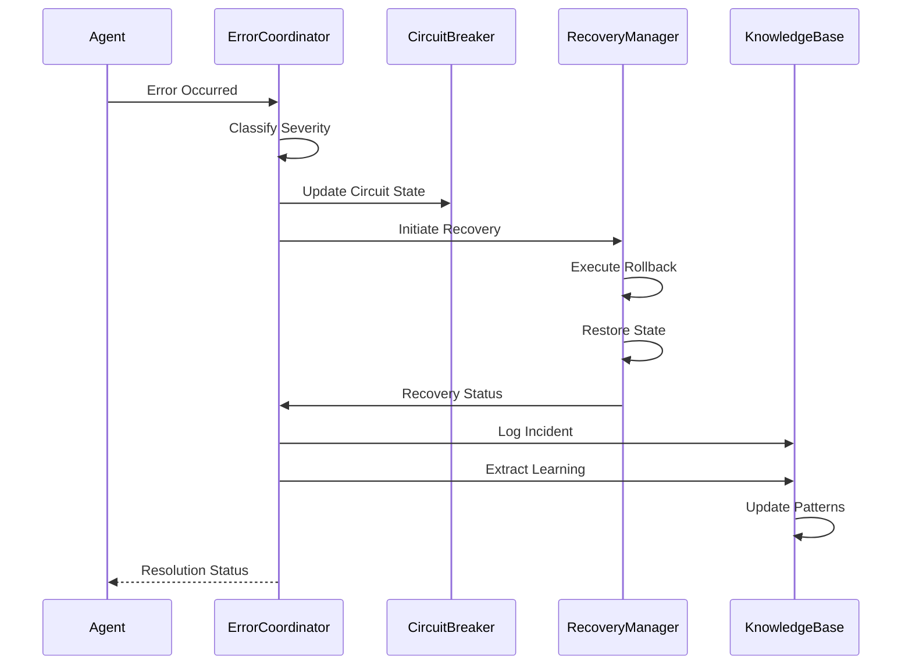
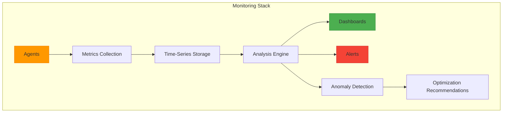
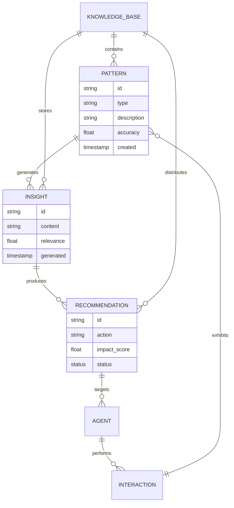

# Meta & Orchestration

<cite>
**Referenced Files in This Document**   
- [multi-agent-coordinator.md](file://multi-agent-coordinator.md)
- [task-distributor.md](file://task-distributor.md)
- [context-manager.md](file://context-manager.md)
- [error-coordinator.md](file://error-coordinator.md)
- [performance-monitor.md](file://performance-monitor.md)
- [workflow-orchestrator.md](file://workflow-orchestrator.md)
- [agent-organizer.md](file://agent-organizer.md)
- [knowledge-synthesizer.md](file://knowledge-synthesizer.md)
</cite>

## Table of Contents
1. [Introduction](#introduction)
2. [Core Orchestration Components](#core-orchestration-components)
3. [Workflow Orchestration and Execution](#workflow-orchestration-and-execution)
4. [Agent Coordination and Task Distribution](#agent-coordination-and-task-distribution)
5. [State and Context Management](#state-and-context-management)
6. [Error Handling and System Resilience](#error-handling-and-system-resilience)
7. [Performance Monitoring and Optimization](#performance-monitoring-and-optimization)
8. [Knowledge Synthesis and Collective Intelligence](#knowledge-synthesis-and-collective-intelligence)
9. [Integration with MCP Tools](#integration-with-mcp-tools)
10. [Best Practices for Multi-Agent Systems](#best-practices-for-multi-agent-systems)
11. [Conclusion](#conclusion)

## Introduction

The Meta & Orchestration category encompasses a suite of specialized agents designed to coordinate, optimize, and manage complex multi-agent workflows. These agents work in concert to ensure efficient task execution, maintain system resilience, and enable intelligent decision-making across distributed environments. This document details the architecture and functionality of key orchestration components including multi-agent-coordinator, task-distributor, context-manager, error-coordinator, performance-monitor, workflow-orchestrator, agent-organizer, and knowledge-synthesizer. Each agent plays a critical role in maintaining system-wide coordination, ensuring fault tolerance, and enabling dynamic adaptation based on real-time conditions and historical insights.

## Core Orchestration Components

The orchestration framework is built upon eight core agents that provide specialized coordination capabilities. The multi-agent-coordinator manages complex workflow orchestration and inter-agent communication, while the task-distributor handles intelligent work allocation based on agent expertise and current load. The context-manager maintains shared state across the system, ensuring consistency and accessibility of contextual information. For resilience, the error-coordinator handles failures and recovery procedures, while the performance-monitor tracks agent efficiency and system health. The workflow-orchestrator manages execution sequences and process automation, the agent-organizer maintains the agent registry and team composition, and the knowledge-synthesizer aggregates insights from multiple agents to enable collective intelligence and continuous improvement.

**Section sources**
- [multi-agent-coordinator.md](file://multi-agent-coordinator.md#L1-L293)
- [task-distributor.md](file://task-distributor.md#L1-L293)
- [context-manager.md](file://context-manager.md#L1-L293)
- [error-coordinator.md](file://error-coordinator.md#L1-L292)
- [performance-monitor.md](file://performance-monitor.md#L1-L293)
- [workflow-orchestrator.md](file://workflow-orchestrator.md#L1-L293)
- [agent-organizer.md](file://agent-organizer.md#L1-L293)
- [knowledge-synthesizer.md](file://knowledge-synthesizer.md#L1-L292)

## Workflow Orchestration and Execution

The workflow-orchestrator specializes in designing and executing complex business processes through robust workflow patterns, state machine implementation, and transaction management. It ensures reliable execution of workflows by maintaining state consistency, implementing compensation logic for error recovery, and supporting dynamic modifications to running processes. The orchestrator handles various process patterns including sequential flows, parallel splits, exclusive choices, loops, and event-based gateways, while providing comprehensive monitoring and observability through detailed metrics and audit trails.

**Diagram sources**
- [workflow-orchestrator.md](file://workflow-orchestrator.md#L1-L293)

**Section sources**
- [workflow-orchestrator.md](file://workflow-orchestrator.md#L1-L293)

## Agent Coordination and Task Distribution

The multi-agent-coordinator and task-distributor work in tandem to manage agent interactions and workload allocation. The coordinator focuses on high-level orchestration, managing inter-agent communication, dependency graphs, and parallel execution control, while ensuring coordination overhead remains below 5%. The task-distributor specializes in intelligent work allocation, using priority scheduling, load balancing algorithms, and capacity tracking to distribute tasks efficiently across available agents. Together, they implement various coordination patterns including master-worker, peer-to-peer, publish-subscribe, and scatter-gather, while maintaining fairness and optimizing resource utilization.

**Diagram sources**
- [multi-agent-coordinator.md](file://multi-agent-coordinator.md#L1-L293)
- [task-distributor.md](file://task-distributor.md#L1-L293)

**Section sources**
- [multi-agent-coordinator.md](file://multi-agent-coordinator.md#L1-L293)
- [task-distributor.md](file://task-distributor.md#L1-L293)

## State and Context Management

The context-manager provides centralized information storage, retrieval, and synchronization across the multi-agent system. It ensures data consistency, fast access, and secure storage through a combination of Redis for in-memory caching, Elasticsearch for full-text search, and vector databases for semantic storage. The context-manager implements sophisticated synchronization protocols to maintain state consistency across distributed agents, handling conflict detection, resolution strategies, and version control. It supports various context types including project metadata, agent interactions, task history, decision logs, and performance metrics, organized through hierarchical, tag-based, and time-series storage patterns.

**Diagram sources**
- [context-manager.md](file://context-manager.md#L1-L293)

**Section sources**
- [context-manager.md](file://context-manager.md#L1-L293)

## Error Handling and System Resilience

The error-coordinator provides comprehensive distributed error handling, failure recovery, and system resilience capabilities. It implements circuit breaker patterns, bulkhead isolation, and timeout management to prevent cascading failures, while coordinating automated recovery flows and state restoration procedures. The coordinator aggregates and classifies errors from across the system, performing cross-agent correlation to identify root causes and impact chains. It maintains a learning system that captures insights from failures, updates runbooks, and continuously improves recovery effectiveness through pattern recognition and system hardening.

**Diagram sources**
- [error-coordinator.md](file://error-coordinator.md#L1-L292)

**Section sources**
- [error-coordinator.md](file://error-coordinator.md#L1-L292)

## Performance Monitoring and Optimization

The performance-monitor delivers system-wide metrics collection, analysis, and optimization through real-time monitoring, anomaly detection, and actionable insights. It collects over 2,800 metrics across the agent ecosystem with sub-second latency, creating comprehensive dashboards that visualize KPIs, service maps, and performance trends. The monitor implements advanced analytics including predictive monitoring, capacity forecasting, and failure prediction, while maintaining low overhead (<2% resource consumption). It integrates with alerting systems to detect anomalies within five minutes and provides optimization recommendations for performance tuning, resource allocation, and cost reduction.

**Diagram sources**
- [performance-monitor.md](file://performance-monitor.md#L1-L293)

**Section sources**
- [performance-monitor.md](file://performance-monitor.md#L1-L293)

## Knowledge Synthesis and Collective Intelligence

The knowledge-synthesizer extracts insights from multi-agent interactions, identifies patterns, and builds collective intelligence across the system. It analyzes workflows, outcomes, and collaborations to identify best practices, failure patterns, and optimization opportunities, storing this knowledge in a graph database enhanced with vector embeddings for semantic search. The synthesizer generates actionable recommendations that improve system performance by up to 23%, distributing learning to all agents through automated updates and training materials. It implements continuous learning mechanisms including supervised learning, unsupervised discovery, and reinforcement learning to evolve the knowledge base over time.

**Diagram sources**
- [knowledge-synthesizer.md](file://knowledge-synthesizer.md#L1-L292)

**Section sources**
- [knowledge-synthesizer.md](file://knowledge-synthesizer.md#L1-L292)

## Integration with MCP Tools

All orchestration agents integrate with the MCP (Multi-agent Coordination Platform) tool suite to enhance their coordination capabilities. The multi-agent-coordinator leverages message-queue and pubsub for asynchronous communication, while the task-distributor uses load-balancer and scheduler for intelligent routing. The context-manager utilizes Redis, Elasticsearch, and vector-db for state persistence, and the error-coordinator integrates with Sentry and PagerDuty for incident management. Performance-monitor employs Prometheus, Grafana, and Datadog for comprehensive observability, while the knowledge-synthesizer uses NLP tools and ML pipelines for advanced pattern recognition. These integrations enable seamless interoperability and data exchange across the orchestration ecosystem.

**Section sources**
- [multi-agent-coordinator.md](file://multi-agent-coordinator.md#L1-L293)
- [task-distributor.md](file://task-distributor.md#L1-L293)
- [context-manager.md](file://context-manager.md#L1-L293)
- [error-coordinator.md](file://error-coordinator.md#L1-L292)
- [performance-monitor.md](file://performance-monitor.md#L1-L293)
- [knowledge-synthesizer.md](file://knowledge-synthesizer.md#L1-L292)

## Best Practices for Multi-Agent Systems

Effective multi-agent systems require careful attention to scalability, fault tolerance, and coordination protocols. Key best practices include implementing dynamic agent selection based on task requirements and real-time performance metrics, using load balancing to distribute work evenly across agents, and designing for fault tolerance with automated recovery and state persistence. To avoid deadlocks, systems should implement timeout mechanisms, circuit breakers, and proper resource locking strategies. Context propagation must be consistent across agent boundaries, with version control and audit trails for critical state changes. Regular performance monitoring and knowledge synthesis enable continuous optimization and adaptation to changing workloads and requirements.

**Section sources**
- [multi-agent-coordinator.md](file://multi-agent-coordinator.md#L1-L293)
- [task-distributor.md](file://task-distributor.md#L1-L293)
- [error-coordinator.md](file://error-coordinator.md#L1-L292)
- [performance-monitor.md](file://performance-monitor.md#L1-L293)
- [knowledge-synthesizer.md](file://knowledge-synthesizer.md#L1-L292)

## Conclusion

The Meta & Orchestration framework provides a comprehensive solution for managing complex multi-agent systems through specialized coordination, optimization, and management capabilities. By leveraging the complementary strengths of multi-agent-coordinator, task-distributor, context-manager, error-coordinator, performance-monitor, workflow-orchestrator, agent-organizer, and knowledge-synthesizer, organizations can build resilient, efficient, and intelligent distributed systems. These agents work together to ensure seamless collaboration, maintain system health, and enable continuous improvement through collective learning. When combined with MCP tool integrations and adherence to best practices, this orchestration framework delivers exceptional performance, reliability, and adaptability in dynamic multi-agent environments.