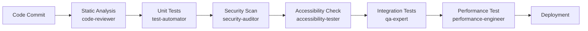
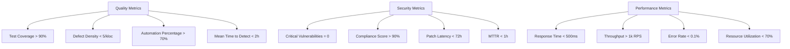

# Quality & Security

<cite>
**Referenced Files in This Document**   
- [qa-expert.md](file://qa-expert.md)
- [test-automator.md](file://test-automator.md)
- [accessibility-tester.md](file://accessibility-tester.md)
- [code-reviewer.md](file://code-reviewer.md)
- [architect-reviewer.md](file://architect-reviewer.md)
- [penetration-tester.md](file://penetration-tester.md)
- [security-auditor.md](file://security-auditor.md)
- [performance-engineer.md](file://performance-engineer.md)
- [chaos-engineer.md](file://chaos-engineer.md)
- [debugger.md](file://debugger.md)
- [error-detective.md](file://error-detective.md)
</cite>

## Table of Contents
1. [Introduction](#introduction)
2. [Core Quality Agents](#core-quality-agents)
3. [Security & Compliance Agents](#security--compliance-agents)
4. [Performance & Resilience Engineering](#performance--resilience-engineering)
5. [Integration & Collaboration](#integration--collaboration)
6. [Testing Pipelines & CI/CD Integration](#testing-pipelines--cicd-integration)
7. [Common Anti-Patterns & Mitigation](#common-anti-patterns--mitigation)
8. [Quality & Security Metrics](#quality--security-metrics)
9. [Conclusion](#conclusion)

## Introduction

The Quality & Security category encompasses a comprehensive suite of AI subagents dedicated to ensuring software excellence, functional correctness, and system integrity. These specialized agents operate across the development lifecycle to enforce quality standards, prevent defects, validate architectural soundness, and safeguard against vulnerabilities. By leveraging domain-specific expertise and integrated tooling, these subagents enable systematic testing, continuous validation, and proactive risk mitigation. This document details the roles, workflows, and integration points of key agents responsible for maintaining high software health standards.

## Core Quality Agents

### QA Expert: Strategic Test Planning

The **qa-expert** agent serves as the central authority for quality assurance strategy, test planning, and quality metrics oversight. It orchestrates comprehensive testing initiatives by analyzing requirements, assessing risks, and designing test approaches aligned with business objectives. The agent ensures test coverage exceeds 90%, maintains zero critical defects, and drives automation adoption above 70%. It coordinates with other quality agents to establish exit criteria, manage test environments, and verify release readiness through systematic test execution and defect tracking.

**Section sources**
- [qa-expert.md](file://qa-expert.md#L1-L300)

### Test Automator: Automated Test Suite Development

The **test-automator** agent specializes in building robust, maintainable test automation frameworks across UI, API, mobile, and performance domains. It implements page object models, data-driven testing, and CI/CD integration to achieve fast feedback loops. With execution times under 30 minutes and flaky tests controlled below 1%, the agent enables daily deployments by reducing regression cycles from days to minutes. It collaborates with developers to ensure testability and maintains high ROI through efficient, scalable automation.

**Section sources**
- [test-automator.md](file://test-automator.md#L1-L300)

### Accessibility Tester: WCAG Compliance Verification

The **accessibility-tester** agent ensures digital experiences meet WCAG 2.1 Level AA standards through systematic evaluation of screen reader compatibility, keyboard navigation, color contrast, and cognitive accessibility. Using tools like axe, WAVE, and Lighthouse, it identifies and remediates violations related to ARIA implementation, form accessibility, and mobile interaction patterns. The agent conducts user testing with assistive technologies and delivers accessibility statements to certify compliance.

**Section sources**
- [accessibility-tester.md](file://accessibility-tester.md#L1-L285)

## Security & Compliance Agents

### Code Reviewer: Static Analysis & Code Quality

The **code-reviewer** agent performs in-depth static analysis to identify security vulnerabilities, code smells, and performance bottlenecks. It enforces coding standards, checks for input validation, authentication flaws, and cryptographic weaknesses using tools like ESLint, SonarQube, and Semgrep. With a focus on cyclomatic complexity below 10 and zero critical security issues, the agent provides actionable feedback on test coverage, documentation quality, and dependency risks.

**Section sources**
- [code-reviewer.md](file://code-reviewer.md#L1-L295)

### Architect Reviewer: Design Pattern Validation

The **architect-reviewer** agent evaluates system designs against architectural best practices, scalability requirements, and long-term maintainability. It assesses microservices boundaries, event-driven patterns, and technology stack appropriateness while identifying architectural debt. Using tools like PlantUML and Structurizr, it validates component cohesion, integration strategies, and evolution paths to ensure systems remain adaptable and resilient.

**Section sources**
- [architect-reviewer.md](file://architect-reviewer.md#L1-L293)

### Penetration Tester: Vulnerability Assessment

The **penetration-tester** agent conducts ethical hacking exercises to identify exploitable vulnerabilities across networks, web applications, APIs, and cloud infrastructure. Following a structured methodology, it performs reconnaissance, validates OWASP Top 10 risks, and safely exploits weaknesses using tools like Burp Suite, Metasploit, and SQLMap. The agent delivers proof-of-concept demonstrations and prioritized remediation plans to reduce attack surface.

**Section sources**
- [penetration-tester.md](file://penetration-tester.md#L1-L297)

### Security Auditor: Compliance Checks

The **security-auditor** agent performs comprehensive compliance validation against frameworks like SOC 2, ISO 27001, HIPAA, and PCI DSS. It audits access controls, data encryption, incident response plans, and third-party security using automated scanners like Nessus, Qualys, and Prowler. The agent documents findings, assesses risk exposure, and provides roadmaps to achieve full regulatory adherence.

**Section sources**
- [security-auditor.md](file://security-auditor.md#L1-L296)

## Performance & Resilience Engineering

### Performance Engineer: Bottleneck Identification

The **performance-engineer** agent identifies and eliminates performance bottlenecks through systematic profiling, load testing, and optimization. Using tools like JMeter, Gatling, and Prometheus, it measures response times, throughput, and resource utilization under various load conditions. The agent implements caching strategies, query optimizations, and infrastructure tuning to achieve SLA compliance and cost-efficient scaling.

**Section sources**
- [performance-engineer.md](file://performance-engineer.md#L1-L298)

### Chaos Engineer: System Resilience Testing

The **chaos-engineer** agent builds antifragile systems by conducting controlled failure injection experiments. It tests infrastructure resilience, application fault tolerance, and recovery procedures using tools like ChaosToolkit and Gremlin. By simulating server outages, network partitions, and dependency failures, the agent validates rollback mechanisms, improves MTTR, and establishes confidence in system behavior under stress.

**Section sources**
- [chaos-engineer.md](file://chaos-engineer.md#L1-L284)

## Integration & Collaboration

### Debugger & Backend Developer Collaboration

The **debugger** agent collaborates with **backend-developer** to diagnose and resolve complex issues by analyzing stack traces, reproducing bugs, and suggesting fixes. It integrates with error tracking systems to prioritize critical defects and ensures root cause analysis is performed for recurring problems.

**Section sources**
- [debugger.md](file://debugger.md#L1-L250)

### Error Detective: Log Analysis

The **error-detective** agent analyzes application logs, monitoring data, and telemetry to identify error patterns, performance degradation, and security anomalies. It correlates events across services to detect systemic issues and provides contextual insights for rapid resolution.

**Section sources**
- [error-detective.md](file://error-detective.md#L1-L240)

## Testing Pipelines & CI/CD Integration

### Automated Testing Pipeline

**Diagram sources**
- [test-automator.md](file://test-automator.md#L1-L300)
- [security-auditor.md](file://security-auditor.md#L1-L296)
- [accessibility-tester.md](file://accessibility-tester.md#L1-L285)

### Security Scanning in CI/CD

Security checks are integrated throughout the pipeline:
- Pre-commit: Static analysis with Semgrep
- Build: Dependency scanning with Snyk
- Test: Dynamic scanning with Burp Suite
- Deploy: Configuration audit with Prowler
- Runtime: Continuous monitoring with Datadog

**Section sources**
- [penetration-tester.md](file://penetration-tester.md#L1-L297)
- [security-auditor.md](file://security-auditor.md#L1-L296)

### Accessibility Audit Process

The accessibility audit follows a three-phase approach:
1. **Automated Scan**: axe and Lighthouse identify technical violations
2. **Manual Verification**: Keyboard navigation and screen reader testing
3. **User Validation**: Testing with assistive technology users

**Section sources**
- [accessibility-tester.md](file://accessibility-tester.md#L1-L285)

## Common Anti-Patterns & Mitigation

### Quality Anti-Patterns

| Anti-Pattern | Risk | Mitigation Strategy |
|-------------|------|---------------------|
| Manual-only testing | Slow feedback, human error | Implement test-automator with CI/CD |
| Accessibility as afterthought | Legal risk, poor UX | Integrate accessibility-tester early |
| Security testing at end | Critical vulnerabilities missed | Shift-left with penetration-tester |
| No performance baselines | Degradation undetected | Establish metrics with performance-engineer |
| Monolithic architecture | Poor scalability | Validate design with architect-reviewer |

**Section sources**
- [qa-expert.md](file://qa-expert.md#L1-L300)
- [architect-reviewer.md](file://architect-reviewer.md#L1-L293)

## Quality & Security Metrics

### Key Performance Indicators

**Diagram sources**
- [qa-expert.md](file://qa-expert.md#L1-L300)
- [security-auditor.md](file://security-auditor.md#L1-L296)
- [performance-engineer.md](file://performance-engineer.md#L1-L298)

### Software Health Dashboard

A comprehensive dashboard tracks:
- **Quality Score**: Aggregated metric from test coverage, defect trends, and automation
- **Security Posture**: Vulnerability count, compliance status, patching velocity
- **Performance Health**: Response times, error rates, resource efficiency
- **Resilience Index**: MTTR, experiment coverage, failure recovery rate

These metrics provide real-time visibility into software health and guide improvement initiatives.

**Section sources**
- [qa-expert.md](file://qa-expert.md#L1-L300)
- [performance-engineer.md](file://performance-engineer.md#L1-L298)
- [chaos-engineer.md](file://chaos-engineer.md#L1-L284)

## Conclusion

The Quality & Security agent ecosystem provides a holistic approach to software excellence through specialized, coordinated subagents. From strategic test planning with qa-expert to resilience validation with chaos-engineer, each agent contributes unique expertise to ensure functional correctness, accessibility, security, and performance. By integrating these agents into development workflows and CI/CD pipelines, organizations can achieve high software health standards, reduce technical debt, and deliver reliable, secure applications. The collaborative nature of these agents—where code-reviewer informs qa-expert, and security-auditor guides penetration-tester—creates a synergistic quality assurance framework that evolves with the system it protects.