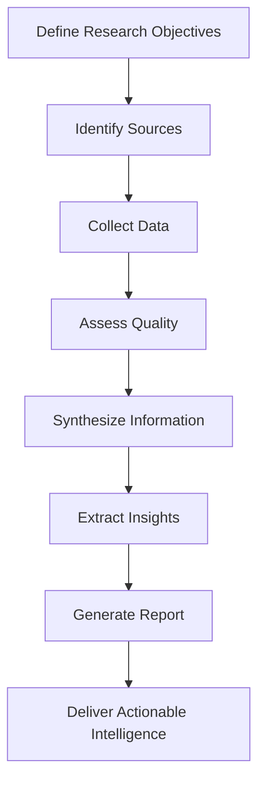
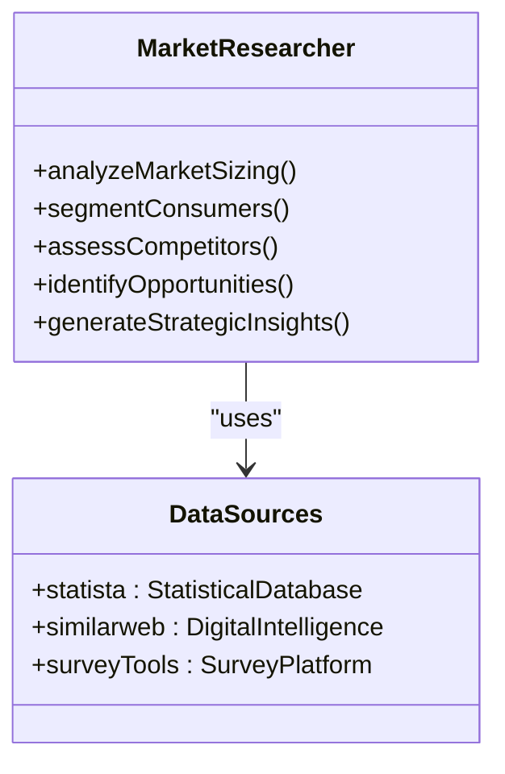
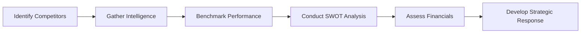
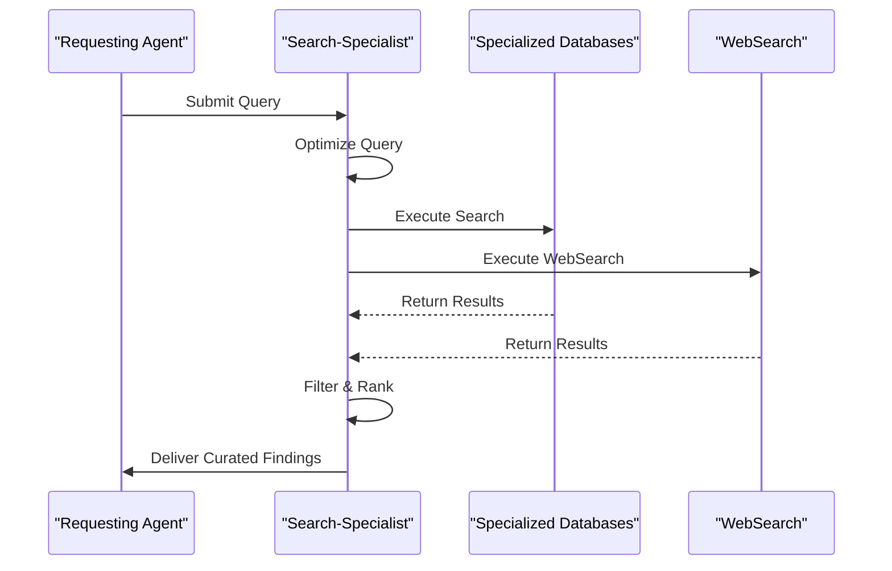
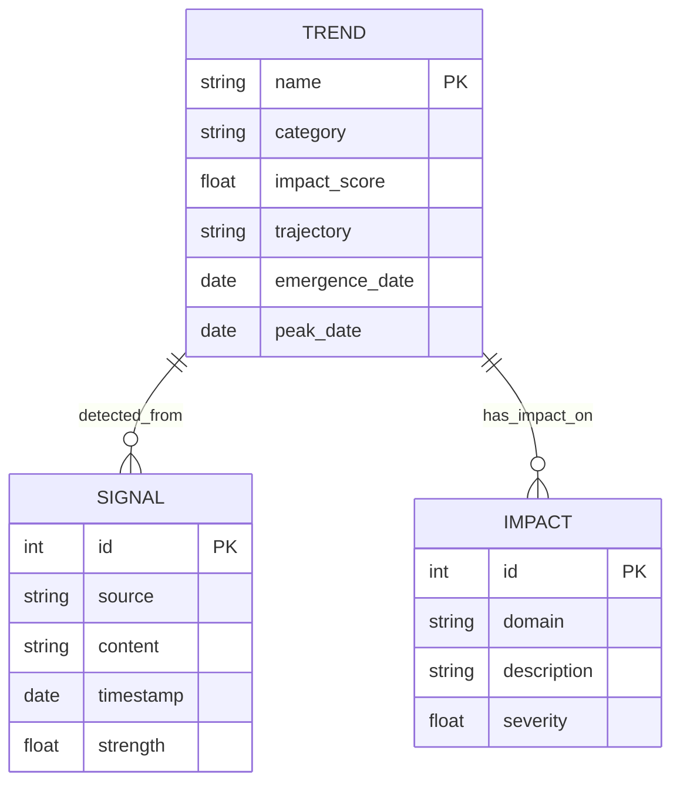
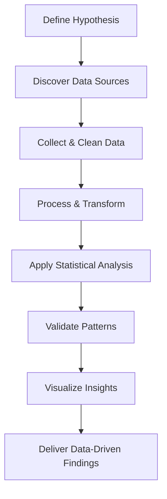
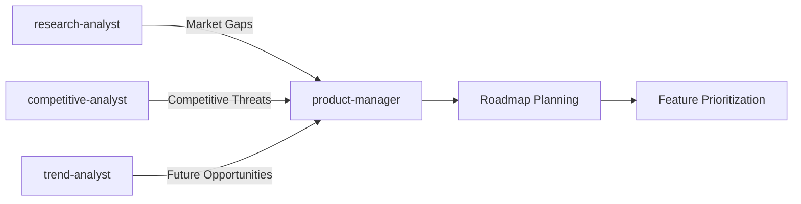
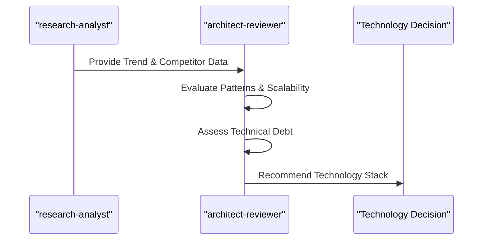

# Research & Analysis

<cite>
**Referenced Files in This Document**   
- [research-analyst.md](file://research-analyst.md)
- [market-researcher.md](file://market-researcher.md)
- [competitive-analyst.md](file://competitive-analyst.md)
- [search-specialist.md](file://search-specialist.md)
- [trend-analyst.md](file://trend-analyst.md)
- [data-researcher.md](file://data-researcher.md)
- [product-manager.md](file://product-manager.md)
- [architect-reviewer.md](file://architect-reviewer.md)
</cite>

## Table of Contents
1. [Introduction](#introduction)
2. [Core Research Agents](#core-research-agents)
3. [Research Methodologies and Data Sourcing](#research-methodologies-and-data-sourcing)
4. [Integration with Strategic Roles](#integration-with-strategic-roles)
5. [Output Frameworks and Decision Support](#output-frameworks-and-decision-support)
6. [Bias Mitigation and Quality Assurance](#bias-mitigation-and-quality-assurance)
7. [Conclusion](#conclusion)

## Introduction

The Research & Analysis category encompasses a suite of specialized agents designed to gather, analyze, and synthesize information for strategic decision-making. These agents support innovation, competitive positioning, and evidence-based development by transforming raw data into actionable insights. This document details the roles of research-analyst, market-researcher, competitive-analyst, search-specialist, trend-analyst, and data-researcher, along with their integration with product-manager and architect-reviewer to guide product evolution and technology strategy.

**Section sources**
- [research-analyst.md](file://research-analyst.md#L1-L20)
- [market-researcher.md](file://market-researcher.md#L1-L20)

## Core Research Agents

### Research-Analyst: Technical Investigations and Insight Synthesis

The research-analyst conducts comprehensive investigations using systematic methodologies to gather and synthesize information. It verifies information accuracy, evaluates source credibility, and minimizes bias while generating strategic insights. The agent follows a structured workflow: objective definition, source identification, data collection, quality assessment, synthesis, and report generation.

Key capabilities include qualitative and quantitative analysis, pattern recognition, and narrative construction. The research-analyst delivers executive summaries, detailed findings, and actionable recommendations supported by data visualization and rigorous documentation.

**Diagram sources**
- [research-analyst.md](file://research-analyst.md#L30-L60)

**Section sources**
- [research-analyst.md](file://research-analyst.md#L1-L293)

### Market-Researcher: Industry Trends and Consumer Insights

The market-researcher specializes in market dynamics, consumer behavior, and competitive landscapes. It analyzes market sizing, growth projections, segmentation, and pricing strategies to identify opportunities and inform business decisions. Using tools like statista and similarweb, it gathers authoritative data on consumer trends and digital market intelligence.

The agent employs both primary (surveys, interviews) and secondary research methods to validate trends and quantify ROI potential. It delivers strategic insights such as market entry strategies, positioning recommendations, and investment priorities.

**Diagram sources**
- [market-researcher.md](file://market-researcher.md#L25-L45)

**Section sources**
- [market-researcher.md](file://market-researcher.md#L1-L295)

### Competitive-Analyst: Rival Solution Evaluation

The competitive-analyst focuses on gathering and analyzing competitor intelligence to inform strategic positioning. It identifies direct and indirect competitors, analyzes their business models, product features, pricing, and marketing tactics using tools like semrush and crunchbase.

The agent conducts SWOT analysis, competitive benchmarking, and financial performance comparisons. It delivers strategic recommendations such as differentiation strategies, attack/defense plans, and innovation priorities to gain market share.

**Diagram sources**
- [competitive-analyst.md](file://competitive-analyst.md#L25-L45)

**Section sources**
- [competitive-analyst.md](file://competitive-analyst.md#L1-L295)

### Search-Specialist: Information Retrieval and Discovery

The search-specialist excels in advanced information retrieval across diverse sources, including academic databases, patent filings, and specialized repositories. It optimizes queries using Boolean logic, semantic search, and faceted filtering to achieve high precision (>90%) and recall.

Using tools like elasticsearch and google-scholar, it executes systematic, iterative searches and curates results by relevance, credibility, and value. The agent reduces research time significantly while uncovering critical, previously unknown sources.

**Diagram sources**
- [search-specialist.md](file://search-specialist.md#L25-L45)

**Section sources**
- [search-specialist.md](file://search-specialist.md#L1-L295)

### Trend-Analyst: Technology Adoption Forecasting

The trend-analyst detects emerging patterns and forecasts future developments using social listening, search trends, and predictive modeling. It analyzes weak signals, tipping points, and convergence patterns across technology, consumer behavior, and industry transformation.

Using google-trends and data-visualization tools, it creates scenario plans, impact matrices, and timeline projections. The agent delivers foresight on first-mover opportunities, disruption risks, and capability requirements.

**Diagram sources**
- [trend-analyst.md](file://trend-analyst.md#L25-L45)

**Section sources**
- [trend-analyst.md](file://trend-analyst.md#L1-L294)

### Data-Researcher: Hypothesis Validation with Empirical Data

The data-researcher validates hypotheses by collecting and analyzing empirical data from APIs, databases, and web sources. Using python, pandas, and sql, it processes large datasets (millions of records), performs statistical analysis, and identifies significant patterns with high confidence intervals.

The agent ensures data quality through completeness checks, outlier detection, and missing data handling. It generates predictive models and interactive dashboards to support real-time decision-making.

**Diagram sources**
- [data-researcher.md](file://data-researcher.md#L25-L45)

**Section sources**
- [data-researcher.md](file://data-researcher.md#L1-L295)

## Research Methodologies and Data Sourcing

Each research agent follows a structured methodology tailored to its domain:

- **research-analyst**: Mixed-method synthesis combining qualitative and quantitative data
- **market-researcher**: Multi-source validation with statistical rigor
- **competitive-analyst**: Systematic intelligence gathering with ethical standards
- **search-specialist**: Iterative refinement with precision targeting
- **trend-analyst**: Systems thinking with cross-impact analysis
- **data-researcher**: Hypothesis-driven analysis with reproducible methods

Data sourcing strategies include:
- Primary research (surveys, interviews)
- Secondary sources (industry reports, academic papers)
- Web and API data (WebSearch, WebFetch, api-tools)
- Specialized databases (statista, crunchbase, google-scholar)
- Real-time streams (social-listening, analytics)

**Section sources**
- [research-analyst.md](file://research-analyst.md#L65-L100)
- [market-researcher.md](file://market-researcher.md#L50-L80)
- [data-researcher.md](file://data-researcher.md#L50-L80)

## Integration with Strategic Roles

### Collaboration with Product-Manager for Roadmap Planning

The research agents provide critical inputs to the product-manager for roadmap planning. Market and competitive insights inform feature prioritization using frameworks like RICE scoring and OKRs. Trend forecasts help align the product vision with future needs.

The product-manager uses tools like productboard and jira to translate research findings into backlog items, ensuring user value and business impact are balanced.

**Diagram sources**
- [product-manager.md](file://product-manager.md#L25-L45)
- [market-researcher.md](file://market-researcher.md#L200-L220)

**Section sources**
- [product-manager.md](file://product-manager.md#L1-L294)

### Collaboration with Architect-Reviewer for Technology Selection

The architect-reviewer evaluates technology choices based on research inputs. Competitive intelligence on technology stacks, trend analysis on adoption rates, and data-researcher’s empirical validation inform decisions on scalability, maintainability, and future viability.

The architect-reviewer uses plantuml and structurizr to model architectural options and assess fitness against long-term goals.

**Diagram sources**
- [architect-reviewer.md](file://architect-reviewer.md#L25-L45)
- [research-analyst.md](file://research-analyst.md#L200-L220)

**Section sources**
- [architect-reviewer.md](file://architect-reviewer.md#L1-L293)

## Output Frameworks and Decision Support

Research findings are translated into actionable engineering decisions through standardized outputs:

- **Competitive Analysis Reports**: SWOT matrices, positioning maps, feature comparisons
- **Technology Feasibility Studies**: Stack evaluations, scalability assessments, migration complexity
- **Market Gap Identification**: Unmet needs, white spaces, growth segments
- **Strategic Roadmaps**: Quarterly objectives, dependency mapping, risk mitigation

Frameworks used include:
- Jobs to be Done for user needs
- Design Thinking for solution validation
- Lean Startup for MVP testing
- Agile methodologies for iterative delivery

**Section sources**
- [competitive-analyst.md](file://competitive-analyst.md#L150-L180)
- [product-manager.md](file://product-manager.md#L100-L130)

## Bias Mitigation and Quality Assurance

All research agents implement rigorous quality assurance:
- **Bias Minimization**: Multiple perspectives, source triangulation, peer review
- **Fact Verification**: Cross-referencing, authority validation, accuracy audits
- **Completeness Review**: Gap identification, contradiction resolution, update tracking
- **Ethical Standards**: Transparent sourcing, privacy compliance, responsible AI use

The research-analyst leads in bias control, while data-researcher ensures statistical significance and reproducibility.

**Section sources**
- [research-analyst.md](file://research-analyst.md#L110-L130)
- [data-researcher.md](file://data-researcher.md#L100-L120)

## Conclusion

The Research & Analysis agents form a powerful ecosystem for evidence-based development. By combining technical investigations, market analysis, competitive intelligence, and trend forecasting, they enable organizations to innovate strategically. Their integration with product-manager and architect-reviewer ensures that insights directly inform roadmap planning and technology selection, driving sustainable competitive advantage through data-driven decision-making.