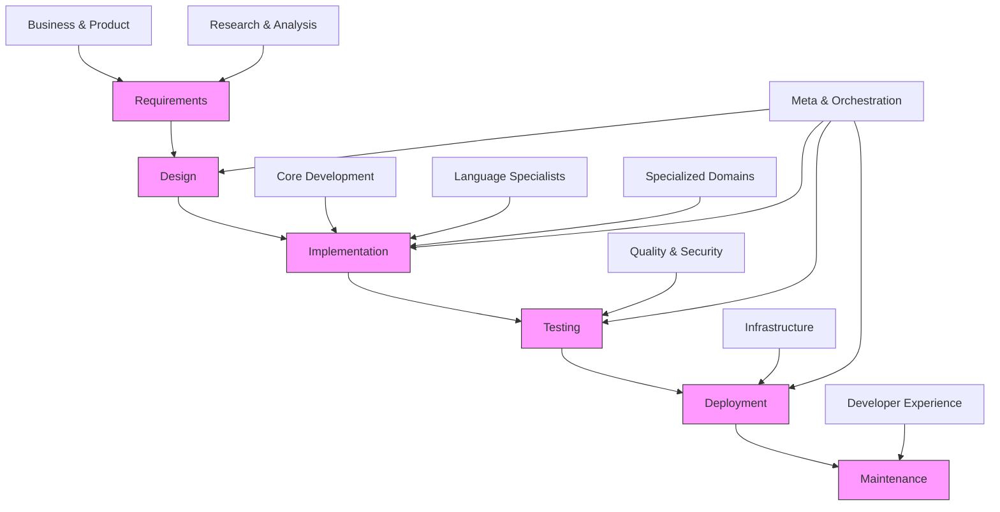
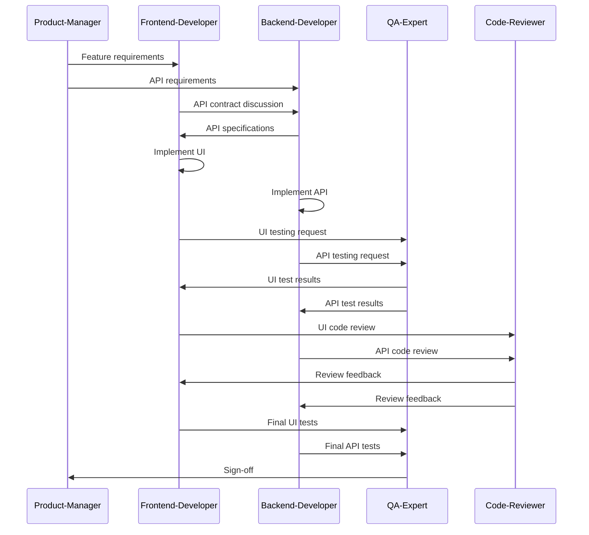
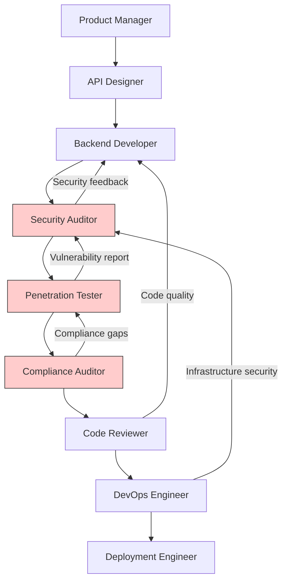
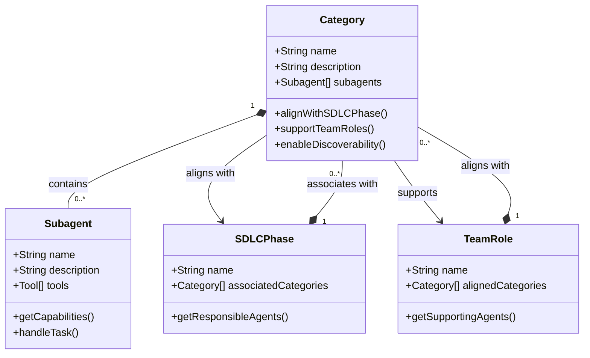

# Subagent Categories

<cite>
**Referenced Files in This Document**   
- [README.md](file://README.md)
- [agent-organizer.md](file://agent-organizer.md)
- [frontend-developer.md](file://frontend-developer.md)
- [backend-developer.md](file://backend-developer.md)
- [qa-expert.md](file://qa-expert.md)
- [api-designer.md](file://api-designer.md)
- [product-manager.md](file://product-manager.md)
- [code-reviewer.md](file://code-reviewer.md)
- [security-auditor.md](file://security-auditor.md)
- [data-scientist.md](file://data-scientist.md)
- [devops-engineer.md](file://devops-engineer.md)
- [multi-agent-coordinator.md](file://multi-agent-coordinator.md)
- [research-analyst.md](file://research-analyst.md)
</cite>

## Table of Contents
1. [Introduction](#introduction)
2. [Core Development](#core-development)
3. [Language Specialists](#language-specialists)
4. [Infrastructure](#infrastructure)
5. [Quality & Security](#quality--security)
6. [Data & AI](#data--ai)
7. [Developer Experience](#developer-experience)
8. [Specialized Domains](#specialized-domains)
9. [Business & Product](#business--product)
10. [Meta & Orchestration](#meta--orchestration)
11. [Research & Analysis](#research--analysis)
12. [Category Alignment with SDLC](#category-alignment-with-sdlc)
13. [Multi-Agent Workflow Examples](#multi-agent-workflow-examples)
14. [Categorization Rationale](#categorization-rationale)

## Introduction
The subagent categorization system organizes specialized AI agents into ten distinct categories based on their primary functions and expertise domains. This structured approach enhances discoverability, maintainability, and effective utilization of agents across the software development lifecycle. Each category serves specific roles and aligns with particular phases of development, enabling teams to efficiently select and coordinate the right agents for their tasks.

**Section sources**
- [README.md](file://README.md#L50-L238)

## Core Development
This category encompasses agents responsible for fundamental software development tasks across the technology stack.

**Scope and Purpose**: These agents handle end-to-end feature implementation, from UI design to backend services and full-stack integration. They form the backbone of application development.

**Representative Subagents**:
- [**api-designer**](file://api-designer.md): REST and GraphQL API architect
- [**backend-developer**](file://backend-developer.md): Server-side expert for scalable APIs
- [**frontend-developer**](file://frontend-developer.md): UI/UX specialist for React, Vue, and Angular
- [**fullstack-developer**](file://fullstack-developer.md): End-to-end feature development
- [**microservices-architect**](file://microservices-architect.md): Distributed systems designer
- [**mobile-developer**](file://mobile-developer.md): Cross-platform mobile specialist
- [**ui-designer**](file://ui-designer.md): Visual design and interaction specialist

**Usage Guidance**: Use these agents for implementing core application features, creating new services, or developing user interfaces. They are typically engaged during the implementation phase of the SDLC.

**Section sources**
- [README.md](file://README.md#L52-L68)

## Language Specialists
This category includes agents with deep expertise in specific programming languages and frameworks.

**Scope and Purpose**: These specialists provide language-specific knowledge, best practices, and framework optimization for various technology stacks.

**Representative Subagents**:
- [**typescript-pro**](file://typescript-pro.md): TypeScript specialist
- [**python-pro**](file://python-pro.md): Python ecosystem master
- [**java-architect**](file://java-architect.md): Enterprise Java expert
- [**golang-pro**](file://golang-pro.md): Go concurrency specialist
- [**react-specialist**](file://react-specialist.md): React 18+ modern patterns expert
- [**spring-boot-engineer**](file://spring-boot-engineer.md): Spring Boot 3+ microservices expert
- [**dotnet-core-expert**](file://dotnet-core-expert.md): .NET 8 cross-platform specialist
- [**rust-engineer**](file://rust-engineer.md): Systems programming expert

**Usage Guidance**: Engage these agents when working with specific language ecosystems, migrating between language versions, or optimizing performance for particular frameworks.

**Section sources**
- [README.md](file://README.md#L67-L91)

## Infrastructure
This category covers agents specializing in deployment, operations, and cloud infrastructure management.

**Scope and Purpose**: These agents handle infrastructure as code, deployment automation, cloud architecture, and operational reliability.

**Representative Subagents**:
- [**cloud-architect**](file://cloud-architect.md): AWS/GCP/Azure specialist
- [**devops-engineer**](file://devops-engineer.md): CI/CD and automation expert
- [**kubernetes-specialist**](file://kubernetes-specialist.md): Container orchestration master
- [**terraform-engineer**](file://terraform-engineer.md): Infrastructure as Code expert
- [**sre-engineer**](file://sre-engineer.md): Site reliability engineering expert
- [**platform-engineer**](file://platform-engineer.md): Platform architecture expert
- [**deployment-engineer**](file://deployment-engineer.md): Deployment automation specialist

**Usage Guidance**: Utilize these agents for cloud migration, infrastructure provisioning, CI/CD pipeline creation, and ensuring system reliability and scalability.

**Section sources**
- [README.md](file://README.md#L94-L108)

## Quality & Security
This category includes agents focused on code quality, testing, and security assurance.

**Scope and Purpose**: These agents ensure software quality through testing, code review, security auditing, and performance optimization.

**Representative Subagents**:
- [**qa-expert**](file://qa-expert.md): Test automation specialist
- [**code-reviewer**](file://code-reviewer.md): Code quality guardian
- [**security-auditor**](file://security-auditor.md): Security vulnerability expert
- [**performance-engineer**](file://performance-engineer.md): Performance optimization expert
- [**penetration-tester**](file://penetration-tester.md): Ethical hacking specialist
- [**accessibility-tester**](file://accessibility-tester.md): A11y compliance expert
- [**test-automator**](file://test-automator.md): Test automation framework expert

**Usage Guidance**: Deploy these agents during quality assurance phases, before production releases, or when addressing specific quality or security concerns.

**Section sources**
- [README.md](file://README.md#L110-L124)

## Data & AI
This category encompasses agents specializing in data engineering, machine learning, and artificial intelligence.

**Scope and Purpose**: These agents handle data pipelines, machine learning models, natural language processing, and AI system architecture.

**Representative Subagents**:
- [**data-engineer**](file://data-engineer.md): Data pipeline architect
- [**machine-learning-engineer**](file://machine-learning-engineer.md): Machine learning systems expert
- [**nlp-engineer**](file://nlp-engineer.md): Natural language processing expert
- [**data-scientist**](file://data-scientist.md): Analytics and insights expert
- [**mlops-engineer**](file://mlops-engineer.md): MLOps and model deployment expert
- [**llm-architect**](file://llm-architect.md): Large language model architect
- [**prompt-engineer**](file://prompt-engineer.md): Prompt optimization specialist

**Usage Guidance**: Use these agents when implementing data-intensive features, creating machine learning models, or integrating AI capabilities into applications.

**Section sources**
- [README.md](file://README.md#L126-L138)

## Developer Experience
This category includes agents focused on improving developer productivity and tooling.

**Scope and Purpose**: These agents optimize the development environment, tooling, and processes to enhance developer efficiency.

**Representative Subagents**:
- [**refactoring-specialist**](file://refactoring-specialist.md): Code refactoring expert
- [**git-workflow-manager**](file://git-workflow-manager.md): Git workflow and branching expert
- [**dependency-manager**](file://dependency-manager.md): Package and dependency specialist
- [**documentation-engineer**](file://documentation-engineer.md): Technical documentation expert
- [**build-engineer**](file://build-engineer.md): Build system specialist
- [**tooling-engineer**](file://tooling-engineer.md): Developer tooling specialist
- [**legacy-modernizer**](file://legacy-modernizer.md): Legacy code modernization specialist

**Usage Guidance**: Engage these agents when improving development workflows, modernizing legacy systems, or enhancing documentation and tooling.

**Section sources**
- [README.md](file://README.md#L142-L154)

## Specialized Domains
This category covers agents with expertise in specific technological domains and verticals.

**Scope and Purpose**: These agents provide specialized knowledge in niche areas such as blockchain, fintech, IoT, and gaming.

**Representative Subagents**:
- [**blockchain-developer**](file://blockchain-developer.md): Web3 and crypto specialist
- [**fintech-engineer**](file://fintech-engineer.md): Financial technology specialist
- [**iot-engineer**](file://iot-engineer.md): IoT systems developer
- [**game-developer**](file://game-developer.md): Game development expert
- [**embedded-systems**](file://embedded-systems.md): Embedded and real-time systems expert
- [**payment-integration**](file://payment-integration.md): Payment systems expert
- [**seo-specialist**](file://seo-specialist.md): Search engine optimization expert

**Usage Guidance**: Use these agents when working on domain-specific applications that require specialized technical knowledge beyond general software development.

**Section sources**
- [README.md](file://README.md#L156-L169)

## Business & Product
This category includes agents focused on product management, business analysis, and customer-facing roles.

**Scope and Purpose**: These agents bridge technical implementation with business requirements and market needs.

**Representative Subagents**:
- [**product-manager**](file://product-manager.md): Product strategy expert
- [**business-analyst**](file://business-analyst.md): Requirements specialist
- [**project-manager**](file://project-manager.md): Project management specialist
- [**ux-researcher**](file://ux-researcher.md): User research expert
- [**scrum-master**](file://scrum-master.md): Agile methodology expert
- [**technical-writer**](file://technical-writer.md): Technical documentation specialist
- [**customer-success-manager**](file://customer-success-manager.md): Customer success expert

**Usage Guidance**: Engage these agents during product planning, requirement gathering, and when aligning technical implementation with business objectives.

**Section sources**
- [README.md](file://README.md#L171-L183)

## Meta & Orchestration
This category encompasses agents that coordinate other agents and manage complex workflows.

**Scope and Purpose**: These agents orchestrate multi-agent teams, manage context, and optimize workflow execution.

**Representative Subagents**:
- [**agent-organizer**](file://agent-organizer.md): Multi-agent coordinator
- [**multi-agent-coordinator**](file://multi-agent-coordinator.md): Advanced multi-agent orchestration
- [**workflow-orchestrator**](file://workflow-orchestrator.md): Complex workflow automation
- [**context-manager**](file://context-manager.md): Context optimization expert
- [**task-distributor**](file://task-distributor.md): Task allocation specialist
- [**error-coordinator**](file://error-coordinator.md): Error handling and recovery specialist
- [**performance-monitor**](file://performance-monitor.md): Agent performance optimization

**Usage Guidance**: Use these agents for complex tasks requiring coordination of multiple specialists, workflow automation, or when optimizing team performance.

**Section sources**
- [README.md](file://README.md#L185-L195)
- [agent-organizer.md](file://agent-organizer.md#L0-L43)

## Research & Analysis
This category includes agents specializing in information gathering, market research, and data analysis.

**Scope and Purpose**: These agents conduct comprehensive research, competitive analysis, and market intelligence gathering.

**Representative Subagents**:
- [**research-analyst**](file://research-analyst.md): Comprehensive research specialist
- [**market-researcher**](file://market-researcher.md): Market analysis and consumer insights
- [**competitive-analyst**](file://competitive-analyst.md): Competitive intelligence specialist
- [**trend-analyst**](file://trend-analyst.md): Emerging trends and forecasting expert
- [**search-specialist**](file://search-specialist.md): Advanced information retrieval expert
- [**data-researcher**](file://data-researcher.md): Data discovery and analysis expert

**Usage Guidance**: Deploy these agents during discovery phases, market analysis, competitive research, or when gathering intelligence to inform technical decisions.

**Section sources**
- [README.md](file://README.md#L197-L205)
- [research-analyst.md](file://research-analyst.md#L45-L96)

## Category Alignment with SDLC
The subagent categories align with different phases of the software development lifecycle and team roles:

**Diagram sources**
- [README.md](file://README.md#L50-L205)
- [agent-organizer.md](file://agent-organizer.md#L0-L43)

**Section sources**
- [README.md](file://README.md#L50-L205)

## Multi-Agent Workflow Examples
Complex tasks often require collaboration across multiple agent categories. Here are examples of multi-agent workflows:

### Frontend-Backend-QA Collaboration

**Diagram sources**
- [frontend-developer.md](file://frontend-developer.md)
- [backend-developer.md](file://backend-developer.md)
- [qa-expert.md](file://qa-expert.md)
- [code-reviewer.md](file://code-reviewer.md)
- [product-manager.md](file://product-manager.md)

### Security Compliance Workflow

**Diagram sources**
- [product-manager.md](file://product-manager.md)
- [api-designer.md](file://api-designer.md)
- [backend-developer.md](file://backend-developer.md)
- [security-auditor.md](file://security-auditor.md)
- [penetration-tester.md](file://penetration-tester.md)
- [compliance-auditor.md](file://compliance-auditor.md)
- [code-reviewer.md](file://code-reviewer.md)
- [devops-engineer.md](file://devops-engineer.md)
- [deployment-engineer.md](file://deployment-engineer.md)

## Categorization Rationale
The categorization system was designed to support discoverability and maintainability through several key principles:

**Diagram sources**
- [README.md](file://README.md#L50-L205)
- [agent-organizer.md](file://agent-organizer.md#L0-L43)

**Section sources**
- [README.md](file://README.md#L50-L205)
- [agent-organizer.md](file://agent-organizer.md#L0-L43)

The categorization system provides several benefits:
- **Discoverability**: Users can easily find agents by functional area rather than searching through a flat list of hundreds of agents
- **Maintainability**: Categories provide natural groupings for updates, improvements, and versioning
- **Onboarding**: New users can understand the agent ecosystem by exploring categories relevant to their needs
- **Workflow Design**: Teams can design multi-agent workflows by selecting agents from appropriate categories based on SDLC phase
- **Scalability**: The system can accommodate new agents by placing them in existing categories or creating new ones as needed

The ten-category structure balances specificity with manageability, ensuring that each category has a clear scope while covering the complete spectrum of software development activities.