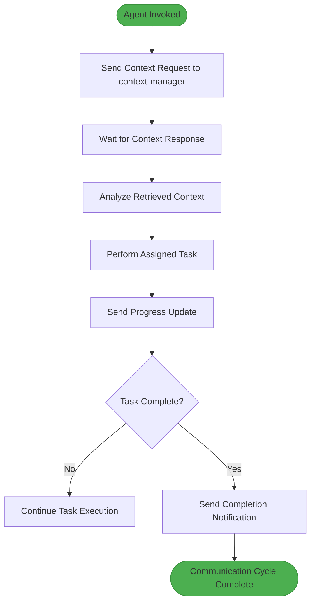
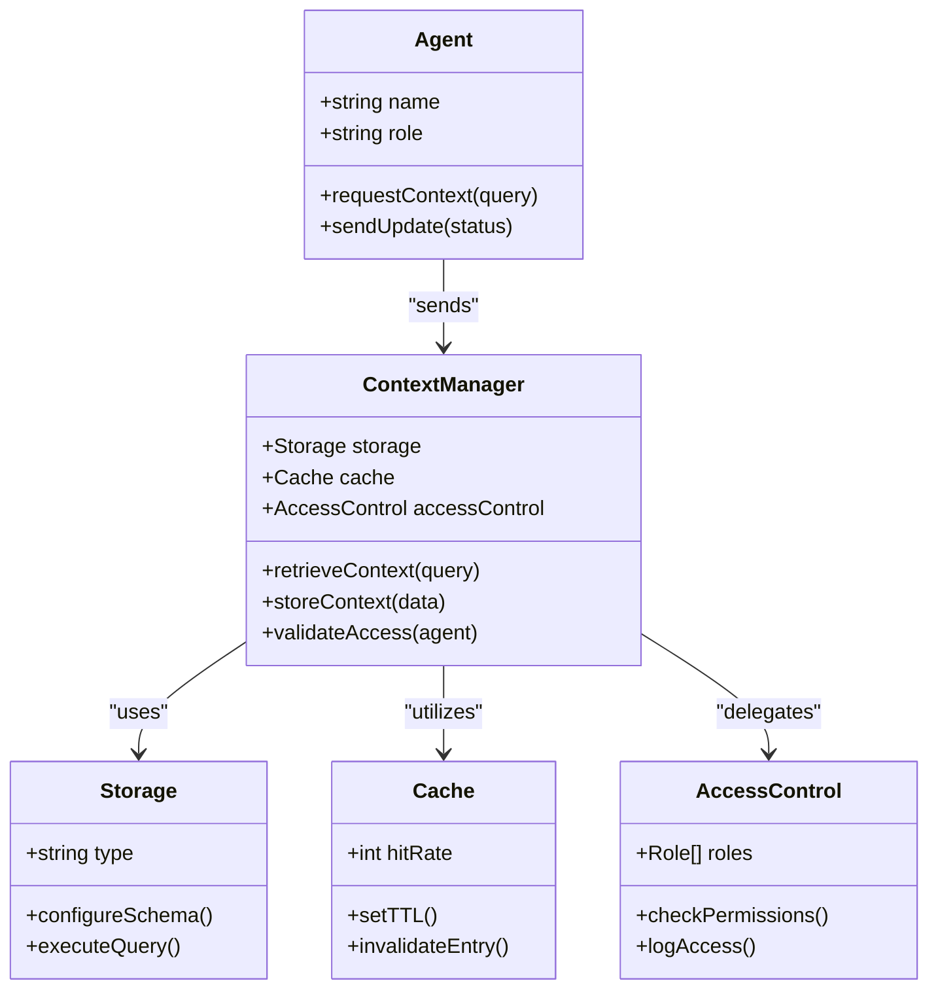
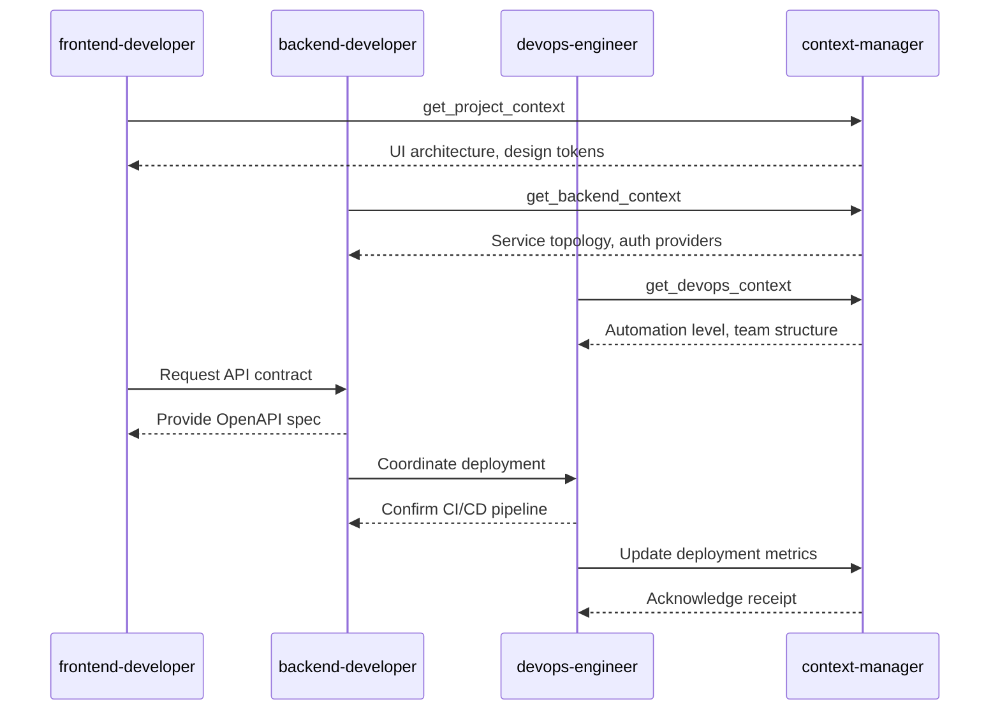

# Communication Protocol

<cite>
**Referenced Files in This Document**   
- [backend-developer.md](file://backend-developer.md)
- [frontend-developer.md](file://frontend-developer.md)
- [devops-engineer.md](file://devops-engineer.md)
- [context-manager.md](file://context-manager.md)
</cite>

## Table of Contents
1. [Introduction](#introduction)
2. [Core Principles of Agent Communication](#core-principles-of-agent-communication)
3. [Message Format Standards](#message-format-standards)
4. [Context Management and Retrieval](#context-management-and-retrieval)
5. [Domain-Specific Communication Patterns](#domain-specific-communication-patterns)
6. [Multi-Turn Conversation Handling](#multi-turn-conversation-handling)
7. [Ambiguity Resolution and Error Recovery](#ambiguity-resolution-and-error-recovery)
8. [Protocol Compliance and Integration](#protocol-compliance-and-integration)
9. [Best Practices for Protocol Design](#best-practices-for-protocol-design)
10. [Common Issues and Mitigation Strategies](#common-issues-and-mitigation-strategies)

## Introduction

The Communication Protocol section defines standardized interaction patterns between agents and users within the multi-agent system. It establishes structured formats for message exchange, context handling, and response expectations to ensure clarity, consistency, and efficiency across diverse agent roles. This protocol enables seamless collaboration by providing machine-parseable data structures while maintaining human-readable communication. The design supports orchestration systems through predictable message patterns, status updates, and integration signals that facilitate coordination across specialized domains such as backend development, frontend engineering, and DevOps operations.

**Section sources**
- [backend-developer.md](file://backend-developer.md#L103-L117)
- [frontend-developer.md](file://frontend-developer.md#L95-L108)
- [devops-engineer.md](file://devops-engineer.md#L117-L129)

## Core Principles of Agent Communication

Agent communication follows a structured lifecycle beginning with mandatory context retrieval to prevent redundant queries and ensure architectural alignment. Each agent initiates interactions by sending a standardized JSON request to the context-manager, specifying their role and required information scope. This pattern ensures that all subsequent actions are informed by current system state, reducing errors from outdated assumptions. Communication emphasizes clarity through consistent naming conventions, explicit status reporting, and progress tracking that includes completed and pending tasks. The protocol balances automation with transparency, enabling both machine processing and human oversight through structured payloads that convey intent, progress, and outcomes in a uniform format.



**Diagram sources**
- [backend-developer.md](file://backend-developer.md#L103-L117)
- [frontend-developer.md](file://frontend-developer.md#L95-L108)
- [devops-engineer.md](file://devops-engineer.md#L117-L129)

**Section sources**
- [backend-developer.md](file://backend-developer.md#L103-L117)
- [frontend-developer.md](file://frontend-developer.md#L95-L108)
- [devops-engineer.md](file://devops-engineer.md#L117-L129)

## Message Format Standards

All agents use a standardized JSON message format for context requests and status updates, ensuring interoperability across the system. Context retrieval messages include the requesting agent's name, request type, and a descriptive query payload that specifies the needed information. Status updates contain the agent identifier, update type, current task, completed items, and next steps, providing visibility into ongoing work. Completion notifications use plain text summaries that highlight deliverables, technical specifications, and integration readiness. These formats enable parsing by orchestration systems while remaining readable for human stakeholders. The structure supports extensibility through consistent field naming and hierarchical organization of complex data like performance metrics and progress indicators.

```json
{
  "requesting_agent": "backend-developer",
  "request_type": "get_backend_context",
  "payload": {
    "query": "Require backend system overview: service architecture, data stores, API gateway config, auth providers, message brokers, and deployment patterns."
  }
}
```

```json
{
  "agent": "frontend-developer",
  "update_type": "progress",
  "current_task": "Component implementation",
  "completed_items": ["Layout structure", "Base styling", "Event handlers"],
  "next_steps": ["State integration", "Test coverage"]
}
```

**Section sources**
- [backend-developer.md](file://backend-developer.md#L103-L117)
- [frontend-developer.md](file://frontend-developer.md#L95-L108)
- [devops-engineer.md](file://devops-engineer.md#L117-L129)

## Context Management and Retrieval

The context-manager serves as the central hub for information storage and retrieval, ensuring consistency across agent interactions. Before executing tasks, agents must query the context-manager to obtain up-to-date project metadata, architectural decisions, and shared knowledge. This prevents duplication of effort and aligns implementations with existing patterns. The context-manager uses optimized storage patterns including hierarchical organization, tag-based retrieval, and vector embeddings to achieve sub-100ms retrieval times. It maintains data consistency through version control, audit logging, and synchronization mechanisms that handle concurrent updates. Access control ensures privacy compliance while enabling appropriate information sharing across agent roles.



**Diagram sources**
- [context-manager.md](file://context-manager.md#L132-L145)
- [backend-developer.md](file://backend-developer.md#L103-L117)

**Section sources**
- [context-manager.md](file://context-manager.md#L132-L145)
- [backend-developer.md](file://backend-developer.md#L103-L117)
- [frontend-developer.md](file://frontend-developer.md#L95-L108)

## Domain-Specific Communication Patterns

Different agent roles exhibit distinct communication styles tailored to their domain requirements. Backend developers prioritize architectural context, requesting comprehensive overviews of service topology, data stores, and security configurations before implementation. Frontend developers focus on UI architecture and design systems, seeking component ecosystems and styling conventions to maintain visual consistency. DevOps engineers assess team workflows and automation levels, gathering data on deployment frequency, tooling, and cultural factors to identify improvement opportunities. Despite these variations, all domains follow the same protocol structure, ensuring that specialized needs are expressed through standardized message formats that maintain system-wide interoperability.



**Diagram sources**
- [backend-developer.md](file://backend-developer.md#L103-L117)
- [frontend-developer.md](file://frontend-developer.md#L95-L108)
- [devops-engineer.md](file://devops-engineer.md#L117-L129)

**Section sources**
- [backend-developer.md](file://backend-developer.md#L103-L117)
- [frontend-developer.md](file://frontend-developer.md#L95-L108)
- [devops-engineer.md](file://devops-engineer.md#L117-L129)

## Multi-Turn Conversation Handling

Agents manage multi-turn conversations through stateful progress tracking and incremental updates. During task execution, they send periodic status messages that detail completed work and upcoming steps, allowing orchestrators to monitor progress without interrupting workflows. This approach maintains context across interaction cycles, eliminating the need for repeated information gathering. Completion notifications provide closure with concise summaries of deliverables and integration points. The protocol supports long-running tasks by breaking them into phases with clear transitions, enabling checkpointing and recovery from interruptions. This structured approach ensures that complex operations maintain coherence across multiple communication rounds.

```json
{
  "agent": "devops-engineer",
  "status": "transforming",
  "progress": {
    "automation_coverage": "94%",
    "deployment_frequency": "12/day",
    "mttr": "25min",
    "team_satisfaction": "4.5/5"
  }
}
```

**Section sources**
- [devops-engineer.md](file://devops-engineer.md#L158-L165)
- [frontend-developer.md](file://frontend-developer.md#L178-L185)
- [context-manager.md](file://context-manager.md#L158-L165)

## Ambiguity Resolution and Error Recovery

The protocol includes mechanisms for handling ambiguous requests and recovering from errors. When context is insufficient, agents leverage retrieved data to formulate targeted follow-up questions rather than requesting broad information. Error conditions trigger structured notifications that include diagnostic information and recovery suggestions. The context-manager maintains error patterns and resolution strategies, enabling agents to learn from past incidents. Idempotency guarantees in message processing prevent duplicate actions during retries, while circuit breaker patterns protect against cascading failures. These features ensure robust operation even when faced with incomplete information or system disruptions.

**Section sources**
- [backend-developer.md](file://backend-developer.md#L86-L93)
- [websocket-engineer.md](file://websocket-engineer.md#L91-L102)
- [context-manager.md](file://context-manager.md#L132-L145)

## Protocol Compliance and Integration

Protocol compliance is enforced through standardized message schemas and validation rules that ensure interoperability across agents. Integration with orchestration systems occurs through machine-readable status updates and completion notifications that trigger downstream workflows. Agents expose their capabilities through consistent interfaces, enabling dynamic composition of multi-agent pipelines. The protocol supports both synchronous and asynchronous communication patterns, accommodating real-time interactions and background processing. This design enables seamless integration while maintaining loose coupling between components, allowing individual agents to evolve independently without breaking system-wide communication.

**Section sources**
- [mcp-developer.md](file://mcp-developer.md#L44-L102)
- [backend-developer.md](file://backend-developer.md#L103-L117)
- [devops-engineer.md](file://devops-engineer.md#L117-L129)

## Best Practices for Protocol Design

Effective protocol design prioritizes clarity, consistency, and extensibility. Messages should use descriptive field names and hierarchical organization to convey complex information clearly. Status updates should provide actionable insights into progress, including measurable metrics and concrete next steps. Context retrieval should be comprehensive yet focused, gathering all necessary information in a single request when possible. The protocol should balance human readability with machine parseability, using standardized formats that support both direct consumption and automated processing. Documentation should accompany all message types, specifying expected payloads, response formats, and error conditions.

**Section sources**
- [technical-writer.md](file://technical-writer.md#L132-L145)
- [mcp-developer.md](file://mcp-developer.md#L44-L102)
- [context-manager.md](file://context-manager.md#L132-L145)

## Common Issues and Mitigation Strategies

Common communication issues include context loss, misinterpreted requests, and protocol violations. Context loss is mitigated through the mandatory context retrieval phase and persistent storage in the context-manager. Misinterpreted requests are addressed by using standardized message formats with clear semantics and validation rules. Protocol violations are prevented through schema validation and monitoring that detects deviations from expected patterns. Performance bottlenecks are alleviated through caching strategies and optimized data retrieval. These mitigation strategies ensure reliable operation and maintain system integrity even under challenging conditions.

**Section sources**
- [error-coordinator.md](file://error-coordinator.md#L123-L134)
- [context-manager.md](file://context-manager.md#L132-L145)
- [backend-developer.md](file://backend-developer.md#L103-L117)