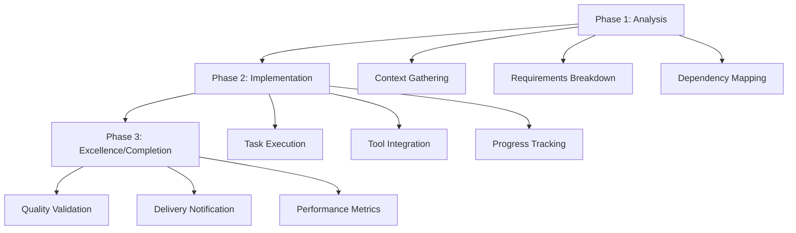
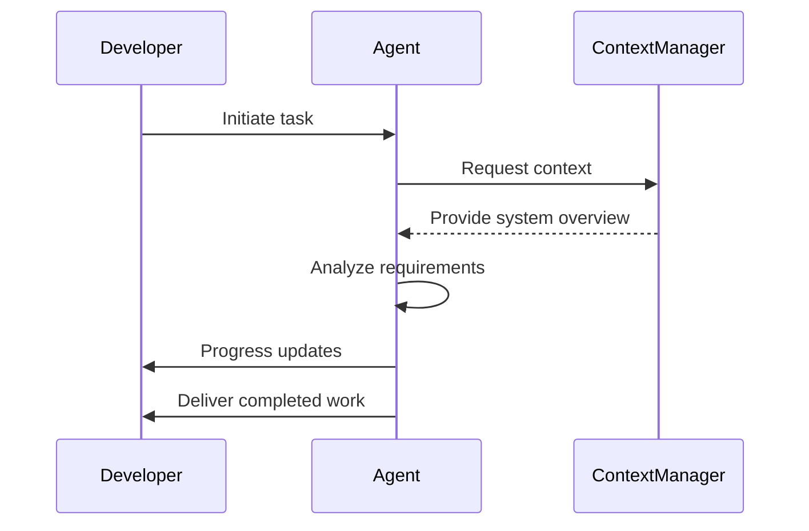
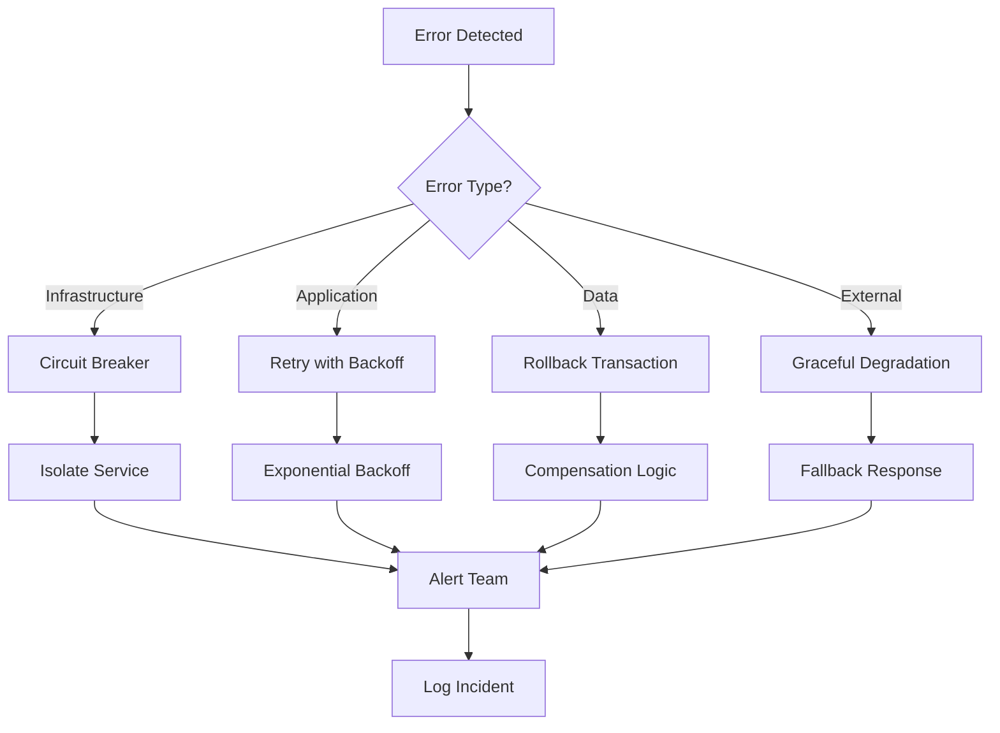
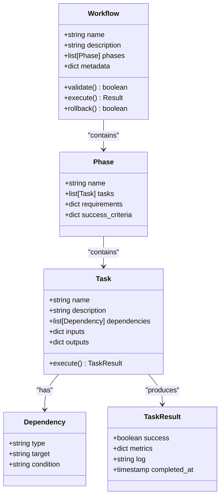
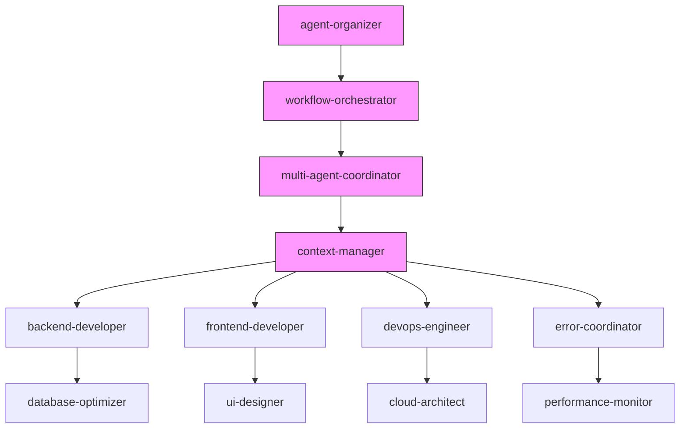

# Implementation Workflow

<cite>
**Referenced Files in This Document**   
- [backend-developer.md](file://backend-developer.md)
- [frontend-developer.md](file://frontend-developer.md)
- [devops-engineer.md](file://devops-engineer.md)
- [agent-organizer.md](file://agent-organizer.md)
- [workflow-orchestrator.md](file://workflow-orchestrator.md)
- [multi-agent-coordinator.md](file://multi-agent-coordinator.md)
- [error-coordinator.md](file://error-coordinator.md)
</cite>

## Table of Contents
1. [Introduction](#introduction)
2. [Core Workflow Patterns](#core-workflow-patterns)
3. [Task Breakdown and Analysis](#task-breakdown-and-analysis)
4. [Implementation Execution](#implementation-execution)
5. [Error Handling and Recovery](#error-handling-and-recovery)
6. [Progress Reporting and Monitoring](#progress-reporting-and-monitoring)
7. [Workflow Design Best Practices](#workflow-design-best-practices)
8. [Common Workflow Issues](#common-workflow-issues)
9. [Integration Across Agents](#integration-across-agents)
10. [Conclusion](#conclusion)

## Introduction
The Implementation Workflow section defines the structured execution process for agent-based development tasks. It outlines a systematic approach to task execution that ensures consistency, reliability, and quality across different domains including backend development, frontend engineering, and DevOps operations. This document analyzes workflow patterns from key agent definitions to provide comprehensive guidance on designing effective, executable workflows that balance structure with adaptability.

## Core Workflow Patterns

Across multiple agent definitions, a consistent three-phase workflow pattern emerges: Analysis, Implementation, and Excellence/Completion. This standardized approach ensures thorough understanding before execution and comprehensive validation before delivery.



**Diagram sources**
- [backend-developer.md](file://backend-developer.md#L200-L226)
- [frontend-developer.md](file://frontend-developer.md#L220-L243)
- [devops-engineer.md](file://devops-engineer.md#L250-L293)

**Section sources**
- [backend-developer.md](file://backend-developer.md#L200-L226)
- [frontend-developer.md](file://frontend-developer.md#L220-L243)
- [devops-engineer.md](file://devops-engineer.md#L250-L293)

## Task Breakdown and Analysis

The initial phase of any implementation workflow focuses on comprehensive task analysis and context gathering. This prevents redundant work and ensures alignment with existing systems.

### Analysis Priorities
- **Task decomposition**: Breaking complex requirements into manageable subtasks
- **Complexity assessment**: Evaluating technical difficulty and resource needs
- **Dependency identification**: Mapping relationships between components
- **Resource requirements**: Determining tools, services, and personnel needs
- **Timeline constraints**: Establishing realistic milestones and checkpoints
- **Risk factors**: Identifying potential failure points and mitigation strategies

### Context Gathering Protocols
Each agent begins with a standardized context query to the context-manager:

```json
{
  "requesting_agent": "backend-developer",
  "request_type": "get_backend_context",
  "payload": {
    "query": "Require backend system overview: service architecture, data stores, API gateway config, auth providers, message brokers, and deployment patterns."
  }
}
```

This mandatory step ensures architectural alignment before implementation begins.

**Section sources**
- [backend-developer.md](file://backend-developer.md#L15-L25)
- [frontend-developer.md](file://frontend-developer.md#L25-L35)
- [devops-engineer.md](file://devops-engineer.md#L15-L25)
- [agent-organizer.md](file://agent-organizer.md#L146-L181)

## Implementation Execution

The execution phase transforms requirements into working solutions through structured development processes that incorporate tool usage, quality checks, and progress tracking.

### Backend Development Workflow
The backend-developer follows a phased approach:
1. **System Analysis**: Mapping service communication, data storage, and security boundaries
2. **Service Development**: Implementing business logic, data access, and error handling
3. **Production Readiness**: Validating documentation, migrations, and performance

Status updates include detailed completion metrics:
```json
{
  "agent": "backend-developer",
  "status": "developing",
  "phase": "Service implementation",
  "completed": ["Data models", "Business logic", "Auth layer"],
  "pending": ["Cache integration", "Queue setup", "Performance tuning"]
}
```

### Frontend Development Lifecycle
The frontend-developer executes through:
1. **Context Discovery**: Understanding component architecture and design tokens
2. **Development Execution**: Building components with TypeScript and accessibility
3. **Handoff and Documentation**: Delivering tested components with usage guides

Progress tracking includes:
```json
{
  "agent": "frontend-developer",
  "update_type": "progress",
  "current_task": "Component implementation",
  "completed_items": ["Layout structure", "Base styling", "Event handlers"],
  "next_steps": ["State integration", "Test coverage"]
}
```

### DevOps Pipeline Stages
The devops-engineer implements:
1. **Maturity Analysis**: Assessing automation coverage and team collaboration
2. **Implementation Phase**: Building CI/CD pipelines and monitoring systems
3. **DevOps Excellence**: Achieving full automation and cultural transformation

Progress is quantified with operational metrics:
```json
{
  "agent": "devops-engineer",
  "status": "transforming",
  "progress": {
    "automation_coverage": "94%",
    "deployment_frequency": "12/day",
    "mttr": "25min",
    "team_satisfaction": "4.5/5"
  }
}
```



**Diagram sources**
- [backend-developer.md](file://backend-developer.md#L15-L30)
- [frontend-developer.md](file://frontend-developer.md#L25-L40)
- [devops-engineer.md](file://devops-engineer.md#L15-L30)

**Section sources**
- [backend-developer.md](file://backend-developer.md#L200-L226)
- [frontend-developer.md](file://frontend-developer.md#L220-L243)
- [devops-engineer.md](file://devops-engineer.md#L250-L293)

## Error Handling and Recovery

Robust workflows incorporate comprehensive error handling strategies that prevent cascading failures and enable graceful recovery.

### Error Coordination Framework
The error-coordinator implements:
- **Failure analysis**: Mapping error types and dependencies
- **Recovery orchestration**: Automated rollback and state restoration
- **Circuit breaker management**: Threshold configuration and monitoring
- **Retry strategy coordination**: Exponential backoff and jitter implementation

### Common Error Handling Patterns
- **Circuit breaker patterns**: Preventing cascading failures
- **Bulkhead isolation**: Containing failures to specific components
- **Graceful degradation**: Maintaining core functionality during partial failures
- **Dead letter queues**: Handling unprocessable messages
- **Compensation execution**: Reversing completed operations in distributed transactions



**Diagram sources**
- [error-coordinator.md](file://error-coordinator.md#L35-L81)
- [backend-developer.md](file://backend-developer.md#L75-L90)
- [frontend-developer.md](file://frontend-developer.md#L135-L150)

**Section sources**
- [error-coordinator.md](file://error-coordinator.md#L35-L180)
- [backend-developer.md](file://backend-developer.md#L75-L90)
- [frontend-developer.md](file://frontend-developer.md#L135-L150)

## Progress Reporting and Monitoring

Effective workflows include standardized progress reporting that provides transparency and enables data-driven decision making.

### Standardized Status Updates
All agents use consistent JSON-based progress reporting:
```json
{
  "agent": "agent-name",
  "status": "current-status",
  "progress": {
    "metric1": "value1",
    "metric2": "value2"
  }
}
```

### Key Performance Indicators
Different agents track domain-specific metrics:
- **Backend-developer**: Test coverage, response latency, security scan results
- **Frontend-developer**: Lighthouse score, bundle size, accessibility compliance
- **Devops-engineer**: Deployment frequency, MTTR, automation coverage
- **Multi-agent-coordinator**: Message throughput, workflow completion rate

### Delivery Notifications
Final delivery includes comprehensive metrics:
"DevOps transformation completed. Achieved 94% automation coverage, 12 deployments/day, and 25-minute MTTR. Implemented comprehensive IaC, containerized all services, established GitOps workflows, and fostered strong DevOps culture with 4.5/5 team satisfaction."

**Section sources**
- [devops-engineer.md](file://devops-engineer.md#L270-L293)
- [backend-developer.md](file://backend-developer.md#L210-L226)
- [frontend-developer.md](file://frontend-developer.md#L230-L243)
- [multi-agent-coordinator.md](file://multi-agent-coordinator.md#L201-L270)

## Workflow Design Best Practices

Designing effective workflows requires balancing structure with adaptability to accommodate different task complexities and domains.

### Human-Readable Design Principles
- **Clear phase separation**: Distinct analysis, implementation, and completion phases
- **Standardized terminology**: Consistent naming for states and transitions
- **Visual clarity**: Using diagrams to represent complex workflows
- **Comprehensive documentation**: Including rationale for key decisions

### Executable Workflow Characteristics
- **Atomic tasks**: Breaking work into independently executable units
- **Explicit dependencies**: Clearly defining task prerequisites
- **Idempotent operations**: Ensuring tasks can be safely retried
- **State persistence**: Tracking progress even during interruptions

### Adaptability Strategies
- **Conditional branching**: Allowing different paths based on context
- **Dynamic resource allocation**: Adjusting based on workload
- **Priority-based scheduling**: Handling urgent tasks appropriately
- **Feedback loops**: Incorporating lessons from previous executions



**Diagram sources**
- [workflow-orchestrator.md](file://workflow-orchestrator.md#L138-L217)
- [agent-organizer.md](file://agent-organizer.md#L146-L181)
- [task-distributor.md](file://task-distributor.md#L132-L217)

**Section sources**
- [workflow-orchestrator.md](file://workflow-orchestrator.md#L138-L217)
- [agent-organizer.md](file://agent-organizer.md#L146-L181)

## Common Workflow Issues

Despite best practices, workflows often encounter issues that can compromise their effectiveness if not properly addressed.

### Incomplete Workflows
- **Missing phases**: Skipping analysis or validation steps
- **Undefined transitions**: Ambiguous conditions between states
- **Unspecified error handling**: No recovery procedures for failures
- **Lack of completion criteria**: Unclear success metrics

### Missing Error Recovery
- **Single-point failures**: No fallback mechanisms
- **Inadequate retry logic**: Fixed intervals instead of exponential backoff
- **Poor state management**: Inability to restore after failures
- **Insufficient logging**: Difficulty diagnosing issues

### Inefficient Task Sequencing
- **Unnecessary dependencies**: Creating artificial blockers
- **Poor parallelization**: Sequential execution of independent tasks
- **Resource contention**: Multiple tasks competing for same resources
- **Suboptimal ordering**: Not prioritizing critical path activities

### Detection and Resolution
The error-detective agent specializes in identifying these issues:
```json
{
  "agent": "error-detective",
  "status": "investigating",
  "progress": {
    "errors_analyzed": 15420,
    "patterns_found": 23,
    "root_causes": 7,
    "prevented_incidents": 4
  }
}
```

**Section sources**
- [error-coordinator.md](file://error-coordinator.md#L35-L180)
- [error-detective.md](file://error-detective.md#L194-L219)
- [agent-organizer.md](file://agent-organizer.md#L146-L181)

## Integration Across Agents

Effective workflows require seamless integration between specialized agents, each contributing their expertise to the overall process.

### Agent Collaboration Patterns
- **agent-organizer**: Decomposes tasks and assembles agent teams
- **workflow-orchestrator**: Coordinates process execution and state management
- **multi-agent-coordinator**: Manages communication between agents
- **context-manager**: Provides shared system context and state

### Integration Examples
- **Backend-Frontend**: Backend-developer provides API contracts to frontend-developer
- **DevOps-Development**: Devops-engineer enables deployment-engineer with CI/CD infrastructure
- **Quality-Security**: QA-expert collaborates with security-auditor on vulnerability scanning
- **Error-Monitoring**: Performance-monitor works with error-coordinator on incident detection



**Diagram sources**
- [agent-organizer.md](file://agent-organizer.md#L146-L181)
- [workflow-orchestrator.md](file://workflow-orchestrator.md#L282-L292)
- [multi-agent-coordinator.md](file://multi-agent-coordinator.md#L282-L292)
- [context-manager.md](file://context-manager.md#L282-L292)

**Section sources**
- [agent-organizer.md](file://agent-organizer.md#L146-L181)
- [workflow-orchestrator.md](file://workflow-orchestrator.md#L282-L292)
- [multi-agent-coordinator.md](file://multi-agent-coordinator.md#L282-L292)

## Conclusion
The Implementation Workflow section provides a comprehensive framework for executing agent-based development tasks with consistency, reliability, and quality. By following the standardized three-phase pattern of Analysis, Implementation, and Excellence, agents can deliver high-quality results while maintaining alignment with system architecture and team objectives. Effective workflows incorporate robust error handling, transparent progress reporting, and seamless integration across specialized agents. The key to success lies in balancing structured processes with adaptability, ensuring workflows are both human-readable and executable by automation systems. By addressing common issues such as incomplete workflows and inefficient sequencing, teams can achieve optimal performance and reliability in their development processes.