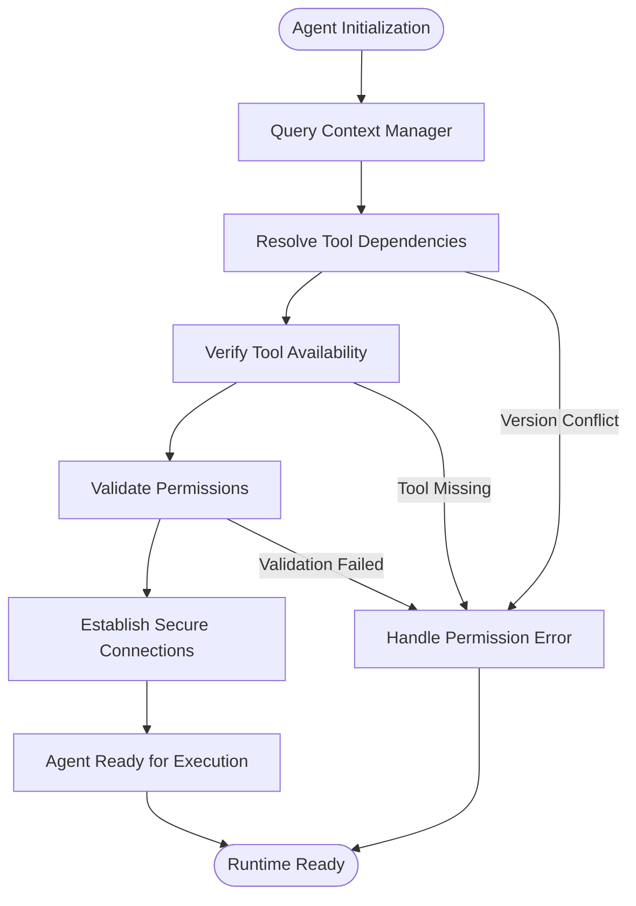
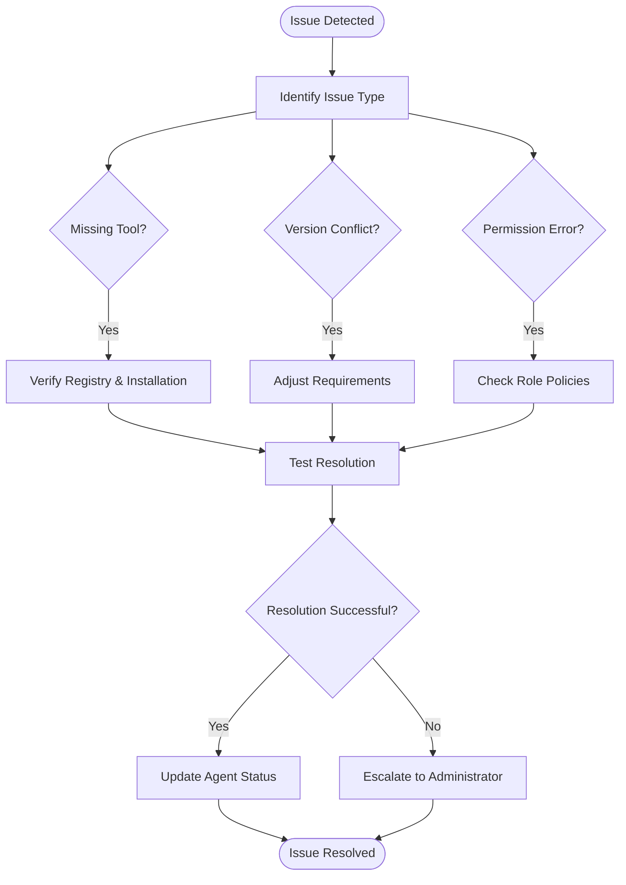

# MCP Tool Integration

<cite>
**Referenced Files in This Document**   
- [backend-developer.md](file://backend-developer.md)
- [frontend-developer.md](file://frontend-developer.md)
- [devops-engineer.md](file://devops-engineer.md)
- [mcp-developer.md](file://mcp-developer.md)
</cite>

## Table of Contents
1. [Introduction](#introduction)
2. [Tool Declaration Syntax](#tool-declaration-syntax)
3. [Integration Patterns by Role](#integration-patterns-by-role)
4. [Runtime Tool Resolution](#runtime-tool-resolution)
5. [Permission Enforcement](#permission-enforcement)
6. [Troubleshooting Common Issues](#troubleshooting-common-issues)
7. [Best Practices](#best-practices)
8. [Conclusion](#conclusion)

## Introduction
The Model Context Protocol (MCP) enables AI agents to access external capabilities through declarative tool integration. This document details the specifications for MCP tool integration in agent definitions, focusing on how the tools field connects agents with external systems. The protocol follows JSON-RPC 2.0 standards and leverages SDKs for TypeScript and Python implementations, ensuring secure, performant, and reliable interactions between AI systems and external tools or data sources.

**Section sources**
- [mcp-developer.md](file://mcp-developer.md#L0-L42)

## Tool Declaration Syntax
The tools field in agent definitions specifies external capabilities available to the agent. Tools are declared as a comma-separated list in the agent's configuration header, following the format:

```yaml
tools: Read, Write, MultiEdit, Bash, [tool1], [tool2], [tool3]
```

Each tool declaration may include version requirements using semantic versioning syntax:

```yaml
tools: typescript^4.9.0, nodejs~18.17.0, python>=3.11
```

Parameter specifications can be included for tools requiring configuration:

```yaml
tools: docker[registry=ghcr.io, insecure=false], terraform[backend=s3]
```

Tool names are case-sensitive and must match registered tool identifiers in the MCP registry. The protocol validates tool availability and compatibility during agent initialization, ensuring all declared tools are accessible and meet version requirements before activation.

**Section sources**
- [mcp-developer.md](file://mcp-developer.md#L0-L42)
- [mcp-developer.md](file://mcp-developer.md#L44-L102)

## Integration Patterns by Role

### Backend Developer Integration
Backend developers leverage MCP tools for API testing, database management, and container orchestration. The backend-developer agent declaration includes:

```yaml
tools: Read, Write, MultiEdit, Bash, Docker, database, redis, postgresql
```

Key integration patterns:
- **database**: Schema management and query optimization
- **redis**: Cache configuration and session storage
- **postgresql**: Advanced queries and performance tuning
- **docker**: Container orchestration and multi-stage builds

These tools enable automated database migrations, performance benchmarking, and containerized service deployment, supporting the agent's focus on scalable API development and microservices architecture.

**Section sources**
- [backend-developer.md](file://backend-developer.md#L2-L226)

### Frontend Developer Integration
Frontend developers utilize MCP tools for UI inspection, testing, and framework integration. The frontend-developer agent declaration includes:

```yaml
tools: Read, Write, MultiEdit, Bash, magic, context7, playwright
```

Key integration patterns:
- **magic**: Component generation and design system integration
- **context7**: Framework documentation lookup and best practices research
- **playwright**: Browser automation testing and accessibility validation

These tools support responsive design implementation, accessibility compliance (WCAG 2.1 AA), and performance optimization, enabling the creation of maintainable, high-quality React components with >85% test coverage.

**Section sources**
- [frontend-developer.md](file://frontend-developer.md#L2-L243)

### DevOps Engineer Integration
DevOps engineers use MCP tools for infrastructure automation, deployment, and monitoring. The devops-engineer agent declaration includes:

```yaml
tools: Read, Write, MultiEdit, Bash, docker, kubernetes, terraform, ansible, prometheus, jenkins
```

Key integration patterns:
- **terraform**: Infrastructure as Code implementation
- **kubernetes**: Container orchestration and service mesh setup
- **ansible**: Configuration management and secret handling
- **prometheus**: Metrics collection and alert management
- **jenkins**: CI/CD pipeline automation

These tools enable comprehensive DevOps capabilities including GitOps workflows, automated security scanning, and self-service infrastructure platforms, supporting the agent's focus on automation, collaboration, and continuous improvement.

**Section sources**
- [devops-engineer.md](file://devops-engineer.md#L2-L293)

## Runtime Tool Resolution
Tool declarations are resolved at runtime through a multi-step process:

1. **Agent Initialization**: During startup, the agent queries the context manager for tool availability and compatibility.
2. **Dependency Resolution**: The MCP runtime resolves tool dependencies and version requirements.
3. **Capability Verification**: Each declared tool is verified for availability and proper configuration.
4. **Security Validation**: Permission policies are checked against the agent's role and declared tools.
5. **Connection Establishment**: Secure connections are established with external systems.

The resolution process follows a structured workflow:


**Diagram sources**
- [mcp-developer.md](file://mcp-developer.md#L137-L163)
- [mcp-developer.md](file://mcp-developer.md#L172-L241)

**Section sources**
- [mcp-developer.md](file://mcp-developer.md#L137-L163)
- [mcp-developer.md](file://mcp-developer.md#L172-L241)

## Permission Enforcement
MCP implements role-based access control (RBAC) to enforce tool permissions. Each agent's tool access is governed by:

1. **Role Policies**: Predefined permission sets based on agent responsibilities
2. **Tool Scopes**: Granular permissions for specific tool capabilities
3. **Environment Constraints**: Restrictions based on deployment environment
4. **Audit Logging**: Comprehensive logging of tool access and usage

Permission enforcement occurs at multiple levels:
- **Declaration Level**: Tools are validated against the agent's role during definition
- **Runtime Level**: Each tool invocation is checked against current permissions
- **Execution Level**: Commands are sandboxed and monitored for policy violations

The system implements security controls including input validation, request filtering, audit logging, and secure configuration management to prevent unauthorized access and ensure compliance with security standards.

**Section sources**
- [mcp-developer.md](file://mcp-developer.md#L44-L102)
- [mcp-developer.md](file://mcp-developer.md#L104-L138)

## Troubleshooting Common Issues

### Missing Tools
When a declared tool is unavailable:
1. Verify the tool name spelling and case sensitivity
2. Check the MCP tool registry for availability
3. Confirm the tool is properly installed and configured
4. Validate network connectivity to the tool service

Resolution protocol:
```json
{
  "agent": "mcp-developer",
  "status": "troubleshooting",
  "issue": "missing_tool",
  "tool_name": "docker",
  "suggested_actions": [
    "Verify tool registry",
    "Check installation status",
    "Validate network connectivity",
    "Confirm service availability"
  ]
}
```

### Version Conflicts
When version requirements cannot be satisfied:
1. Review the agent's version specifications
2. Check available tool versions in the environment
3. Adjust version requirements to compatible ranges
4. Update the environment to support required versions

### Permission Errors
When access is denied:
1. Verify the agent's role has required permissions
2. Check tool scope configurations
3. Validate environment-specific constraints
4. Review audit logs for denied access attempts

Troubleshooting workflow:


**Diagram sources**
- [mcp-developer.md](file://mcp-developer.md#L172-L241)
- [dependency-manager.md](file://dependency-manager.md#L115-L150)

**Section sources**
- [mcp-developer.md](file://mcp-developer.md#L172-L241)
- [dependency-manager.md](file://dependency-manager.md#L115-L150)

## Best Practices

### Tool Selection
- Choose tools that align with the agent's primary responsibilities
- Prioritize tools with strong community support and documentation
- Select tools with established security practices and regular updates
- Consider tool maturity and stability for production environments

### Dependency Management
- Minimize dependencies to essential tools only
- Use version ranges rather than fixed versions when possible
- Regularly audit and update tool dependencies
- Document rationale for tool selection and version choices

### Security Considerations
- Implement principle of least privilege for tool access
- Regularly review and update permission policies
- Enable comprehensive audit logging for tool usage
- Conduct security scanning of tools and dependencies
- Isolate sensitive operations in secure execution environments

### Performance Optimization
- Implement connection pooling for frequently accessed tools
- Use caching strategies for expensive tool operations
- Optimize batch processing for multiple tool invocations
- Monitor tool performance and resource usage
- Implement graceful degradation for unavailable tools

**Section sources**
- [mcp-developer.md](file://mcp-developer.md#L44-L102)
- [mcp-developer.md](file://mcp-developer.md#L104-L138)

## Conclusion
MCP tool integration provides a robust framework for connecting AI agents with external capabilities through standardized declarations. By following the syntax guidelines, understanding runtime resolution processes, and implementing proper permission controls, organizations can create powerful agent systems that leverage external tools securely and efficiently. The integration patterns demonstrated by backend, frontend, and DevOps engineers illustrate the versatility of the MCP approach across different domains. Adhering to best practices in tool selection, dependency management, and security ensures reliable and maintainable agent implementations that deliver value while minimizing risks.

**Section sources**
- [mcp-developer.md](file://mcp-developer.md#L172-L241)
- [mcp-developer.md](file://mcp-developer.md#L242-L283)