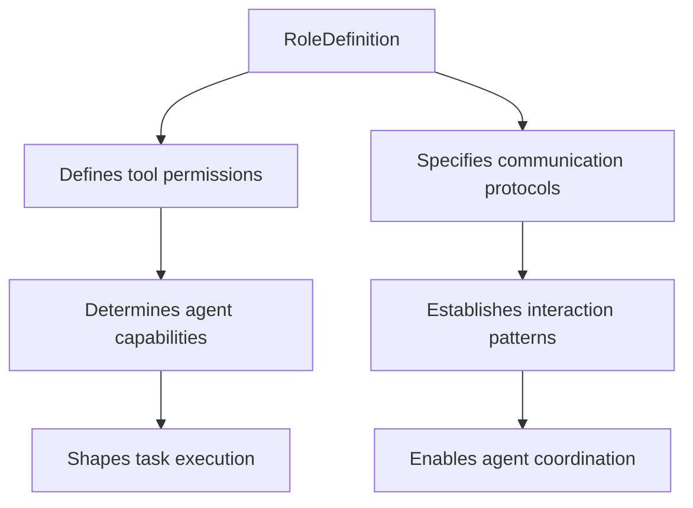

# Role Definition

<cite>
**Referenced Files in This Document**   
- [backend-developer.md](file://backend-developer.md)
- [frontend-developer.md](file://frontend-developer.md)
- [devops-engineer.md](file://devops-engineer.md)
</cite>

## Table of Contents
1. [Introduction](#introduction)
2. [Core Components of Role Definitions](#core-components-of-role-definitions)
3. [Domain-Specific Role Scoping](#domain-specific-role-scoping)
4. [Influence on Prompt Engineering and Decision-Making](#influence-on-prompt-engineering-and-decision-making)
5. [Writing Effective Role Statements](#writing-effective-role-statements)
6. [Anti-Patterns in Role Descriptions](#anti-patterns-in-role-descriptions)
7. [Interaction with Tool Permissions and Communication Protocols](#interaction-with-tool-permissions-and-communication-protocols)
8. [Consistency and Predictability Across Agent Ecosystem](#consistency-and-predictability-across-agent-ecosystem)
9. [Conclusion](#conclusion)

## Introduction
The Role Definition section in agent configuration files establishes the foundational identity, expertise, responsibilities, and behavioral boundaries for each specialized agent within the multi-agent ecosystem. These definitions serve as the primary mechanism for aligning agent behavior with domain-specific requirements while ensuring predictable interactions across the system. By clearly articulating an agent's purpose, scope, and operational parameters, role definitions enable effective delegation, coordination, and integration among diverse agent types. This document analyzes how role definitions shape agent behavior through examples from backend-developer.md, frontend-developer.md, and devops-engineer.md, demonstrating variations in scoping across technical domains and providing guidance for crafting effective role statements.

**Section sources**
- [backend-developer.md](file://backend-developer.md#L1-L10)
- [frontend-developer.md](file://frontend-developer.md#L1-L10)
- [devops-engineer.md](file://devops-engineer.md#L1-L10)

## Core Components of Role Definitions

Role definitions consist of several key components that collectively establish an agent's identity and operational framework. The metadata block at the beginning of each agent file contains essential information including the agent's name and a concise description of their specialization. This is followed by a comprehensive declaration of tool permissions that defines the agent's technical capabilities and access rights. The main body of the role definition elaborates on specific responsibilities, implementation standards, and operational workflows that guide the agent's behavior.

Each role definition includes domain-specific checklists, technical requirements, and best practices that reflect industry standards and organizational expectations. These structured guidelines ensure consistency in output quality and adherence to established patterns. The definitions also specify communication protocols that govern how agents interact with context managers and other agents, establishing standardized message formats for status updates and information requests.

**Section sources**
- [backend-developer.md](file://backend-developer.md#L1-L50)
- [frontend-developer.md](file://frontend-developer.md#L1-L50)
- [devops-engineer.md](file://devops-engineer.md#L1-L50)

## Domain-Specific Role Scoping

### Backend Developer Role Scoping
The backend-developer role is scoped around server-side application development with a strong emphasis on scalability, security, and performance. The definition establishes expertise in Node.js, Python, and Go, focusing on API development and microservices architecture. Responsibilities include database schema design, authentication implementation, and distributed system patterns. The role emphasizes technical precision in areas such as RESTful API design, database optimization, and security compliance with OWASP guidelines.

**Section sources**
- [backend-developer.md](file://backend-developer.md#L15-L100)

### Frontend Developer Role Scoping
The frontend-developer role centers on user interface engineering with specialization in React, Vue, and Angular frameworks. The scope prioritizes user experience, accessibility, and maintainable component architecture. Key responsibilities include implementing responsive designs, ensuring WCAG 2.1 AA compliance, and optimizing frontend performance metrics such as Core Web Vitals. The role emphasizes modern practices like TypeScript strict mode, Atomic Design principles, and comprehensive testing strategies.

**Section sources**
- [frontend-developer.md](file://frontend-developer.md#L15-L100)

### DevOps Engineer Role Scoping
The devops-engineer role encompasses the entire software delivery lifecycle with a focus on automation, infrastructure management, and team collaboration. The scope spans infrastructure as code, CI/CD pipeline implementation, container orchestration, and monitoring systems. Responsibilities include achieving full automation coverage, implementing GitOps workflows, and fostering DevSecOps practices. The role emphasizes cultural aspects such as blameless postmortems and continuous improvement alongside technical capabilities.

**Section sources**
- [devops-engineer.md](file://devops-engineer.md#L15-L100)

## Influence on Prompt Engineering and Decision-Making

Role definitions directly shape prompt engineering by establishing the agent's perspective, vocabulary, and decision-making framework. When generating responses or implementing solutions, agents draw upon the specific guidelines and priorities outlined in their role definition. For example, the backend-developer's emphasis on security constraints influences how it interprets requirements and makes architectural decisions, automatically considering authentication, authorization, and data protection aspects.

The structured checklists and implementation standards serve as decision trees that guide the agent through complex technical scenarios. When faced with implementation choices, agents reference their role-specific best practices to select appropriate patterns and technologies. This ensures that decisions align with domain expertise—for instance, the frontend-developer's state management approach guides selection between Redux Toolkit, Zustand, or Pinia based on application complexity.

**Section sources**
- [backend-developer.md](file://backend-developer.md#L60-L150)
- [frontend-developer.md](file://frontend-developer.md#L60-L150)
- [devops-engineer.md](file://devops-engineer.md#L60-L150)

## Writing Effective Role Statements

Effective role statements balance specificity with flexibility by clearly defining core responsibilities while allowing adaptation to specific contexts. They begin with a concise description that captures the agent's primary specialization and value proposition. The statement should articulate both technical expertise (e.g., "specializing in Node.js 18+, Python 3.11+, and Go 1.21+") and functional focus (e.g., "building scalable, secure, and performant backend systems").

Well-crafted role statements include measurable quality standards (e.g., "test coverage exceeding 80%") and reference established industry frameworks (e.g., "security measures following OWASP guidelines"). They avoid overly narrow constraints that limit adaptability while providing sufficient guidance to ensure consistent output quality. The most effective statements also incorporate success metrics that enable evaluation of the agent's performance against defined objectives.

**Section sources**
- [backend-developer.md](file://backend-developer.md#L1-L20)
- [frontend-developer.md](file://frontend-developer.md#L1-L20)
- [devops-engineer.md](file://devops-engineer.md#L1-L20)

## Anti-Patterns in Role Descriptions

Common anti-patterns in role descriptions include overly broad statements that lack specificity, making it difficult for agents to prioritize actions or make informed decisions. Examples include vague descriptions like "handles all technical tasks" without domain focus or capability details. Such ambiguity leads to inconsistent behavior and poor alignment with project requirements.

Another anti-pattern is excessive specificity that reduces flexibility and adaptability. Roles that prescribe exact technologies or implementation methods without considering context can become obsolete quickly or fail to accommodate legitimate variations in project needs. Additionally, role descriptions that omit critical constraints or success metrics make it difficult to evaluate performance or ensure quality standards.

**Section sources**
- [backend-developer.md](file://backend-developer.md)
- [frontend-developer.md](file://frontend-developer.md)
- [devops-engineer.md](file://devops-engineer.md)

## Interaction with Tool Permissions and Communication Protocols

Role definitions are intrinsically linked to tool permissions and communication protocols, creating a cohesive framework that shapes agent behavior. The tools declaration specifies exactly which capabilities an agent can access, directly constraining their technical scope. For example, the backend-developer's access to database, redis, and postgresql tools reflects their responsibility for data layer implementation, while the frontend-developer's magic and playwright tools support UI generation and testing.

Communication protocols establish standardized interaction patterns that ensure consistency across the agent ecosystem. The mandatory context retrieval process requires agents to gather relevant information before acting, preventing redundant questions and ensuring alignment with existing architecture. Status update formats provide transparency into progress and enable coordination with other agents, while delivery notifications follow consistent patterns that facilitate handoffs and integration.

**Diagram sources**
- [backend-developer.md](file://backend-developer.md#L10-L20)
- [frontend-developer.md](file://frontend-developer.md#L10-L20)
- [devops-engineer.md](file://devops-engineer.md#L10-L20)

**Section sources**
- [backend-developer.md](file://backend-developer.md#L10-L30)
- [frontend-developer.md](file://frontend-developer.md#L10-L30)
- [devops-engineer.md](file://devops-engineer.md#L10-L30)

## Consistency and Predictability Across Agent Ecosystem

Consistent role definition patterns enable predictable agent performance by establishing uniform expectations for behavior, output quality, and interaction protocols across the ecosystem. The standardized structure—beginning with metadata, followed by tool permissions, responsibilities, and communication protocols—creates a familiar framework that both agents and users can rely upon. This consistency reduces cognitive load when working with different agents and facilitates seamless collaboration.

The predictable execution workflows outlined in each role definition ensure that agents approach tasks systematically, following similar phases of context gathering, implementation, and delivery. This uniformity enables effective coordination through the multi-agent system, as each agent's behavior follows established patterns that other agents can anticipate and respond to appropriately. The result is a cohesive ecosystem where specialized agents work together efficiently toward common objectives.

**Section sources**
- [backend-developer.md](file://backend-developer.md)
- [frontend-developer.md](file://frontend-developer.md)
- [devops-engineer.md](file://devops-engineer.md)

## Conclusion
Role definitions serve as the cornerstone of effective agent behavior in the multi-agent ecosystem, establishing clear boundaries, responsibilities, and operational parameters for each specialized agent. By analyzing examples from backend-developer.md, frontend-developer.md, and devops-engineer.md, this document has demonstrated how role scoping varies across domains while maintaining consistent structural patterns. Effective role statements balance specificity with flexibility, guiding prompt engineering and decision-making while interacting with tool permissions and communication protocols to shape predictable agent behavior. The consistent application of these principles across the agent ecosystem enables reliable performance, seamless coordination, and successful collaboration among specialized agents.