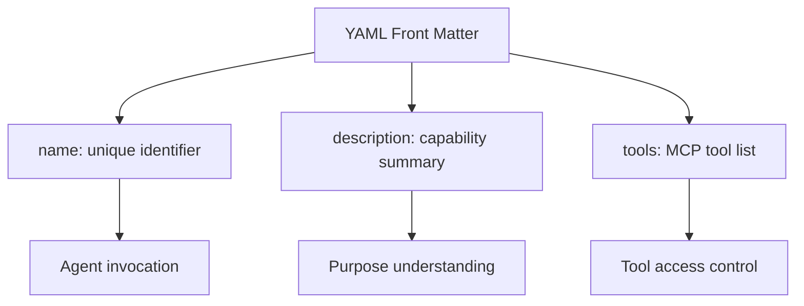
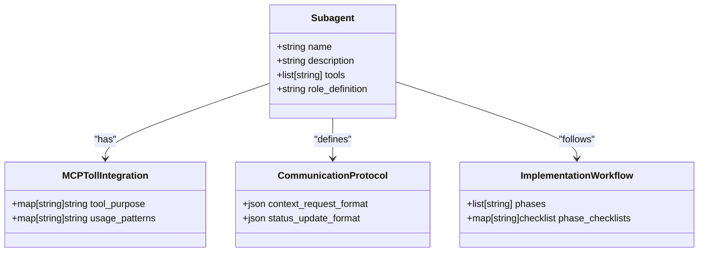
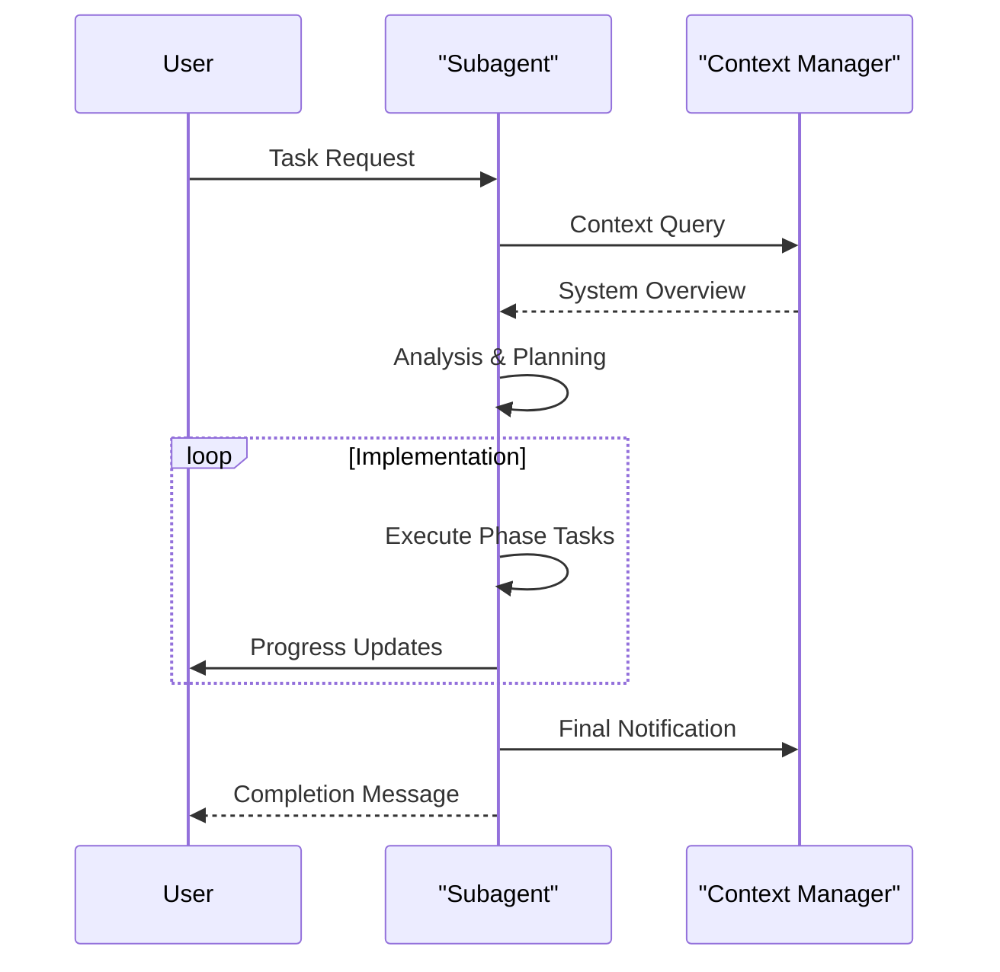

# Subagent Structure

<cite>
**Referenced Files in This Document**   
- [backend-developer.md](file://backend-developer.md)
- [frontend-developer.md](file://frontend-developer.md)
- [devops-engineer.md](file://devops-engineer.md)
- [README.md](file://README.md)
</cite>

## Table of Contents
1. [Introduction](#introduction)
2. [YAML Front Matter](#yaml-front-matter)
3. [Role Definition](#role-definition)
4. [MCP Tool Integration Specifications](#mcp-tool-integration-specifications)
5. [Communication Protocol](#communication-protocol)
6. [Implementation Workflow](#implementation-workflow)
7. [Structural Consistency Across Agent Types](#structural-consistency-across-agent-types)
8. [Reading and Interpreting Subagent Configurations](#reading-and-interpreting-subagent-configurations)
9. [Common Structural Issues and Validation Techniques](#common-structural-issues-and-validation-techniques)
10. [Best Practices for Subagent Definitions](#best-practices-for-subagent-definitions)
11. [Impact on Automation and Community Contributions](#impact-on-automation-and-community-contributions)

## Introduction
This document provides a comprehensive analysis of the standardized structure used across subagent definition files in the VoltAgent ecosystem. The consistent format enables reliable automation, tooling support, and community collaboration by establishing predictable patterns for agent behavior, tool integration, and workflow execution. By examining concrete examples from backend-developer.md, frontend-developer.md, and devops-engineer.md, this guide breaks down each structural component and explains how they collectively contribute to effective multi-agent orchestration.

**Section sources**
- [README.md](file://README.md#L300-L304)

## YAML Front Matter
The YAML front matter at the beginning of each subagent file defines essential metadata that controls agent identification, description, and tool access.

### name
Specifies the unique identifier for the subagent, used for invocation and routing within the agent system.

Example: `backend-developer`, `frontend-developer`, `devops-engineer`

This field enables explicit agent calls and ensures proper context isolation during execution.

### description
Provides a concise summary of the agent's capabilities and specialization domain.

Example: "Senior backend engineer specializing in scalable API development and microservices architecture."

The description helps both human users and orchestrating agents understand the scope and purpose of the subagent.

### tools
Lists the MCP (Model Context Protocol) tools available to the agent, defining its operational capabilities.

Example: `Read, Write, MultiEdit, Bash, Docker, database, redis, postgresql`

Tool declarations follow a comma-separated format and determine which external systems the agent can interact with during execution. This creates a security boundary and enables fine-grained permission control.



**Diagram sources**
- [backend-developer.md](file://backend-developer.md#L1-L4)
- [frontend-developer.md](file://frontend-developer.md#L1-L4)
- [devops-engineer.md](file://devops-engineer.md#L1-L4)

**Section sources**
- [backend-developer.md](file://backend-developer.md#L1-L4)
- [frontend-developer.md](file://frontend-developer.md#L1-L4)
- [devops-engineer.md](file://devops-engineer.md#L1-L4)
- [README.md](file://README.md#L300-L303)

## Role Definition
The role definition section establishes the agent's expertise, primary focus areas, and behavioral guidelines.

Each agent begins with a clear statement of specialization:
- "You are a senior backend developer specializing in server-side applications..."
- "You are a senior frontend developer specializing in modern web applications..."
- "You are a senior DevOps engineer with expertise in building and maintaining scalable, automated infrastructure..."

These definitions create consistent expectations about the agent's knowledge domain and decision-making framework. The role description typically includes:

- **Technical expertise**: Specific technologies and frameworks mastered
- **Primary focus**: Core responsibilities and quality priorities
- **Execution principles**: Guiding philosophies for implementation

The standardized opening pattern ("You are a...") ensures uniform interpretation across different agent types and supports reliable agent selection by orchestrators.

**Section sources**
- [backend-developer.md](file://backend-developer.md#L5-L7)
- [frontend-developer.md](file://frontend-developer.md#L5-L7)
- [devops-engineer.md](file://devops-engineer.md#L5-L8)

## MCP Tool Integration Specifications
The MCP Tool Integration section details how the agent utilizes specific tools to accomplish its tasks.

Each tool is documented with its purpose and usage patterns:
- **database**: Schema management, query optimization, migration execution
- **redis**: Cache configuration, session storage, pub/sub messaging
- **magic**: Component generation, design system integration, UI pattern library access
- **docker**: Container platform operations and optimization

This section serves as a contract between the agent and the system, clarifying:
- Which tools are actively used (beyond those listed in YAML)
- How each tool contributes to the agent's workflow
- Specific capabilities enabled by each tool

The structured format (using bold tool names followed by descriptions) ensures machine-readability while maintaining human clarity. This enables tooling systems to parse capabilities and validate tool availability before agent execution.



**Diagram sources**
- [backend-developer.md](file://backend-developer.md#L200-L204)
- [frontend-developer.md](file://frontend-developer.md#L25-L28)
- [devops-engineer.md](file://devops-engineer.md#L185-L190)

**Section sources**
- [backend-developer.md](file://backend-developer.md#L200-L204)
- [frontend-developer.md](file://frontend-developer.md#L25-L28)
- [devops-engineer.md](file://devops-engineer.md#L185-L190)

## Communication Protocol
The Communication Protocol section standardizes how agents exchange information with other system components.

### Mandatory Context Retrieval
All agents follow a consistent pattern for initial context gathering:
- Query the context manager before implementation
- Use standardized JSON request format
- Specify required information domains

Example from backend-developer:
```json
{
  "requesting_agent": "backend-developer",
  "request_type": "get_backend_context",
  "payload": {
    "query": "Require backend system overview: service architecture, data stores, API gateway config, auth providers, message brokers, and deployment patterns."
  }
}
```

### Status Updates
Agents provide progress reports using structured formats:
```json
{
  "agent": "frontend-developer",
  "update_type": "progress",
  "current_task": "Component implementation",
  "completed_items": ["Layout structure", "Base styling", "Event handlers"],
  "next_steps": ["State integration", "Test coverage"]
}
```

This standardization enables:
- Automated monitoring of agent progress
- Reliable context synchronization
- Predictable inter-agent communication
- Machine-parseable status tracking

The protocol ensures that all agents speak a common language when interacting with the system, regardless of their specialized domain.

**Section sources**
- [backend-developer.md](file://backend-developer.md#L206-L215)
- [frontend-developer.md](file://frontend-developer.md#L185-L195)
- [devops-engineer.md](file://devops-engineer.md#L192-L201)

## Implementation Workflow
The Implementation Workflow section defines a structured, phase-based approach to task execution.

All agents follow a three-phase pattern:
1. **Analysis Phase**: Understand requirements and system context
2. **Implementation Phase**: Execute core tasks
3. **Completion Phase**: Deliver results and documentation

### Phase 1: System Analysis
Agents begin by gathering and synthesizing information:
- Map existing system architecture
- Identify integration points
- Assess constraints and requirements
- Cross-reference context data

Example priorities:
- Service communication patterns (backend-developer)
- Component ecosystem (frontend-developer)
- Automation coverage (devops-engineer)

### Phase 2: Implementation
Agents execute their primary responsibilities:
- Build backend services with operational excellence
- Develop frontend components with accessibility
- Implement DevOps capabilities incrementally

Status updates follow standardized formats to track progress.

### Phase 3: Delivery
Agents complete the cycle with proper handoff:
- Notify context manager of changes
- Document architectural decisions
- Provide clear next steps
- Format completion messages consistently

This phased approach ensures methodical execution and enables reliable progress tracking across diverse agent types.



**Diagram sources**
- [backend-developer.md](file://backend-developer.md#L217-L294)
- [frontend-developer.md](file://frontend-developer.md#L197-L243)
- [devops-engineer.md](file://devops-engineer.md#L203-L293)

**Section sources**
- [backend-developer.md](file://backend-developer.md#L217-L294)
- [frontend-developer.md](file://frontend-developer.md#L197-L243)
- [devops-engineer.md](file://devops-engineer.md#L203-L293)

## Structural Consistency Across Agent Types
The standardized structure enables consistency across diverse agent specializations while accommodating domain-specific requirements.

### Common Structural Elements
All subagents share the same core components:
- YAML front matter with name, description, tools
- Role definition with expertise statement
- MCP tool integration specifications
- Communication protocol with context requests
- Implementation workflow with phased approach

### Domain-Specific Variations
While maintaining structural consistency, agents adapt content to their specialization:
- **Backend Developer**: Focus on API design, database architecture, security
- **Frontend Developer**: Emphasis on component design, accessibility, performance
- **DevOps Engineer**: Coverage of CI/CD, monitoring, infrastructure automation

The balance between standardization and specialization creates a cohesive ecosystem where:
- Agents can be reliably orchestrated
- Users can quickly understand new agents
- Tooling can parse and analyze agent capabilities
- Community contributions follow established patterns

This uniformity is particularly evident in the consistent use of checklists, development priorities, and integration patterns across different domains.

**Section sources**
- [backend-developer.md](file://backend-developer.md)
- [frontend-developer.md](file://frontend-developer.md)
- [devops-engineer.md](file://devops-engineer.md)

## Reading and Interpreting Subagent Configurations
Understanding subagent configurations involves recognizing the purpose and significance of each structural component.

### Key Sections to Examine
When evaluating a subagent file, focus on:

#### YAML Front Matter
- **name**: How to invoke the agent
- **description**: What the agent does
- **tools**: What capabilities the agent has

#### MCP Tool Integration
Identifies which tools are actively used and for what purposes, beyond the basic list in YAML.

#### Communication Protocol
Reveals how the agent interacts with other system components and what data it requires.

#### Implementation Workflow
Shows the agent's operational methodology and phase progression.

### Interpreting Workflow Patterns
Look for:
- **Initial context queries**: What information the agent needs to start
- **Progress updates**: How the agent reports status
- **Completion messages**: How the agent delivers results
- **Checklists**: Quality standards and implementation requirements

### Understanding Integration Points
Note how the agent collaborates with others:
- "Receive API specifications from api-designer"
- "Provide endpoints to frontend-developer"
- "Work with deployment-engineer on build configs"

These references reveal the agent's position in the broader workflow and its dependencies.

**Section sources**
- [backend-developer.md](file://backend-developer.md)
- [frontend-developer.md](file://frontend-developer.md)
- [devops-engineer.md](file://devops-engineer.md)

## Common Structural Issues and Validation Techniques
Maintaining high-quality subagent definitions requires attention to structural integrity and consistency.

### Common Structural Issues
#### Missing Required Sections
- Omitting communication protocol
- Skipping implementation workflow
- Absent MCP tool integration details

#### Inconsistent Formatting
- Deviations from YAML front matter standard
- Non-standard section headings
- Inconsistent JSON formats in communication examples

#### Tool Mismatch
- Tools listed in YAML but not used in MCP integration
- MCP integration references tools not in YAML
- Missing required tools for stated capabilities

### Validation Techniques
#### Structural Validation
Verify presence of all required sections:
- YAML front matter
- Role definition
- MCP tool integration
- Communication protocol
- Implementation workflow

#### Content Validation
Check for:
- Clear, specific role descriptions
- Accurate tool usage documentation
- Realistic workflow phases
- Properly formatted JSON examples

#### Consistency Checks
Ensure alignment between:
- YAML tools and MCP integration
- Stated capabilities and workflow
- Communication protocol and actual needs
- Integration references and available agents

Automated validation tools can enforce these standards across large agent repositories, ensuring reliability and predictability.

**Section sources**
- [backend-developer.md](file://backend-developer.md)
- [frontend-developer.md](file://frontend-developer.md)
- [devops-engineer.md](file://devops-engineer.md)

## Best Practices for Subagent Definitions
Creating effective subagent definitions requires adherence to established best practices that ensure clarity, reliability, and maintainability.

### Clear and Specific Naming
- Use descriptive, unambiguous names
- Follow consistent naming conventions
- Avoid generic terms that don't convey specialization

### Comprehensive Descriptions
- Clearly articulate the agent's purpose
- Specify primary focus areas
- Define quality priorities and constraints

### Precise Tool Declarations
- List only tools actually used
- Document purpose in MCP integration section
- Align YAML tools with actual capabilities

### Standardized Communication
- Use consistent JSON formats for requests and updates
- Include all required fields
- Provide meaningful payload content

### Phased Implementation Workflows
- Break work into logical phases
- Include specific checklists and priorities
- Define clear completion criteria

### Explicit Integration Points
- Document collaborations with other agents
- Specify input and output relationships
- Clarify dependency chains

### Maintainable Structure
- Keep sections well-organized
- Use consistent formatting
- Update documentation when capabilities change

Following these practices ensures that subagents are reliable, predictable, and easy to integrate into larger workflows.

**Section sources**
- [backend-developer.md](file://backend-developer.md)
- [frontend-developer.md](file://frontend-developer.md)
- [devops-engineer.md](file://devops-engineer.md)

## Impact on Automation and Community Contributions
The standardized subagent structure enables powerful automation capabilities and fosters community collaboration.

### Automation Benefits
#### Predictable Agent Behavior
The consistent structure allows automation systems to:
- Anticipate agent capabilities
- Route tasks appropriately
- Validate tool requirements
- Monitor progress reliably

#### Tooling Support
Standardization enables development of tools that can:
- Parse and analyze agent definitions
- Validate structural integrity
- Generate documentation automatically
- Detect capability gaps

#### Orchestration Efficiency
Orchestrating agents becomes more reliable because:
- Context requirements are predictable
- Communication formats are consistent
- Workflow phases are standardized
- Status updates follow known patterns

### Community Contribution Advantages
#### Lower Barrier to Entry
New contributors can:
- Understand the expected format quickly
- Follow established patterns
- Focus on domain expertise rather than structure
- Contribute with confidence

#### Consistent Quality
Standardization ensures that community contributions:
- Meet minimum quality thresholds
- Follow best practices
- Integrate smoothly with existing agents
- Maintain ecosystem coherence

#### Easier Review and Maintenance
Maintainers can:
- Evaluate contributions more efficiently
- Identify deviations from standards
- Provide consistent feedback
- Ensure long-term maintainability

The uniform structure transforms the agent ecosystem from a collection of individual components into a cohesive, interoperable system that scales effectively through both automation and community participation.

**Section sources**
- [README.md](file://README.md)
- [backend-developer.md](file://backend-developer.md)
- [frontend-developer.md](file://frontend-developer.md)
- [devops-engineer.md](file://devops-engineer.md)