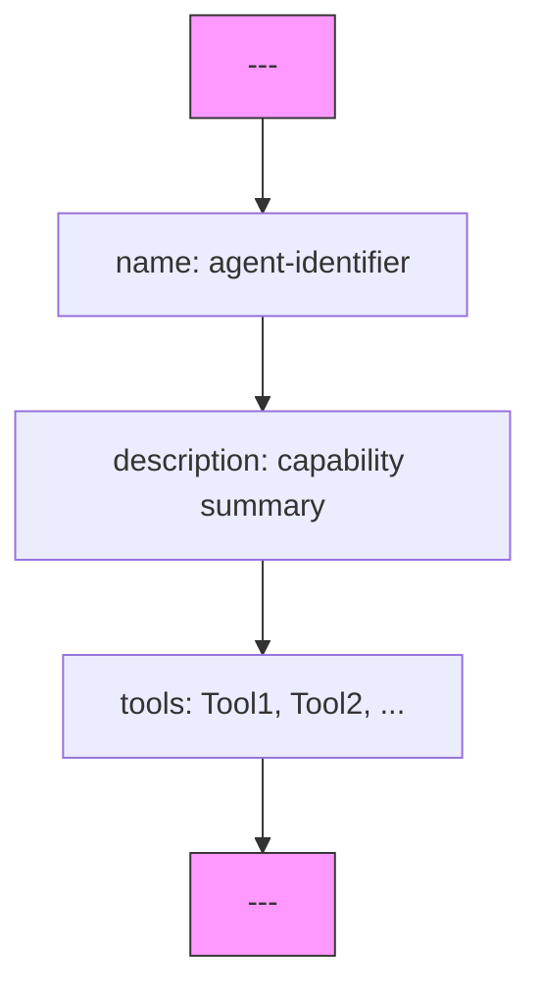
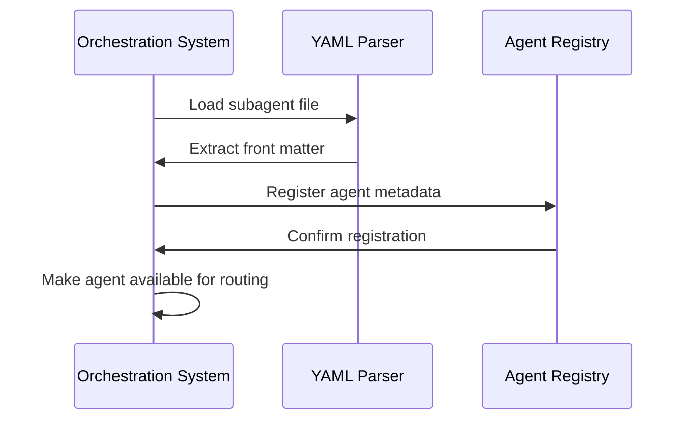

# YAML Front Matter

<cite>
**Referenced Files in This Document**   
- [backend-developer.md](file://backend-developer.md)
- [frontend-developer.md](file://frontend-developer.md)
- [devops-engineer.md](file://devops-engineer.md)
- [README.md](file://README.md)
</cite>

## Table of Contents
1. [Introduction](#introduction)
2. [Structure of YAML Front Matter](#structure-of-yaml-front-matter)
3. [Required Fields](#required-fields)
4. [Tools Array and MCP Integration](#tools-array-and-mcp-integration)
5. [Syntax Guidelines and Validation](#syntax-guidelines-and-validation)
6. [Best Practices for Descriptions](#best-practices-for-descriptions)
7. [Parsing and Runtime Impact](#parsing-and-runtime-impact)
8. [Conclusion](#conclusion)

## Introduction
The YAML front matter block is a metadata section at the beginning of each subagent definition file that provides essential configuration for agent initialization, capability declaration, and orchestration. This structured header enables the system to understand an agent's identity, purpose, and tool access before processing its full behavioral definition. The front matter uses standard YAML syntax enclosed between triple dashes (`---`) and contains critical fields that determine how agents are discovered, routed, and executed within multi-agent workflows.

**Section sources**
- [README.md](file://README.md#L300-L304)

## Structure of YAML Front Matter
The YAML front matter follows a strict format with three required fields: `name`, `description`, and `tools`. These fields appear in a specific order and must be properly formatted to ensure correct parsing by the orchestration system. The block is delimited by triple dashes on both ends, creating a clear boundary between metadata and the agent's main content.



**Diagram sources**
- [README.md](file://README.md#L300-L304)
- [backend-developer.md](file://backend-developer.md#L0-L4)

## Required Fields
Each subagent definition requires three specific fields in its front matter block, all of which directly impact agent functionality and discovery.

### name
The `name` field serves as the unique identifier for the subagent and must follow kebab-case naming conventions. This identifier is used when explicitly invoking the agent or referencing it in orchestration workflows. The name should clearly reflect the agent's primary function and be consistent across similar agent types.

**Section sources**
- [backend-developer.md](file://backend-developer.md#L1)
- [frontend-developer.md](file://frontend-developer.md#L1)
- [devops-engineer.md](file://devops-engineer.md#L1)

### description
The `description` field provides a concise summary of the agent's capabilities, expertise, and focus areas. It should be written in complete sentences and emphasize the agent's specialization, technical domains, and primary objectives. This field is crucial for agent discovery and selection by orchestrator agents.

**Section sources**
- [backend-developer.md](file://backend-developer.md#L2)
- [frontend-developer.md](file://frontend-developer.md#L2)
- [devops-engineer.md](file://devops-engineer.md#L2)

### tools
The `tools` field declares the MCP (Model Context Protocol) tools that the agent is authorized to use during execution. This array determines the agent's capabilities and influences which tasks it can effectively handle. Tool names are comma-separated and should match exactly with available MCP integrations.

**Section sources**
- [backend-developer.md](file://backend-developer.md#L3)
- [frontend-developer.md](file://frontend-developer.md#L3)
- [devops-engineer.md](file://devops-engineer.md#L3)

## Tools Array and MCP Integration
The tools array plays a critical role in defining an agent's operational capabilities and integration with external systems through MCP. Each tool declaration enables specific functionality that the agent can leverage during task execution.

### Backend Developer Example
The backend-developer agent declares several database and containerization tools that enable its server-side development capabilities:

```yaml
tools: Read, Write, MultiEdit, Bash, Docker, database, redis, postgresql
```

This configuration allows the agent to interact with various data storage systems and container platforms, directly supporting its specialization in scalable API development and microservices architecture.

**Section sources**
- [backend-developer.md](file://backend-developer.md#L3)

### Frontend Developer Example
The frontend-developer agent includes tools focused on UI development and testing:

```yaml
tools: Read, Write, MultiEdit, Bash, magic, context7, playwright
```

These tools support component generation, framework documentation lookup, and browser automation testing, aligning with the agent's expertise in modern web application development.

**Section sources**
- [frontend-developer.md](file://frontend-developer.md#L3)

### DevOps Engineer Example
The devops-engineer agent declares infrastructure and automation tools:

```yaml
tools: Read, Write, MultiEdit, Bash, docker, kubernetes, terraform, ansible, prometheus, jenkins
```

This comprehensive toolset enables the agent to manage container orchestration, infrastructure as code, configuration management, monitoring, and CI/CD automation across the software delivery lifecycle.

**Section sources**
- [devops-engineer.md](file://devops-engineer.md#L3)

## Syntax Guidelines and Validation
Proper syntax in the YAML front matter is essential for successful parsing and agent initialization. Several common formatting issues can prevent correct interpretation of the metadata.

### Valid Syntax Patterns
- Field names must be lowercase with no spaces
- String values should not be quoted unless they contain special characters
- Tools array uses comma-separated values with single spaces after commas
- No trailing commas in the tools list
- Consistent indentation (no tabs, use spaces if needed)
- Proper spacing around colons in key-value pairs

### Common Errors to Avoid
- Using underscores or camelCase in the name field
- Missing spaces after commas in the tools array
- Incorrect capitalization of tool names
- Missing required fields
- Improper YAML delimiters (using less than three dashes)
- Trailing whitespace on lines
- Special characters in the name field

Validation should include checking that the name is unique within the agent registry, the description accurately reflects capabilities, and all listed tools are available in the MCP environment.

**Section sources**
- [README.md](file://README.md#L300-L304)
- [backend-developer.md](file://backend-developer.md#L1-L3)

## Best Practices for Descriptions
Effective descriptions in the YAML front matter should follow specific guidelines to ensure clarity and consistency across the agent ecosystem.

### Writing Clear Descriptions
- Begin with the agent's role or title (e.g., "Senior backend engineer")
- Specify technical domains and specializations
- Mention key focus areas (performance, security, maintainability)
- Include relevant technologies or frameworks when appropriate
- Keep descriptions between 150-200 characters
- Use active voice and present tense
- Avoid vague terms like "expert" without context
- Focus on what the agent does rather than how it does it

### Tool Declaration Guidelines
- List tools in order of importance or frequency of use
- Include only tools the agent will actively use
- Use exact tool names as defined in the MCP specification
- Group related tools together when possible
- Consider the security implications of tool access
- Regularly review and update tool declarations as capabilities evolve

**Section sources**
- [backend-developer.md](file://backend-developer.md#L2)
- [frontend-developer.md](file://frontend-developer.md#L2)
- [devops-engineer.md](file://devops-engineer.md#L2)

## Parsing and Runtime Impact
The YAML front matter is parsed during agent initialization and has significant implications for routing, capability assessment, and execution context.

### Agent Initialization Process
When a subagent file is loaded, the system first parses the YAML front matter to extract key metadata. This information is used to register the agent in the agent registry, making it discoverable by orchestrator agents and available for task delegation.



**Diagram sources**
- [README.md](file://README.md#L300-L304)
- [agent-organizer.md](file://agent-organizer.md#L1-L4)

### Routing and Orchestration
The information in the front matter directly influences how orchestrator agents select and route tasks. The name field enables explicit agent invocation, the description supports semantic matching of agent capabilities to task requirements, and the tools array allows for capability-based filtering to ensure agents have the necessary tools for a given task.

Agent selection criteria based on front matter:
- **Name matching**: Direct invocation by identifier
- **Description analysis**: Semantic similarity to task requirements
- **Tool availability**: Presence of required MCP tools for task execution
- **Capability alignment**: Matching of described expertise to task domain

**Section sources**
- [README.md](file://README.md#L300-L304)
- [agent-organizer.md](file://agent-organizer.md#L45-L113)

## Conclusion
The YAML front matter serves as the essential metadata layer for subagent definition files, providing structured information that enables effective agent management, discovery, and orchestration. By following consistent patterns for the required fields—name, description, and tools—developers can create well-defined agents that integrate seamlessly into multi-agent workflows. The tools array, in particular, plays a critical role in enabling MCP integrations and determining agent capabilities. Proper syntax, clear descriptions, and thoughtful tool declarations ensure that agents are correctly parsed, appropriately routed, and capable of executing their intended functions within the orchestration system.