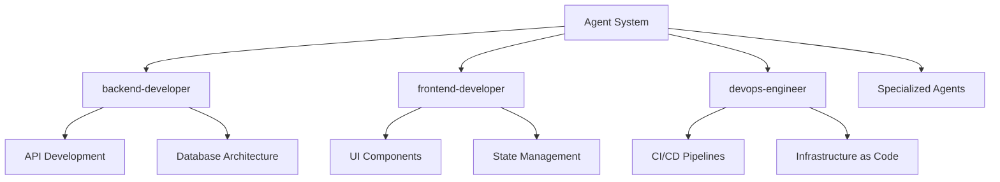
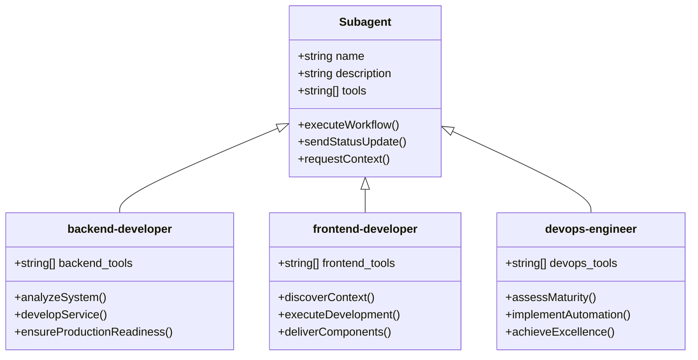
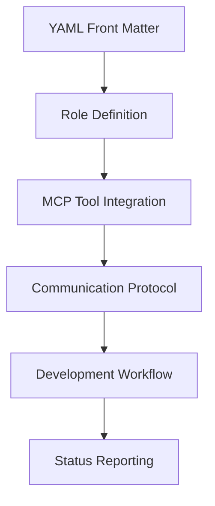
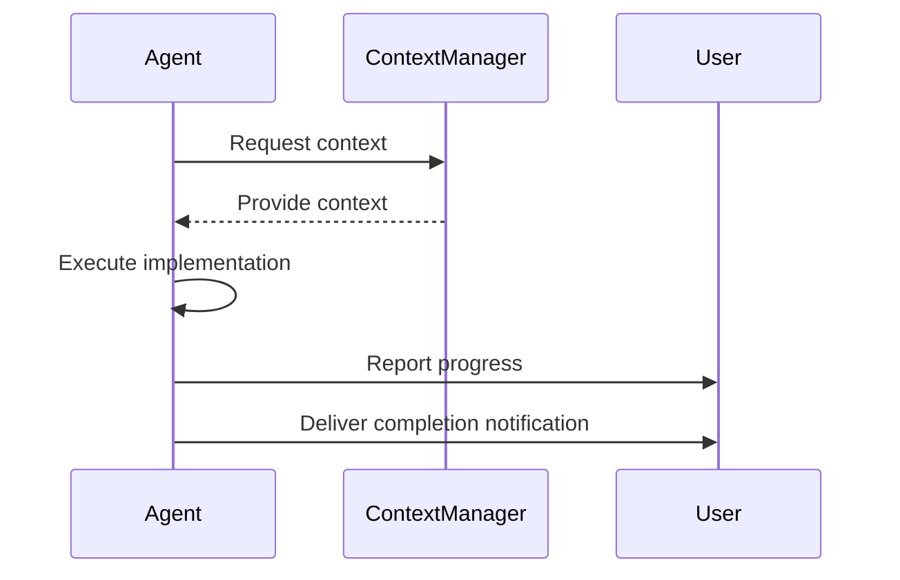
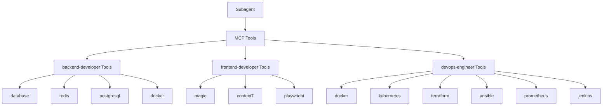
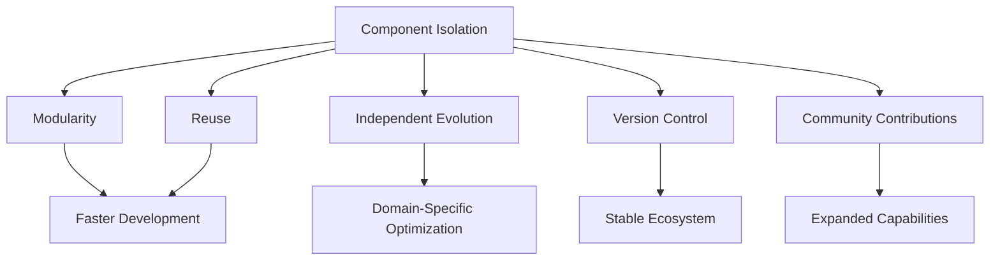
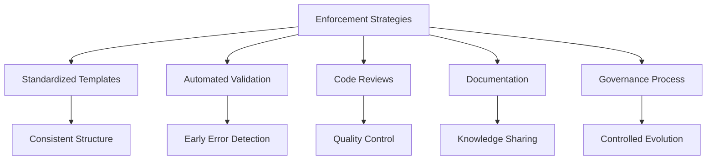

# Component Architecture

<cite>
**Referenced Files in This Document**   
- [backend-developer.md](file://backend-developer.md)
- [frontend-developer.md](file://frontend-developer.md)
- [devops-engineer.md](file://devops-engineer.md)
</cite>

## Table of Contents
1. [Introduction](#introduction)
2. [Component-Based Structure](#component-based-structure)
3. [Standardized Interface Pattern](#standardized-interface-pattern)
4. [Internal Structure of a Subagent](#internal-structure-of-a-subagent)
5. [Workflow Specification](#workflow-specification)
6. [MCP Tool Integration](#mcp-tool-integration)
7. [Cross-Domain Consistency](#cross-domain-consistency)
8. [Benefits of Component Isolation](#benefits-of-component-isolation)
9. [Challenges in Interface Consistency](#challenges-in-interface-consistency)
10. [Enforcement Strategies](#enforcement-strategies)

## Introduction
The agents system is built on a component-based architecture where each subagent functions as a self-contained unit with specialized expertise. This document details the architectural principles behind this design, focusing on modularity, standardized interfaces, and domain-specific implementation patterns. The system comprises over 117 specialized agents, each following a consistent structural pattern while maintaining domain-specific capabilities.

## Component-Based Structure
Each subagent operates as an independent component with clearly defined responsibilities and boundaries. This architecture enables specialization while maintaining system-wide consistency.



**Diagram sources**
- [backend-developer.md](file://backend-developer.md#L1-L20)
- [frontend-developer.md](file://frontend-developer.md#L1-L20)
- [devops-engineer.md](file://devops-engineer.md#L1-L20)

**Section sources**
- [backend-developer.md](file://backend-developer.md#L1-L50)
- [frontend-developer.md](file://frontend-developer.md#L1-L50)
- [devops-engineer.md](file://devops-engineer.md#L1-L50)

## Standardized Interface Pattern
All subagents follow a standardized interface pattern that ensures consistency across the system. This pattern includes YAML front matter, role definition, tool integration, and workflow specification.



**Diagram sources**
- [backend-developer.md](file://backend-developer.md#L1-L10)
- [frontend-developer.md](file://frontend-developer.md#L1-L10)
- [devops-engineer.md](file://devops-engineer.md#L1-L10)

**Section sources**
- [backend-developer.md](file://backend-developer.md#L1-L30)
- [frontend-developer.md](file://frontend-developer.md#L1-L30)
- [devops-engineer.md](file://devops-engineer.md#L1-L30)

## Internal Structure of a Subagent
A typical subagent follows a consistent internal structure with several key components.

### YAML Front Matter
Each subagent begins with standardized YAML front matter that defines its identity and capabilities:
- **name**: Unique identifier for the agent
- **description**: Brief overview of expertise
- **tools**: List of MCP tools available

### Role Definition
The role definition establishes the agent's purpose and scope of expertise. For example:
- backend-developer focuses on scalable API development
- frontend-developer specializes in UI engineering
- devops-engineer bridges development and operations

### Core Components


**Diagram sources**
- [backend-developer.md](file://backend-developer.md#L1-L20)
- [frontend-developer.md](file://frontend-developer.md#L1-L20)
- [devops-engineer.md](file://devops-engineer.md#L1-L20)

**Section sources**
- [backend-developer.md](file://backend-developer.md#L1-L50)
- [frontend-developer.md](file://frontend-developer.md#L1-L50)
- [devops-engineer.md](file://devops-engineer.md#L1-L50)

## Workflow Specification
Each subagent follows a structured three-phase workflow that ensures consistent execution patterns.

### Phase 1: Context Discovery
All agents begin by querying the context manager for relevant system information:
```json
{
  "requesting_agent": "backend-developer",
  "request_type": "get_backend_context",
  "payload": {
    "query": "Require backend system overview: service architecture, data stores, API gateway config, auth providers, message brokers, and deployment patterns."
  }
}
```

### Phase 2: Implementation
Agents execute their specialized tasks following domain-specific checklists and patterns.

### Phase 3: Delivery and Reporting
Completion involves delivering artifacts and reporting status in a standardized format.



**Diagram sources**
- [backend-developer.md](file://backend-developer.md#L60-L70)
- [frontend-developer.md](file://frontend-developer.md#L150-L160)
- [devops-engineer.md](file://devops-engineer.md#L140-L150)

**Section sources**
- [backend-developer.md](file://backend-developer.md#L50-L100)
- [frontend-developer.md](file://frontend-developer.md#L140-L200)
- [devops-engineer.md](file://devops-engineer.md#L130-L190)

## MCP Tool Integration
Subagents integrate with MCP tools to extend their capabilities in domain-specific ways.

### Backend Developer Tools
- **database**: Schema management and query optimization
- **redis**: Cache configuration and session storage
- **postgresql**: Advanced queries and performance tuning
- **docker**: Container orchestration and network configuration

### Frontend Developer Tools
- **magic**: Component generation and design system integration
- **context7**: Framework documentation and best practices
- **playwright**: Browser automation and accessibility testing

### DevOps Engineer Tools
- **docker**: Container platform
- **kubernetes**: Container orchestration
- **terraform**: Infrastructure as Code
- **ansible**: Configuration management
- **prometheus**: Monitoring system
- **jenkins**: CI/CD automation



**Diagram sources**
- [backend-developer.md](file://backend-developer.md#L200-L220)
- [frontend-developer.md](file://frontend-developer.md#L20-L40)
- [devops-engineer.md](file://devops-engineer.md#L200-L220)

**Section sources**
- [backend-developer.md](file://backend-developer.md#L200-L227)
- [frontend-developer.md](file://frontend-developer.md#L20-L45)
- [devops-engineer.md](file://devops-engineer.md#L200-L225)

## Cross-Domain Consistency
Despite operating in different domains, subagents maintain remarkable consistency in their structure and behavior.

### Common Patterns Across Domains
| Aspect | backend-developer | frontend-developer | devops-engineer |
|-------|------------------|-------------------|----------------|
| **Initialization** | get_backend_context | get_project_context | get_devops_context |
| **Workflow Phases** | Analysis, Development, Production | Discovery, Execution, Handoff | Analysis, Implementation, Excellence |
| **Status Updates** | JSON progress reports | JSON progress reports | JSON progress reports |
| **Completion Format** | Structured delivery message | Structured delivery message | Structured delivery message |

### Integration Patterns
All subagents integrate with other agents in the ecosystem:
- backend-developer collaborates with api-designer and devops-engineer
- frontend-developer works with ui-designer and backend-developer
- devops-engineer partners with sre-engineer and kubernetes-specialist

**Section sources**
- [backend-developer.md](file://backend-developer.md#L220-L227)
- [frontend-developer.md](file://frontend-developer.md#L230-L244)
- [devops-engineer.md](file://devops-engineer.md#L280-L294)

## Benefits of Component Isolation
The component-based architecture provides several key benefits.

### Modularity
Each subagent can be developed, tested, and deployed independently, enabling parallel development across multiple domains.

### Reuse
Common patterns and workflows can be reused across different agent types, reducing implementation effort.

### Independent Evolution
Subagents can evolve independently based on domain requirements without affecting other components.

### Version Control
Individual subagents can be versioned separately, allowing for granular updates and rollbacks.

### Community Contributions
The standardized structure makes it easier for community members to contribute new subagents following established patterns.



**Diagram sources**
- [backend-developer.md](file://backend-developer.md#L1-L10)
- [frontend-developer.md](file://frontend-developer.md#L1-L10)
- [devops-engineer.md](file://devops-engineer.md#L1-L10)

## Challenges in Interface Consistency
Maintaining interface consistency across 117+ subagents presents several challenges.

### Scale Complexity
As the number of subagents grows, ensuring consistent implementation of the standardized interface becomes increasingly difficult.

### Domain-Specific Requirements
Different domains may require specialized extensions to the base interface, potentially leading to divergence.

### Evolution Pressure
Individual subagents may evolve at different rates, creating version compatibility issues.

### Knowledge Distribution
Ensuring all contributors understand and follow the standardized patterns requires effective documentation and onboarding.

**Section sources**
- [backend-developer.md](file://backend-developer.md#L1-L10)
- [frontend-developer.md](file://frontend-developer.md#L1-L10)
- [devops-engineer.md](file://devops-engineer.md#L1-L10)

## Enforcement Strategies
Several strategies are employed to maintain interface consistency across the agent ecosystem.

### Standardized Templates
All subagents are created from standardized templates that enforce the required structure and patterns.

### Automated Validation
Tools automatically validate new and updated subagents against the interface specification.

### Code Reviews
All contributions undergo rigorous code review to ensure compliance with architectural standards.

### Documentation
Comprehensive documentation provides clear guidance on implementing and extending subagents.

### Governance Process
A governance process oversees the evolution of the interface specification and manages extensions.



**Diagram sources**
- [backend-developer.md](file://backend-developer.md#L1-L10)
- [frontend-developer.md](file://frontend-developer.md#L1-L10)
- [devops-engineer.md](file://devops-engineer.md#L1-L10)

**Section sources**
- [backend-developer.md](file://backend-developer.md#L1-L10)
- [frontend-developer.md](file://frontend-developer.md#L1-L10)
- [devops-engineer.md](file://devops-engineer.md#L1-L10)