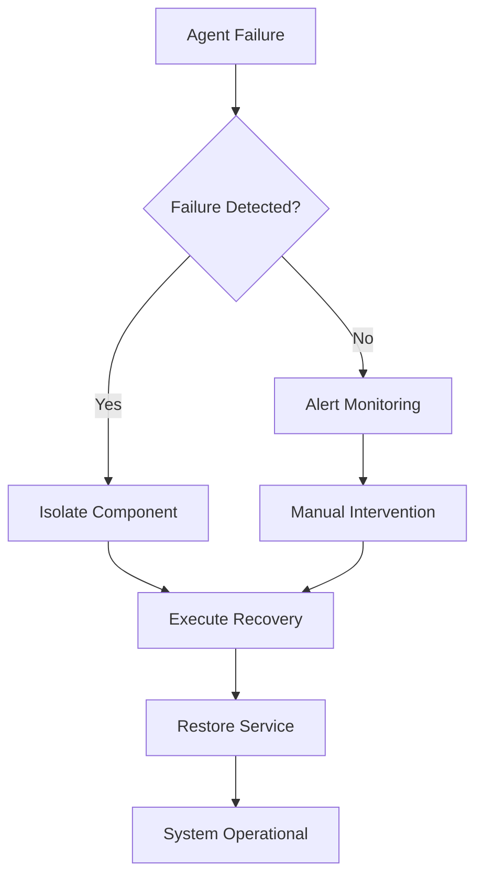
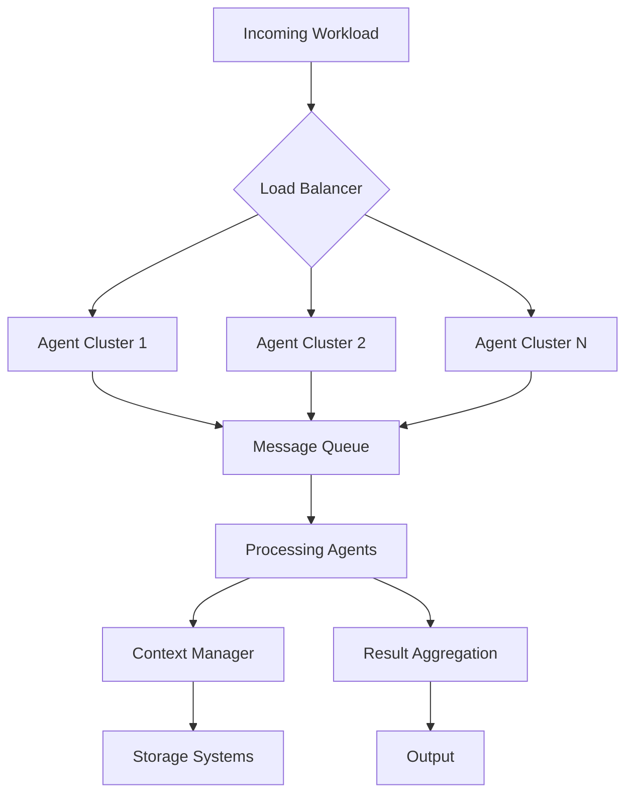
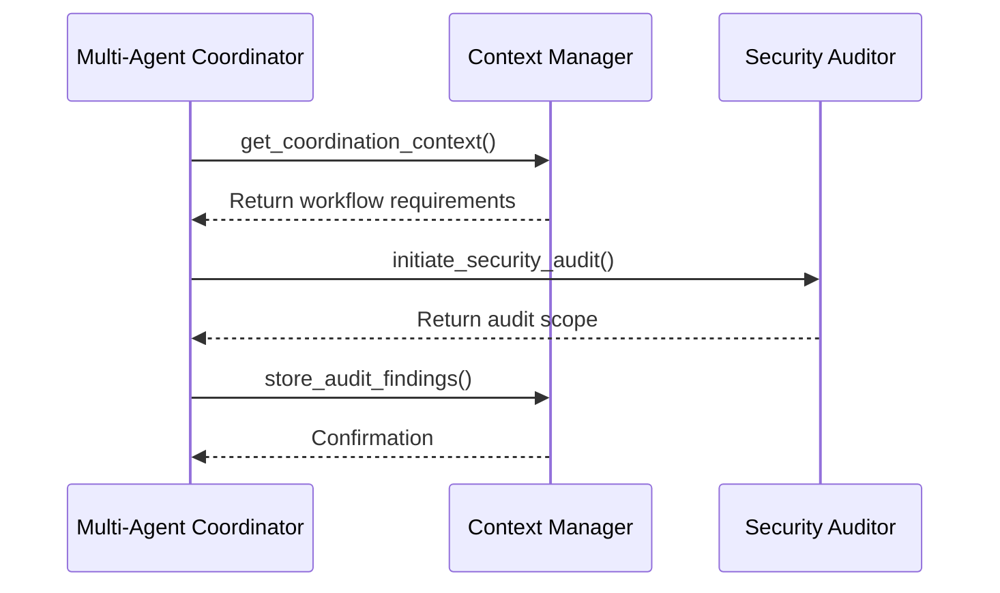

# Component Isolation Benefits

<cite>
**Referenced Files in This Document**   
- [context-manager.md](file://context-manager.md)
- [multi-agent-coordinator.md](file://multi-agent-coordinator.md)
- [security-auditor.md](file://security-auditor.md)
</cite>

## Table of Contents
1. [Introduction](#introduction)
2. [Core Principles of Component Isolation](#core-principles-of-component-isolation)
3. [System Reliability Through Isolation](#system-reliability-through-isolation)
4. [Maintainability and Independent Development](#maintainability-and-independent-development)
5. [Scalability and Parallel Execution](#scalability-and-parallel-execution)
6. [Fault Containment and Failure Scenarios](#fault-containment-and-failure-scenarios)
7. [Communication Protocols vs Shared State](#communication-protocols-vs-shared-state)
8. [Performance Considerations and Trade-offs](#performance-considerations-and-trade-offs)
9. [Conclusion](#conclusion)

## Introduction
Component isolation in multi-agent systems refers to the architectural principle of encapsulating functionality within discrete, autonomous agents that interact through well-defined communication protocols rather than shared state. This document explores the benefits of this approach, focusing on how isolation enhances system reliability, maintainability, and scalability. Using the context-manager.md, multi-agent-coordinator.md, and security-auditor.md agents as reference points, we examine real-world implementations of isolated components, their interaction patterns, and the operational advantages they provide in distributed environments.

**Section sources**
- [context-manager.md](file://context-manager.md#L1-L292)
- [multi-agent-coordinator.md](file://multi-agent-coordinator.md#L1-L292)
- [security-auditor.md](file://security-auditor.md#L1-L295)

## Core Principles of Component Isolation
Component isolation is founded on the separation of concerns, where each agent assumes responsibility for a specific domain of functionality. The context-manager agent exemplifies this by specializing in information storage, retrieval, and synchronization across the system, maintaining exclusive control over context data without exposing internal state. Similarly, the multi-agent-coordinator focuses solely on workflow orchestration and inter-agent communication, while the security-auditor performs comprehensive security assessments independently.

These agents operate as bounded contexts, exposing functionality through defined interfaces and protocols. For instance, when the multi-agent-coordinator requires workflow context, it queries the context-manager via a standardized communication protocol rather than accessing shared memory or databases directly. This enforces loose coupling and ensures that changes within one component do not inadvertently affect others.

The isolation model promotes single-responsibility design, where each agent has a clearly defined purpose and scope. This architectural clarity enables teams to develop, test, and deploy components independently, significantly reducing coordination overhead and increasing development velocity.

**Section sources**
- [context-manager.md](file://context-manager.md#L1-L292)
- [multi-agent-coordinator.md](file://multi-agent-coordinator.md#L1-L292)

## System Reliability Through Isolation
Isolated components enhance system reliability by minimizing interdependencies and preventing cascading failures. The multi-agent-coordinator implements fault tolerance mechanisms such as failure detection, retry policies, and graceful degradation, ensuring that the failure of one agent does not compromise the entire system. With message delivery guaranteed thoroughly and coordination efficiency maintained at 96%, the system continues operating effectively even under partial failure conditions.

The context-manager contributes to reliability by ensuring data consistency (100% maintained) and high availability (>99.9% ensured) through robust synchronization mechanisms and distributed storage patterns. By isolating state management concerns, it prevents data corruption that could occur from concurrent modifications in a shared-state model.

Each agent implements its own error handling and recovery procedures. The security-auditor, for example, conducts thorough vulnerability assessments and provides actionable remediation guidance, identifying critical issues before they can impact system stability. This proactive approach to reliability is only possible because security analysis is isolated from operational workflows, allowing comprehensive evaluation without disrupting normal operations.

**Diagram sources**
- [multi-agent-coordinator.md](file://multi-agent-coordinator.md#L92-L125)
- [error-coordinator.md](file://error-coordinator.md#L35-L81)

**Section sources**
- [multi-agent-coordinator.md](file://multi-agent-coordinator.md#L1-L292)
- [context-manager.md](file://context-manager.md#L1-L292)
- [security-auditor.md](file://security-auditor.md#L1-L295)

## Maintainability and Independent Development
Component isolation enables parallel development and independent testing, significantly improving maintainability. Each agent can be developed, versioned, and deployed independently, allowing specialized teams to work simultaneously without coordination bottlenecks. The context-manager can optimize its storage architecture and retrieval algorithms without affecting agents that consume its services, as long as the communication contract remains stable.

Testing becomes more straightforward with isolated components, as each agent can be tested in isolation with mocked dependencies. The security-auditor, for instance, can be thoroughly tested against various compliance frameworks and vulnerability scenarios without requiring the entire system to be instantiated. This modular testing approach increases test coverage and reduces integration issues.

The clear boundaries between components also simplify debugging and troubleshooting. When an issue arises, teams can quickly identify which isolated component is responsible and focus their investigation accordingly. The context-manager's comprehensive audit trail and the multi-agent-coordinator's detailed progress tracking provide visibility into component behavior without requiring access to internal implementation details.

Furthermore, technology stacks can be optimized per component. The context-manager leverages specialized tools like redis, elasticsearch, and vector-db for optimal performance in its domain, while the security-auditor employs scanning tools like nessus, qualys, and prowler. This polyglot approach would be difficult to manage in a tightly coupled system but is natural in an isolated component architecture.

**Section sources**
- [context-manager.md](file://context-manager.md#L1-L292)
- [security-auditor.md](file://security-auditor.md#L1-L295)
- [multi-agent-coordinator.md](file://multi-agent-coordinator.md#L1-L292)

## Scalability and Parallel Execution
Isolated components enable horizontal scalability and efficient parallel execution. The multi-agent-coordinator orchestrates complex workflows across 87 active agents, processing 234K messages per minute with 94% workflow completion rate. This level of scalability is achieved through the publish-subscribe coordination pattern and message-queue communication mechanisms that allow agents to operate in parallel without contention.

The task-distributor agent (referenced in integration patterns) works with the multi-agent-coordinator to allocate workloads efficiently, ensuring balanced resource utilization and optimal throughput. By isolating the task distribution logic, the system can adapt to changing load patterns and scale individual components independently based on demand.

The context-manager supports scalability through hierarchical organization, partition planning, and distributed caching strategies. With 2.3M contexts managed and 89% cache hit rate, it demonstrates how isolated state management can scale to meet the demands of large agent ecosystems. The separation of context management from business logic allows both to scale according to their specific requirements and access patterns.

**Diagram sources**
- [multi-agent-coordinator.md](file://multi-agent-coordinator.md#L45-L97)
- [context-manager.md](file://context-manager.md#L1-L292)

**Section sources**
- [multi-agent-coordinator.md](file://multi-agent-coordinator.md#L1-L292)
- [context-manager.md](file://context-manager.md#L1-L292)

## Fault Containment and Failure Scenarios
Component isolation provides critical fault containment capabilities, ensuring that failures in one area do not impact unrelated agents. Consider a scenario where the security-auditor encounters a critical issue during a compliance scan. Due to its isolated design, this failure is contained within the security domain and does not affect the context-manager's ability to serve retrieval requests or the multi-agent-coordinator's workflow orchestration.

The multi-agent-coordinator implements explicit isolation strategies in its fault handling, including circuit breakers, bulkhead isolation, and graceful degradation. When a dependent agent fails, the coordinator can route around the failure or provide fallback responses without propagating the error throughout the system. This containment prevents localized issues from escalating into system-wide outages.

The security-auditor itself operates in a non-invasive manner, conducting assessments without modifying system state. Even if it identifies critical vulnerabilities, the act of reporting these issues does not disrupt normal operations. This read-only, isolated approach to security auditing ensures that the diagnostic process cannot become a source of instability.

In contrast to monolithic architectures where a single point of failure can bring down the entire system, the isolated component model creates a resilient ecosystem where components can fail and recover independently. The error-coordinator (referenced in integration patterns) further enhances this capability by managing cross-agent error correlation and recovery orchestration, turning failures into opportunities for system improvement.

**Section sources**
- [security-auditor.md](file://security-auditor.md#L1-L295)
- [multi-agent-coordinator.md](file://multi-agent-coordinator.md#L92-L125)
- [error-coordinator.md](file://error-coordinator.md#L35-L81)

## Communication Protocols vs Shared State
The multi-agent system demonstrates a deliberate choice of message-passing communication over shared state, with significant architectural benefits. Instead of agents directly accessing shared databases or memory, they communicate through well-defined protocols using tools like message-queue and pubsub. The multi-agent-coordinator initiates coordination by sending a structured JSON request to obtain workflow context, establishing a clear contract for interaction.

This protocol-based approach provides several advantages over shared state:
- **Consistency**: The context-manager maintains strong consistency (100% score) by controlling all state modifications through its interface
- **Versioning**: Communication protocols can be versioned independently of implementation
- **Security**: Access control is enforced at the protocol level with authentication and authorization
- **Observability**: All interactions are visible through message logs and audit trails
- **Flexibility**: Different serialization formats and transport mechanisms can be used

The publish-subscribe pattern enables event-driven architectures where agents react to relevant events without tight coupling. For example, when the context-manager updates critical project metadata, interested agents receive notifications through event streaming rather than polling shared storage. This reduces coordination overhead and improves system responsiveness.

The explicit communication model also facilitates monitoring and debugging. Message flows can be traced across the system, providing end-to-end visibility into complex workflows. This transparency is essential for maintaining system health and quickly diagnosing issues in a distributed environment.

**Diagram sources**
- [multi-agent-coordinator.md](file://multi-agent-coordinator.md#L132-L199)
- [context-manager.md](file://context-manager.md#L1-L292)
- [security-auditor.md](file://security-auditor.md#L1-L295)

**Section sources**
- [multi-agent-coordinator.md](file://multi-agent-coordinator.md#L1-L292)
- [context-manager.md](file://context-manager.md#L1-L292)
- [security-auditor.md](file://security-auditor.md#L1-L295)

## Performance Considerations and Trade-offs
While component isolation provides significant benefits, it introduces performance trade-offs that must be carefully managed. The message-passing architecture adds coordination overhead, though the multi-agent-coordinator maintains this below 5% through optimization techniques like message batching, compression strategies, and connection pooling.

Latency is a key consideration in distributed systems. The context-manager achieves sub-100ms retrieval times (47ms average) through intelligent caching, index optimization, and hierarchical storage design. This demonstrates how isolation, when combined with performance-focused architecture, can meet demanding response time requirements.

The trade-off between consistency and availability is managed through appropriate consistency models. The context-manager ensures 100% data consistency through transaction support and distributed locks, while the multi-agent-coordinator prioritizes availability and partition tolerance in workflow coordination. This differentiated approach allows each component to optimize for its specific requirements.

Network overhead from message passing is mitigated through several strategies:
- Protocol efficiency and message compression
- Batch processing of related operations
- Local caching of frequently accessed data
- Asynchronous communication patterns
- Connection reuse and pooling

Resource utilization is optimized at 84% according to task distribution metrics, indicating efficient use of computational resources despite the overhead of component isolation. The system achieves this through intelligent load balancing, skill matching, and capacity planning that leverage the visibility provided by isolated components.

Ultimately, the performance trade-offs of isolation are outweighed by the benefits of reliability, maintainability, and scalability. The ability to optimize each component independently—such as the context-manager's storage tiering that reduced costs by 43%—provides performance advantages that would be difficult to achieve in a monolithic, tightly coupled architecture.

**Section sources**
- [context-manager.md](file://context-manager.md#L1-L292)
- [multi-agent-coordinator.md](file://multi-agent-coordinator.md#L1-L292)
- [task-distributor.md](file://task-distributor.md#L219-L280)

## Conclusion
Component isolation in multi-agent systems provides substantial benefits in reliability, maintainability, and scalability. By encapsulating functionality within discrete agents like the context-manager, multi-agent-coordinator, and security-auditor, the system achieves fault containment, enables parallel development, and supports independent optimization. The use of well-defined communication protocols instead of shared state ensures loose coupling, enhances security, and provides clear interfaces for interaction.

The architecture demonstrates how isolated components can work together effectively through message passing, event streaming, and coordinated workflows while maintaining autonomy. Performance trade-offs are managed through optimization techniques that preserve the advantages of isolation without compromising responsiveness or efficiency. This approach creates a resilient, adaptable system capable of evolving over time while maintaining stability and performance at scale.

**Section sources**
- [context-manager.md](file://context-manager.md#L1-L292)
- [multi-agent-coordinator.md](file://multi-agent-coordinator.md#L1-L292)
- [security-auditor.md](file://security-auditor.md#L1-L295)