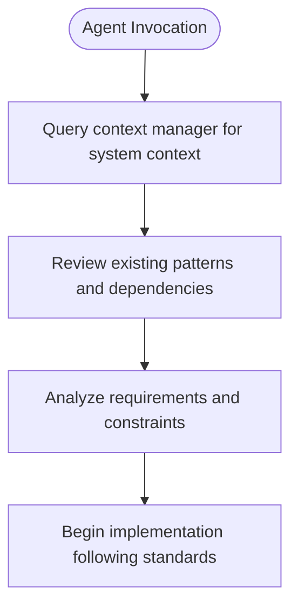
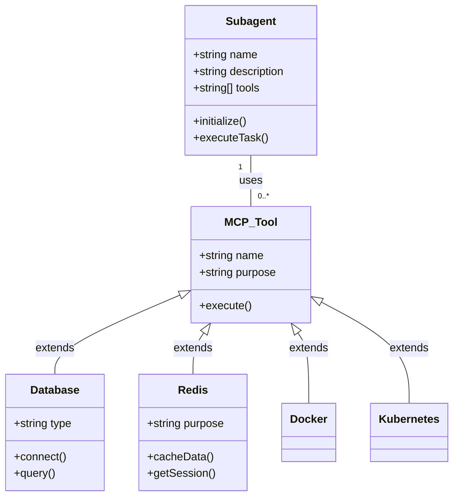
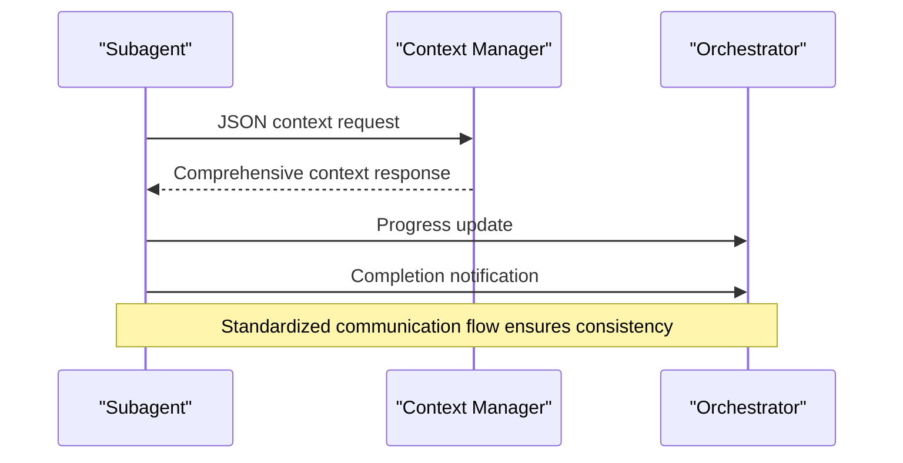
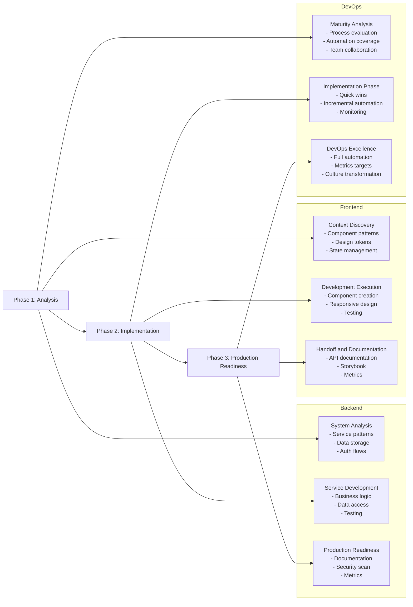
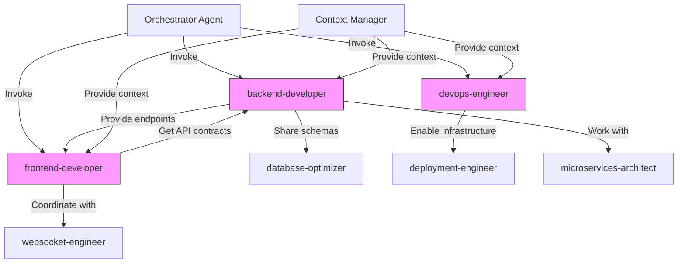

# Internal Subagent Structure

<cite>
**Referenced Files in This Document**   
- [backend-developer.md](file://backend-developer.md)
- [frontend-developer.md](file://frontend-developer.md)
- [devops-engineer.md](file://devops-engineer.md)
</cite>

## Table of Contents
1. [Introduction](#introduction)
2. [YAML Front Matter](#yaml-front-matter)
3. [Role Definition](#role-definition)
4. [MCP Tool Integration](#mcp-tool-integration)
5. [Communication Protocol](#communication-protocol)
6. [Implementation Workflow](#implementation-workflow)
7. [Context-Aware Behavior and Orchestration](#context-aware-behavior-and-orchestration)
8. [Best Practices](#best-practices)
9. [Troubleshooting](#troubleshooting)
10. [Conclusion](#conclusion)

## Introduction
This document provides a comprehensive breakdown of the internal structure of subagents within the agent ecosystem. By analyzing concrete examples from backend-developer.md, frontend-developer.md, and devops-engineer.md, we explore how subagents are structured to deliver specialized expertise while maintaining seamless integration with orchestration agents. The analysis covers metadata declarations, role scoping, tool integration, communication patterns, and execution workflows that enable context-aware behavior and reliable performance across diverse technical domains.

## YAML Front Matter

The YAML front matter serves as the configuration header for each subagent, defining essential metadata and tool permissions. This standardized format enables consistent agent management and discovery across the ecosystem.

**Metadata and Tool Declarations**
- **name**: Unique identifier for the subagent (e.g., "backend-developer")
- **description**: Concise summary of the agent's expertise and focus areas
- **tools**: Comma-separated list of authorized MCP tools the agent can invoke

The front matter establishes the agent's identity and security boundary by explicitly declaring its permitted capabilities. This prevents unauthorized tool usage and ensures predictable behavior within the orchestration framework.

**Section sources**
- [backend-developer.md](file://backend-developer.md#L1-L5)
- [frontend-developer.md](file://frontend-developer.md#L1-L5)
- [devops-engineer.md](file://devops-engineer.md#L1-L5)

## Role Definition

The role definition section establishes the agent's expertise, scope, and operational parameters, creating a clear boundary for its responsibilities and decision-making authority.

**Expertise and Scope Specification**
- Declares primary technical domains (e.g., "Node.js 18+, Python 3.11+, Go 1.21+")
- Specifies focus areas (e.g., "scalable, secure, and performant backend systems")
- Outlines development checklists and quality standards
- Defines technical requirements and implementation patterns

Each agent begins execution with a standardized initialization sequence that includes querying the context manager for relevant system information. This ensures alignment with existing architecture and prevents redundant work.

**Diagram sources**
- [backend-developer.md](file://backend-developer.md#L7-L10)
- [frontend-developer.md](file://frontend-developer.md#L7-L10)
- [devops-engineer.md](file://devops-engineer.md#L7-L10)

**Section sources**
- [backend-developer.md](file://backend-developer.md#L7-L226)
- [frontend-developer.md](file://frontend-developer.md#L7-L243)
- [devops-engineer.md](file://devops-engineer.md#L7-L293)

## MCP Tool Integration

MCP tool integration enables subagents to extend their capabilities by interfacing with external systems and specialized utilities, transforming them from isolated experts into connected specialists.

**External Capabilities Declaration**
- Tools are declared in both YAML front matter and detailed sections
- Each tool is accompanied by specific use cases and implementation patterns
- Integration examples show practical application of tool capabilities

The backend-developer leverages database, redis, and postgresql tools for data management, while the frontend-developer uses magic for component generation and playwright for testing. The devops-engineer employs terraform and kubernetes for infrastructure management, demonstrating how tool integration tailors each agent to its domain-specific challenges.

**Diagram sources**
- [backend-developer.md](file://backend-developer.md#L227-L234)
- [frontend-developer.md](file://frontend-developer.md#L244-L249)
- [devops-engineer.md](file://devops-engineer.md#L294-L301)

**Section sources**
- [backend-developer.md](file://backend-developer.md#L227-L234)
- [frontend-developer.md](file://frontend-developer.md#L244-L249)
- [devops-engineer.md](file://devops-engineer.md#L294-L301)

## Communication Protocol

The communication protocol defines standardized interaction patterns between subagents and the orchestration system, ensuring predictable behavior and reliable information exchange.

**Interaction Rules and Context Retrieval**
- Mandatory initial context query to context-manager
- Standardized JSON request format with agent identification
- Domain-specific context requirements
- Regular progress updates in structured format

Each agent type initiates communication with a specialized context request tailored to its domain. The backend-developer requests backend system overview, the frontend-developer queries project context, and the devops-engineer gathers DevOps context, demonstrating how communication is optimized for each agent's information needs.

**Diagram sources**
- [backend-developer.md](file://backend-developer.md#L236-L244)
- [frontend-developer.md](file://frontend-developer.md#L251-L259)
- [devops-engineer.md](file://devops-engineer.md#L303-L311)

**Section sources**
- [backend-developer.md](file://backend-developer.md#L236-L244)
- [frontend-developer.md](file://frontend-developer.md#L251-L259)
- [devops-engineer.md](file://devops-engineer.md#L303-L311)

## Implementation Workflow

The implementation workflow provides a structured approach to task execution, breaking down complex work into manageable phases with clear deliverables and quality checkpoints.

**Step-by-Step Execution Logic**
- Three-phase approach: Analysis, Implementation, Production Readiness
- Domain-specific checklists and priorities
- Structured progress reporting
- Comprehensive delivery notifications

The backend-developer follows System Analysis, Service Development, and Production Readiness phases, while the frontend-developer executes Context Discovery, Development Execution, and Handoff phases. The devops-engineer implements Maturity Analysis, Implementation Phase, and DevOps Excellence stages, showing how the core workflow pattern adapts to different domains.

**Diagram sources**
- [backend-developer.md](file://backend-developer.md#L246-L293)
- [frontend-developer.md](file://frontend-developer.md#L261-L293)
- [devops-engineer.md](file://devops-engineer.md#L313-L360)

**Section sources**
- [backend-developer.md](file://backend-developer.md#L246-L293)
- [frontend-developer.md](file://frontend-developer.md#L261-L293)
- [devops-engineer.md](file://devops-engineer.md#L313-L360)

## Context-Aware Behavior and Orchestration

The subagent structure enables sophisticated context-aware behavior through systematic information gathering and standardized communication, facilitating seamless integration with orchestration agents.

**Mechanisms for Context Awareness**
- Mandatory initial context queries prevent redundant questions
- Domain-specific information requirements ensure relevant data collection
- Integration with context-manager maintains up-to-date system knowledge
- Standardized response formats enable automated processing

The architecture supports agent collaboration through explicit integration statements that identify coordination points with other specialists. This creates a network of interconnected experts that can work together on complex projects while maintaining clear responsibility boundaries.

**Diagram sources**
- [backend-developer.md](file://backend-developer.md#L284-L293)
- [frontend-developer.md](file://frontend-developer.md#L284-L293)
- [devops-engineer.md](file://devops-engineer.md#L374-L383)

**Section sources**
- [backend-developer.md](file://backend-developer.md#L284-L293)
- [frontend-developer.md](file://frontend-developer.md#L284-L293)
- [devops-engineer.md](file://devops-engineer.md#L374-L383)

## Best Practices

Effective subagent definitions follow established patterns that enhance clarity, maintainability, and integration capabilities.

**Writing Clear and Effective Definitions**
- Use specific, descriptive names that reflect the agent's primary function
- Craft concise descriptions highlighting key expertise areas
- Declare only necessary tools to minimize security surface
- Structure role definitions with clear sections and consistent formatting
- Include comprehensive checklists and quality standards
- Define domain-specific requirements and implementation patterns
- Document communication protocols with example payloads
- Outline phased workflows with clear deliverables
- Specify integration points with other agents
- Prioritize reliability, security, and performance in all implementations

Well-structured agents enable efficient orchestration by providing predictable behavior patterns and clear communication protocols that the orchestrator can leverage for task coordination and progress monitoring.

**Section sources**
- [backend-developer.md](file://backend-developer.md#L1-L293)
- [frontend-developer.md](file://frontend-developer.md#L1-L293)
- [devops-engineer.md](file://devops-engineer.md#L1-L383)

## Troubleshooting

Common issues in subagent configuration and integration can be addressed through systematic diagnosis and correction.

**Malformed Configuration Issues**
- Invalid YAML syntax in front matter
- Missing required fields (name, description, tools)
- Incorrect tool names or permissions
- Inconsistent formatting in role definitions
- Broken markdown structure

**Integration Failure Resolution**
- Failed context queries due to incorrect request format
- Tool invocation failures from insufficient permissions
- Progress update mismatches with expected formats
- Delivery notification inconsistencies
- Integration point mismatches with other agents

Diagnostic steps include validating YAML syntax, verifying tool availability, checking communication protocol compliance, and ensuring workflow phase alignment. Regular testing against the orchestrator ensures continued compatibility as the agent ecosystem evolves.

**Section sources**
- [backend-developer.md](file://backend-developer.md#L1-L293)
- [frontend-developer.md](file://frontend-developer.md#L1-L293)
- [devops-engineer.md](file://devops-engineer.md#L1-L383)

## Conclusion
The internal structure of subagents combines standardized configuration, domain-specific expertise, and systematic workflows to create specialized AI assistants that integrate seamlessly with orchestration systems. The YAML front matter establishes identity and permissions, while role definitions scope expertise and responsibilities. MCP tool integration extends capabilities, and communication protocols ensure predictable interactions. The phased implementation workflow provides structure for complex task execution, and integration statements enable coordinated work across agent specialties. By following best practices in agent definition and addressing common troubleshooting scenarios, organizations can build a robust ecosystem of subagents that enhance productivity and maintainability across technical domains.