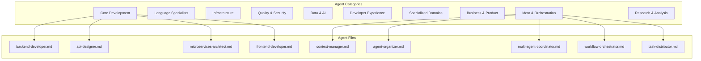
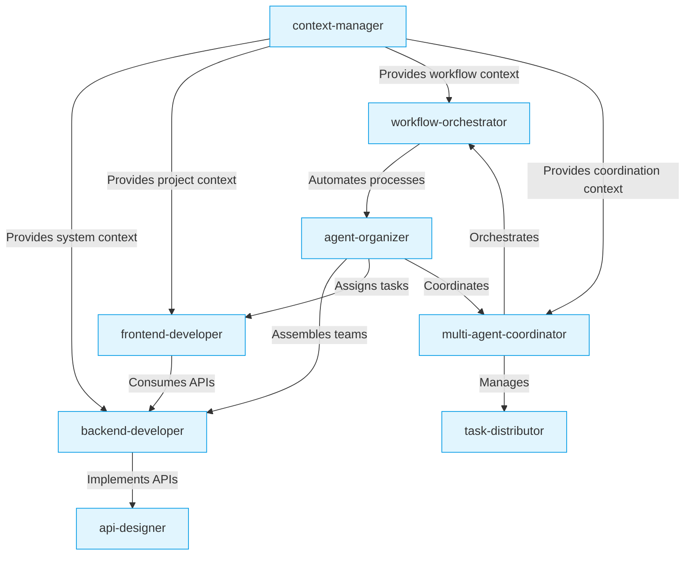
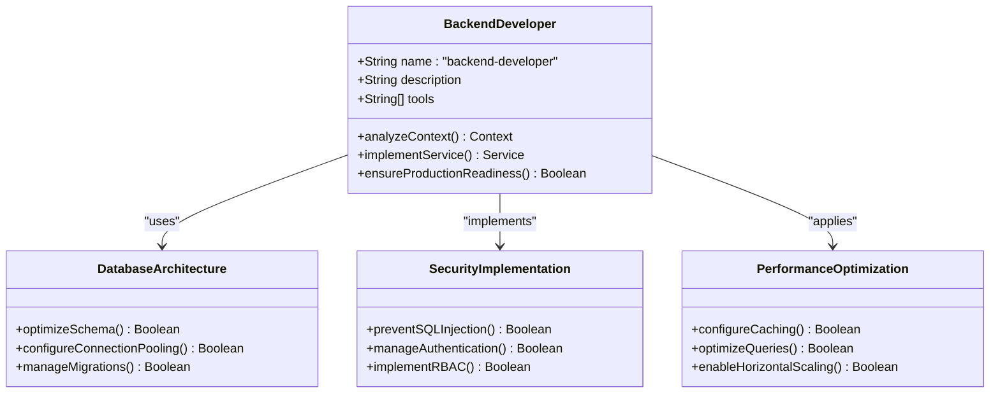
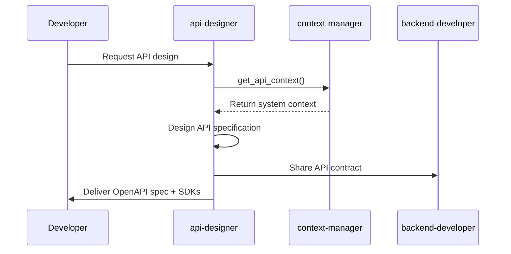
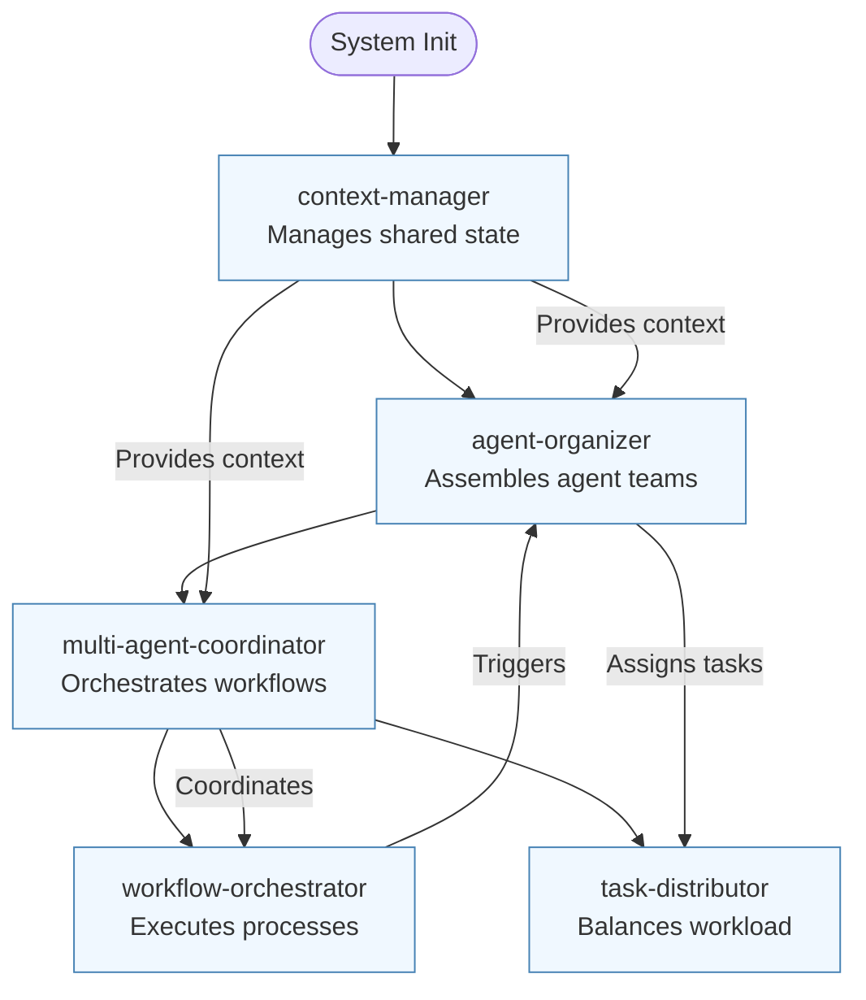
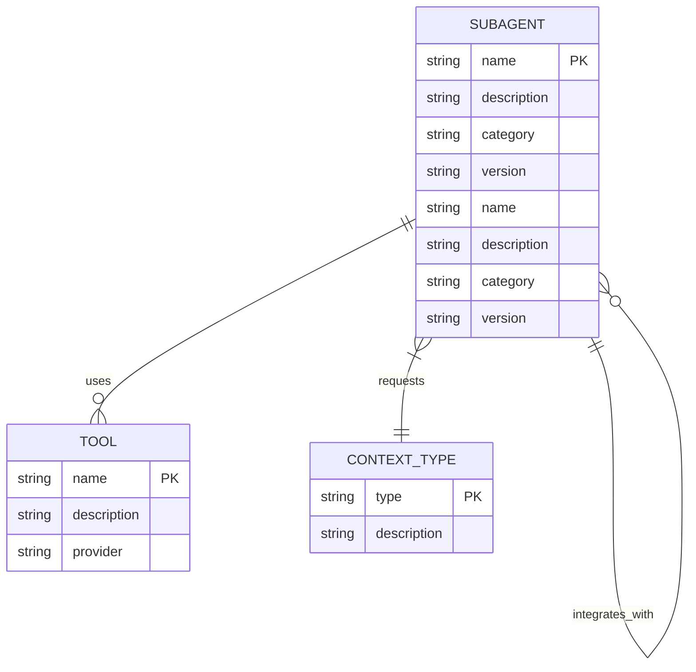

# Modularity and Reuse

<cite>
**Referenced Files in This Document**   
- [README.md](file://README.md)
- [backend-developer.md](file://backend-developer.md)
- [api-designer.md](file://api-designer.md)
- [microservices-architect.md](file://microservices-architect.md)
- [frontend-developer.md](file://frontend-developer.md)
- [context-manager.md](file://context-manager.md)
- [agent-organizer.md](file://agent-organizer.md)
- [multi-agent-coordinator.md](file://multi-agent-coordinator.md)
- [workflow-orchestrator.md](file://workflow-orchestrator.md)
- [task-distributor.md](file://task-distributor.md)
</cite>

## Table of Contents
1. [Introduction](#introduction)
2. [Project Structure and Modularity](#project-structure-and-modularity)
3. [Core Components and Reusability](#core-components-and-reusability)
4. [Architecture Overview](#architecture-overview)
5. [Detailed Component Analysis](#detailed-component-analysis)
6. [Dependency Management and Integration](#dependency-management-and-integration)
7. [Versioning and Naming Conventions](#versioning-and-naming-conventions)
8. [Challenges in Agent Discovery and Selection](#challenges-in-agent-discovery-and-selection)
9. [Conclusion](#conclusion)

## Introduction
This document explores the modular architecture of the VoltAgent subagent system, focusing on how component-based design enables independent development, testing, sharing, and reuse of subagents across projects. The system exemplifies a production-ready framework where specialized AI agents can be leveraged without modification in diverse contexts. By analyzing the structure, communication protocols, and integration patterns, this documentation highlights best practices in modularity, versioning, and dependency management that support seamless reuse while minimizing regression risks.

## Project Structure and Modularity
The agents system follows a flat, file-based modular structure where each subagent is defined in its own Markdown file. This design enables straightforward discovery, version control, and reuse across projects.

**Diagram sources**
- [README.md](file://README.md#L100-L200)

**Section sources**
- [README.md](file://README.md#L50-L250)

## Core Components and Reusability
Each subagent operates as an independent module with clearly defined responsibilities, tools, and communication protocols. This enables reuse across different projects without modification. For example, the `backend-developer.md` subagent can be applied to any project requiring scalable API development, while `api-designer.md` consistently delivers REST and GraphQL APIs with proper documentation.

The standardized structure across all subagents ensures predictability and ease of integration:
- **name**: Unique identifier following kebab-case convention
- **description**: Clear capability summary
- **tools**: Declared MCP tool dependencies
- **Role definition**: Expertise and focus areas
- **Checklists**: Quality and implementation standards
- **Communication Protocol**: Context retrieval patterns
- **Integration guidance**: Collaboration with other agents

This consistency allows developers to quickly understand and leverage any subagent regardless of domain specificity.

**Section sources**
- [backend-developer.md](file://backend-developer.md#L1-L20)
- [api-designer.md](file://api-designer.md#L1-L20)
- [microservices-architect.md](file://microservices-architect.md#L1-L20)

## Architecture Overview
The system architecture is built around a decentralized model where subagents operate independently but coordinate through shared context and standardized communication protocols. This design enables modularity while supporting complex workflows through orchestration.

**Diagram sources**
- [context-manager.md](file://context-manager.md#L20-L40)
- [agent-organizer.md](file://agent-organizer.md#L20-L40)
- [multi-agent-coordinator.md](file://multi-agent-coordinator.md#L20-L40)

## Detailed Component Analysis

### Backend Developer Analysis
The backend-developer subagent exemplifies modularity through its focused expertise in server-side development across multiple languages (Node.js, Python, Go). It integrates with database, redis, and postgresql tools while following strict API design and security standards.

**Diagram sources**
- [backend-developer.md](file://backend-developer.md#L20-L50)

**Section sources**
- [backend-developer.md](file://backend-developer.md#L1-L227)

### API Designer Analysis
The api-designer subagent demonstrates reusability through its standardized approach to API design, supporting both REST and GraphQL patterns. It generates OpenAPI specifications and integrates with development tools like swagger-ui and postman.

**Diagram sources**
- [api-designer.md](file://api-designer.md#L20-L40)
- [context-manager.md](file://context-manager.md#L20-L40)

**Section sources**
- [api-designer.md](file://api-designer.md#L1-L244)

### Meta Agents Analysis
The meta-agents (context-manager, agent-organizer, multi-agent-coordinator) form the orchestration layer that enables modular composition of specialized agents. These components provide the infrastructure for reuse and coordination.

**Diagram sources**
- [context-manager.md](file://context-manager.md#L1-L30)
- [agent-organizer.md](file://agent-organizer.md#L1-L30)
- [multi-agent-coordinator.md](file://multi-agent-coordinator.md#L1-L30)

**Section sources**
- [context-manager.md](file://context-manager.md#L1-L293)
- [agent-organizer.md](file://agent-organizer.md#L1-L293)
- [multi-agent-coordinator.md](file://multi-agent-coordinator.md#L1-L293)

## Dependency Management and Integration
The system employs a declarative approach to dependency management through the `tools` field in each subagent definition. This explicit declaration enables fine-grained control over capabilities while supporting reuse across different environments.

Integration between subagents follows standardized communication protocols where agents request context from the context-manager before executing tasks. This pattern ensures architectural alignment and prevents redundant work. For example:
- backend-developer queries for backend system overview
- api-designer requests API design context
- microservices-architect gathers system discovery information

The hierarchical precedence of project-specific subagents over global ones (`.claude/agents/` vs `~/.claude/agents/`) enables customization while maintaining baseline functionality.

**Diagram sources**
- [README.md](file://README.md#L300-L320)
- [backend-developer.md](file://backend-developer.md#L5-L10)

**Section sources**
- [README.md](file://README.md#L250-L350)
- [backend-developer.md](file://backend-developer.md#L1-L227)

## Versioning and Naming Conventions
The system follows consistent naming conventions using kebab-case for subagent filenames and identifiers (e.g., `backend-developer.md`, `api-designer.md`). This predictable pattern facilitates discovery and automation.

While explicit versioning is not implemented in the current structure, the design supports versioning through:
- File-based isolation enabling parallel versions
- Clear semantic names indicating purpose
- Standardized structure allowing automated comparison
- Project-level override capability

The categorization system in README.md provides logical grouping that could be extended to support versioned directories or semantic versioning in filenames (e.g., `backend-developer-v2.md`). The current approach prioritizes simplicity and ease of use while maintaining backward compatibility.

**Section sources**
- [README.md](file://README.md#L100-L200)

## Challenges in Agent Discovery and Selection
Despite the comprehensive catalog, discovering and selecting appropriate subagents presents challenges:
- **Information overload**: With over 100 specialized agents, users may struggle to identify the best fit
- **Context mismatch**: Agents designed for specific tech stacks may not be immediately recognizable as relevant
- **Redundancy**: Similar capabilities across agents (e.g., frontend-developer vs react-specialist) create selection ambiguity

The system addresses these challenges through:
- **Categorization**: Clear grouping into 10 domains (Core Development, Language Specialists, etc.)
- **Standardized metadata**: Consistent name, description, and tools fields
- **Cross-linking**: README.md provides an organized index with direct links
- **Integration guidance**: Each agent documents collaboration patterns with others

Future improvements could include:
- **Metadata tagging**: Adding technology stack, complexity level, and domain tags
- **Search functionality**: Implementing full-text search across agent definitions
- **Recommendation engine**: Suggesting agents based on project characteristics
- **Compatibility matrix**: Documenting agent interoperability

**Section sources**
- [README.md](file://README.md#L50-L200)

## Conclusion
The VoltAgent subagent system exemplifies effective modularity and reuse through its component-based design. Each subagent operates as an independent, production-ready module that can be shared across projects without modification. The standardized structure, clear communication protocols, and hierarchical precedence system enable seamless integration while minimizing regression risks.

Key success factors include:
- **Consistent design patterns** across all subagents
- **Explicit dependency declarations** through tool specifications
- **Context-driven execution** ensuring architectural alignment
- **Hierarchical organization** supporting both global and project-specific agents
- **Comprehensive documentation** enabling discoverability

This architecture demonstrates how modular design enables specialized expertise to be captured, shared, and reused at scale, significantly enhancing development efficiency and consistency across projects.