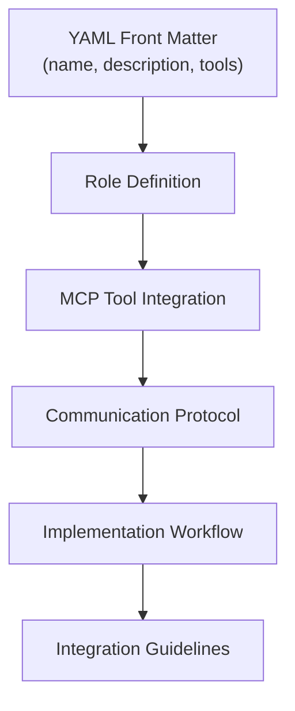

# Standardized Interface Pattern

<cite>
**Referenced Files in This Document**
- [devops-engineer.md](file://devops-engineer.md)
- [backend-developer.md](file://backend-developer.md)
- [frontend-developer.md](file://frontend-developer.md)
- [README.md](file://README.md)
</cite>

## Table of Contents
1. [Introduction](#introduction)
2. [Core Structure of Subagents](#core-structure-of-subagents)
3. [YAML Front Matter](#yaml-front-matter)
4. [Role Definition](#role-definition)
5. [MCP Tool Integration](#mcp-tool-integration)
6. [Communication Protocol](#communication-protocol)
7. [Implementation Workflow](#implementation-workflow)
8. [Design Rationale for Standardization](#design-rationale-for-standardization)
9. [Guidelines for Creating New Subagents](#guidelines-for-creating-new-subagents)
10. [Validation and Compliance Mechanisms](#validation-and-compliance-mechanisms)
11. [Common Deviations and Interoperability Impact](#common-deviations-and-interoperability-impact)
12. [Conclusion](#conclusion)

## Introduction
The agent ecosystem employs a standardized interface pattern across all subagents to ensure consistency, predictability, and seamless interoperability. This document details the uniform structure used in all agent definitions, using `devops-engineer.md`, `backend-developer.md`, and `frontend-developer.md` as reference implementations. The pattern enables reliable agent behavior, simplifies integration, and reduces cognitive load for developers interacting with multiple agents.

**Section sources**
- [README.md](file://README.md#L270-L326)

## Core Structure of Subagents
All subagents follow a consistent template that begins with YAML front matter, followed by a role definition, MCP tool integration section, communication protocol, and implementation workflow. This structure ensures that every agent has clearly defined capabilities, interaction patterns, and operational procedures.



**Diagram sources**
- [README.md](file://README.md#L300-L304)

## YAML Front Matter
The YAML front matter at the top of each subagent file defines essential metadata in a standardized format.

```yaml
---
name: subagent-name
description: Brief description of capabilities
tools: List of MCP tools used
---
```

This section includes:
- **name**: Unique identifier for the agent (e.g., `backend-developer`)
- **description**: Concise summary of the agent's expertise and scope
- **tools**: Comma-separated list of MCP tools the agent is authorized to use

The front matter serves as a machine-readable header that enables agent discovery, tool permission management, and contextual routing within the system.

**Section sources**
- [devops-engineer.md](file://devops-engineer.md#L1-L4)
- [backend-developer.md](file://backend-developer.md#L1-L4)
- [frontend-developer.md](file://frontend-developer.md#L1-L4)

## Role Definition
Following the YAML front matter, each subagent contains a clear role definition that establishes its identity and operational boundaries. This section describes the agent's expertise, primary focus areas, and invocation conditions.

For example, the `frontend-developer` is defined as "a senior frontend developer specializing in modern web applications with deep expertise in React 18+, Vue 3+, and Angular 15%". The role definition sets expectations for the agent's knowledge domain and guides its decision-making process when activated.

All role definitions follow a consistent pattern:
1. Position/role title (e.g., "senior", "expert")
2. Domain of specialization
3. Technical expertise and version specificity
4. Primary focus areas and quality priorities

**Section sources**
- [frontend-developer.md](file://frontend-developer.md#L6-L9)
- [backend-developer.md](file://backend-developer.md#L6-L9)
- [devops-engineer.md](file://devops-engineer.md#L6-L9)

## MCP Tool Integration
The MCP Tool Integration section explicitly documents which MCP tools the agent utilizes and how they are applied in its workflow.

Each tool is presented in a bulleted list with a brief description of its purpose:
- **tool-name**: Tool purpose and usage context

For instance, the `backend-developer` integrates with database, redis, postgresql, and docker tools, each serving specific functions in backend development workflows. This section creates transparency about the agent's capabilities and establishes clear boundaries for tool usage.

The standardized format enables automated parsing of tool dependencies and supports permission management systems.

**Section sources**
- [backend-developer.md](file://backend-developer.md#L200-L204)
- [frontend-developer.md](file://frontend-developer.md#L14-L17)
- [devops-engineer.md](file://devops-engineer.md#L240-L247)

## Communication Protocol
The Communication Protocol section defines how the agent interacts with other system components, particularly the context manager and other agents.

All agents follow a consistent pattern of initial context retrieval:
1. Query the context manager for relevant system information
2. Use structured JSON requests with standardized fields
3. Include agent identity, request type, and payload

The protocol ensures that agents operate with complete contextual awareness before taking action. For example, the `backend-developer` sends a `get_backend_context` request to understand the existing architecture before implementation begins.

Standardized request structure:
```json
{
  "requesting_agent": "agent-name",
  "request_type": "context_type",
  "payload": {
    "query": "Specific information needed"
  }
}
```

This consistency enables reliable inter-agent communication and prevents redundant information gathering.

**Section sources**
- [backend-developer.md](file://backend-developer.md#L207-L214)
- [frontend-developer.md](file://frontend-developer.md#L155-L162)
- [devops-engineer.md](file://devops-engineer.md#L249-L256)

## Implementation Workflow
Each subagent follows a structured, multi-phase implementation workflow that ensures systematic and predictable execution.

The workflow is divided into sequential phases:
### 1. Analysis Phase
- Task or system analysis
- Context evaluation
- Dependency mapping
- Risk assessment

### 2. Implementation Phase
- Incremental development
- Pattern-based execution
- Continuous validation
- Progress tracking

### 3. Completion Phase
- Quality verification
- Documentation
- Handoff procedures
- Success reporting

Agents provide standardized status updates during execution, enabling monitoring and coordination. The `devops-engineer`, for example, reports progress with metrics like automation coverage and deployment frequency.

This phased approach ensures thoroughness and allows for checkpoint-based validation.

**Section sources**
- [devops-engineer.md](file://devops-engineer.md#L261-L326)
- [backend-developer.md](file://backend-developer.md#L217-L243)
- [frontend-developer.md](file://frontend-developer.md#L165-L197)

## Design Rationale for Standardization
The standardized interface pattern was designed to address key challenges in multi-agent systems.

### Improved Discoverability
Consistent structure enables rapid understanding of agent capabilities. Developers can quickly identify relevant agents based on name, description, and tool usage without deep investigation.

### Ease of Use
Standardized patterns reduce the learning curve when working with different agents. Once familiar with one agent's interface, developers can effectively interact with any agent in the system.

### Reduced Cognitive Load
Predictable structure eliminates the need to learn unique patterns for each agent. Developers can focus on problem-solving rather than interface navigation.

### Enhanced Interoperability
Common communication protocols and workflow patterns enable seamless collaboration between agents. The `backend-developer` can reliably coordinate with the `devops-engineer` because both follow the same contextual inquiry patterns.

### Maintainability
Centralized patterns simplify updates and improvements. Changes to the standard can be propagated across all agents, ensuring consistent evolution of the system.

**Section sources**
- [README.md](file://README.md#L270-L326)
- [devops-engineer.md](file://devops-engineer.md)
- [backend-developer.md](file://backend-developer.md)

## Guidelines for Creating New Subagents
When creating new subagents, adhere to the standardized pattern to ensure consistency and interoperability.

### Step-by-Step Creation Process
1. **Define YAML Front Matter**
   - Choose a descriptive, lowercase name
   - Write a concise description of capabilities
   - List only the MCP tools actually needed

2. **Craft Role Definition**
   - Start with position/title
   - Specify technical expertise with version details
   - Define primary focus areas and quality priorities

3. **Document MCP Tool Integration**
   - List each tool with its specific purpose
   - Explain usage patterns and integration points

4. **Implement Communication Protocol**
   - Define context retrieval requirements
   - Use standardized JSON request format
   - Specify expected response handling

5. **Structure Implementation Workflow**
   - Follow the three-phase pattern (Analysis, Implementation, Completion)
   - Include specific checklists and success metrics
   - Define status reporting format

6. **Add Integration Guidelines**
   - Document relationships with other agents
   - Specify handoff procedures
   - Note any dependencies or constraints

**Section sources**
- [README.md](file://README.md#L270-L326)

## Validation and Compliance Mechanisms
To ensure adherence to the standardized pattern, several validation mechanisms are employed.

### Automated Schema Validation
A schema validator checks new and modified agent files against the standard structure, verifying:
- Presence of required YAML fields
- Correct formatting of tool lists
- Existence of mandatory sections
- Proper JSON syntax in communication examples

### Linting Rules
Code linters enforce formatting consistency across all agent files, checking for:
- Proper heading hierarchy
- Consistent section ordering
- Standardized terminology
- Correct code block formatting

### Manual Review Process
All new agents undergo peer review with checklists that verify:
- Completeness of role definition
- Appropriateness of tool permissions
- Clarity of communication protocol
- Practicality of implementation workflow

### Integration Testing
New agents are tested for interoperability by:
- Verifying context manager communication
- Testing coordination with related agents
- Validating status reporting format
- Confirming tool usage patterns

These mechanisms ensure that all agents maintain the high standards required for reliable system operation.

**Section sources**
- [README.md](file://README.md#L270-L326)

## Common Deviations and Interoperability Impact
Despite the standardization efforts, certain deviations can occur and impact system interoperability.

### Missing Context Retrieval
When agents skip the mandatory context query, they risk:
- Implementing solutions that conflict with existing architecture
- Duplicating functionality already available
- Using incorrect assumptions about system state
- Creating integration challenges with other agents

### Inconsistent Tool Documentation
Poorly documented tool usage leads to:
- Unclear boundaries of agent capabilities
- Difficulty in troubleshooting tool-related issues
- Inconsistent tool permission management
- Security concerns around unauthorized tool access

### Non-standard Communication Formats
Deviations from the JSON request format cause:
- Parsing failures in the context manager
- Lost or misrouted information requests
- Inability to automate request handling
- Increased debugging complexity

### Disrupted Workflow Patterns
Agents that don't follow the phased workflow may:
- Skip critical analysis steps
- Fail to provide progress updates
- Deliver incomplete or unverified solutions
- Create coordination challenges with dependent agents

### Remediation Strategies
To address deviations:
1. Implement pre-commit hooks that validate agent structure
2. Provide templates and generators for new agents
3. Conduct regular audits of agent definitions
4. Maintain a reference implementation repository
5. Offer training on the standardized pattern

**Section sources**
- [devops-engineer.md](file://devops-engineer.md#L249-L256)
- [backend-developer.md](file://backend-developer.md#L207-L214)
- [frontend-developer.md](file://frontend-developer.md#L155-L162)

## Conclusion
The standardized interface pattern provides a robust foundation for the multi-agent system, ensuring consistency, reliability, and ease of use across all subagents. By adhering to the uniform structure of YAML front matter, role definition, MCP tool integration, communication protocol, and implementation workflow, agents can operate predictably and collaborate effectively. The design rationale behind this standardization—improved discoverability, ease of use, and reduced cognitive load—directly contributes to the system's overall effectiveness. Strict adherence to the pattern, supported by validation mechanisms and clear guidelines, is essential for maintaining interoperability and delivering consistent value across the agent ecosystem.