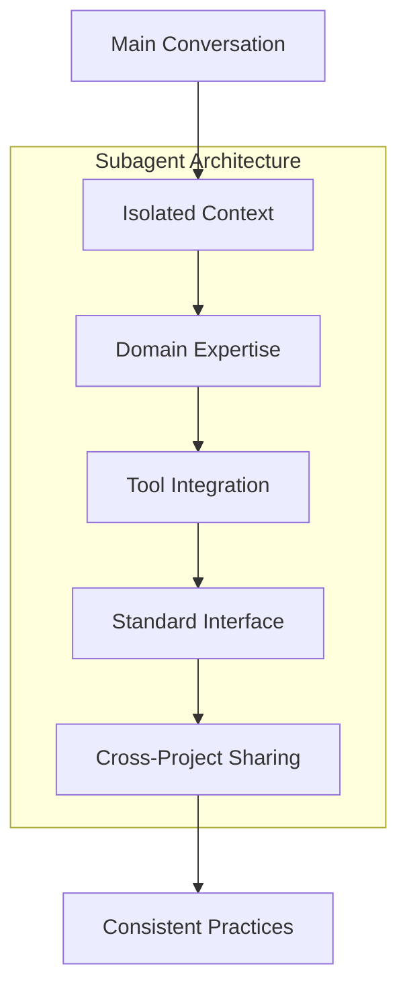
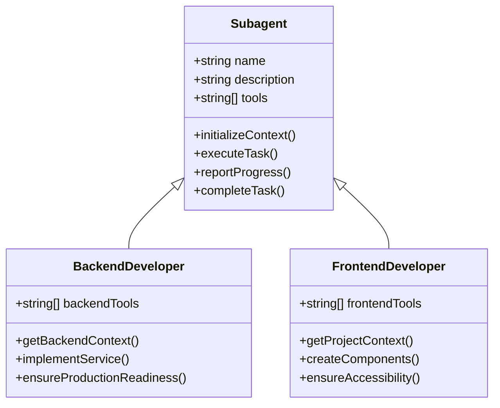
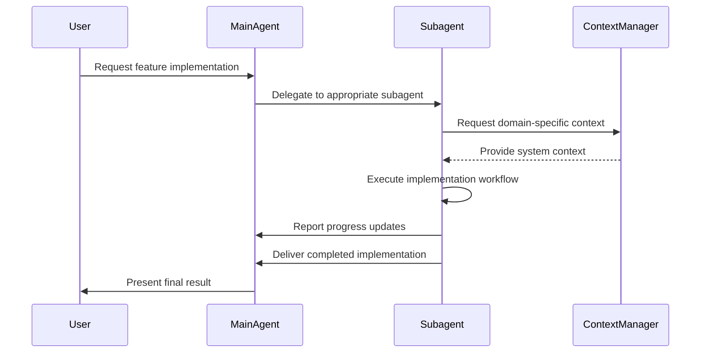

# Subagent Component Model

<cite>
**Referenced Files in This Document**   
- [backend-developer.md](file://backend-developer.md)
- [frontend-developer.md](file://frontend-developer.md)
- [README.md](file://README.md)
</cite>

## Table of Contents
1. [Introduction](#introduction)
2. [Core Architecture Principles](#core-architecture-principles)
3. [Component Structure and Interface Design](#component-structure-and-interface-design)
4. [Domain-Specific Implementation Patterns](#domain-specific-implementation-patterns)
5. [Isolation and Encapsulation Benefits](#isolation-and-encapsulation-benefits)
6. [Development and Versioning Workflow](#development-and-versioning-workflow)
7. [Community Contribution Model](#community-contribution-model)
8. [Modularity and Cross-Cutting Concerns](#modularity-and-cross-cutting-concerns)
9. [Performance Implications and Optimization](#performance-implications-and-optimization)
10. [Consistency Maintenance Strategies](#consistency-maintenance-strategies)

## Introduction

The Subagent Component Model represents a modular architecture for AI-powered development assistants, where each subagent functions as a self-contained unit with specialized expertise. This documentation explores the architectural principles behind this model, focusing on how subagents encapsulate domain-specific knowledge while maintaining interoperability through standardized interfaces. The model enables organizations to build a scalable ecosystem of AI agents that can be independently developed, versioned, and deployed across projects.

**Section sources**
- [README.md](file://README.md#L197-L223)

## Core Architecture Principles

The subagent architecture is built on four foundational principles that ensure both specialization and integration within the broader system.

### Independent Context Windows
Each subagent operates within its own isolated context space, preventing cross-contamination between different tasks. This isolation maintains clarity in the primary conversation thread while allowing deep focus on specific domains. The independent context enables each subagent to maintain its own state, memory, and reasoning process without interference from other agents or the main conversation flow.

### Domain-Specific Intelligence
Subagents are equipped with carefully crafted instructions tailored to their area of expertise. This specialization results in superior performance on domain-specific tasks compared to general-purpose AI models. The intelligence is encoded through comprehensive system prompts, tool integrations, and workflow definitions that reflect industry best practices and standards.

### Granular Tool Permissions
Each subagent is configured with specific tool access rights, enabling fine-grained control over capabilities. This security model ensures that subagents can only perform actions appropriate to their domain, reducing the risk of unintended consequences. The Model Context Protocol (MCP) tools provide standardized interfaces for common development tasks while maintaining security boundaries.

### Shared Across Projects
Subagents can be utilized across various projects and distributed among team members, ensuring consistent development practices. This sharing capability promotes standardization while allowing for customization based on project requirements. The model supports both project-specific and global subagent deployment, with precedence given to local definitions.

**Diagram sources**
- [README.md](file://README.md#L197-L223)
- [README.md](file://README.md#L225-L252)

**Section sources**
- [README.md](file://README.md#L197-L252)

## Component Structure and Interface Design

The subagent component follows a standardized template that ensures consistency across the ecosystem while allowing for domain-specific customization.

### Standardized Template Structure
Each subagent adheres to a YAML-based structure with clearly defined sections:
- **name**: Unique identifier for the subagent
- **description**: Brief overview of capabilities
- **tools**: List of MCP tools with granular permissions
- **Role definition**: Expertise and activation scenarios
- **MCP Tool Integration**: Usage patterns and configurations
- **Communication Protocol**: Inter-agent messaging standards
- **Implementation Workflow**: Structured development phases

This standardized structure enables predictable behavior and simplifies integration across different domains.

### Well-Defined Interfaces
Subagents expose their functionality through well-documented interfaces that facilitate interoperability. The communication protocol defines mandatory context retrieval patterns, ensuring that subagents gather necessary information before execution. For example, the backend-developer subagent initiates work by querying for system architecture details, while the frontend-developer requests project context before implementation.

**Diagram sources**
- [README.md](file://README.md#L270-L326)
- [backend-developer.md](file://backend-developer.md#L1-L226)
- [frontend-developer.md](file://frontend-developer.md#L1-L243)

**Section sources**
- [README.md](file://README.md#L270-L326)

## Domain-Specific Implementation Patterns

The subagent model demonstrates consistent structural patterns across different domains, as illustrated by the backend-developer and frontend-developer implementations.

### Backend Developer Implementation
The backend-developer subagent specializes in server-side applications with expertise in Node.js, Python, and Go. It follows a structured development workflow with three phases: system analysis, service development, and production readiness. The subagent integrates with database, redis, postgresql, and docker tools to implement scalable, secure backend systems.

Key implementation characteristics:
- Mandatory context retrieval for architectural alignment
- Comprehensive backend development checklist covering API design, security, and performance
- Structured status updates during implementation
- Production readiness verification before delivery

### Frontend Developer Implementation
The frontend-developer subagent focuses on modern web applications using React, Vue, and Angular. It implements a similar three-phase workflow: context discovery, development execution, and handoff/documentation. The subagent leverages magic, context7, and playwright tools to create accessible, performant user interfaces.

Key implementation characteristics:
- Project context gathering as a mandatory initial step
- Development checklist emphasizing accessibility and performance
- Progress reporting with detailed completion metrics
- Comprehensive deliverables including documentation and test coverage

**Diagram sources**
- [backend-developer.md](file://backend-developer.md#L86-L117)
- [frontend-developer.md](file://frontend-developer.md#L173-L207)

**Section sources**
- [backend-developer.md](file://backend-developer.md#L1-L226)
- [frontend-developer.md](file://frontend-developer.md#L1-L243)

## Isolation and Encapsulation Benefits

The subagent model provides significant advantages through component isolation and encapsulation of domain-specific expertise.

### Independent Development
Each subagent can be developed, tested, and refined independently of others. This separation allows domain experts to enhance their specialized agents without affecting the broader system. For example, improvements to the backend-developer's database optimization capabilities do not require changes to the frontend-developer's implementation.

### Technology Stack Specialization
Subagents encapsulate knowledge of specific technology stacks, frameworks, and best practices. The backend-developer maintains expertise in server-side technologies like Docker and PostgreSQL, while the frontend-developer specializes in client-side frameworks like React and Vue. This encapsulation prevents knowledge fragmentation and ensures deep expertise in each domain.

### Security Boundary Enforcement
The granular tool permissions create natural security boundaries between subagents. A frontend-developer cannot directly access database systems, while a backend-developer has no capability to modify UI components. This principle of least privilege reduces the attack surface and prevents accidental modifications to unrelated system components.

### Knowledge Preservation
Each subagent serves as a repository of domain-specific knowledge, capturing best practices, patterns, and standards. This preservation ensures consistency across projects and provides onboarding resources for human developers. The encapsulated expertise remains available even as team members change.

**Section sources**
- [README.md](file://README.md#L197-L252)
- [backend-developer.md](file://backend-developer.md#L1-L226)
- [frontend-developer.md](file://frontend-developer.md#L1-L243)

## Development and Versioning Workflow

The subagent model supports sophisticated development and versioning practices that enhance reliability and collaboration.

### Creation Process
Subagents are created through a standardized process:
1. Access the subagent manager via `/agents` command
2. Choose between project-specific or global scope
3. Configure the agent with name, description, and tool permissions
4. Customize the system prompt for domain-specific behavior
5. Save and deploy the subagent

This process ensures consistency while allowing for customization based on specific requirements.

### Versioning Strategy
The model supports both implicit and explicit versioning:
- **Project-level overrides**: Project-specific subagents take precedence over global ones
- **Backward compatibility**: New versions maintain core interface contracts
- **Deprecation protocols**: Clear communication when subagents are updated or replaced
- **Testing requirements**: Comprehensive validation before deployment

The versioning system enables gradual adoption of improvements while maintaining stability for existing projects.

### Deployment Patterns
Subagents can be deployed in multiple configurations:
- **Global agents**: Available across all projects
- **Project-specific agents**: Tailored to individual project needs
- **Team-shared agents**: Distributed within specific teams
- **Personal agents**: Customized for individual developers

This flexibility supports organizational scaling while accommodating specialized requirements.

**Section sources**
- [README.md](file://README.md#L254-L326)

## Community Contribution Model

The subagent ecosystem thrives on community contributions, enabling collective improvement of the agent repository.

### Contribution Guidelines
The project welcomes various types of contributions:
- Submitting new subagents via pull requests
- Improving existing subagent definitions
- Adding MCP tool integrations
- Sharing usage examples and patterns
- Reporting issues and bugs

This open approach ensures continuous enhancement of the subagent collection.

### Quality Assurance
Contributions undergo review to maintain production readiness:
- Validation against best practices and industry standards
- Testing in real-world scenarios
- Compliance with the standardized template
- Verification of tool integrations
- Assessment of security implications

This quality control process ensures that all subagents meet the high standards required for production use.

### Distribution Mechanism
The VoltAgent community provides infrastructure for sharing subagents:
- Centralized repository for discovery
- Documentation of capabilities and use cases
- Version tracking and change history
- Usage statistics and popularity metrics
- Integration with development workflows

This distribution system enables rapid adoption of proven solutions across different organizations and projects.

**Section sources**
- [README.md](file://README.md#L328-L350)

## Modularity and Cross-Cutting Concerns

The subagent model addresses modularity challenges while managing cross-cutting concerns effectively.

### Modular Design Benefits
The component-based architecture provides several advantages:
- **Reusability**: Subagents can be applied across multiple projects
- **Replaceability**: Individual components can be updated without system-wide changes
- **Composability**: Multiple subagents can collaborate on complex tasks
- **Testability**: Each component can be validated independently

This modularity supports agile development practices and rapid iteration.

### Cross-Cutting Concern Management
The model handles cross-cutting concerns through specialized subagents:
- **Security**: Security-auditor and compliance-auditor agents
- **Performance**: Performance-engineer and performance-monitor agents
- **Quality**: Code-reviewer and qa-expert agents
- **Operations**: Devops-engineer and sre-engineer agents

These specialized agents ensure consistent application of cross-cutting concerns without duplicating logic across domain-specific subagents.

### Integration Patterns
Subagents coordinate through well-defined integration patterns:
- Context manager for shared information
- Standardized communication protocols
- Progress reporting formats
- Dependency management
- Error handling and recovery

These patterns enable seamless collaboration while maintaining component boundaries.

**Section sources**
- [README.md](file://README.md#L197-L350)
- [backend-developer.md](file://backend-developer.md#L1-L226)
- [frontend-developer.md](file://frontend-developer.md#L1-L243)

## Performance Implications and Optimization

While the subagent model offers significant benefits, it introduces performance considerations that require careful management.

### Component Proliferation Challenges
As the number of subagents grows, several performance implications emerge:
- **Context switching overhead**: Time required to transition between subagents
- **Memory consumption**: Each subagent maintains its own context space
- **Coordination complexity**: Managing interactions between multiple agents
- **Latency accumulation**: Cumulative delays from sequential agent invocation

These factors can impact overall system responsiveness and efficiency.

### Optimization Strategies
Several approaches mitigate performance implications:
- **Caching**: Store frequently accessed context data
- **Parallel execution**: Run independent subagents concurrently
- **Batch processing**: Group related tasks to reduce overhead
- **Lazy loading**: Initialize subagents only when needed
- **Connection pooling**: Share resources between related subagents

The multi-agent-coordinator subagent specializes in optimizing these performance aspects.

### Resource Management
Effective resource management is critical:
- Monitor subagent utilization patterns
- Implement timeout and cleanup procedures
- Optimize tool access patterns
- Balance specialization with generalization
- Consolidate redundant capabilities

These practices ensure efficient use of computational resources while maintaining the benefits of specialization.

**Section sources**
- [multi-agent-coordinator.md](file://multi-agent-coordinator.md#L0-L270)
- [performance-engineer.md](file://performance-engineer.md#L115-L152)

## Consistency Maintenance Strategies

Maintaining consistency across the subagent ecosystem requires deliberate strategies and governance.

### Standardization Framework
The model enforces consistency through:
- **Template compliance**: All subagents follow the standardized structure
- **Naming conventions**: Consistent naming patterns across domains
- **Tool integration patterns**: Uniform approaches to MCP tool usage
- **Communication protocols**: Standardized message formats and workflows
- **Quality metrics**: Common evaluation criteria for performance and reliability

This framework ensures predictable behavior across the ecosystem.

### Governance Model
A governance structure supports consistency:
- **Core maintainers**: Responsible for the VoltAgent framework
- **Community review**: Peer evaluation of contributions
- **Version compatibility**: Clear upgrade paths and deprecation policies
- **Documentation standards**: Comprehensive, up-to-date documentation
- **Testing requirements**: Rigorous validation before inclusion

This governance ensures the long-term health and reliability of the subagent collection.

### Evolution Management
The ecosystem evolves through:
- Regular updates with new capabilities
- Continuous maintenance and bug fixes
- Backward compatibility preservation
- Deprecation of outdated patterns
- Incorporation of community feedback

This evolutionary approach balances innovation with stability, ensuring the subagent model remains relevant and effective.

**Section sources**
- [README.md](file://README.md#L328-L350)
- [multi-agent-coordinator.md](file://multi-agent-coordinator.md#L0-L270)
- [mcp-developer.md](file://mcp-developer.md#L172-L241)