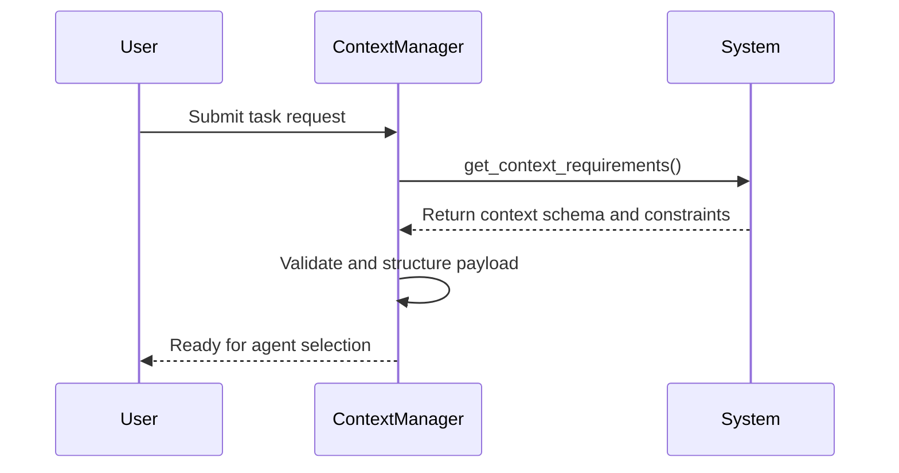
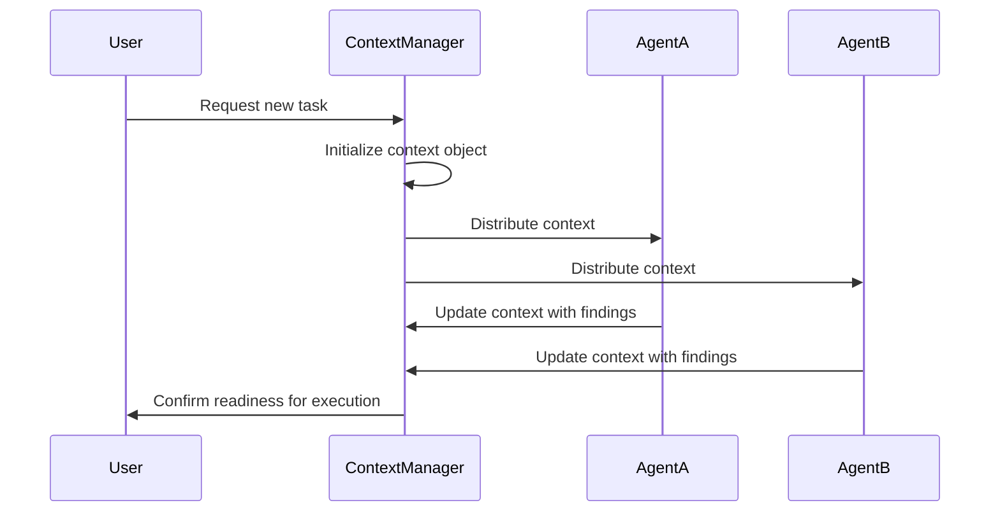
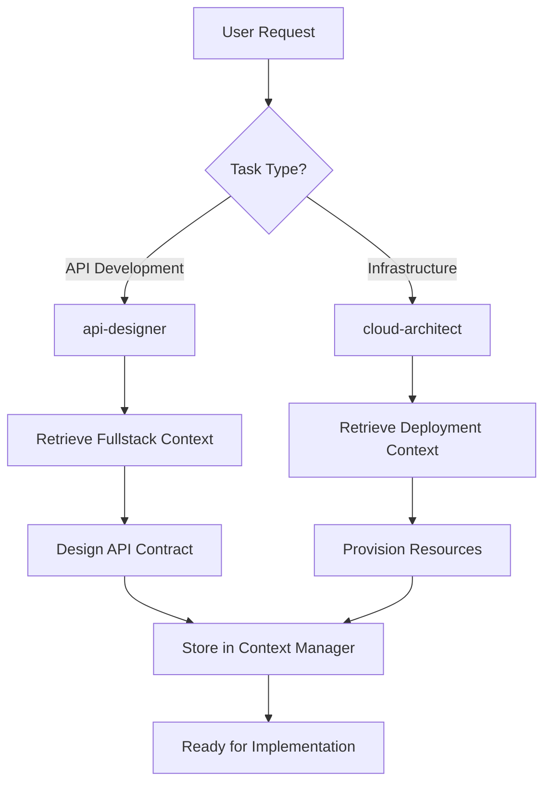

# Context Creation and Propagation

<cite>
**Referenced Files in This Document**   
- [context-manager.md](file://context-manager.md)
- [mobile-developer.md](file://mobile-developer.md)
- [electron-pro.md](file://electron-pro.md)
- [backend-developer.md](file://backend-developer.md)
- [fullstack-developer.md](file://fullstack-developer.md)
</cite>

## Table of Contents
1. [Introduction](#introduction)
2. [Context Initialization Process](#context-initialization-process)
3. [Initial Context Payload Structure](#initial-context-payload-structure)
4. [Sequence of Context Propagation](#sequence-of-context-propagation)
5. [Real-World Scenario Examples](#real-world-scenario-examples)
6. [Error Handling and Default Value Assignment](#error-handling-and-default-value-assignment)
7. [Extending Context Schema](#extending-context-schema)
8. [Conclusion](#conclusion)

## Introduction
The context management system serves as the backbone for information exchange and state coordination across a multi-agent architecture. This document details how the `context-manager` agent initiates and propagates contextual information upon user request, ensuring that all downstream agents receive consistent, validated, and structured data necessary for task execution. The system enables seamless collaboration by extracting task requirements, constraints, and success criteria, then structuring them into a standardized payload that supports agent selection and workflow orchestration.

**Section sources**
- [context-manager.md](file://context-manager.md#L1-L43)

## Context Initialization Process
When a user submits a request, the context initialization process begins with the `context-manager` agent querying the system to gather essential requirements. This phase ensures that all relevant parameters—such as data types, access patterns, performance targets, and compliance needs—are captured before proceeding.

The agent follows a three-phase development workflow:
1. **Architecture Analysis**: Evaluates workload, designs schema, plans indices, defines partitions, sets up replication, configures caching, and documents design.
2. **Implementation Phase**: Deploys storage, configures indices, sets up synchronization, implements caching, enables monitoring, configures security, tests performance, and documents APIs.
3. **Context Excellence**: Ensures optimal performance, guaranteed consistency, high availability, robust security, compliance adherence, active monitoring, complete documentation, and support for evolutionary changes.

This structured approach guarantees that context objects are created with precision and scalability in mind.

**Diagram sources**
- [context-manager.md](file://context-manager.md#L132-L217)

**Section sources**
- [context-manager.md](file://context-manager.md#L132-L217)

## Initial Context Payload Structure
The initial context payload is a JSON object that encapsulates all necessary information for downstream agents to perform their tasks effectively. It includes fields for task requirements, constraints (budget, performance, timeline), and success criteria.

Key fields in the payload include:
- `requesting_agent`: Identifies the agent initiating the context request.
- `request_type`: Specifies the type of context being requested (e.g., backend, mobile, desktop).
- `payload.query`: Contains a human-readable description of the required context, including data types, access patterns, consistency needs, performance targets, and compliance requirements.

Validation rules ensure that:
- All required fields are present
- Data types conform to expected formats
- Constraints fall within acceptable ranges
- Success criteria are measurable and time-bound

The schema is designed for extensibility, allowing custom fields to be added without breaking existing integrations.

**Section sources**
- [context-manager.md](file://context-manager.md#L132-L217)

## Sequence of Context Propagation
Once initialized, the context object is propagated through the agent ecosystem via a standardized communication protocol. Each agent retrieves the context relevant to its domain and contributes additional metadata as needed.

For example:
- The `mobile-developer` requests mobile-specific context such as target platforms, OS versions, native modules, and deployment configuration.
- The `electron-pro` queries for desktop environment details including OS versions, native features, security constraints, and update strategies.
- The `backend-developer` acquires system-wide context covering service architecture, data stores, API gateways, auth providers, and message brokers.

This propagation ensures that every agent operates with a shared understanding of the project scope and constraints.

**Diagram sources**
- [context-manager.md](file://context-manager.md#L132-L217)
- [mobile-developer.md](file://mobile-developer.md#L110-L161)
- [electron-pro.md](file://electron-pro.md#L110-L180)

**Section sources**
- [context-manager.md](file://context-manager.md#L132-L217)
- [mobile-developer.md](file://mobile-developer.md#L110-L161)
- [electron-pro.md](file://electron-pro.md#L110-L180)

## Real-World Scenario Examples

### API Development Context Flow
In an API development scenario, the `api-designer` agent requests full-stack context to understand database schemas, frontend integration points, and authentication systems. The `context-manager` provides a structured payload that includes:
- Required endpoints and data models
- Authentication mechanisms (OAuth2, JWT)
- Rate limiting policies
- Error response standards
- Documentation expectations

This enables the designer to create APIs that align with system-wide standards.

### Infrastructure Deployment Context Flow
During infrastructure deployment, the `cloud-architect` and `terraform-engineer` agents retrieve context about network topology, security groups, scaling policies, and compliance requirements. The context payload ensures that deployed resources meet organizational standards and integrate seamlessly with existing services.

**Diagram sources**
- [fullstack-developer.md](file://fullstack-developer.md#L84-L110)
- [backend-developer.md](file://backend-developer.md#L86-L117)

**Section sources**
- [fullstack-developer.md](file://fullstack-developer.md#L84-L110)
- [backend-developer.md](file://backend-developer.md#L86-L117)

## Error Handling and Default Value Assignment
During context initialization, error handling mechanisms ensure resilience against incomplete or malformed requests. If required fields are missing, the system applies default values based on historical patterns and domain-specific rules.

Strategies include:
- **Field-level validation**: Each field is checked against type, range, and format constraints.
- **Fallback defaults**: When optional fields are absent, sensible defaults are applied (e.g., default timeout values, standard security policies).
- **Graceful degradation**: If certain context elements cannot be retrieved, the system proceeds with available data while logging warnings.
- **Audit logging**: All validation errors and default assignments are recorded for traceability and debugging.

These strategies prevent workflow interruptions while maintaining data integrity.

**Section sources**
- [context-manager.md](file://context-manager.md#L132-L217)

## Extending Context Schema
To support custom use cases, the context schema can be extended while preserving backward compatibility. The evolution support framework includes:
- **Schema migration tools**: Enable gradual transition from old to new formats.
- **Version compatibility checks**: Ensure older agents can still interpret updated payloads.
- **Rolling updates**: Allow incremental deployment without downtime.
- **Data transformation pipelines**: Convert legacy data to new formats during retrieval.

New fields should be added as optional by default, and deprecated fields should be marked with deprecation notices rather than immediate removal. This approach allows teams to adopt enhancements at their own pace while maintaining system stability.

**Section sources**
- [context-manager.md](file://context-manager.md#L219-L280)

## Conclusion
The context creation and propagation system provides a robust foundation for multi-agent coordination by standardizing how information is captured, structured, and shared. By initiating context objects upon user request and enforcing strict validation and propagation rules, the `context-manager` ensures that all agents operate with a consistent and accurate understanding of project requirements. Through extensible schemas, intelligent defaulting, and comprehensive error handling, the system supports both current operations and future evolution of the agent ecosystem.