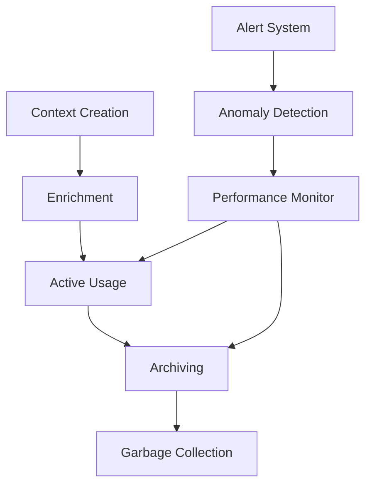

# Context Lifecycle and Optimization

<cite>
**Referenced Files in This Document**   
- [context-manager.md](file://context-manager.md)
- [performance-monitor.md](file://performance-monitor.md)
</cite>

## Table of Contents
1. [Introduction](#introduction)
2. [Context Lifecycle Management](#context-lifecycle-management)
3. [TTL, Versioning, and Snapshotting](#ttl-versioning-and-snapshotting)
4. [Performance Monitoring and Profiling](#performance-monitoring-and-profiling)
5. [Optimization Strategies](#optimization-strategies)
6. [Security Considerations](#security-considerations)
7. [Monitoring and Cleanup Policies](#monitoring-and-cleanup-policies)
8. [Conclusion](#conclusion)

## Introduction
This document provides a comprehensive analysis of context lifecycle management and optimization strategies within a multi-agent system. It details the mechanisms used to manage context from initialization to garbage collection, with a focus on performance, auditability, and security. The context-manager.md and performance-monitor.md files define the architecture, policies, and tools used to ensure efficient, secure, and observable context handling across distributed agents.

**Section sources**
- [context-manager.md](file://context-manager.md#L1-L43)
- [performance-monitor.md](file://performance-monitor.md#L1-L43)

## Context Lifecycle Management

The context lifecycle is systematically managed through five key stages: initialization, enrichment, active usage, archiving, and garbage collection. Each stage is governed by policies defined in the context-manager.md to ensure consistency, performance, and compliance.

- **Initialization**: Context is created based on system requirements gathered via a structured query that identifies data types, access patterns, consistency needs, and performance targets.
- **Enrichment**: As agents interact, context is enriched with metadata such as task history, decision logs, and performance metrics.
- **Active Usage**: During operation, context is accessed and updated with strong consistency guarantees, leveraging caching and synchronization protocols.
- **Archiving**: Based on retention rules and archive strategies, inactive contexts are moved to cost-efficient storage tiers.
- **Garbage Collection**: Deletion protocols ensure secure and compliant removal of expired or obsolete context data.

Lifecycle policies are designed to support scalability, with performance targets including retrieval time under 100ms and availability exceeding 99.9%.

**Section sources**
- [context-manager.md](file://context-manager.md#L45-L98)
- [context-manager.md](file://context-manager.md#L132-L217)

## TTL, Versioning, and Snapshotting

### TTL Management
Time-to-live (TTL) is a core component of cache optimization and lifecycle planning. The context manager implements TTL strategies to automatically expire stale data, ensuring freshness and reducing storage overhead. TTL is configured across cache layers, including distributed and edge caching, with hit rate optimization as a key performance indicator.

### Versioning
Version control is enabled to track changes in context state, supporting rollback capabilities and conflict resolution. Version vectors and causal consistency models ensure accurate ordering of updates across distributed agents. This enables audit compliance and supports schema migration with backward compatibility.

### Snapshotting
Snapshot management allows for point-in-time backups of context state, crucial for auditability and disaster recovery. Snapshots are used in conjunction with delta synchronization to minimize data transfer and ensure consistency. They also support performance baselines and anomaly detection by providing historical context states for comparison.

**Section sources**
- [context-manager.md](file://context-manager.md#L93-L125)
- [context-manager.md](file://context-manager.md#L219-L280)

## Performance Monitoring and Profiling

The performance-monitor.md outlines a comprehensive observability framework that profiles context-related metrics across the system. This includes monitoring context size, serialization overhead, and transmission latency to identify performance bottlenecks.

### Key Metrics Tracked
- **Context Size**: Monitored to prevent bloat and ensure efficient memory usage.
- **Serialization Overhead**: Tracked to optimize data encoding formats and reduce CPU load.
- **Transmission Latency**: Measured across IPC and network channels to ensure timely context propagation.

### Monitoring Architecture
The performance monitoring stack includes:
- **Collection Layer**: Instrumentation agents gather metrics from context stores.
- **Storage Layer**: Time-series databases (e.g., Prometheus) store metrics with 90-day retention.
- **Visualization Layer**: Grafana dashboards provide real-time insights into context performance.
- **Alert Layer**: Anomaly detection triggers alerts for deviations in context behavior, with detection latency under 5 minutes.

Distributed tracing is used to analyze request flow and latency breakdown, enabling root cause analysis of context-related delays.

**Diagram sources**
- [context-manager.md](file://context-manager.md#L132-L217)
- [performance-monitor.md](file://performance-monitor.md#L132-L217)

**Section sources**
- [performance-monitor.md](file://performance-monitor.md#L45-L94)
- [performance-monitor.md](file://performance-monitor.md#L219-L280)

## Optimization Strategies

To maintain high performance and low overhead, several optimization techniques are employed:

### Context Pruning
Unnecessary fields are removed from context objects based on access patterns and usage metrics. This reduces memory footprint and improves retrieval speed.

### Selective Field Propagation
Only relevant context fields are propagated between agents, minimizing network bandwidth and processing overhead. This is guided by access control rules and role-based permissions.

### Binary Serialization Formats
Efficient binary formats (e.g., Protocol Buffers) are used instead of verbose text-based formats to reduce serialization overhead and transmission latency.

### Caching and Compression
- **Cache Hierarchy**: Multi-layer caching (in-memory, distributed) with TTL management ensures fast access.
- **Compression Strategies**: Data compression reduces storage costs by up to 43%, as reported in delivery metrics.

### Real-World Benchmarks
- **Context Retrieval**: Average retrieval time of 47ms with 89% cache hit rate.
- **Storage Efficiency**: 2.3 million contexts managed with optimized schema and partition design.
- **Monitoring Overhead**: Less than 2% system resource overhead from performance monitoring.

These optimizations contribute to cost management and performance tuning, ensuring scalability and efficiency.

**Section sources**
- [context-manager.md](file://context-manager.md#L219-L280)
- [performance-monitor.md](file://performance-monitor.md#L219-L280)

## Security Considerations

Security is enforced throughout the context lifecycle with multiple layers of protection:

- **Encryption**: Data is encrypted both at rest and in transit to prevent unauthorized access.
- **Access Control**: Role-based access control (RBAC) with permission inheritance ensures only authorized agents can access specific context data.
- **Audit Logging**: Complete audit trails record all context access and modifications for compliance and forensic analysis.
- **Data Masking**: Sensitive information is masked in logs and dashboards to protect privacy.
- **Secure Deletion**: Context data is securely erased when deleted, with backup encryption to protect archived data.

These measures ensure compliance with privacy regulations and maintain data integrity across the system.

**Section sources**
- [context-manager.md](file://context-manager.md#L45-L98)
- [context-manager.md](file://context-manager.md#L219-L280)

## Monitoring and Cleanup Policies

### Monitoring Context Bloat
The performance monitor continuously tracks context size and growth trends. Alerts are triggered when context objects exceed predefined thresholds, enabling proactive intervention.

### Efficient Cleanup Policies
- **Retention Rules**: Define how long context data is retained before archiving or deletion.
- **Cleanup Procedures**: Automated jobs remove expired data based on deletion protocols.
- **Cost Management**: Intelligent tiering moves infrequently accessed context to lower-cost storage.

These policies are integrated with SLO management, where error budget tracking and burn rate alerts help maintain system reliability.

**Section sources**
- [context-manager.md](file://context-manager.md#L45-L98)
- [performance-monitor.md](file://performance-monitor.md#L219-L280)

## Conclusion
Effective context lifecycle management is critical for the performance, security, and scalability of multi-agent systems. By leveraging TTL, versioning, and snapshotting, the context manager ensures auditability and consistency. Performance monitoring provides actionable insights into context behavior, enabling optimization through pruning, selective propagation, and efficient serialization. Security controls and automated cleanup policies further enhance reliability and compliance. Together, these strategies enable the system to manage over 2.3 million contexts with sub-100ms retrieval times and minimal overhead.