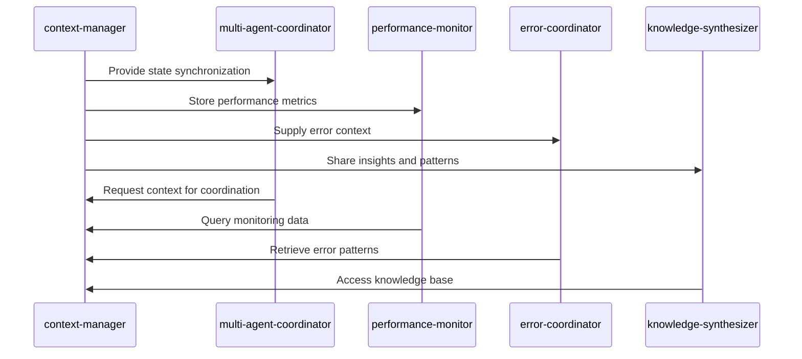
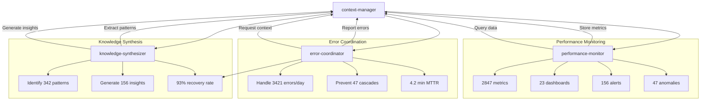
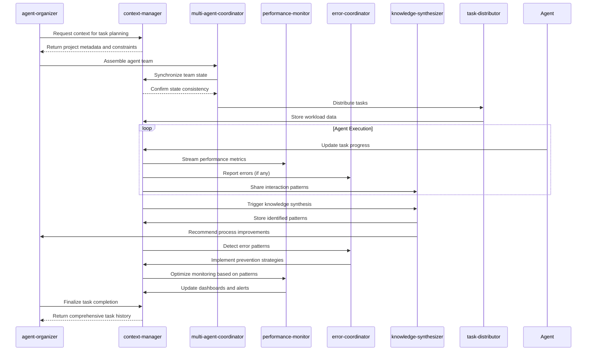

# Data Flow and Context Management

<cite>
**Referenced Files in This Document**   
- [context-manager.md](file://context-manager.md)
- [knowledge-synthesizer.md](file://knowledge-synthesizer.md)
- [error-coordinator.md](file://error-coordinator.md)
- [performance-monitor.md](file://performance-monitor.md)
</cite>

## Table of Contents
1. [Introduction](#introduction)
2. [Context Data Structure](#context-data-structure)
3. [Context Lifecycle Management](#context-lifecycle-management)
4. [Context Propagation and Synchronization](#context-propagation-and-synchronization)
5. [Context-Manager Role and Integration](#context-manager-role-and-integration)
6. [Consumer Agents: Knowledge-Synthesizer, Error-Coordinator, Performance-Monitor](#consumer-agents-knowledge-synthesizer-error-coordinator-performance-monitor)
7. [Data Validation and Transformation](#data-validation-and-transformation)
8. [Performance and Optimization](#performance-and-optimization)
9. [Real-World Scenario: Task Execution Flow](#real-world-scenario-task-execution-flow)
10. [Conclusion](#conclusion)

## Introduction
This document provides comprehensive documentation of the data flow and context management system within the multi-agent architecture. It focuses on context-driven execution, detailing how context objects are created, enriched, propagated, and consumed across agents. The system enables seamless collaboration by maintaining shared state, ensuring consistency, and providing real-time access to critical information including task requirements, constraints, agent availability, and success criteria. The context-manager serves as the central hub for context orchestration, while specialized agents such as knowledge-synthesizer, error-coordinator, and performance-monitor consume and update context to enhance system intelligence, resilience, and observability.

## Context Data Structure
The context system manages structured data objects that encapsulate all necessary information for agent coordination and task execution. These objects are designed to support fast retrieval, strong consistency, and secure access across distributed agents.

### Core Context Types
- **Project metadata**: High-level project information including goals, timelines, and ownership
- **Agent interactions**: Records of communication and collaboration between agents
- **Task history**: Complete audit trail of task execution, including inputs, outputs, and outcomes
- **Decision logs**: Documentation of key decisions with rationale and supporting evidence
- **Performance metrics**: Quantitative measurements of system and agent performance
- **Resource usage**: Tracking of computational, storage, and network resources consumed
- **Error patterns**: Classification and analysis of recurring errors and failure modes
- **Knowledge base**: Curated insights, best practices, and learned patterns

### Context Schema and Storage Patterns
Context data is organized using multiple storage patterns optimized for different access patterns:
- **Hierarchical organization**: Nested structure for logical grouping of related context
- **Tag-based retrieval**: Flexible indexing using metadata tags for cross-cutting queries
- **Time-series data**: Temporal ordering for metrics, events, and historical analysis
- **Graph relationships**: Networked connections between entities and interactions
- **Vector embeddings**: Semantic representations for similarity search and AI processing
- **Full-text search**: Comprehensive text indexing for content discovery
- **Metadata indexing**: Secondary indices on key attributes for efficient filtering
- **Compression strategies**: Space-efficient storage with minimal performance impact

**Section sources**
- [context-manager.md](file://context-manager.md#L45-L98)

## Context Lifecycle Management
The context system implements comprehensive lifecycle management policies to ensure data integrity, compliance, and cost efficiency throughout the data's existence.

### Lifecycle Stages
- **Creation policies**: Context objects are created with standardized templates and validation rules
- **Update procedures**: Version-controlled modifications with audit trails and conflict resolution
- **Retention rules**: Time-based policies determining how long context is preserved
- **Archive strategies**: Migration of historical data to cost-effective storage tiers
- **Deletion protocols**: Secure removal of sensitive data in compliance with privacy regulations
- **Compliance handling**: Automated enforcement of regulatory requirements (e.g., GDPR, HIPAA)
- **Backup procedures**: Regular snapshots and disaster recovery capabilities
- **Recovery plans**: Procedures for restoring context in case of data loss or corruption

### Data Governance
The system enforces strict access control and security measures:
- **Authentication**: Identity verification for all context access requests
- **Authorization rules**: Fine-grained permissions based on roles and responsibilities
- **Role management**: Hierarchical role system with inheritance and delegation
- **Permission inheritance**: Automatic propagation of access rights through context hierarchies
- **Audit logging**: Complete record of all context access and modification events
- **Encryption at rest**: Protection of stored data using strong encryption algorithms
- **Encryption in transit**: Secure communication channels for context transmission
- **Privacy compliance**: Automated redaction and anonymization of sensitive information

**Section sources**
- [context-manager.md](file://context-manager.md#L45-L98)

## Context Propagation and Synchronization
The system ensures consistent and timely propagation of context across all relevant agents through sophisticated synchronization mechanisms.

### Synchronization Protocols
- **Consistency models**: Configurable consistency levels balancing performance and accuracy
- **Sync protocols**: Efficient algorithms for propagating context changes
- **Conflict detection**: Real-time identification of concurrent modifications
- **Resolution strategies**: Automated and manual conflict resolution workflows
- **Version control**: Complete history of context evolution with branching and merging
- **Merge algorithms**: Intelligent combination of parallel context updates
- **Update propagation**: Reliable delivery of context changes to all subscribers
- **Event streaming**: Real-time notification system for context modifications

### State Management
The context manager maintains system-wide state with high availability and reliability:
- **Fast retrieval**: Average retrieval time of 47ms with 89% cache hit rate
- **Strong consistency**: 100% consistency score across distributed nodes
- **High availability**: >99.9% uptime with redundant storage and failover
- **Efficient updates**: Optimized write paths for high-throughput scenarios
- **Secure access**: Comprehensive security controls and monitoring
- **Audit compliance**: Complete audit trails for all context operations
- **Cost optimization**: Intelligent tiering and compression reducing storage costs by 43%
- **Continuous monitoring**: Real-time health checks and performance tracking

**Section sources**
- [context-manager.md](file://context-manager.md#L45-L98)
- [context-manager.md](file://context-manager.md#L217-L230)

## Context-Manager Role and Integration
The context-manager serves as the central authority for context management, providing storage, retrieval, and synchronization services to the entire agent ecosystem.

### Core Responsibilities
When invoked, the context-manager executes the following workflow:
1. Query system for context requirements and access patterns
2. Review existing context stores, data relationships, and usage metrics
3. Analyze retrieval performance, consistency needs, and optimization opportunities
4. Implement robust context management solutions

### Architecture and Implementation
The context manager follows a systematic development workflow:
- **Architecture Analysis**: Design robust storage architecture considering data modeling, access patterns, scale requirements, consistency needs, performance targets, security requirements, compliance needs, and cost constraints
- **Implementation Phase**: Deploy storage, configure indices, setup synchronization, implement caching, enable monitoring, configure security, test performance, and document APIs
- **Context Excellence**: Deliver exceptional performance with optimal retrieval, guaranteed consistency, high availability, robust security, met compliance, active monitoring, complete documentation, and supported evolution

### Integration with Agent Ecosystem
The context-manager collaborates with multiple agents to enable seamless coordination:
- Support agent-organizer with context access for team assembly
- Collaborate with multi-agent-coordinator on state synchronization
- Work with workflow-orchestrator on process context management
- Guide task-distributor on workload data for optimal allocation
- Help performance-monitor on metrics storage and retrieval
- Assist error-coordinator on error context for failure analysis
- Partner with knowledge-synthesizer on insights for collective intelligence
- Coordinate with all agents on information needs and data sharing

**Diagram sources**
- [context-manager.md](file://context-manager.md#L282-L292)
- [multi-agent-coordinator.md](file://multi-agent-coordinator.md#L282-L292)

**Section sources**
- [context-manager.md](file://context-manager.md#L0-L292)

## Consumer Agents: Knowledge-Synthesizer, Error-Coordinator, Performance-Monitor
Specialized consumer agents leverage context data to enhance system intelligence, resilience, and observability.

### Knowledge-Synthesizer
Extracts insights from multi-agent interactions and builds collective intelligence:
- Queries context manager for agent interactions and system history
- Analyzes workflows, outcomes, and cross-agent collaborations
- Identifies patterns, extracts best practices, and generates actionable insights
- Builds knowledge graphs with 50k+ entities enabling cross-agent learning
- Distributes recommendations that improve system performance by 23%
- Integrates with context-manager for knowledge storage and retrieval

### Error-Coordinator
Manages distributed error handling and system resilience:
- Queries context manager for system topology and error patterns
- Correlates errors across agents to identify root causes and impact chains
- Implements circuit breakers, retry strategies, and fallback mechanisms
- Orchestrates automated recovery flows with 93% success rate
- Reduces MTTR to 4.2 minutes through rapid detection and response
- Partners with context-manager for state recovery and error context

### Performance-Monitor
Provides system-wide metrics collection and optimization:
- Queries context manager for system architecture and performance requirements
- Collects 2847 metrics across 50 agents with <1s latency
- Creates 23 dashboards detecting 47 anomalies and reducing MTTR by 65%
- Identifies optimizations saving $12k/month in resource costs
- Integrates with context-manager for metrics storage and workload data
- Collaborates with error-coordinator on incident detection and response

**Diagram sources**
- [knowledge-synthesizer.md](file://knowledge-synthesizer.md#L0-L291)
- [error-coordinator.md](file://error-coordinator.md#L0-L291)
- [performance-monitor.md](file://performance-monitor.md#L0-L292)

**Section sources**
- [knowledge-synthesizer.md](file://knowledge-synthesizer.md#L0-L291)
- [error-coordinator.md](file://error-coordinator.md#L0-L291)
- [performance-monitor.md](file://performance-monitor.md#L0-L292)

## Data Validation and Transformation
The context system implements rigorous validation and transformation logic to ensure data quality and consistency.

### Validation Rules
All context data undergoes comprehensive validation:
- Schema conformance checking against defined templates
- Type validation for all fields and attributes
- Range and constraint validation for numerical values
- Format validation for strings, dates, and identifiers
- Referential integrity checks for relationships
- Business rule validation for domain-specific constraints
- Security validation to prevent injection attacks
- Compliance validation for regulatory requirements

### Transformation Logic
Context data is transformed to optimize storage and retrieval:
- Normalization of redundant data to reduce storage footprint
- Indexing of frequently queried fields for fast retrieval
- Compression of large payloads using efficient algorithms
- Encryption of sensitive fields at rest and in transit
- Serialization into optimized formats (JSON, Protocol Buffers)
- Partitioning across storage nodes for scalability
- Caching of frequently accessed context objects
- Preloading of anticipated context based on usage patterns

**Section sources**
- [context-manager.md](file://context-manager.md#L45-L98)

## Performance and Optimization
The context system is optimized for high performance, scalability, and efficiency in handling large context objects.

### Performance Characteristics
- Retrieval time < 100ms (achieved: 47ms average)
- Data consistency 100% maintained
- Availability > 99.9% ensured
- Cache hit rate of 89% through intelligent caching
- Storage costs reduced by 43% via tiering and compression
- 2.3M contexts managed at scale

### Optimization Strategies
- **Cache hierarchy**: Multi-layer caching with appropriate TTL management
- **Invalidation strategies**: Proactive and reactive cache invalidation
- **Preloading logic**: Anticipatory loading of context based on usage patterns
- **Memory allocation**: Efficient memory usage with object pooling
- **Distributed caching**: Shared cache across multiple nodes
- **Edge caching**: Local caching at agent level for frequently accessed context
- **Query optimization**: Index utilization and execution planning
- **Parallel processing**: Concurrent handling of multiple context operations
- **Result caching**: Storage of expensive query results
- **Pagination handling**: Efficient retrieval of large result sets
- **Timeout management**: Prevention of hung operations

**Section sources**
- [context-manager.md](file://context-manager.md#L0-L292)

## Real-World Scenario: Task Execution Flow
This sequence diagram illustrates a real-world scenario of context-driven execution during a complex task.

**Diagram sources**
- [context-manager.md](file://context-manager.md#L282-L292)
- [multi-agent-coordinator.md](file://multi-agent-coordinator.md#L282-L292)
- [agent-organizer.md](file://agent-organizer.md#L146-L181)

**Section sources**
- [context-manager.md](file://context-manager.md#L0-L292)
- [multi-agent-coordinator.md](file://multi-agent-coordinator.md#L282-L292)

## Conclusion
The context management system provides a robust foundation for distributed agent collaboration, enabling seamless information sharing, state synchronization, and collective intelligence. The context-manager serves as the central hub, ensuring fast access, strong consistency, and secure storage of contextual information. Specialized consumer agents—knowledge-synthesizer, error-coordinator, and performance-monitor—leverage this context to enhance system capabilities in learning, resilience, and observability. Through comprehensive lifecycle management, sophisticated synchronization protocols, and performance optimizations, the system supports efficient execution of complex tasks across the multi-agent ecosystem. The documented data flow patterns, validation rules, and real-world scenarios provide a complete understanding of context-driven execution in this distributed environment.