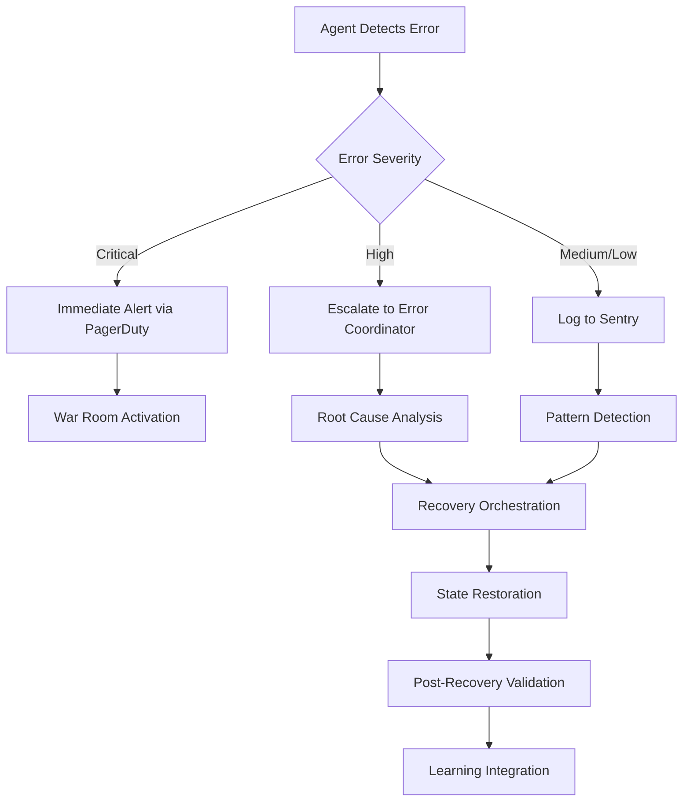
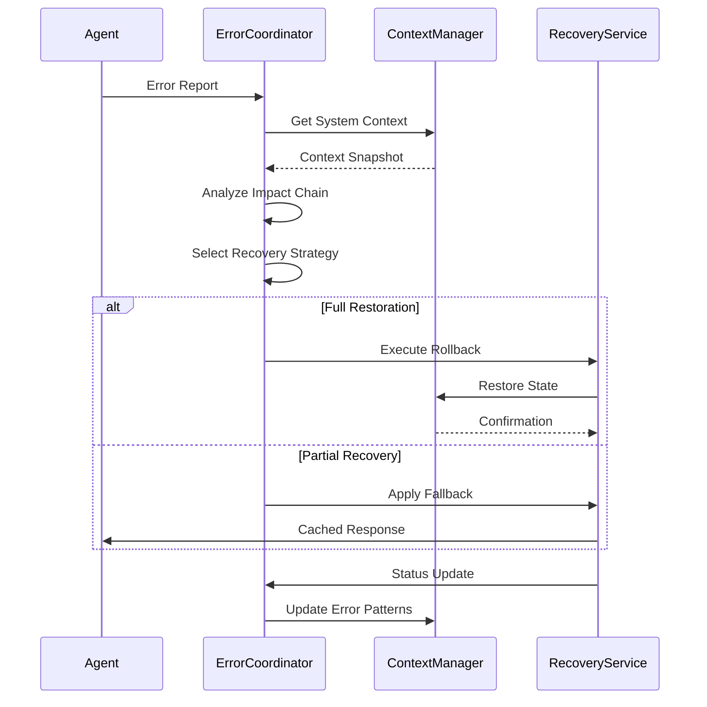
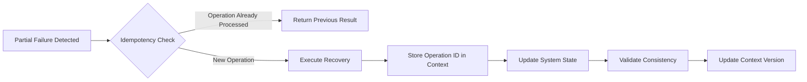

# Error Handling and Context Recovery

<cite>
**Referenced Files in This Document**   
- [error-coordinator.md](file://error-coordinator.md)
- [context-manager.md](file://context-manager.md)
- [debugger.md](file://debugger.md)
- [test-automator.md](file://test-automator.md)
</cite>

## Table of Contents
1. [Introduction](#introduction)
2. [Error Reporting and Classification](#error-reporting-and-classification)
3. [Error Payload Structure](#error-payload-structure)
4. [Recovery Workflows and Context Coordination](#recovery-workflows-and-context-coordination)
5. [Integration with Debugger and Test Automator](#integration-with-debugger-and-test-automator)
6. [Idempotency and Context Consistency](#idempotency-and-context-consistency)
7. [Best Practices for Error-Resilient Context Flows](#best-practices-for-error-resilient-context-flows)

## Introduction
The error-coordinator.md agent serves as the central orchestrator for error handling and recovery in distributed multi-agent systems. It coordinates the detection, classification, escalation, and resolution of errors across agents while maintaining system resilience and minimizing downtime. This document details how errors are reported, structured, and processed through the context system, with emphasis on automated recovery, learning from failures, and integration with debugging and testing systems.

**Section sources**
- [error-coordinator.md](file://error-coordinator.md#L1-L33)
- [context-manager.md](file://context-manager.md#L1-L33)

## Error Reporting and Classification

Errors detected by individual agents are systematically reported to the error-coordinator.md through standardized communication protocols. Upon invocation, the error-coordinator queries the context-manager.md to understand system topology and existing error patterns before analyzing incoming error reports.

The classification process follows a comprehensive taxonomy that categorizes errors into:
- Infrastructure errors
- Application errors
- Integration failures
- Data errors
- Timeout errors
- Permission errors
- Resource exhaustion
- External failures

Cross-agent correlation is performed using temporal correlation, causal analysis, dependency tracking, and request tracing to identify root causes and prevent cascading failures. The error-coordinator implements circuit breaker patterns, bulkhead isolation, and timeout management to contain failures and maintain system stability.

Error escalation follows a severity-based protocol where critical errors trigger immediate alerts through pagerduty, while lower-severity issues are logged and analyzed for pattern detection. The system ensures error detection within 30 seconds and maintains a recovery success rate above 90%.



**Diagram sources**
- [error-coordinator.md](file://error-coordinator.md#L35-L81)
- [error-coordinator.md](file://error-coordinator.md#L145-L180)

**Section sources**
- [error-coordinator.md](file://error-coordinator.md#L1-L33)
- [error-coordinator.md](file://error-coordinator.md#L35-L81)

## Error Payload Structure

Error payloads injected into the context system follow a standardized JSON structure that includes comprehensive metadata for effective analysis and recovery. When an error is detected, the payload contains:

```json
{
  "requesting_agent": "source-agent-name",
  "request_type": "error_report",
  "payload": {
    "error_type": "Infrastructure|Application|Integration|Data|Timeout|Permission|Resource|External",
    "severity": "Critical|High|Medium|Low",
    "timestamp": "ISO8601",
    "affected_components": ["component1", "component2"],
    "error_message": "Descriptive error message",
    "stack_trace": "Optional stack information",
    "context_snapshot": "Current system state",
    "suggested_remediation": ["retry", "fallback", "manual_intervention"]
  }
}
```

The error-coordinator enriches these payloads with additional context from the context-manager, including dependency mappings, recent changes, and historical error patterns. This enriched context enables more accurate root cause identification and appropriate recovery strategy selection.

The system implements deduplication logic to prevent redundant processing of similar errors and uses clustering algorithms to detect emerging patterns across multiple agents.

**Section sources**
- [error-coordinator.md](file://error-coordinator.md#L76-L109)
- [context-manager.md](file://context-manager.md#L132-L217)

## Recovery Workflows and Context Coordination

The error-coordinator orchestrates recovery workflows by coordinating with the context-manager to restore system state after failures. Recovery strategies are selected based on error type, severity, and system context:



Recovery procedures include:
- Automated recovery flows with health verification
- Rollback procedures to previous stable states
- State restoration from context snapshots
- Data reconciliation between inconsistent components
- Service restoration with gradual ramp-up
- Post-recovery validation to ensure system stability

The error-coordinator works closely with the context-manager to ensure state consistency during recovery operations. When failures occur, the context-manager provides versioned snapshots of system state that enable accurate rollback and restoration.

**Diagram sources**
- [error-coordinator.md](file://error-coordinator.md#L190-L269)
- [context-manager.md](file://context-manager.md#L219-L280)

**Section sources**
- [error-coordinator.md](file://error-coordinator.md#L35-L81)
- [error-coordinator.md](file://error-coordinator.md#L190-L269)

## Integration with Debugger and Test Automator

The error-coordinator integrates with debugger.md and test-automator.md to enable comprehensive root cause analysis and prevent recurrence of issues. When complex errors are detected, the error-coordinator engages the debugger agent through a standardized protocol:

```json
{
  "requesting_agent": "error-coordinator",
  "request_type": "get_debugging_context",
  "payload": {
    "query": "Debugging context needed: issue symptoms, error messages, system environment, recent changes, reproduction steps, and impact scope."
  }
}
```

The debugger performs systematic analysis using techniques including stack trace interpretation, log correlation, memory debugging, and performance profiling. Once root causes are identified, the findings are fed back into the error-coordinator's knowledge base for future prevention.

Integration with test-automator.md enables automated regression testing of fixes and validation of recovery procedures. The test-automator creates targeted test cases based on error patterns, ensuring that resolved issues do not reoccur. This integration also supports chaos engineering practices, where the error-coordinator coordinates failure injection tests to validate system resilience.

Post-mortem automation captures lessons from incidents and generates runbooks that are integrated into the system's learning process, improving recovery effectiveness by approximately 15% monthly.

**Section sources**
- [debugger.md](file://debugger.md#L0-L43)
- [debugger.md](file://debugger.md#L150-L185)
- [test-automator.md](file://test-automator.md#L0-L33)

## Idempotency and Context Consistency

The error recovery system ensures idempotency to prevent duplicate actions during partial failures or network interruptions. All recovery operations are designed to be safely repeatable without unintended side effects. This is achieved through:

- Unique operation identifiers for tracking execution state
- Idempotency keys stored in the context system
- State reconciliation before and after recovery attempts
- Transactional updates to system state

Context consistency is maintained through the context-manager's implementation of strong consistency models, distributed locks, and version vectors. The system uses write quorums and read repair mechanisms to ensure that all agents operate on consistent state information, even during network partitions.

When partial failures occur, the error-coordinator coordinates a reconciliation process that:
1. Identifies inconsistent state across components
2. Determines the authoritative state source
3. Applies corrective updates to align all components
4. Validates consistency through health checks
5. Updates the context system with the resolved state

This approach ensures that the system can recover from partial failures without data corruption or service disruption.



**Diagram sources**
- [backend-developer.md](file://backend-developer.md#L86-L117)
- [context-manager.md](file://context-manager.md#L282-L292)

**Section sources**
- [error-coordinator.md](file://error-coordinator.md#L115-L146)
- [context-manager.md](file://context-manager.md#L282-L292)

## Best Practices for Error-Resilient Context Flows

Designing error-resilient context flows requires adherence to several key principles:

1. **Proactive Error Boundaries**: Implement error boundaries at strategic levels to contain failures and prevent cascading effects.

2. **Graceful Degradation**: Design systems to provide reduced functionality rather than complete failure when errors occur, using fallback mechanisms like cached responses or default values.

3. **Comprehensive Monitoring**: Integrate with sentry for error tracking and pagerduty for incident management to ensure timely detection and response.

4. **Automated Recovery**: Implement automated recovery flows with clear success criteria and health verification steps.

5. **Learning Systems**: Capture knowledge from failures to improve future response effectiveness through pattern recognition and runbook generation.

6. **Chaos Engineering**: Regularly test system resilience through controlled failure injection, load testing, and network partition simulations.

7. **Context-Aware Recovery**: Leverage the context-manager to make recovery decisions based on system state, dependencies, and historical patterns.

8. **Documentation Automation**: Ensure all incidents and resolutions are automatically documented to build organizational knowledge.

9. **Team Training**: Regularly train teams on incident response procedures and recovery strategies.

10. **Continuous Improvement**: Regularly review and optimize error handling based on performance metrics and incident analysis.

These practices ensure that the system not only recovers from errors effectively but also becomes more resilient over time through continuous learning and improvement.

**Section sources**
- [error-coordinator.md](file://error-coordinator.md#L281-L291)
- [frontend-developer.md](file://frontend-developer.md#L77-L93)