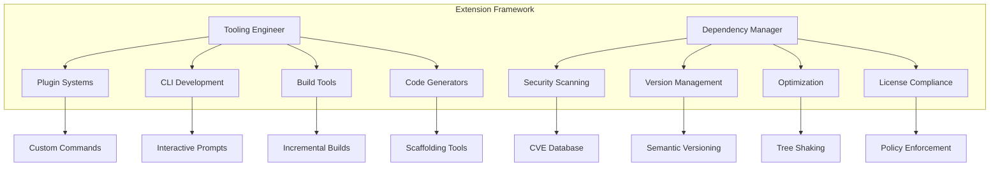
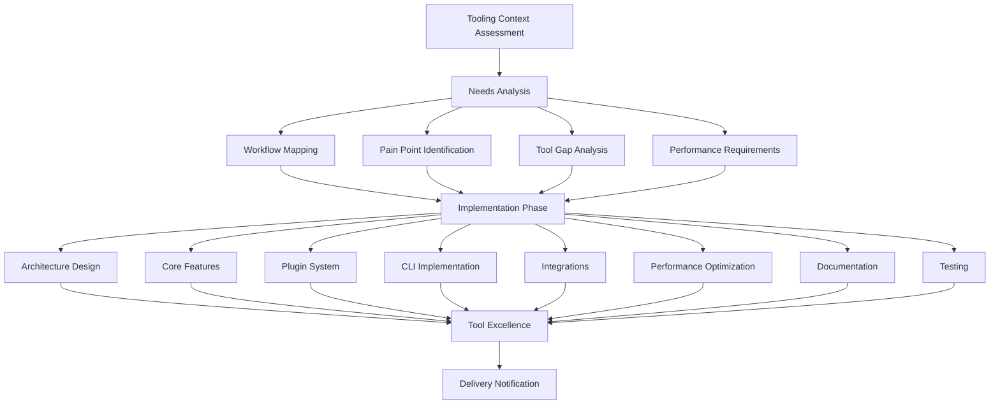
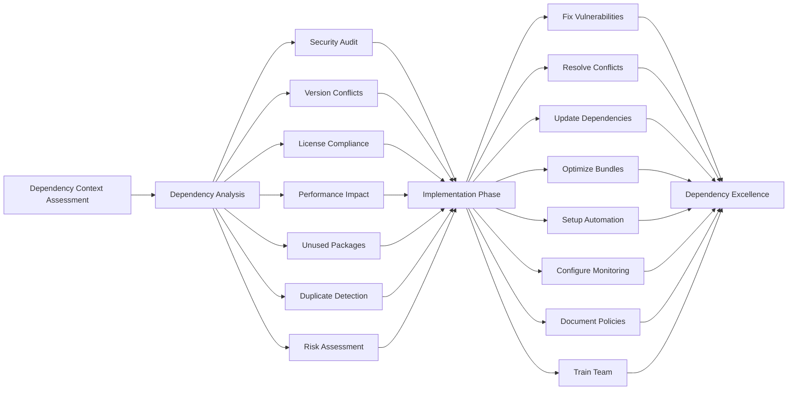
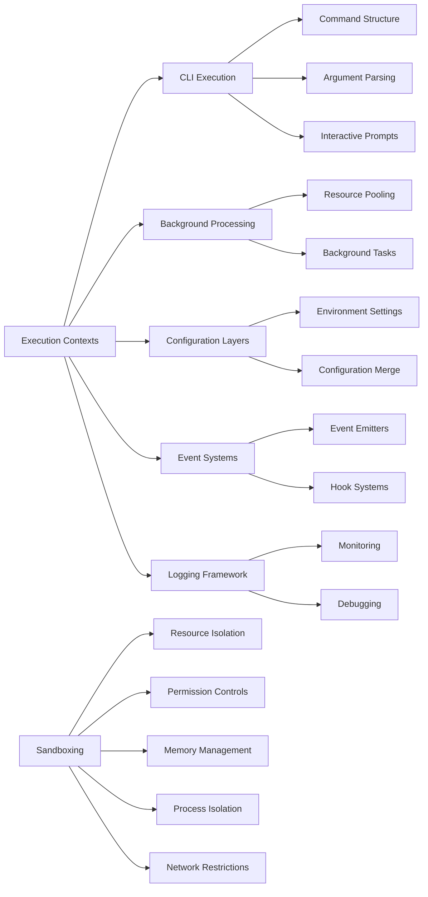
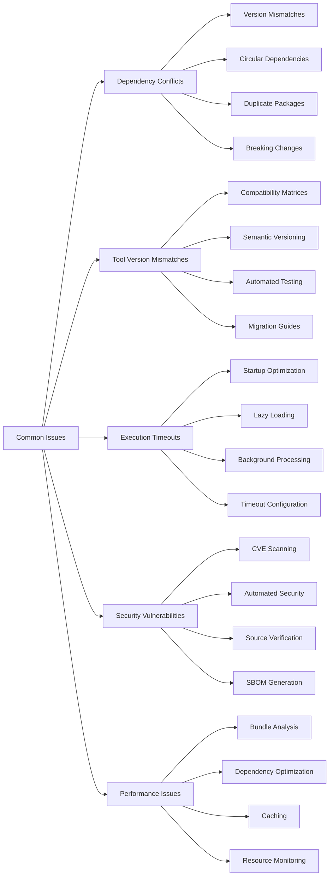
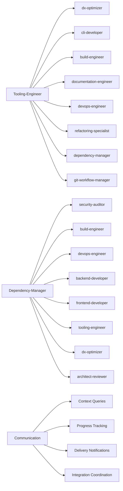

# Agent Functionality Extension

<cite>
**Referenced Files in This Document**   
- [tooling-engineer.md](file://tooling-engineer.md)
- [dependency-manager.md](file://dependency-manager.md)
</cite>

## Table of Contents
1. [Introduction](#introduction)
2. [Core Extension Mechanisms](#core-extension-mechanisms)
3. [Tool Integration Workflow](#tool-integration-workflow)
4. [Dependency Management Strategies](#dependency-management-strategies)
5. [Packaging and Distribution](#packaging-and-distribution)
6. [Execution Contexts and Sandboxing](#execution-contexts-and-sandboxing)
7. [Configuration and Dynamic Loading](#configuration-and-dynamic-loading)
8. [Common Issues and Troubleshooting](#common-issues-and-troubleshooting)
9. [Performance Optimization](#performance-optimization)
10. [Integration Patterns](#integration-patterns)

## Introduction
This document details the extension of agent functionality through tooling and dependency management systems. It focuses on how custom tools and scripts are integrated into agent workflows to enhance automation and domain-specific capabilities. The content covers the integration patterns used by the tooling-engineer and dependency-manager agents, including their approaches to dependency resolution, version pinning, compatibility management, and tool distribution. The document also addresses configuration options, execution contexts, sandboxing mechanisms, and troubleshooting strategies for extended agent operations.

**Section sources**
- [tooling-engineer.md](file://tooling-engineer.md#L0-L43)
- [dependency-manager.md](file://dependency-manager.md#L0-L43)

## Core Extension Mechanisms

The extension of agent functionality is achieved through two primary mechanisms: tooling integration and dependency management. The tooling-engineer agent specializes in creating developer tools that enhance productivity through CLI development, build tools, code generators, and IDE extensions. The dependency-manager agent focuses on maintaining secure, stable, and performant dependency management across multiple language ecosystems.

Tooling-engineer implements extensible tool architectures with plugin systems, extension points, event systems, and configuration layers that allow for seamless integration of custom functionality. The agent emphasizes performance optimization, usability, and backward compatibility to ensure tools become essential parts of developer workflows.

Dependency-manager provides comprehensive dependency analysis, security scanning, version management, and optimization strategies across multiple ecosystems including NPM, Yarn, pip, Maven, Gradle, Cargo, Bundler, and Composer. The agent ensures zero critical vulnerabilities, strategic version pinning, and license compliance while optimizing build times and bundle sizes.

**Diagram sources**
- [tooling-engineer.md](file://tooling-engineer.md#L0-L43)
- [dependency-manager.md](file://dependency-manager.md#L0-L43)

**Section sources**
- [tooling-engineer.md](file://tooling-engineer.md#L0-L43)
- [dependency-manager.md](file://dependency-manager.md#L0-L43)

## Tool Integration Workflow

The integration of custom tools into agent workflows follows a systematic development process that begins with needs analysis and ends with tool excellence verification. The tooling-engineer agent initiates this process by querying the context manager for developer needs, workflow pain points, existing tools, integration requirements, performance needs, and user preferences.

The workflow consists of three main phases:

1. **Needs Analysis**: This phase involves workflow mapping, pain point identification, tool gap analysis, performance requirements assessment, integration needs evaluation, user research, success metrics definition, and technical constraints analysis.

2. **Implementation Phase**: During this phase, the agent designs the tool architecture, builds core features, creates plugin systems, implements CLI interfaces, adds integrations, optimizes performance, writes documentation, and conducts thorough testing.

3. **Tool Excellence**: The final phase verifies that the tool meets excellence criteria including optimal performance, complete features, comprehensive documentation, thorough testing, and high user satisfaction.

**Diagram sources**
- [tooling-engineer.md](file://tooling-engineer.md#L134-L219)

**Section sources**
- [tooling-engineer.md](file://tooling-engineer.md#L134-L219)

## Dependency Management Strategies

The dependency-manager agent employs comprehensive strategies for managing dependencies across multiple ecosystems. These strategies focus on security, stability, performance, and compliance while enabling rapid development without compromising safety.

### Dependency Analysis
The agent conducts thorough dependency analysis including:
- Security audit and vulnerability scanning
- Version conflict detection
- License compliance verification
- Performance impact assessment
- Unused package identification
- Duplicate detection
- Risk assessment

### Version Management
Strategic version management practices include:
- Semantic versioning enforcement
- Version range strategies
- Lock file management
- Update policies and rollback procedures
- Compatibility matrix maintenance
- Migration planning

### Conflict Resolution
The agent resolves dependency conflicts through:
- Dependency graph analysis
- Resolution strategies and override mechanisms
- Patch management and fork maintenance
- Vendor communication and documentation

### Supply Chain Security
Security practices include:
- Package verification and signature checking
- Source validation and build reproducibility
- Dependency pinning and vendor management
- Audit trails and incident response

**Diagram sources**
- [dependency-manager.md](file://dependency-manager.md#L115-L150)

**Section sources**
- [dependency-manager.md](file://dependency-manager.md#L45-L91)

## Packaging and Distribution

The tooling-engineer agent implements comprehensive packaging and distribution strategies to ensure tools are easily accessible and maintainable across different environments. These strategies cover multiple distribution channels and ensure backward compatibility and smooth migration paths.

### Distribution Methods
The agent supports various distribution strategies:
- **NPM packages**: For JavaScript/Node.js tools
- **Homebrew formulas**: For macOS users
- **Docker images**: For containerized deployment
- **Binary releases**: For cross-platform executables
- **Auto-updates**: For seamless version management
- **Version management**: For handling multiple tool versions
- **Installation guides**: For user onboarding
- **Migration paths**: For upgrading between versions

### Plugin Architecture
The agent implements robust plugin systems with:
- Hook systems and event emitters
- Middleware patterns and dependency injection
- Configuration merging and lifecycle management
- API stability and comprehensive documentation

### MCP Tool Suite
The agent leverages multiple tooling platforms:
- **node**: Node.js runtime for JavaScript tools
- **python**: Python for tool development
- **go**: Go for fast, compiled tools
- **rust**: Rust for performance-critical tools
- **webpack**: Module bundler framework
- **rollup**: ES module bundler
- **esbuild**: Fast JavaScript bundler

```mermaid
graph TD
A[Tool Distribution] --> B[NPM Packages]
A --> C[Homebrew Formulas]
A --> D[Docker Images]
A --> E[Binary Releases]
A --> F[Auto-updates]
A --> G[Version Management]
A --> H[Installation Guides]
A --> I[Migration Paths]
J[Plugin Architecture] --> K[Hook Systems]
J --> L[Event Emitters]
J --> M[Middleware Patterns]
J --> N[Dependency Injection]
J --> O[Configuration Merge]
J --> P[Lifecycle Management]
J --> Q[API Stability]
J --> R[Documentation]
S[MCP Tool Suite] --> T[node]
S --> U[python]
S --> V[go]
S --> W[rust]
S --> X[webpack]
S --> Y[rollup]
S --> Z[esbuild]
```

**Diagram sources**
- [tooling-engineer.md](file://tooling-engineer.md#L92-L127)

**Section sources**
- [tooling-engineer.md](file://tooling-engineer.md#L92-L127)

## Execution Contexts and Sandboxing

The tooling-engineer agent implements secure execution contexts and sandboxing mechanisms to ensure safe execution of external tools and plugins. These mechanisms protect the host environment while allowing for extensible functionality.

### Execution Contexts
The agent manages multiple execution contexts:
- **CLI execution**: With command structure design, argument parsing, and interactive prompts
- **Background processing**: For long-running tasks and resource pooling
- **Configuration layers**: For managing different environment settings
- **Event systems**: For handling asynchronous operations
- **Logging framework**: For monitoring and debugging

### Sandboxing Mechanisms
Security measures include:
- **Resource isolation**: Preventing unauthorized access to system resources
- **Permission controls**: Limiting plugin capabilities
- **Memory management**: Preventing memory leaks and excessive usage
- **Process isolation**: Running plugins in separate processes
- **Network restrictions**: Controlling network access for external tools

### Performance Optimization
The agent optimizes execution through:
- Lazy loading of plugins and modules
- Caching strategies for frequently used data
- Parallel processing for independent tasks
- Stream processing for large data sets
- Memory pooling for efficient resource utilization
- Binary optimization for performance-critical tools
- Startup optimization for faster initialization
- Background tasks for non-blocking operations

**Diagram sources**
- [tooling-engineer.md](file://tooling-engineer.md#L45-L98)

**Section sources**
- [tooling-engineer.md](file://tooling-engineer.md#L45-L98)

## Configuration and Dynamic Loading

The tooling-engineer agent implements flexible configuration systems and dynamic loading mechanisms to support customizable and extensible tool behavior. These systems enable agents to adapt to different environments and requirements without code changes.

### Configuration Management
The agent supports multiple configuration layers:
- **Default configuration**: Built-in sensible defaults
- **User configuration**: Custom settings from users
- **Environment configuration**: Settings based on execution environment
- **Project configuration**: Settings specific to projects
- **Command-line overrides**: Temporary changes via CLI flags

### Dynamic Loading
The agent enables dynamic tool loading through:
- **Plugin discovery**: Automatically finding available plugins
- **Loading mechanisms**: Safely loading plugin code
- **API contracts**: Defining stable interfaces between core and plugins
- **Version compatibility**: Ensuring plugins work with current tool versions
- **Dependency handling**: Managing plugin dependencies
- **Security sandboxing**: Isolating plugin execution
- **Update mechanisms**: Keeping plugins current
- **Documentation**: Providing clear guidance for plugin developers

### User Experience
The agent prioritizes user experience with:
- Intuitive commands and clear feedback
- Progress indication and error recovery
- Help discovery and configuration simplicity
- Sensible defaults and low learning curve

```mermaid
flowchart TD
A[Configuration System] --> B[Default Configuration]
A --> C[User Configuration]
A --> D[Environment Configuration]
A --> E[Project Configuration]
A --> F[Command-line Overrides]
B --> G[Sensible Defaults]
C --> H[Custom Settings]
D --> I[Environment Variables]
E --> J[Project Files]
F --> K[CLI Flags]
L[Dynamic Loading] --> M[Plugin Discovery]
L --> N[Loading Mechanisms]
L --> O[API Contracts]
L --> P[Version Compatibility]
L --> Q[Dependency Handling]
L --> R[Security Sandboxing]
L --> S[Update Mechanisms]
L --> T[Documentation]
U[User Experience] --> V[Intuitive Commands]
U --> W[Clear Feedback]
U --> X[Progress Indication]
U --> Y[Error Recovery]
U --> Z[Help Discovery]
U --> AA[Configuration Simplicity]
U --> AB[Sensible Defaults]
U --> AC[Low Learning Curve]
```

**Diagram sources**
- [tooling-engineer.md](file://tooling-engineer.md#L92-L127)

**Section sources**
- [tooling-engineer.md](file://tooling-engineer.md#L92-L127)

## Common Issues and Troubleshooting

This section addresses common issues encountered when extending agent functionality and provides troubleshooting guidance for resolution.

### Dependency Conflicts
Common causes and solutions:
- **Version mismatches**: Use lock files and version pinning
- **Circular dependencies**: Analyze dependency graphs and refactor
- **Duplicate packages**: Implement deduplication strategies
- **Breaking changes**: Test updates in staging environments

### Tool Version Mismatches
Prevention and resolution:
- Maintain compatibility matrices
- Use semantic versioning consistently
- Implement automated testing across versions
- Provide clear migration guides

### Execution Timeouts
Mitigation strategies:
- Optimize tool startup time (target < 100ms)
- Implement lazy loading for non-essential components
- Use background processing for long-running tasks
- Configure appropriate timeout thresholds

### Security Vulnerabilities
Proactive measures:
- Conduct regular CVE database checks
- Implement automated security scanning
- Verify package sources and signatures
- Maintain SBOM (Software Bill of Materials)

### Performance Issues
Optimization approaches:
- Analyze bundle size and implement tree shaking
- Optimize dependency resolution algorithms
- Implement caching strategies
- Monitor resource usage (memory, CPU, I/O)

**Diagram sources**
- [dependency-manager.md](file://dependency-manager.md#L194-L273)
- [tooling-engineer.md](file://tooling-engineer.md#L221-L282)

**Section sources**
- [dependency-manager.md](file://dependency-manager.md#L194-L273)
- [tooling-engineer.md](file://tooling-engineer.md#L221-L282)

## Performance Optimization

The tooling-engineer and dependency-manager agents implement comprehensive performance optimization strategies to ensure efficient agent operations.

### Tool Performance
The tooling-engineer agent optimizes tool performance through:
- **Startup time**: Achieving < 100ms startup through lazy loading and optimization
- **Memory usage**: Maintaining memory efficiency through pooling and cleanup
- **CPU efficiency**: Optimizing algorithms and parallel processing
- **I/O optimization**: Efficient file and network operations
- **Caching strategies**: Reducing redundant operations
- **Background processing**: Non-blocking execution of long tasks
- **Resource pooling**: Reusing expensive resources

### Dependency Performance
The dependency-manager agent optimizes dependency performance by:
- **Bundle analysis**: Identifying size impact of dependencies
- **Tree shaking**: Removing unused code
- **Chunk splitting**: Optimizing load patterns
- **Lazy loading**: Loading dependencies on demand
- **Dead code elimination**: Removing unreachable code
- **Minification**: Reducing code size
- **Compression**: Optimizing storage and transfer
- **CDN strategies**: Distributing packages efficiently

### Monitoring and Metrics
Both agents track key performance metrics:
- Vulnerabilities fixed and packages updated
- Bundle size reduction and build time improvement
- Features implemented and startup time
- Plugin count and user adoption

```mermaid
graph TD
A[Performance Optimization] --> B[Tool Performance]
A --> C[Dependency Performance]
A --> D[Monitoring]
B --> E[Startup Time < 100ms]
B --> F[Memory Efficiency]
B --> G[CPU Efficiency]
B --> H[I/O Optimization]
B --> I[Caching]
B --> J[Background Processing]
B --> K[Resource Pooling]
C --> L[Bundle Analysis]
C --> M[Tree Shaking]
C --> N[Chunk Splitting]
C --> O[Lazy Loading]
C --> P[Dead Code Elimination]
C --> Q[Minification]
C --> R[Compression]
C --> S[CDN Strategies]
D --> T[Vulnerabilities Fixed]
D --> U[Packages Updated]
D --> V[Bundle Size Reduction]
D --> W[Build Time Improvement]
D --> X[Features Implemented]
D --> Y[Startup Time]
D --> Z[Plugin Count]
D --> AA[User Adoption]
```

**Diagram sources**
- [tooling-engineer.md](file://tooling-engineer.md#L45-L98)
- [dependency-manager.md](file://dependency-manager.md#L194-L273)

**Section sources**
- [tooling-engineer.md](file://tooling-engineer.md#L45-L98)
- [dependency-manager.md](file://dependency-manager.md#L194-L273)

## Integration Patterns

The tooling-engineer and dependency-manager agents integrate with other agents through well-defined patterns that enhance overall system capabilities.

### Tooling-Engineer Integrations
The agent collaborates with:
- **dx-optimizer**: On workflow optimization
- **cli-developer**: On CLI patterns and best practices
- **build-engineer**: On build tool development
- **documentation-engineer**: On tool documentation
- **devops-engineer**: On automation workflows
- **refactoring-specialist**: On code analysis tools
- **dependency-manager**: On package management tools
- **git-workflow-manager**: On Git integration tools

### Dependency-Manager Integrations
The agent partners with:
- **security-auditor**: On vulnerability assessment
- **build-engineer**: On dependency optimization
- **devops-engineer**: On CI/CD integration
- **backend-developer**: On package selection
- **frontend-developer**: On bundling strategies
- **tooling-engineer**: On automation tools
- **dx-optimizer**: On performance optimization
- **architect-reviewer**: On policy enforcement

### Cross-Agent Communication
Both agents use standardized communication protocols:
- JSON-based context queries
- Progress tracking with structured payloads
- Delivery notifications with impact metrics
- Integration coordination through shared workflows

**Diagram sources**
- [tooling-engineer.md](file://tooling-engineer.md#L285-L295)
- [dependency-manager.md](file://dependency-manager.md#L285-L295)

**Section sources**
- [tooling-engineer.md](file://tooling-engineer.md#L285-L295)
- [dependency-manager.md](file://dependency-manager.md#L285-L295)