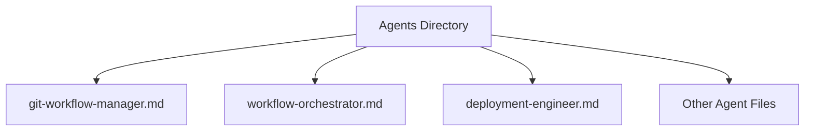
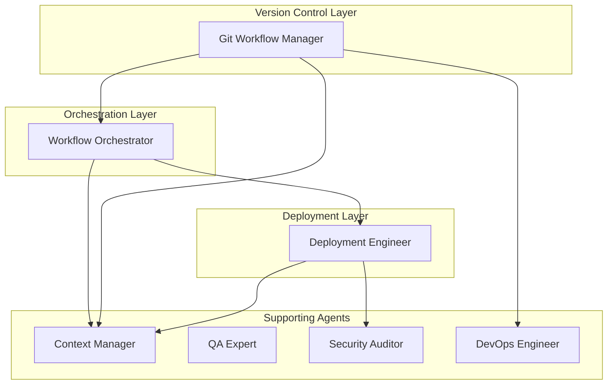
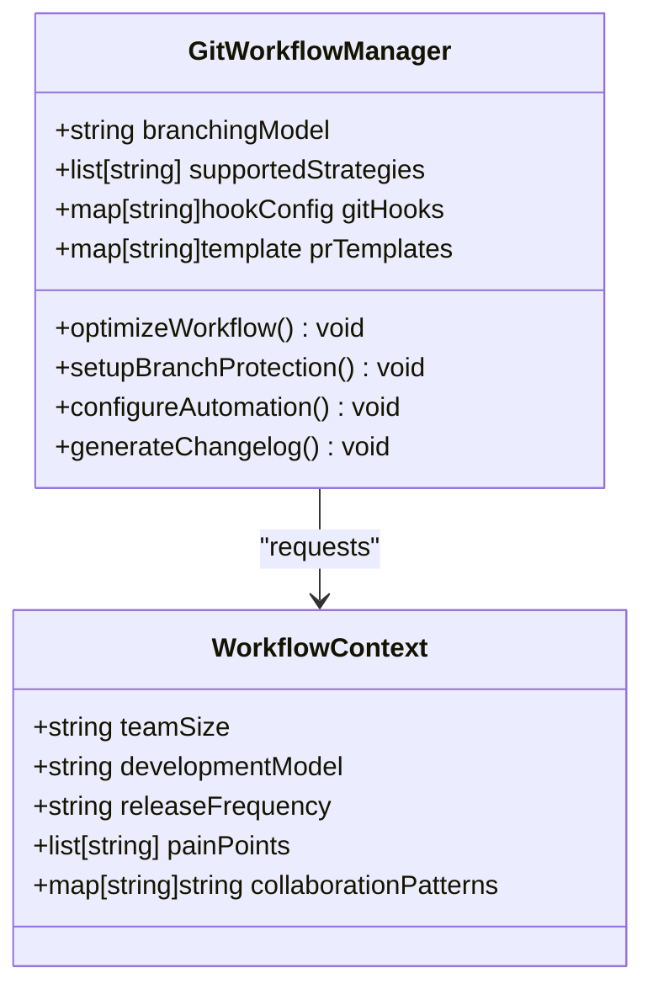
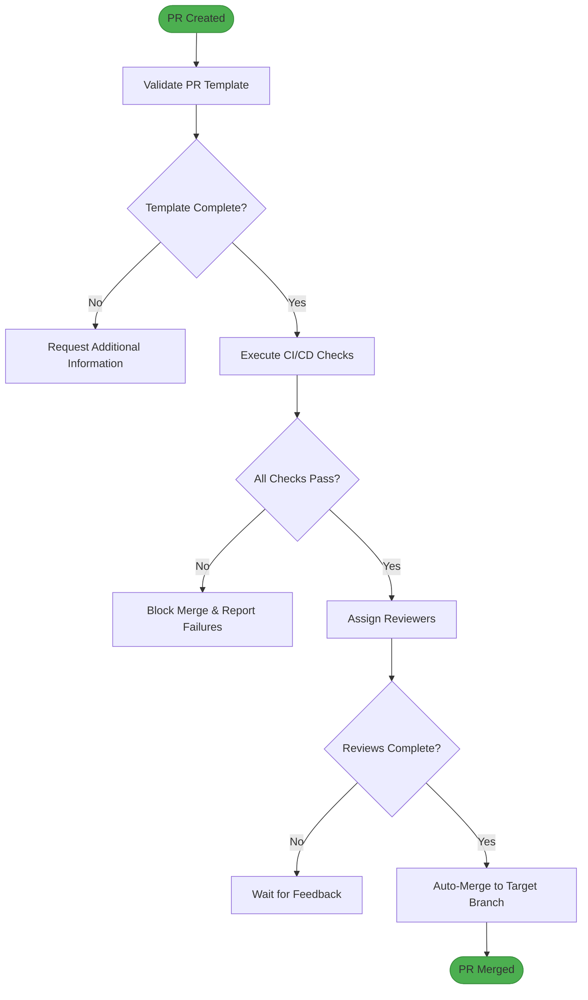
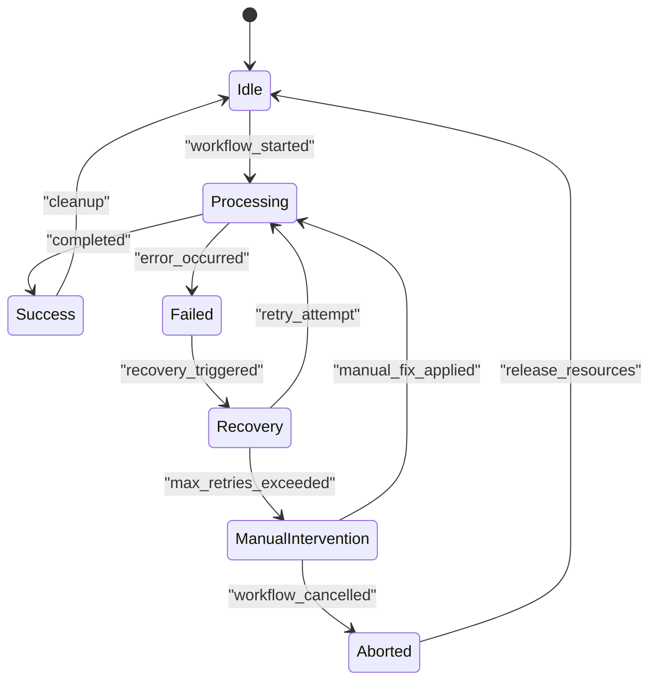
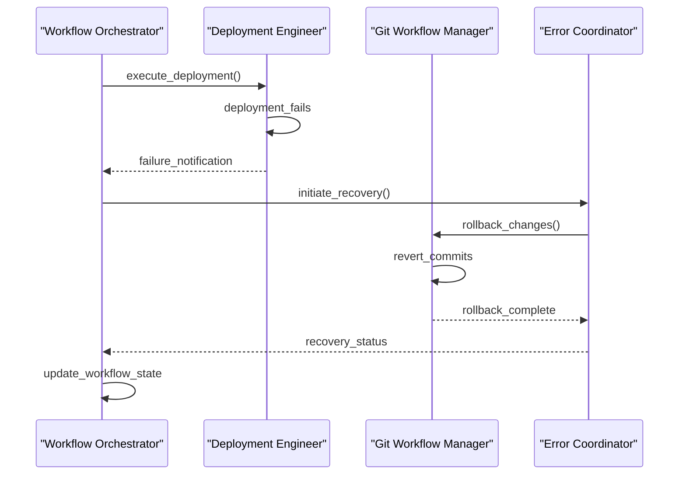
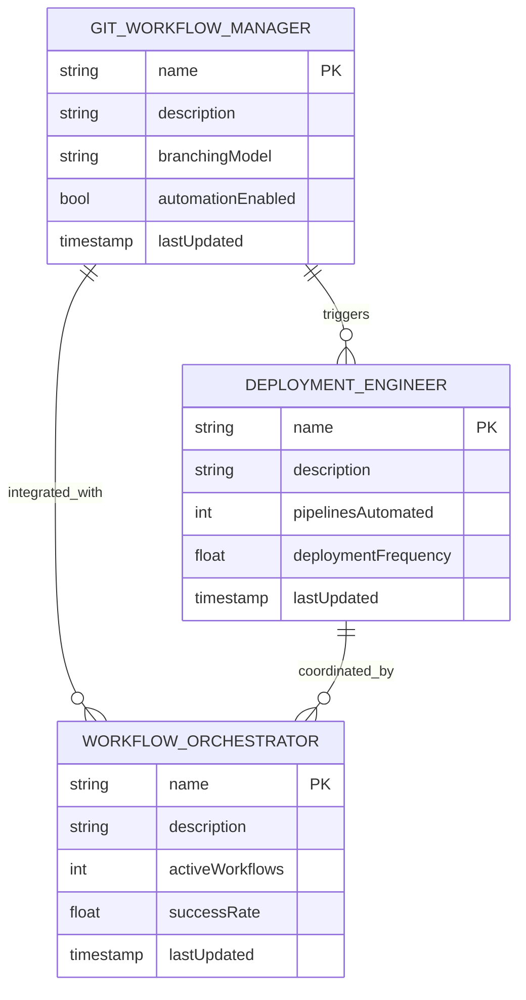

# Custom Workflow Implementation

<cite>
**Referenced Files in This Document**   
- [git-workflow-manager.md](file://git-workflow-manager.md)
- [workflow-orchestrator.md](file://workflow-orchestrator.md)
- [deployment-engineer.md](file://deployment-engineer.md)
</cite>

## Table of Contents
1. [Introduction](#introduction)
2. [Project Structure](#project-structure)
3. [Core Components](#core-components)
4. [Architecture Overview](#architecture-overview)
5. [Detailed Component Analysis](#detailed-component-analysis)
6. [Dependency Analysis](#dependency-analysis)
7. [Performance Considerations](#performance-considerations)
8. [Troubleshooting Guide](#troubleshooting-guide)
9. [Conclusion](#conclusion)

## Introduction
This document provides comprehensive guidance on implementing custom development workflows using the `git-workflow-manager.md` as a foundational reference. It details how agents integrate with version control systems to automate branching strategies, pull request management, and code review processes. The documentation covers workflow definition syntax, trigger conditions, state transitions, CI/CD pipeline automation, code promotion flows, and release coordination patterns. It also explains how agents coordinate across stages, maintain workflow state, handle exceptions, and support manual interventions. Guidance is provided for creating reusable templates, enforcing policies, audit logging, rollback procedures, and integrating with external notification systems. Best practices for designing resilient, observable, and maintainable workflows are included.

## Project Structure
The project structure consists of a collection of markdown files, each representing a specialized agent with defined roles, tools, and operational workflows. These agents collectively form an ecosystem for managing software development processes, from version control and deployment to compliance and security.

**Diagram sources**
- [git-workflow-manager.md](file://git-workflow-manager.md#L1-L10)
- [workflow-orchestrator.md](file://workflow-orchestrator.md#L1-L10)

**Section sources**
- [git-workflow-manager.md](file://git-workflow-manager.md#L1-L292)
- [workflow-orchestrator.md](file://workflow-orchestrator.md#L1-L292)

## Core Components
The core components of the custom workflow implementation include the Git Workflow Manager, Workflow Orchestrator, and Deployment Engineer agents. These components work in concert to automate and manage the software development lifecycle.

The **Git Workflow Manager** specializes in branching strategies, automation, and team collaboration, focusing on enabling efficient, clear, and scalable version control practices. It supports various branching models such as Git Flow, GitHub Flow, GitLab Flow, and trunk-based development.

The **Workflow Orchestrator** handles complex process design, state machine implementation, and business process automation. It ensures workflow reliability, state consistency, and rapid recovery through advanced error compensation and transaction management.

The **Deployment Engineer** focuses on CI/CD pipelines, release automation, and deployment strategies, including blue-green, canary, and rolling deployments with zero-downtime capabilities.

**Section sources**
- [git-workflow-manager.md](file://git-workflow-manager.md#L1-L292)
- [workflow-orchestrator.md](file://workflow-orchestrator.md#L1-L292)
- [deployment-engineer.md](file://deployment-engineer.md#L1-L293)

## Architecture Overview
The architecture integrates multiple specialized agents that communicate through a context manager and coordinate via standardized protocols. Each agent operates within its domain while collaborating with others to achieve end-to-end workflow automation.

**Diagram sources**
- [git-workflow-manager.md](file://git-workflow-manager.md#L1-L292)
- [workflow-orchestrator.md](file://workflow-orchestrator.md#L1-L292)
- [deployment-engineer.md](file://deployment-engineer.md#L1-L293)

## Detailed Component Analysis

### Git Workflow Manager Analysis
The Git Workflow Manager implements branching strategies, merge management, and PR/MR automation. It uses Git hooks for pre-commit validation, commit message formatting, code quality checks, and CI/CD triggers.

#### Branching Strategy Implementation

**Diagram sources**
- [git-workflow-manager.md](file://git-workflow-manager.md#L15-L200)

#### Pull Request Automation Flow

**Diagram sources**
- [git-workflow-manager.md](file://git-workflow-manager.md#L100-L150)

**Section sources**
- [git-workflow-manager.md](file://git-workflow-manager.md#L1-L292)

### Workflow Orchestrator Analysis
The Workflow Orchestrator manages complex business processes using state machines and BPMN patterns. It ensures transactional integrity through saga patterns and compensation logic.

#### State Machine Design

**Diagram sources**
- [workflow-orchestrator.md](file://workflow-orchestrator.md#L50-L100)

#### Error Compensation Pattern

**Diagram sources**
- [workflow-orchestrator.md](file://workflow-orchestrator.md#L150-L200)
- [error-coordinator.md](file://error-coordinator.md#L281-L291)

**Section sources**
- [workflow-orchestrator.md](file://workflow-orchestrator.md#L1-L292)

### Deployment Engineer Analysis
The Deployment Engineer implements CI/CD pipelines and deployment strategies, ensuring rapid, safe, and auditable releases.

#### CI/CD Pipeline Orchestration

```mermaid
flowchart LR
A[Code Commit] --> B[Build & Test]
B --> C[Security Scan]
C --> D[Artifact Storage]
D --> E[Staging Deployment]
E --> F[Automated Testing]
F --> G[Production Approval]
G --> H[Blue-Green Deployment]
H --> I[Monitoring Validation]
I --> J[Traffic Switch]
J --> K[Old Version Cleanup]
```

**Diagram sources**
- [deployment-engineer.md](file://deployment-engineer.md#L50-L100)

**Section sources**
- [deployment-engineer.md](file://deployment-engineer.md#L1-L293)

## Dependency Analysis
The agents in this system exhibit a well-defined dependency structure, where higher-level orchestrators depend on specialized agents for domain-specific operations.

**Diagram sources**
- [git-workflow-manager.md](file://git-workflow-manager.md#L1-L292)
- [workflow-orchestrator.md](file://workflow-orchestrator.md#L1-L292)
- [deployment-engineer.md](file://deployment-engineer.md#L1-L293)

## Performance Considerations
The system is designed for high reliability and performance, with measurable outcomes across all components:

- **Git Workflow Manager**: Achieves 67% reduction in merge conflicts, 89% automation coverage, and 4.2-hour average PR review time
- **Workflow Orchestrator**: Manages 234 active workflows at 1.2K executions/minute with 99.4% success rate
- **Deployment Engineer**: Supports 14 deployments/day with 47-minute lead time and 3.2% failure rate

These metrics demonstrate the effectiveness of the implemented workflows in enhancing development velocity while maintaining quality and reliability.

## Troubleshooting Guide
When issues arise in the workflow system, the following diagnostic and resolution steps should be followed:

1. **Check Context Manager**: Verify that all agents have received the correct context via their respective queries
2. **Review Progress Tracking**: Examine JSON progress reports from each agent to identify bottlenecks
3. **Validate Integration Points**: Confirm communication between agents (e.g., Git Workflow Manager with DevOps Engineer)
4. **Audit Logs**: Check audit trails for any policy violations or unexpected state changes
5. **Manual Intervention**: For critical failures, initiate manual recovery procedures through the Error Coordinator

**Section sources**
- [git-workflow-manager.md](file://git-workflow-manager.md#L282-L292)
- [workflow-orchestrator.md](file://workflow-orchestrator.md#L281-L291)
- [error-coordinator.md](file://error-coordinator.md#L281-L291)

## Conclusion
The custom workflow implementation described in this document leverages specialized agents to create a robust, automated, and observable software development lifecycle. By combining the Git Workflow Manager's version control expertise, the Workflow Orchestrator's process automation capabilities, and the Deployment Engineer's CI/CD proficiency, organizations can achieve rapid, reliable, and compliant software delivery. The system supports various branching strategies, automated PR management, sophisticated deployment patterns, and comprehensive error handling. Through proper integration and coordination, these agents enable the creation of reusable workflow templates, enforcement of organizational policies, and implementation of audit logging and rollback procedures. This approach represents a best practice for designing resilient, observable, and maintainable development workflows in modern software engineering environments.