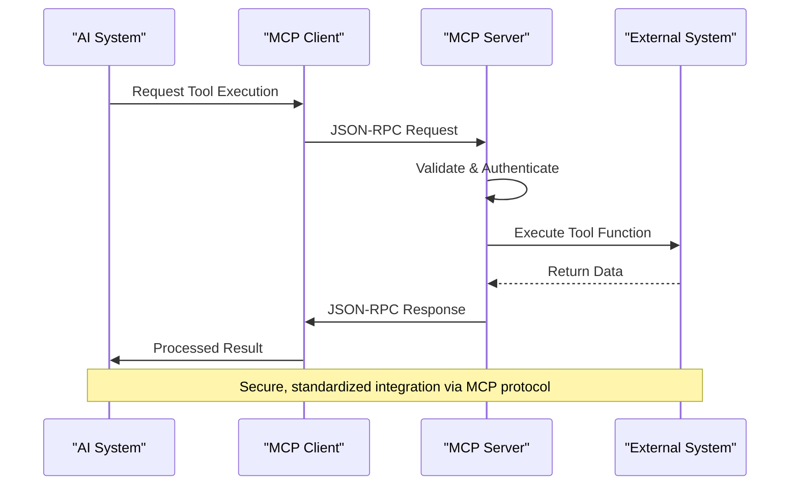
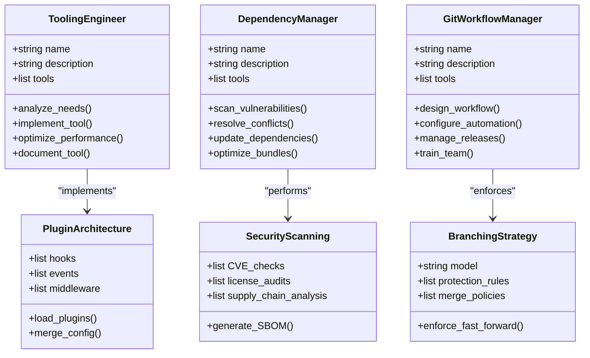
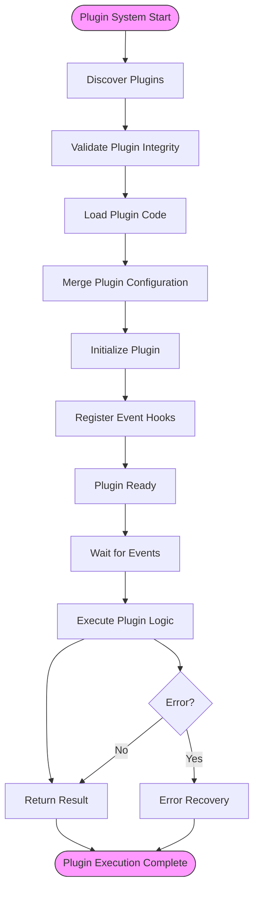
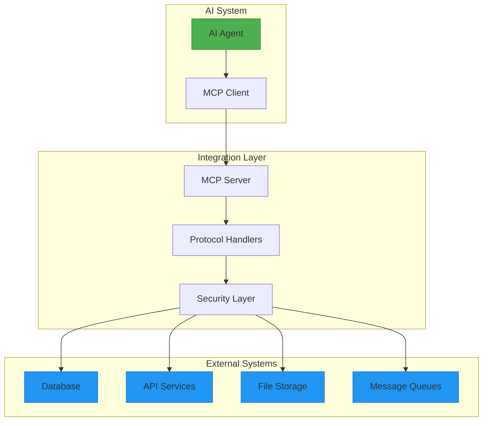
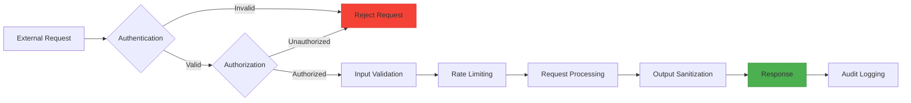
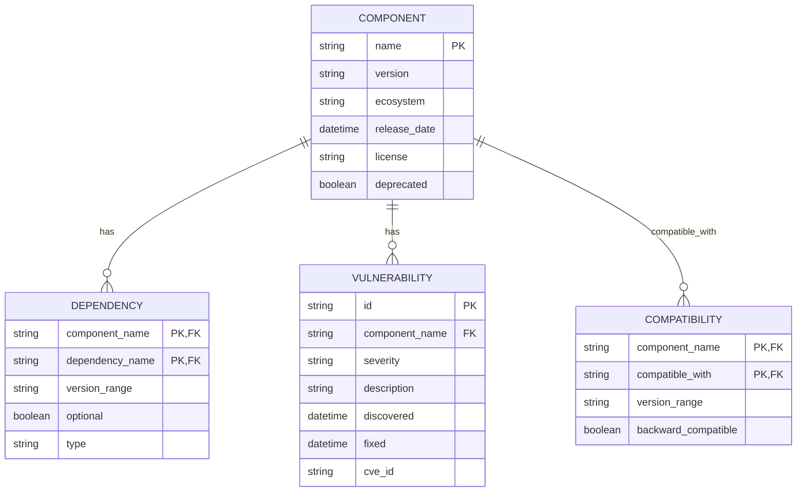

# Integration and Extensibility Patterns

<cite>
**Referenced Files in This Document**   
- [mcp-developer.md](file://mcp-developer.md)
- [tooling-engineer.md](file://tooling-engineer.md)
- [dependency-manager.md](file://dependency-manager.md)
- [git-workflow-manager.md](file://git-workflow-manager.md)
</cite>

## Table of Contents
1. [Introduction](#introduction)
2. [MCP Tool Integration Framework](#mcp-tool-integration-framework)
3. [Agent Extension Patterns](#agent-extension-patterns)
4. [Plugin Architecture](#plugin-architecture)
5. [External System Integration](#external-system-integration)
6. [Security Considerations](#security-considerations)
7. [Version and Compatibility Management](#version-and-compatibility-management)
8. [Developer Guidelines](#developer-guidelines)
9. [Conclusion](#conclusion)

## Introduction
This document outlines the integration and extensibility architecture of the agents system, focusing on how MCP (Model Context Protocol) enables seamless connectivity between AI systems and external tools. It details the patterns used by specialized agents to extend functionality, manage dependencies, and maintain efficient workflows. The system is designed to support secure, scalable, and maintainable integrations while providing robust tooling for developers.

## MCP Tool Integration Framework

The MCP (Model Context Protocol) serves as the foundational integration layer that enables AI systems to interact with external tools and data sources through standardized communication protocols. The mcp-developer agent specializes in implementing production-ready MCP servers and clients that adhere to strict quality standards.

Key integration capabilities include:
- **Protocol Compliance**: Full adherence to JSON-RPC 2.0 specification with message validation and error code standards
- **Transport Abstraction**: Support for various transport mechanisms with optimized configuration
- **Security Controls**: Implementation of authentication, authorization, rate limiting, and audit logging
- **Performance Optimization**: Connection pooling, caching strategies, and batch processing capabilities
- **Development Tooling**: Comprehensive SDKs for TypeScript and Python with type safety enforcement

The MCP development workflow follows a three-phase approach: protocol analysis, implementation, and production excellence. During protocol analysis, the system maps data sources, defines tool functions, and establishes client integration points. The implementation phase focuses on building modular servers with resource endpoints and tool functions, while the production excellence phase ensures protocol compliance, security testing, and performance optimization.

**Diagram sources**
- [mcp-developer.md](file://mcp-developer.md#L44-L102)
- [mcp-developer.md](file://mcp-developer.md#L172-L241)

**Section sources**
- [mcp-developer.md](file://mcp-developer.md#L0-L42)
- [mcp-developer.md](file://mcp-developer.md#L137-L163)

## Agent Extension Patterns

The agents system employs specialized roles to extend functionality through well-defined patterns. Each agent type contributes to the overall extensibility of the system while maintaining focus on specific domains.

### Tooling Engineer Patterns
The tooling-engineer agent creates developer tools that enhance productivity through CLI development, build tools, and IDE extensions. Key patterns include:

- **CLI Development**: Implementation of command structures with argument parsing, interactive prompts, and shell completions
- **Plugin Systems**: Creation of extensible tools with hook systems, event emitters, and middleware patterns
- **Performance Optimization**: Focus on sub-100ms startup times, memory efficiency, and cross-platform support
- **Distribution Strategies**: Multiple distribution methods including NPM packages, Docker images, and binary releases

The tooling-engineer follows a systematic workflow beginning with needs analysis to identify workflow pain points, followed by implementation of user-friendly tools with comprehensive documentation.

### Dependency Management Patterns
The dependency-manager agent ensures secure and efficient dependency management across multiple ecosystems. Core capabilities include:

- **Security Scanning**: CVE database checking, supply chain analysis, and license compliance auditing
- **Version Management**: Semantic versioning strategies, lock file management, and conflict resolution
- **Optimization**: Bundle size analysis, tree shaking, and duplicate package detection
- **Automation**: Automated PR creation for updates, test suite integration, and rollback procedures

This agent supports multiple package managers including npm, pip, Maven, Gradle, Cargo, Bundler, and Composer, enabling comprehensive dependency management across polyglot environments.

### Git Workflow Management Patterns
The git-workflow-manager agent establishes efficient version control practices through:

- **Branching Strategies**: Implementation of Git Flow, GitHub Flow, and trunk-based development
- **Automation**: Pre-commit hooks, PR templates, and auto-merge setup
- **Release Management**: Automated version tagging, changelog generation, and deployment triggers
- **Team Collaboration**: Code review processes, commit conventions, and conflict resolution strategies

These patterns ensure clean history, enable parallel development, and maintain code quality through automated checks and protected branches.

**Diagram sources**
- [tooling-engineer.md](file://tooling-engineer.md#L0-L42)
- [dependency-manager.md](file://dependency-manager.md#L0-L42)
- [git-workflow-manager.md](file://git-workflow-manager.md#L0-L42)

**Section sources**
- [tooling-engineer.md](file://tooling-engineer.md#L92-L127)
- [dependency-manager.md](file://dependency-manager.md#L44-L102)
- [git-workflow-manager.md](file://git-workflow-manager.md#L44-L102)

## Plugin Architecture

The agents system supports a flexible plugin architecture that enables extensibility across various components. This architecture is designed to maintain API stability while allowing for incremental enhancements.

### Core Plugin Principles
- **API Contracts**: Well-defined interfaces between core systems and plugins
- **Version Compatibility**: Support for semantic versioning and backward compatibility
- **Dependency Handling**: Isolated dependency management for plugins
- **Security Sandboxing**: Restricted execution environments for third-party plugins
- **Lifecycle Management**: Clear startup, runtime, and shutdown sequences

### Implementation Patterns
- **Hook Systems**: Event-driven architecture allowing plugins to register for specific events
- **Dependency Injection**: Flexible configuration merging and service access
- **Configuration Layers**: Multiple configuration sources with proper precedence
- **Update Mechanisms**: Automated update checks and safe installation procedures

The plugin architecture enables developers to extend functionality without modifying core systems, promoting maintainability and reducing the risk of introducing regressions. Each plugin operates within defined boundaries, ensuring that failures are contained and do not affect the overall system stability.

**Diagram sources**
- [tooling-engineer.md](file://tooling-engineer.md#L92-L127)
- [cli-developer.md](file://cli-developer.md#L93-L126)

**Section sources**
- [tooling-engineer.md](file://tooling-engineer.md#L92-L127)
- [cli-developer.md](file://cli-developer.md#L93-L126)

## External System Integration

The agents system facilitates integration with external systems through standardized patterns and protocols. These integrations enable AI systems to access data and functionality beyond their native capabilities.

### Integration Patterns
- **Database Connections**: Secure access to various database systems with connection pooling and query optimization
- **API Service Wrappers**: Client libraries for external APIs with error handling and retry logic
- **File System Access**: Controlled access to local and remote file systems with proper permissions
- **Authentication Providers**: Integration with OAuth, SAML, and other identity providers
- **Message Queue Integration**: Connectivity with Kafka, RabbitMQ, and other messaging systems
- **Webhook Processors**: Event-driven integration with external services through webhook handling
- **Data Transformation**: Tools for converting data between different formats and schemas
- **Legacy System Adapters**: Bridges to older systems using modern protocols

### Custom Workflow Implementation
Custom workflows are implemented through composition of existing tools and creation of new integration points. The process involves:

1. **Requirements Analysis**: Understanding the workflow requirements and integration points
2. **Tool Selection**: Choosing appropriate existing tools or creating new ones
3. **Orchestration**: Defining the sequence of operations and data flow
4. **Error Handling**: Implementing robust recovery mechanisms
5. **Monitoring**: Adding logging and performance tracking

The mcp-developer agent plays a crucial role in implementing these integrations, ensuring they meet security, performance, and reliability standards.

**Diagram sources**
- [mcp-developer.md](file://mcp-developer.md#L44-L102)
- [mcp-developer.md](file://mcp-developer.md#L137-L163)

**Section sources**
- [mcp-developer.md](file://mcp-developer.md#L44-L102)
- [mcp-developer.md](file://mcp-developer.md#L137-L163)

## Security Considerations

Security is a fundamental aspect of all integrations and extensions in the agents system. The architecture incorporates multiple layers of protection to safeguard against threats while enabling necessary functionality.

### Third-Party Integration Security
- **Input Validation**: Comprehensive validation of all inputs using schema validation tools like Zod and Pydantic
- **Output Sanitization**: Cleaning of data before transmission to prevent injection attacks
- **Authentication Mechanisms**: Support for various authentication methods including API keys, OAuth, and JWT
- **Authorization Controls**: Fine-grained access control based on roles and permissions
- **Rate Limiting**: Protection against abuse and denial-of-service attacks
- **Request Filtering**: Inspection and filtering of potentially malicious requests
- **Audit Logging**: Comprehensive logging of all integration activities for security analysis

### Secure Development Practices
- **Dependency Scanning**: Regular scanning for known vulnerabilities in dependencies
- **Supply Chain Security**: Verification of package sources and signatures
- **Code Signing**: Digital signatures for plugins and updates
- **Sandboxing**: Execution of third-party code in restricted environments
- **Principle of Least Privilege**: Minimal permissions granted to integrations
- **Regular Security Testing**: Automated security testing integrated into development workflows

The security-engineer and security-auditor agents collaborate with integration specialists to ensure all components meet security standards before deployment.

**Diagram sources**
- [mcp-developer.md](file://mcp-developer.md#L44-L102)
- [dependency-manager.md](file://dependency-manager.md#L44-L102)

**Section sources**
- [mcp-developer.md](file://mcp-developer.md#L44-L102)
- [dependency-manager.md](file://dependency-manager.md#L44-L102)

## Version and Compatibility Management

The agents system implements comprehensive version and compatibility management to ensure smooth operation across different environments and update cycles.

### Version Compatibility
- **Semantic Versioning**: Strict adherence to semantic versioning principles for all components
- **Backward Compatibility**: Maintenance of backward compatibility for stable APIs
- **Deprecation Policies**: Clear deprecation timelines and migration paths
- **Compatibility Matrix**: Documentation of component compatibility across versions

### Dependency Management
- **Version Pinning**: Strategic pinning of critical dependencies
- **Conflict Resolution**: Automated detection and resolution of version conflicts
- **Update Lag Management**: Target of less than 30 days for security updates
- **Monorepo Handling**: Specialized strategies for workspace configuration and version synchronization

The dependency-manager agent plays a crucial role in maintaining healthy dependency trees, regularly scanning for vulnerabilities and optimizing package versions for performance and security.

**Diagram sources**
- [dependency-manager.md](file://dependency-manager.md#L44-L102)
- [dependency-manager.md](file://dependency-manager.md#L104-L163)

**Section sources**
- [dependency-manager.md](file://dependency-manager.md#L44-L102)
- [dependency-manager.md](file://dependency-manager.md#L104-L163)

## Developer Guidelines

This section provides guidelines for developers creating new integrations and extensions within the agents system.

### Best Practices for Integration Development
- **Start Simple**: Begin with basic functionality and incrementally add complexity
- **Implement Security Early**: Integrate security controls from the beginning of development
- **Test Protocol Compliance**: Verify adherence to protocol specifications through automated testing
- **Optimize Performance**: Monitor and improve response times and resource usage
- **Document Thoroughly**: Provide comprehensive documentation for all components
- **Plan for Scale**: Design systems to handle increased load and usage
- **Monitor in Production**: Implement logging and monitoring for real-time insights

### Error Handling
- **Comprehensive Error Handling**: Implement robust error handling at all levels
- **Clear Error Messages**: Provide descriptive error messages that aid debugging
- **Recovery Suggestions**: Include suggestions for resolving common errors
- **Graceful Degradation**: Ensure systems remain functional even when components fail
- **Retry Logic**: Implement intelligent retry mechanisms for transient failures

### Logging and Monitoring
- **Structured Logging**: Use consistent, machine-readable log formats
- **Performance Monitoring**: Track response times, error rates, and resource usage
- **Alerting Setup**: Configure alerts for critical issues and performance degradation
- **Metrics Collection**: Gather key metrics for capacity planning and optimization
- **Log Aggregation**: Centralize logs for easier analysis and troubleshooting

### Performance Monitoring
- **Benchmarking**: Establish performance baselines and track changes
- **Profiling Integration**: Use profiling tools to identify performance bottlenecks
- **Resource Cleanup**: Ensure proper cleanup of connections and resources
- **Memory Management**: Monitor and optimize memory usage patterns
- **Scalability Planning**: Design systems to scale horizontally when needed

Developers should collaborate with relevant agents such as the mcp-developer for protocol compliance, the tooling-engineer for development tools, and the security-engineer for security controls to ensure high-quality integrations.

**Section sources**
- [mcp-developer.md](file://mcp-developer.md#L172-L241)
- [tooling-engineer.md](file://tooling-engineer.md#L92-L127)
- [dependency-manager.md](file://dependency-manager.md#L44-L102)

## Conclusion
The agents system provides a comprehensive framework for integration and extensibility through the MCP protocol and specialized agent roles. The mcp-developer enables seamless connectivity between AI systems and external tools, while the tooling-engineer, dependency-manager, and git-workflow-manager agents provide specialized capabilities for extending functionality. The plugin architecture supports secure and maintainable extensions, and robust security practices protect against threats. With comprehensive version management and clear developer guidelines, the system enables the creation of powerful, reliable integrations that enhance the capabilities of AI systems while maintaining high standards of security, performance, and usability.