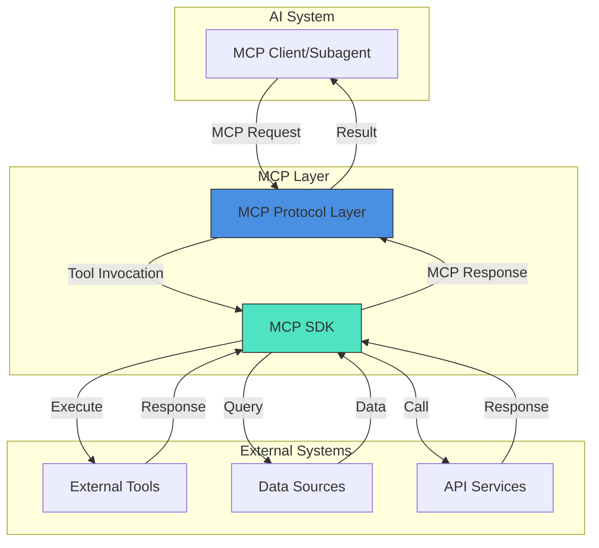
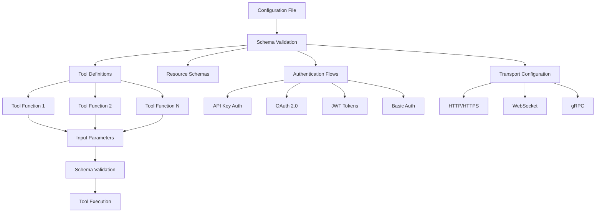
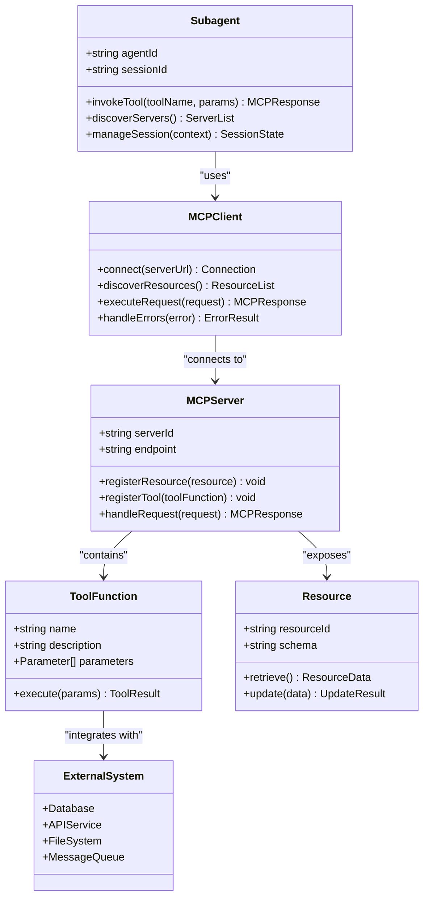
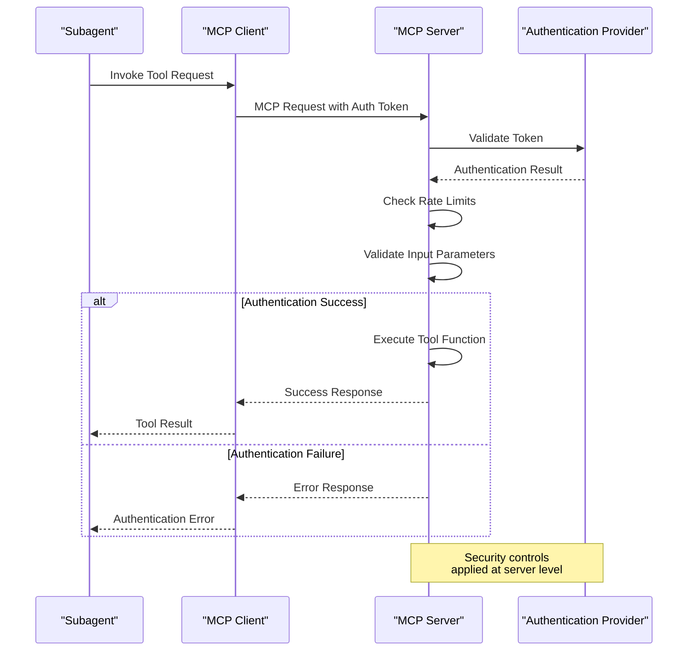
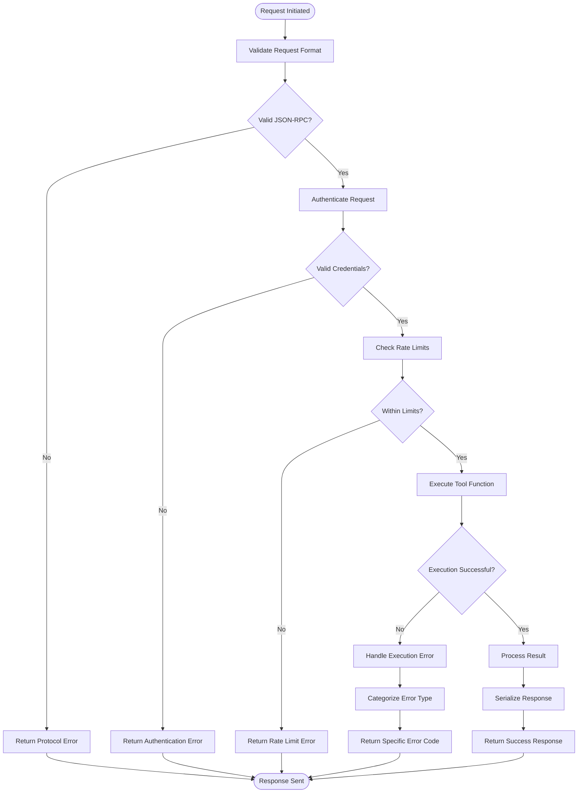
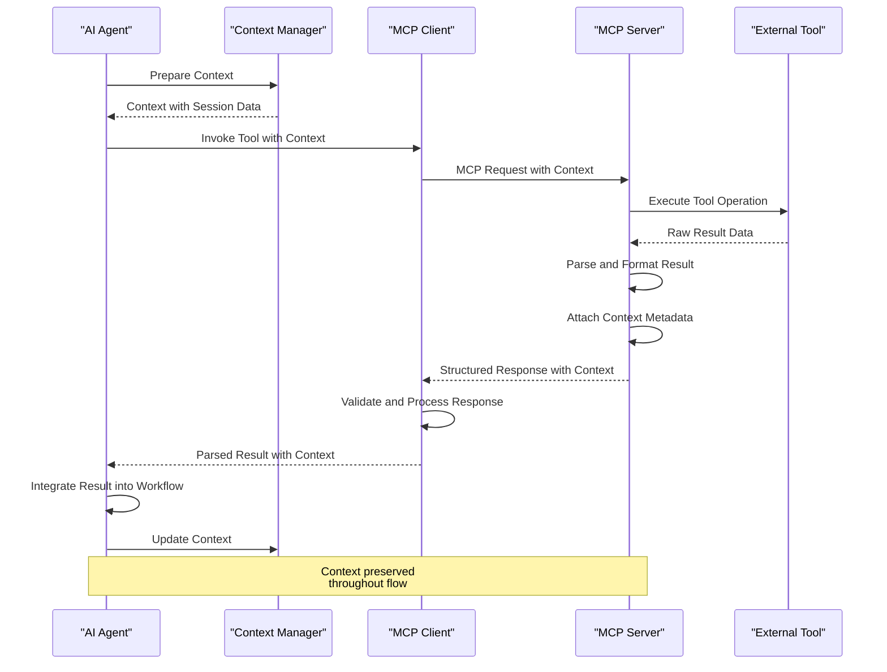

# MCP Tool Integration

<cite>
**Referenced Files in This Document**   
- [mcp-developer.md](file://mcp-developer.md)
</cite>

## Table of Contents
1. [Introduction](#introduction)
2. [MCP Architecture Overview](#mcp-architecture-overview)
3. [Configuration Structure and YAML Schema](#configuration-structure-and-yaml-schema)
4. [Subagent Integration Patterns](#subagent-integration-patterns)
5. [Authentication and Security Implementation](#authentication-and-security-implementation)
6. [Request/Response Flows and Error Handling](#requestresponse-flows-and-error-handling)
7. [Context Preservation and Result Parsing](#context-preservation-and-result-parsing)
8. [Security Considerations](#security-considerations)
9. [Best Practices for MCP Integration Development](#best-practices-for-mcp-integration-development)
10. [Conclusion](#conclusion)

## Introduction

The Model Context Protocol (MCP) enables AI subagents to extend their capabilities by integrating with external tools and data sources. This documentation provides comprehensive guidance on MCP tool integration, detailing how subagents leverage the protocol to access external services, the configuration structure for tool declaration, and best practices for secure and efficient implementation. The MCP framework follows JSON-RPC 2.0 standards and supports both TypeScript and Python implementations through dedicated SDKs, ensuring type safety and robust integration patterns.

**Section sources**
- [mcp-developer.md](file://mcp-developer.md#L0-L42)

## MCP Architecture Overview

MCP operates as a middleware layer connecting AI systems with external tools through a standardized protocol. The architecture consists of MCP servers that expose resources and tools, and MCP clients (subagents) that discover and invoke these capabilities. The protocol enables seamless integration while maintaining security, performance, and developer experience.

**Diagram sources**
- [mcp-developer.md](file://mcp-developer.md#L44-L102)

**Section sources**
- [mcp-developer.md](file://mcp-developer.md#L44-L102)

## Configuration Structure and YAML Schema

MCP integrations are configured through a structured YAML schema that defines tool declarations, authentication requirements, and endpoint specifications. The configuration enables declarative setup of external tool access with proper typing and validation.

**Diagram sources**
- [mcp-developer.md](file://mcp-developer.md#L137-L163)

**Section sources**
- [mcp-developer.md](file://mcp-developer.md#L137-L163)

## Subagent Integration Patterns

Subagents leverage MCP to extend their capabilities through various integration patterns that connect to external systems. These patterns include database connections, API service wrappers, file system access, and legacy system adapters. The MCP SDK provides abstractions that simplify these integrations while maintaining protocol compliance.

**Diagram sources**
- [mcp-developer.md](file://mcp-developer.md#L172-L241)

**Section sources**
- [mcp-developer.md](file://mcp-developer.md#L172-L241)

## Authentication and Security Implementation

MCP provides robust authentication mechanisms to secure tool access while maintaining usability. The protocol supports multiple authentication patterns including API keys, OAuth 2.0, JWT tokens, and basic authentication, with configuration options for rate limiting and request filtering.

**Diagram sources**
- [mcp-developer.md](file://mcp-developer.md#L44-L102)

**Section sources**
- [mcp-developer.md](file://mcp-developer.md#L44-L102)

## Request/Response Flows and Error Handling

MCP follows JSON-RPC 2.0 standards for request/response handling, with comprehensive error handling mechanisms. The protocol supports batch requests, notifications, and proper error code standards to ensure reliable communication between subagents and external tools.

**Diagram sources**
- [mcp-developer.md](file://mcp-developer.md#L44-L102)

**Section sources**
- [mcp-developer.md](file://mcp-developer.md#L44-L102)

## Context Preservation and Result Parsing

MCP maintains context throughout tool execution by preserving session state and properly parsing results for integration into agent workflows. The protocol ensures that contextual information is carried through the entire request lifecycle, from initiation to result utilization.

**Diagram sources**
- [mcp-developer.md](file://mcp-developer.md#L172-L241)

**Section sources**
- [mcp-developer.md](file://mcp-developer.md#L172-L241)

## Security Considerations

MCP implementations must address critical security considerations including credential management, rate limiting, and input validation. The protocol provides built-in mechanisms for secure configuration, request filtering, and audit logging to protect against common vulnerabilities.

```mermaid
flowchart TD
Security[Security Framework] --> Authentication
Security --> Authorization
Security --> InputValidation
Security --> RateLimiting
Security --> Logging
Security --> Encryption
Authentication --> APIKeys
Authentication --> OAuth2
Authentication --> JWT
Authentication --> MutualTLS
Authorization --> RBAC
Authorization --> ABAC
Authorization --> Scopes
InputValidation --> SchemaValidation
InputValidation --> Sanitization
InputValidation --> XSSPrevention
InputValidation --> SQLInjection
RateLimiting --> PerUser
RateLimiting --> PerIP
RateLimiting --> BurstControl
RateLimiting --> SustainedFlow
Logging --> AuditLogs
Logging --> AccessLogs
Logging --> ErrorLogs
Logging --> Monitoring
Encryption --> TLS
Encryption --> DataAtRest
Encryption --> SecretsManagement
style Security fill:#E34F26,stroke:#333,color:white
style Authentication fill:#4A90E2,stroke:#333
style Authorization fill:#4A90E2,stroke:#333
style InputValidation fill:#4A90E2,stroke:#333
style RateLimiting fill:#4A90E2,stroke:#333
style Logging fill:#4A90E2,stroke:#333
style Encryption fill:#4A90E2,stroke:#333
```

**Diagram sources**
- [mcp-developer.md](file://mcp-developer.md#L44-L102)

**Section sources**
- [mcp-developer.md](file://mcp-developer.md#L44-L102)

## Best Practices for MCP Integration Development

Developers implementing MCP integrations should follow established best practices to ensure robust, secure, and maintainable solutions. These practices cover development workflow, testing strategies, performance optimization, and deployment considerations.

```mermaid
flowchart TD
BestPractices[MCP Best Practices] --> Development
BestPractices --> Testing
BestPractices --> Performance
BestPractices --> Security
BestPractices --> Operations
Development --> Modularity
Development --> Documentation
Development --> TypeSafety
Development --> ErrorHandling
Testing --> UnitTests
Testing --> IntegrationTests
Testing --> ComplianceTests
Testing --> SecurityTests
Performance --> Caching
Performance --> ConnectionPooling
Performance --> BatchProcessing
Performance --> LazyLoading
Security --> InputValidation
Security --> LeastPrivilege
Security --> RegularAudits
Security --> SecureDefaults
Operations --> Monitoring
Operations --> Logging
Operations --> Alerting
Operations --> Rollback
style BestPractices fill:#7B68EE,stroke:#333,color:white
style Development fill:#FFD700,stroke:#333
style Testing fill:#32CD32,stroke:#333
style Performance fill:#FF6347,stroke:#333
style Security fill:#DC143C,stroke:#333
style Operations fill:#4169E1,stroke:#333
```

**Diagram sources**
- [mcp-developer.md](file://mcp-developer.md#L172-L241)

**Section sources**
- [mcp-developer.md](file://mcp-developer.md#L172-L241)

## Conclusion

MCP provides a robust framework for integrating AI subagents with external tools and services, enabling extended capabilities while maintaining security and performance standards. By following the configuration patterns, security practices, and development workflows outlined in this documentation, developers can create production-ready MCP integrations that seamlessly connect AI systems with external data sources and tools. The protocol's adherence to JSON-RPC 2.0 standards, combined with comprehensive SDK support and security controls, ensures reliable and scalable integrations across diverse environments.