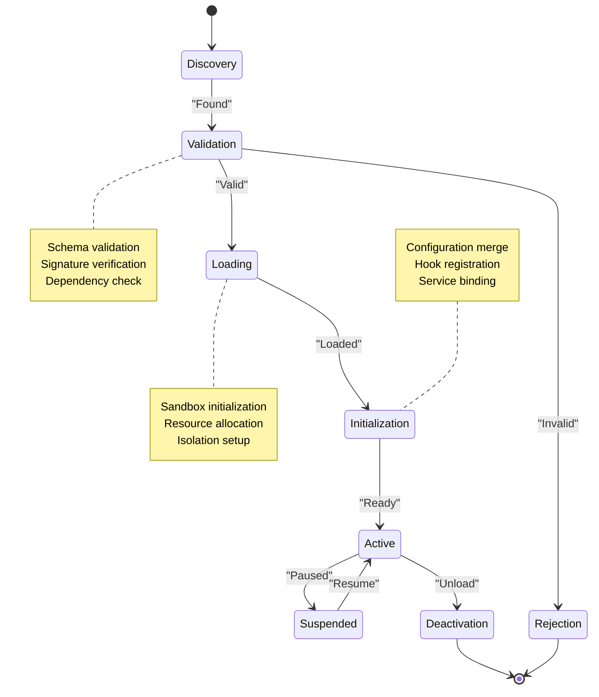
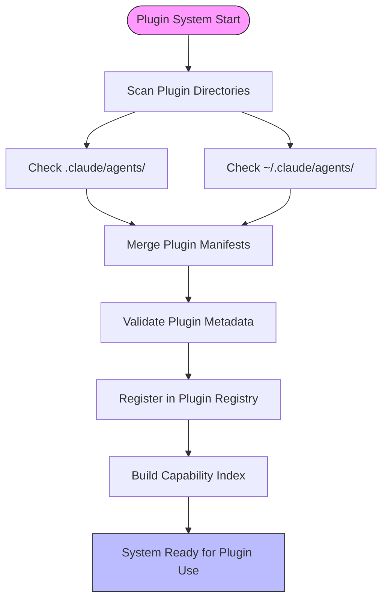
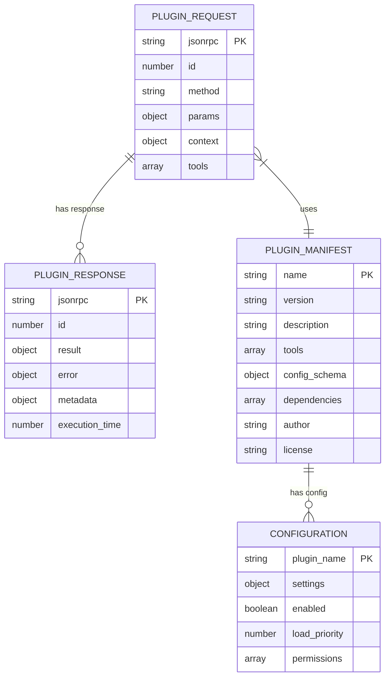
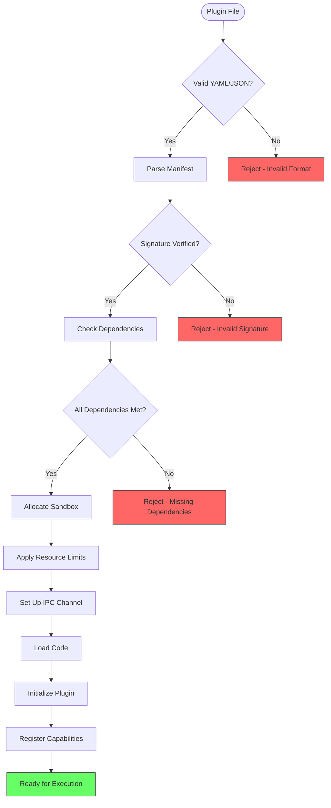
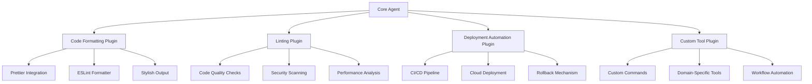
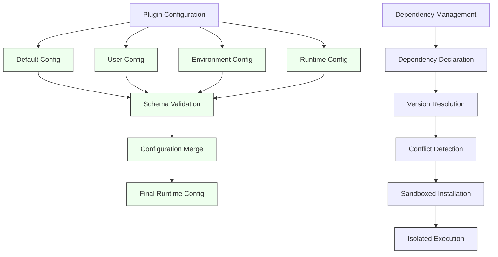
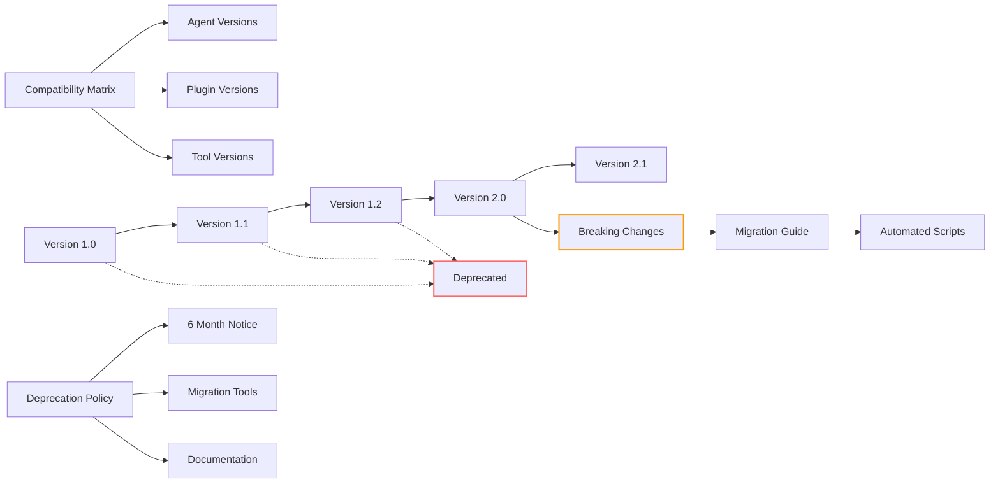
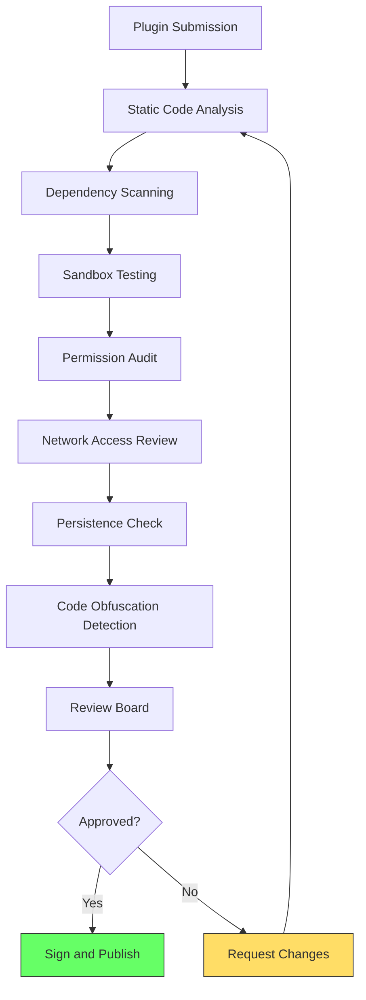
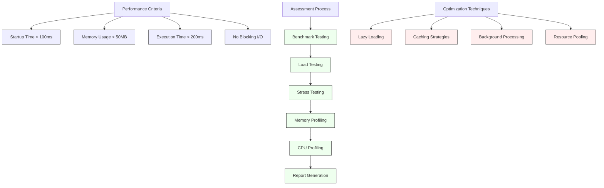

# Plugin Architecture for Agents

<cite>
**Referenced Files in This Document**   
- [tooling-engineer.md](file://tooling-engineer.md)
- [mcp-developer.md](file://mcp-developer.md)
- [cli-developer.md](file://cli-developer.md)
</cite>

## Table of Contents
1. [Introduction](#introduction)
2. [Plugin Lifecycle and Management](#plugin-lifecycle-and-management)
3. [Discovery and Registration Mechanism](#discovery-and-registration-mechanism)
4. [Interface Contracts and Event Hooks](#interface-contracts-and-event-hooks)
5. [Data Exchange Formats](#data-exchange-formats)
6. [Plugin Loading, Validation, and Sandboxing](#plugin-loading-validation-and-sandboxing)
7. [Extensibility Examples](#extensibility-examples)
8. [Configuration and Dependency Management](#configuration-and-dependency-management)
9. [Versioning and Compatibility](#versioning-and-compatibility)
10. [Security Review Guidelines](#security-review-guidelines)
11. [Performance Impact Assessment](#performance-impact-assessment)

## Introduction
The plugin architecture for agents enables extensible behavior across specialized AI agents such as tooling-engineer.md and mcp-developer.md. This system allows for dynamic extension of agent capabilities through modular plugins that adhere to standardized interfaces. The architecture supports a wide range of developer tools including code formatting, linting, and deployment automation, while maintaining security, performance, and backward compatibility.

## Plugin Lifecycle and Management

The plugin lifecycle follows a structured progression from discovery to execution and eventual deactivation. Plugins are managed through well-defined phases that ensure reliability and consistency across agent implementations.



**Diagram sources**
- [tooling-engineer.md](file://tooling-engineer.md#L100-L120)
- [mcp-developer.md](file://mcp-developer.md#L110-L130)

**Section sources**
- [tooling-engineer.md](file://tooling-engineer.md#L90-L130)
- [mcp-developer.md](file://mcp-developer.md#L100-L140)

## Discovery and Registration Mechanism

Plugins are discovered through a hierarchical search process that checks both project-specific and global locations. The registration system maintains a central registry that tracks all available plugins and their metadata.



**Diagram sources**
- [tooling-engineer.md](file://tooling-engineer.md#L105-L115)
- [mcp-developer.md](file://mcp-developer.md#L120-L130)

**Section sources**
- [tooling-engineer.md](file://tooling-engineer.md#L100-L120)
- [cli-developer.md](file://cli-developer.md#L95-L105)

## Interface Contracts and Event Hooks

Plugins must adhere to standardized interface contracts and can register for various event hooks to extend agent functionality. These contracts ensure consistent behavior across different plugin implementations.

```mermaid
classDiagram
class PluginInterface {
+string name
+string version
+string description
+string[] tools
+validate() boolean
+initialize(config) void
+execute(payload) Result
+shutdown() void
}
class EventHook {
+string eventName
+number priority
+execute(data) any
}
class LifecycleHook {
+onLoad() void
+onActivate() void
+onDeactivate() void
+onUnload() void
}
class ToolHook {
+executeTool(command) Result
+getToolSpec() ToolSpec
}
class ConfigHook {
+mergeConfig(userConfig) Config
+validateConfig(config) ValidationReport
}
PluginInterface <|-- LifecycleHook : "extends"
PluginInterface <|-- ToolHook : "extends"
PluginInterface <|-- ConfigHook : "extends"
PluginInterface --> EventHook : "emits"
note right of PluginInterface
All plugins must implement<br/>core interface methods
end note
note right of EventHook
Plugins can subscribe to<br/>system events with priority
end note
```

**Diagram sources**
- [tooling-engineer.md](file://tooling-engineer.md#L110-L125)
- [mcp-developer.md](file://mcp-developer.md#L115-L135)

**Section sources**
- [tooling-engineer.md](file://tooling-engineer.md#L110-L130)
- [mcp-developer.md](file://mcp-developer.md#L110-L140)

## Data Exchange Formats

Plugins communicate with agents using standardized data exchange formats based on JSON-RPC 2.0 protocol. This ensures interoperability between different agents and plugins regardless of implementation language.



**Diagram sources**
- [mcp-developer.md](file://mcp-developer.md#L130-L150)
- [tooling-engineer.md](file://tooling-engineer.md#L120-L130)

**Section sources**
- [mcp-developer.md](file://mcp-developer.md#L130-L160)
- [tooling-engineer.md](file://tooling-engineer.md#L120-L140)

## Plugin Loading, Validation, and Sandboxing

The plugin system employs a rigorous loading process that includes validation and sandboxing to ensure security and stability. Each plugin is isolated in a secure execution environment with controlled resource access.



**Diagram sources**
- [tooling-engineer.md](file://tooling-engineer.md#L115-L125)
- [mcp-developer.md](file://mcp-developer.md#L140-L150)

**Section sources**
- [tooling-engineer.md](file://tooling-engineer.md#L110-L130)
- [mcp-developer.md](file://mcp-developer.md#L140-L160)

## Extensibility Examples

The plugin architecture enables various types of extensions that enhance agent capabilities. These examples demonstrate how new functionalities like code formatting, linting, and deployment automation can be added.



**Diagram sources**
- [tooling-engineer.md](file://tooling-engineer.md#L80-L90)
- [mcp-developer.md](file://mcp-developer.md#L90-L100)

**Section sources**
- [tooling-engineer.md](file://tooling-engineer.md#L80-L100)
- [mcp-developer.md](file://mcp-developer.md#L90-L110)

## Configuration and Dependency Management

Plugins support flexible configuration through layered configuration systems and manage dependencies through a centralized dependency management system that ensures compatibility and security.



**Diagram sources**
- [tooling-engineer.md](file://tooling-engineer.md#L118-L125)
- [dependency-manager.md](file://dependency-manager.md#L150-L180)

**Section sources**
- [tooling-engineer.md](file://tooling-engineer.md#L115-L130)
- [dependency-manager.md](file://dependency-manager.md#L145-L190)

## Versioning and Compatibility

The plugin system implements comprehensive versioning strategies with backward compatibility guarantees and clear deprecation policies to ensure smooth upgrades and maintenance.



**Diagram sources**
- [tooling-engineer.md](file://tooling-engineer.md#L122-L125)
- [mcp-developer.md](file://mcp-developer.md#L155-L165)

**Section sources**
- [tooling-engineer.md](file://tooling-engineer.md#L120-L130)
- [mcp-developer.md](file://mcp-developer.md#L150-L170)

## Security Review Guidelines

Third-party plugins undergo rigorous security reviews to prevent vulnerabilities and ensure safe execution within the agent ecosystem. The review process covers code quality, dependency security, and runtime behavior.



**Diagram sources**
- [mcp-developer.md](file://mcp-developer.md#L140-L160)
- [dependency-manager.md](file://dependency-manager.md#L150-L180)

**Section sources**
- [mcp-developer.md](file://mcp-developer.md#L140-L170)
- [dependency-manager.md](file://dependency-manager.md#L145-L190)

## Performance Impact Assessment

All plugins are evaluated for their performance impact to ensure they meet strict performance criteria and do not degrade the overall agent experience.



**Diagram sources**
- [tooling-engineer.md](file://tooling-engineer.md#L95-L105)
- [mcp-developer.md](file://mcp-developer.md#L150-L160)

**Section sources**
- [tooling-engineer.md](file://tooling-engineer.md#L90-L110)
- [mcp-developer.md](file://mcp-developer.md#L145-L165)