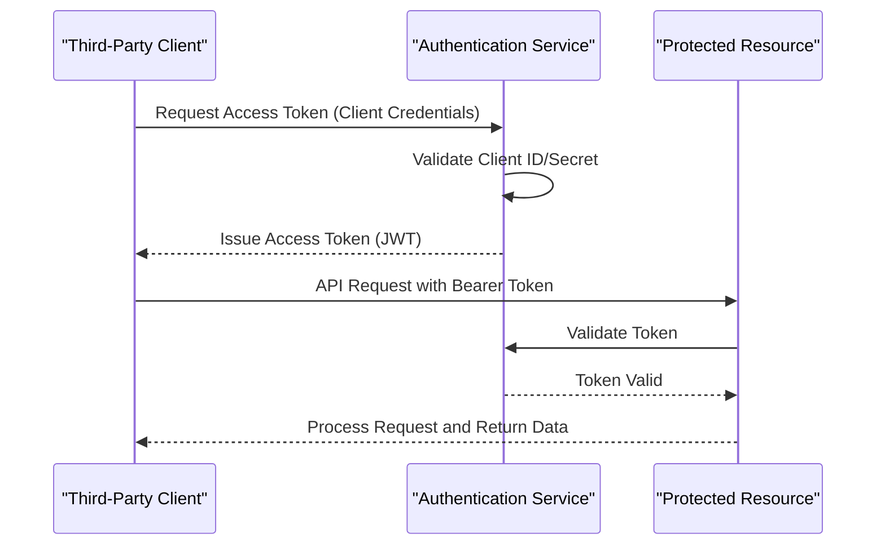
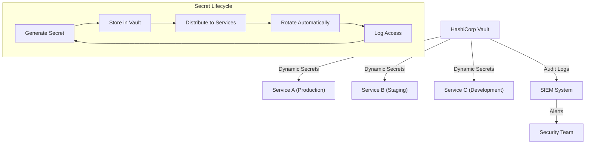
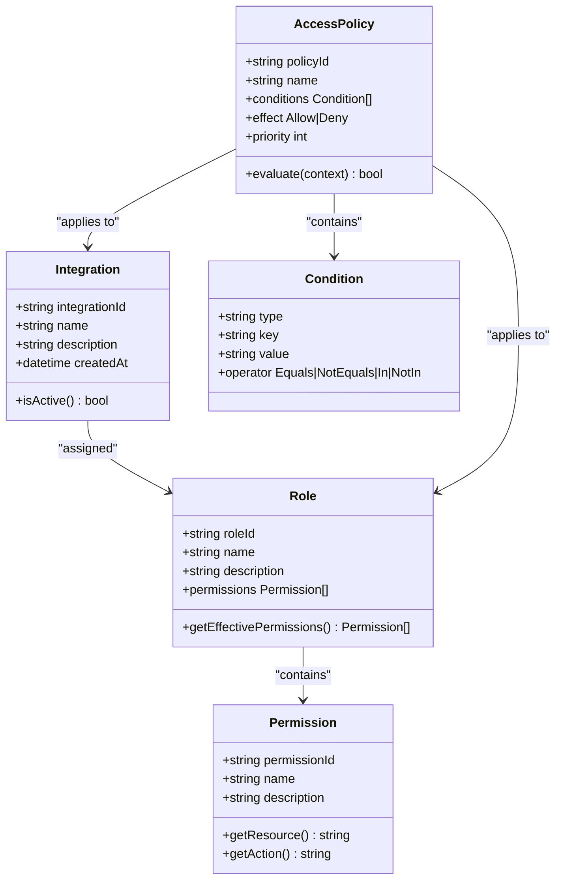
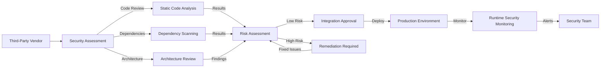
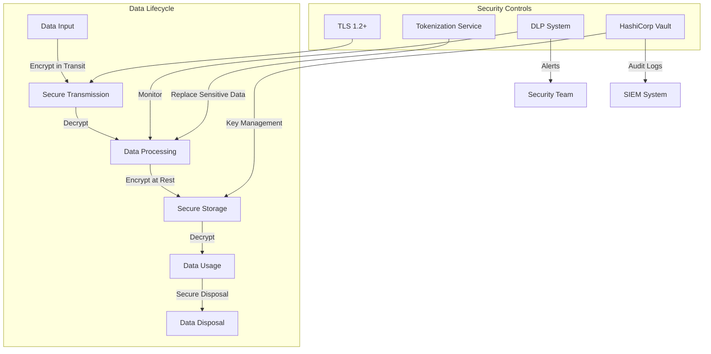
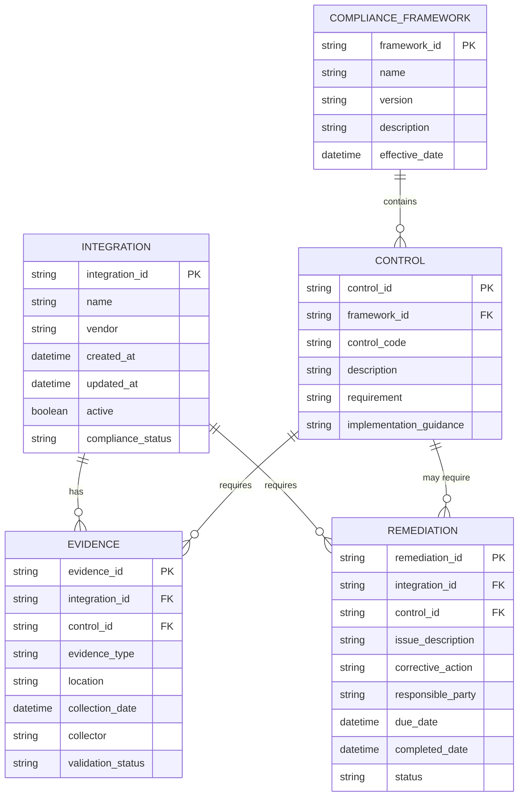
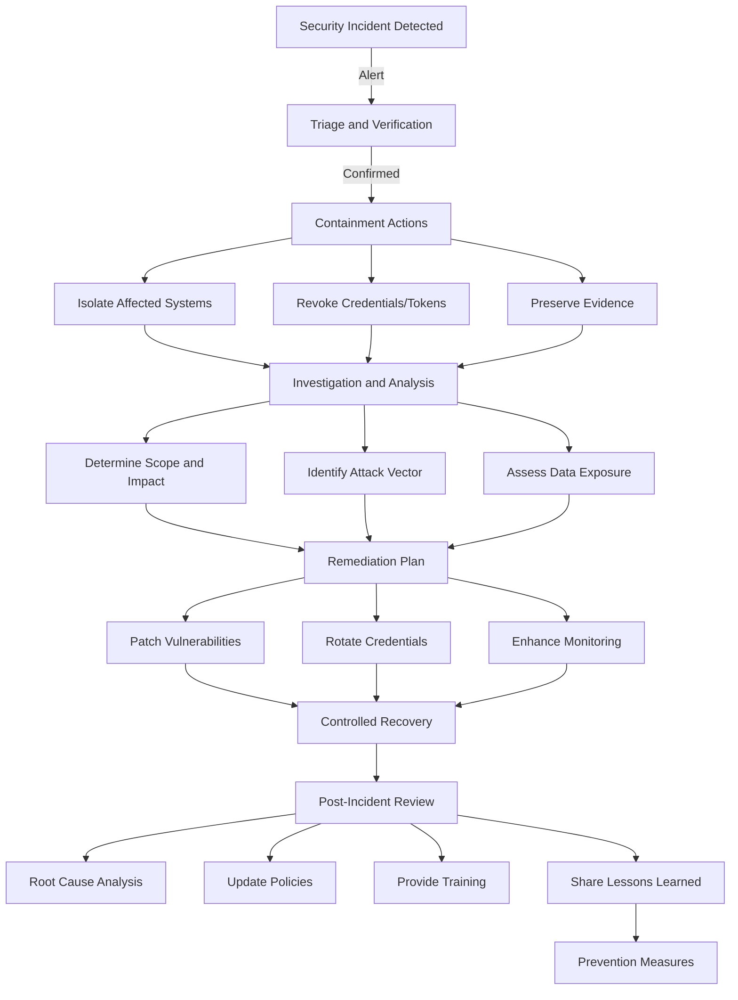

# Security for Third-Party Integrations

<cite>
**Referenced Files in This Document**   
- [mcp-developer.md](file://mcp-developer.md)
- [compliance-auditor.md](file://compliance-auditor.md)
- [security-auditor.md](file://security-auditor.md)
- [payment-integration.md](file://payment-integration.md)
- [security-engineer.md](file://security-engineer.md)
- [fintech-engineer.md](file://fintech-engineer.md)
- [dependency-manager.md](file://dependency-manager.md)
</cite>

## Table of Contents
1. [Introduction](#introduction)
2. [Authentication Protocols](#authentication-protocols)
3. [Credential Storage and Secrets Management](#credential-storage-and-secrets-management)
4. [Least-Privilege Access Principles](#least-privilege-access-principles)
5. [Integration Vetting and Security Assessment](#integration-vetting-and-security-assessment)
6. [Data Protection and Encryption](#data-protection-and-encryption)
7. [Compliance Requirements](#compliance-requirements)
8. [Secure Deployment Checklist](#secure-deployment-checklist)
9. [Incident Response for Compromised Integrations](#incident-response-for-compromised-integrations)
10. [Audit Logging Requirements](#audit-logging-requirements)
11. [Real-World MCP Implementation Examples](#real-world-mcp-implementation-examples)
12. [Common Integration Vulnerabilities to Avoid](#common-integration-vulnerabilities-to-avoid)

## Introduction

Third-party integrations are critical for extending the capabilities of AI agent ecosystems, enabling access to external tools, data sources, and services. However, they introduce significant security risks that must be systematically addressed. This document provides comprehensive security guidance for integrating third-party systems within the agent ecosystem, drawing on expertise from the MCP Developer, Compliance Auditor, and Security Auditor roles.

The guidance covers secure integration patterns, authentication mechanisms, data protection, compliance frameworks, and operational best practices. It emphasizes a defense-in-depth approach, combining technical controls, policy enforcement, and continuous monitoring to ensure secure, compliant, and resilient integrations.

**Section sources**
- [mcp-developer.md](file://mcp-developer.md#L1-L283)
- [compliance-auditor.md](file://compliance-auditor.md#L1-L283)
- [security-auditor.md](file://security-auditor.md#L1-L295)

## Authentication Protocols

Secure authentication is the foundation of trusted third-party integrations. The ecosystem supports multiple authentication mechanisms, each suited to different integration scenarios.

### OAuth 2.0 and OpenID Connect
For user-facing integrations requiring delegated access, OAuth 2.0 with OpenID Connect (OIDC) is the preferred standard. This enables secure authorization flows such as Authorization Code with PKCE for web and mobile clients, and Client Credentials flow for service-to-service communication.

### API Keys
For machine-to-machine integrations where user context is not required, API keys provide a simple yet effective authentication mechanism. Keys must be long, cryptographically random strings, transmitted over HTTPS, and associated with specific permissions and rate limits.

### Service Accounts
For backend services and automated processes, service accounts with dedicated credentials provide traceable, auditable access. These accounts follow the principle of least privilege and are rotated regularly.

### Mutual TLS (mTLS)
For high-security integrations, mutual TLS provides bidirectional authentication, ensuring both client and server verify each other's identities through digital certificates.

**Diagram sources**
- [mcp-developer.md](file://mcp-developer.md#L155-L163)
- [security-auditor.md](file://security-auditor.md#L100-L114)

**Section sources**
- [mcp-developer.md](file://mcp-developer.md#L155-L163)
- [security-auditor.md](file://security-auditor.md#L100-L114)

## Credential Storage and Secrets Management

Proper handling of credentials and secrets is critical to prevent unauthorized access and data breaches.

### Secure Storage Principles
Credentials must never be stored in plaintext, hardcoded in source code, or committed to version control. Instead, they should be managed through dedicated secrets management systems.

### HashiCorp Vault Integration
The recommended solution for secrets management is HashiCorp Vault, which provides:
- Dynamic secret generation
- Automated secret rotation
- Fine-grained access policies
- Audit logging of secret access
- Encryption as a service

### Environment-Specific Configuration
Credentials are injected into runtime environments through secure configuration mechanisms, with separate secrets for development, staging, and production environments.

**Diagram sources**
- [security-engineer.md](file://security-engineer.md#L95-L129)
- [mcp-developer.md](file://mcp-developer.md#L172-L180)

**Section sources**
- [security-engineer.md](file://security-engineer.md#L95-L129)
- [mcp-developer.md](file://mcp-developer.md#L172-L180)

## Least-Privilege Access Principles

The principle of least privilege is fundamental to minimizing the attack surface of third-party integrations.

### Role-Based Access Control (RBAC)
Access to resources and tools is granted through predefined roles with specific permissions. Each integration is assigned the minimum set of permissions required to perform its function.

### Scope-Limited Tokens
Authentication tokens include scoped permissions that limit what actions can be performed. For example, a read-only integration receives tokens with only GET permissions.

### Just-In-Time (JIT) Access
For high-privilege operations, just-in-time access provisioning ensures that elevated permissions are granted only when needed and automatically revoked after use.

### Regular Access Reviews
Automated systems conduct regular reviews of integration permissions, identifying and removing unnecessary access rights.

**Diagram sources**
- [security-auditor.md](file://security-auditor.md#L70-L85)
- [compliance-auditor.md](file://compliance-auditor.md#L60-L75)

**Section sources**
- [security-auditor.md](file://security-auditor.md#L70-L85)
- [compliance-auditor.md](file://compliance-auditor.md#L60-L75)

## Integration Vetting and Security Assessment

All third-party integrations undergo a rigorous vetting process before deployment to production environments.

### Code Scanning
Automated static application security testing (SAST) tools scan integration code for vulnerabilities, including:
- Injection flaws
- Broken authentication
- Sensitive data exposure
- Security misconfigurations
- Known vulnerabilities in dependencies

### Dependency Audits
The dependency manager conducts comprehensive audits of all third-party libraries, checking for:
- Known CVEs (Common Vulnerabilities and Exposures)
- License compliance issues
- Supply chain risks
- Typosquatting and dependency confusion
- Build reproducibility

### Runtime Monitoring
Once deployed, integrations are continuously monitored for anomalous behavior using:
- Falco for runtime security monitoring
- Trivy for container vulnerability scanning
- Custom behavioral analytics
- Performance and error rate tracking

**Diagram sources**
- [dependency-manager.md](file://dependency-manager.md#L45-L91)
- [security-auditor.md](file://security-auditor.md#L115-L150)
- [security-engineer.md](file://security-engineer.md#L95-L129)

**Section sources**
- [dependency-manager.md](file://dependency-manager.md#L45-L91)
- [security-auditor.md](file://security-auditor.md#L115-L150)
- [security-engineer.md](file://security-engineer.md#L95-L129)

## Data Protection and Encryption

Data protection is paramount when integrating with third-party systems, especially when handling sensitive information.

### Encryption in Transit
All data transmitted between the agent ecosystem and third-party services must be encrypted using:
- TLS 1.2 or higher
- Strong cipher suites
- Certificate pinning for critical integrations
- Perfect forward secrecy

### Encryption at Rest
Data stored by integrations must be encrypted at rest using:
- AES-256 encryption
- Key management through HashiCorp Vault
- Customer-managed encryption keys (CMEK) where required
- Hardware security modules (HSMs) for highest sensitivity data

### Data Minimization
Integrations follow the principle of data minimization, collecting and processing only the data necessary for their specific function.

### Tokenization
For sensitive data like payment information, tokenization replaces sensitive values with non-sensitive equivalents, reducing the scope of compliance requirements.

**Diagram sources**
- [payment-integration.md](file://payment-integration.md#L91-L125)
- [security-auditor.md](file://security-auditor.md#L80-L94)
- [compliance-auditor.md](file://compliance-auditor.md#L50-L64)

**Section sources**
- [payment-integration.md](file://payment-integration.md#L91-L125)
- [security-auditor.md](file://security-auditor.md#L80-L94)
- [compliance-auditor.md](file://compliance-auditor.md#L50-L64)

## Compliance Requirements

Third-party integrations must comply with relevant regulatory frameworks and industry standards.

### GDPR Compliance
For integrations handling personal data of EU residents:
- Lawful basis for processing documented
- Data subject rights implemented (access, rectification, erasure)
- Data protection impact assessments (DPIAs) conducted
- Data processing agreements (DPAs) in place with vendors
- Cross-border transfer mechanisms established

### SOC 2 Compliance
For integrations requiring SOC 2 compliance:
- Security, availability, processing integrity, confidentiality, and privacy principles implemented
- Regular audits conducted
- Evidence of controls maintained
- Continuous monitoring of control effectiveness

### PCI DSS Compliance
For payment-related integrations:
- Tokenization of cardholder data
- Segregation of payment systems
- Regular penetration testing
- Strong customer authentication (SCA)
- Comprehensive audit trails

### Other Frameworks
Additional compliance requirements may include:
- HIPAA for healthcare data
- CCPA/CPRA for California residents
- ISO 27001 for information security management
- NIST frameworks for cybersecurity

**Diagram sources**
- [compliance-auditor.md](file://compliance-auditor.md#L1-L283)
- [security-auditor.md](file://security-auditor.md#L1-L295)
- [payment-integration.md](file://payment-integration.md#L91-L125)

**Section sources**
- [compliance-auditor.md](file://compliance-auditor.md#L1-L283)
- [security-auditor.md](file://security-auditor.md#L1-L295)
- [payment-integration.md](file://payment-integration.md#L91-L125)

## Secure Deployment Checklist

Before deploying any third-party integration to production, the following security checklist must be completed:

### Authentication and Authorization
- [ ] Authentication mechanism implemented (OAuth, API keys, or service accounts)
- [ ] Authorization controls enforce least privilege
- [ ] MFA enabled for administrative access
- [ ] Session management follows secure practices

### Data Protection
- [ ] Encryption in transit (TLS 1.2+) implemented
- [ ] Encryption at rest configured for sensitive data
- [ ] Data minimization principles applied
- [ ] Tokenization used for sensitive fields where applicable

### Security Controls
- [ ] Input validation and output encoding implemented
- [ ] Rate limiting configured to prevent abuse
- [ ] Logging and monitoring enabled
- [ ] Error handling prevents information leakage

### Compliance and Audit
- [ ] Required compliance frameworks addressed (GDPR, SOC 2, PCI DSS, etc.)
- [ ] Audit logging captures all access and changes
- [ ] Data retention and deletion policies implemented
- [ ] Vendor security assessments completed

### Operational Readiness
- [ ] Automated testing coverage > 90%
- [ ] Incident response procedures documented
- [ ] Backup and recovery procedures tested
- [ ] Disaster recovery plan in place

**Section sources**
- [mcp-developer.md](file://mcp-developer.md#L172-L241)
- [compliance-auditor.md](file://compliance-auditor.md#L1-L283)
- [security-auditor.md](file://security-auditor.md#L1-L295)

## Incident Response for Compromised Integrations

When a third-party integration is suspected or confirmed to be compromised, the following incident response procedures must be followed.

### Immediate Containment
1. Disable the compromised integration
2. Revoke all associated credentials and tokens
3. Isolate affected systems from the network
4. Preserve logs and evidence for forensic analysis

### Investigation and Analysis
1. Determine the scope and impact of the compromise
2. Identify the attack vector and root cause
3. Assess data accessed or exfiltrated
4. Evaluate compliance implications

### Remediation and Recovery
1. Patch vulnerabilities and strengthen security controls
2. Rotate all compromised credentials
3. Implement additional monitoring
4. Gradually restore services with enhanced security

### Post-Incident Review
1. Conduct a root cause analysis
2. Update security policies and procedures
3. Provide additional training if needed
4. Share lessons learned with relevant teams

**Diagram sources**
- [security-auditor.md](file://security-auditor.md#L130-L144)
- [payment-integration.md](file://payment-integration.md#L219-L280)
- [fintech-engineer.md](file://fintech-engineer.md#L283-L293)

**Section sources**
- [security-auditor.md](file://security-auditor.md#L130-L144)
- [payment-integration.md](file://payment-integration.md#L219-L280)
- [fintech-engineer.md](file://fintech-engineer.md#L283-L293)

## Audit Logging Requirements

Comprehensive audit logging is essential for security monitoring, incident investigation, and compliance verification.

### Log Content Requirements
All integration activities must be logged with the following information:
- Timestamp (UTC)
- User or service identity
- Source IP address
- Action performed
- Target resource
- Request and response details (without sensitive data)
- Result (success/failure)
- Trace ID for request correlation

### Log Management
- Logs are stored for a minimum of 365 days
- Logs are protected from tampering and unauthorized access
- Logs are aggregated in a central SIEM system
- Logs are regularly reviewed for suspicious activity

### Retention and Archiving
- Active logs retained for 90 days in high-performance storage
- Archived logs retained for 365 days in cost-effective storage
- Critical security events retained indefinitely
- Legal hold capabilities for investigation purposes

**Section sources**
- [security-auditor.md](file://security-auditor.md#L115-L150)
- [compliance-auditor.md](file://compliance-auditor.md#L1-L283)
- [mcp-developer.md](file://mcp-developer.md#L172-L241)

## Real-World MCP Implementation Examples

### Secure Payment Integration
The payment-integration agent implements secure connections to multiple payment gateways while maintaining PCI DSS compliance:
- Tokenization of cardholder data
- End-to-end encryption
- Strong customer authentication
- Comprehensive audit trails
- Automated reconciliation
- Fraud detection systems

### Financial Data Integration
The fintech-engineer agent integrates with banking and financial systems:
- OAuth 2.0 for user authorization
- Mutual TLS for service-to-service communication
- Data encryption at rest and in transit
- Regular penetration testing
- Compliance with financial regulations

### Cloud Service Integration
The cloud-architect agent connects to cloud provider APIs:
- Service accounts with limited permissions
- API key rotation every 90 days
- Activity logging to cloud audit trails
- Integration with cloud security tools (Prowler, Scout Suite)

**Section sources**
- [payment-integration.md](file://payment-integration.md#L91-L292)
- [fintech-engineer.md](file://fintech-engineer.md#L283-L293)
- [cloud-architect.md](file://cloud-architect.md#L1-L283)

## Common Integration Vulnerabilities to Avoid

### Insecure Authentication
- Hardcoded API keys in source code
- Weak or predictable passwords
- Lack of multi-factor authentication
- Insufficient session expiration

### Poor Input Validation
- Injection attacks (SQL, command, XSS)
- Buffer overflow vulnerabilities
- Improper error handling that leaks information
- Lack of input sanitization

### Inadequate Access Controls
- Overly permissive roles and permissions
- Missing authorization checks
- Insecure direct object references
- Horizontal privilege escalation

### Misconfigured Security
- Disabled or weak encryption
- Unpatched software with known vulnerabilities
- Open ports and unnecessary services
- Default credentials not changed

### Insufficient Monitoring
- Lack of audit logging
- No alerting for suspicious activity
- Inadequate log retention
- Failure to monitor third-party dependencies

**Section sources**
- [security-auditor.md](file://security-auditor.md#L1-L295)
- [code-reviewer.md](file://code-reviewer.md#L1-L43)
- [dependency-manager.md](file://dependency-manager.md#L1-L43)