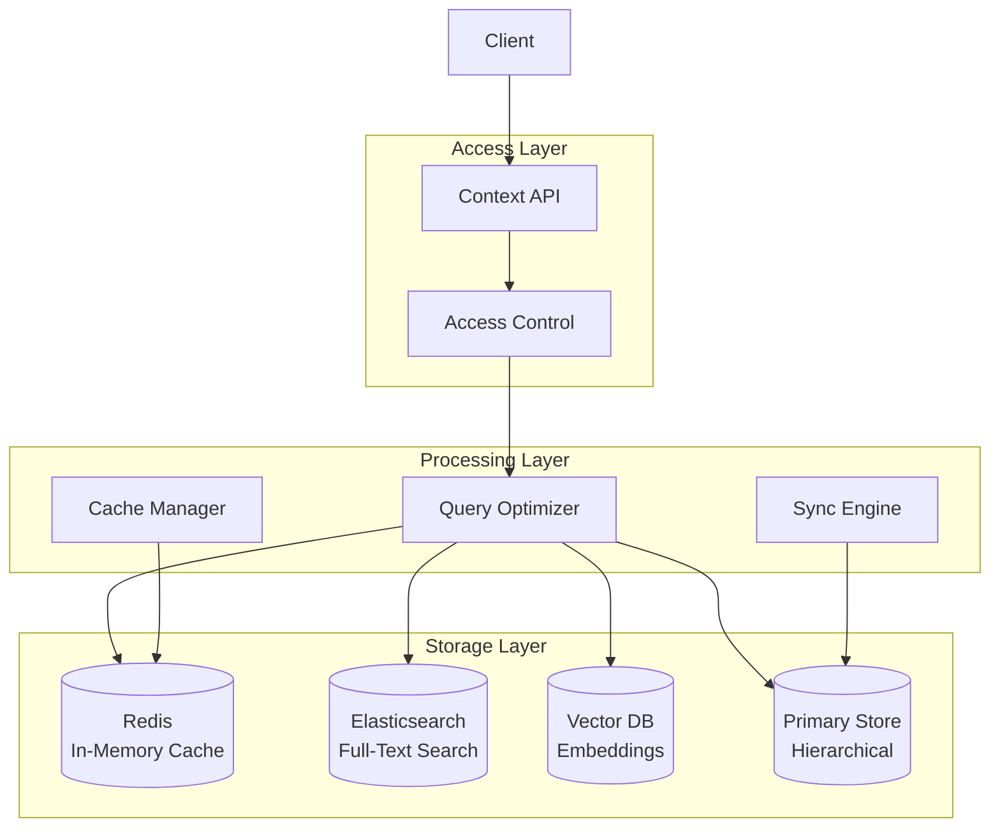
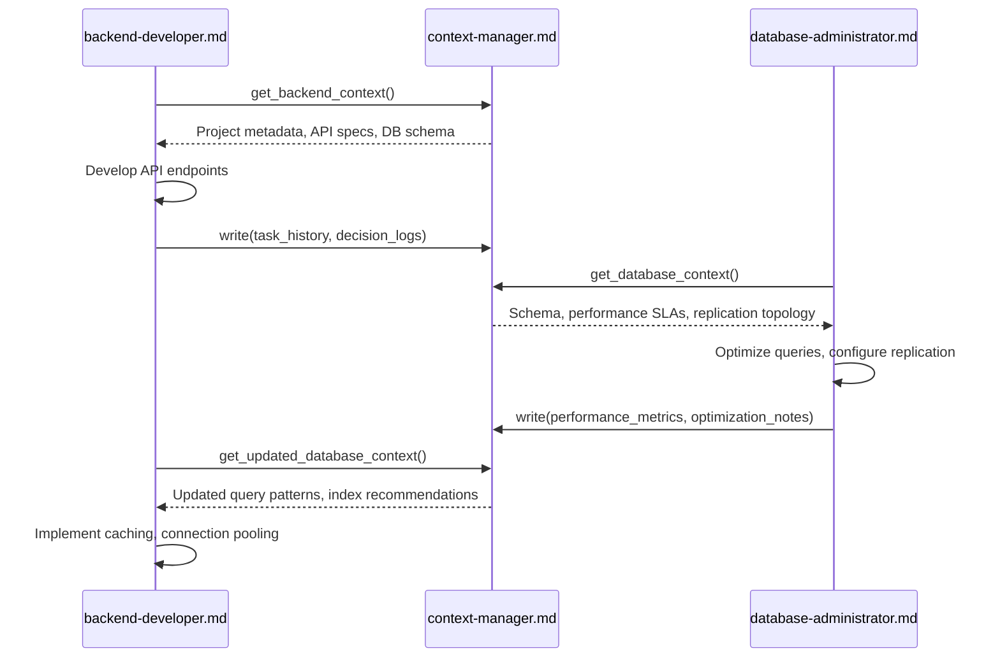
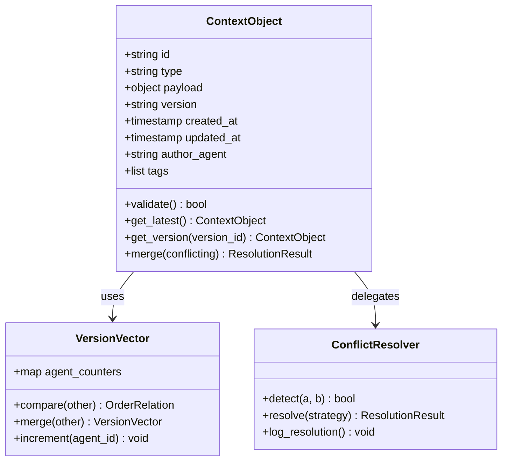
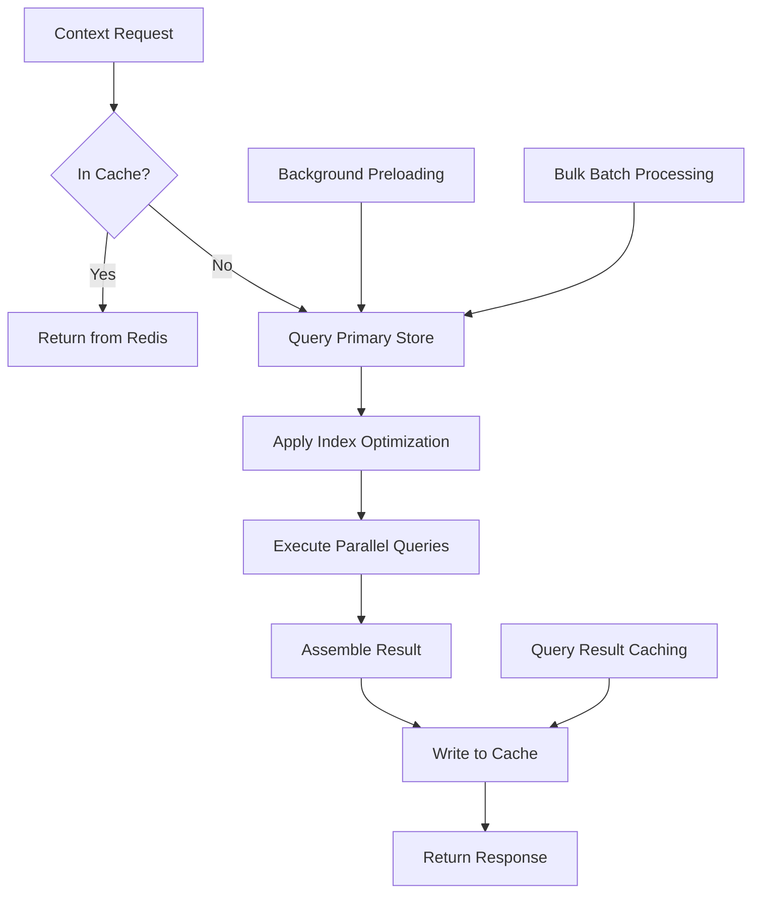
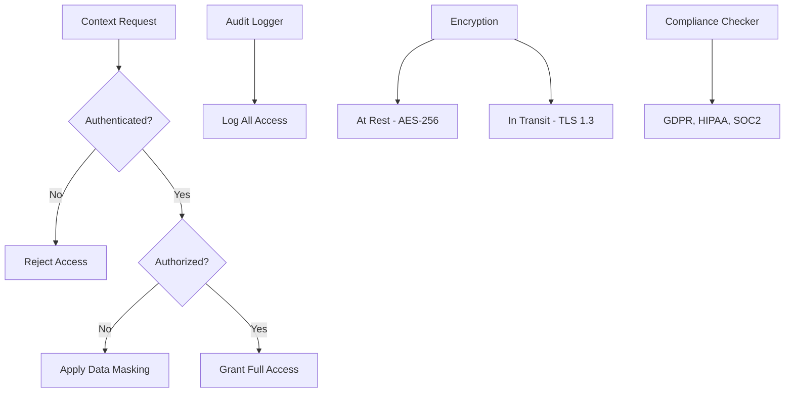

# Context Manager

<cite>
**Referenced Files in This Document**   
- [context-manager.md](file://context-manager.md)
- [backend-developer.md](file://backend-developer.md)
- [database-administrator.md](file://database-administrator.md)
</cite>

## Table of Contents
1. [Introduction](#introduction)
2. [Core Responsibilities](#core-responsibilities)
3. [Context Architecture](#context-architecture)
4. [Domain Model for Context Objects](#domain-model-for-context-objects)
5. [Context Propagation and MCP Integration](#context-propagation-and-mcp-integration)
6. [Agent Collaboration Workflow](#agent-collaboration-workflow)
7. [Consistency and Versioning](#consistency-and-versioning)
8. [Common Challenges and Solutions](#common-challenges-and-solutions)
9. [Performance and Optimization](#performance-and-optimization)
10. [Security and Compliance](#security-and-compliance)

## Introduction

The Context Manager serves as the central nervous system for information flow across distributed agent systems. It ensures that all collaborating agents—such as backend-developer.md and database-administrator.md—operate with consistent, up-to-date, and relevant contextual knowledge throughout project execution. This document details its role in gathering, storing, and distributing project-specific context including codebase structure, requirements, constraints, and shared state.

By maintaining a unified source of truth, the Context Manager enables seamless collaboration across specialized agents, preventing information silos and reducing coordination overhead. It supports both beginners through intuitive access patterns and experienced developers via advanced consistency models and versioning controls.

**Section sources**
- [context-manager.md](file://context-manager.md#L1-L43)

## Core Responsibilities

The Context Manager is responsible for end-to-end lifecycle management of contextual information across the multi-agent ecosystem. Its primary functions include:

- **Information Storage**: Persisting structured and unstructured context using optimized storage backends.
- **Retrieval Optimization**: Ensuring sub-100ms retrieval times through indexing, caching, and query optimization.
- **State Synchronization**: Maintaining data consistency across agents with version control and conflict resolution.
- **Access Governance**: Enforcing authentication, authorization, and audit logging for secure access.
- **Lifecycle Management**: Applying retention, archiving, and deletion policies in compliance with regulatory standards.

These responsibilities are guided by strict performance targets: retrieval time < 100ms, availability > 99.9%, and 100% data consistency.

**Section sources**
- [context-manager.md](file://context-manager.md#L43-L98)

## Context Architecture

The Context Manager employs a multi-layered architecture designed for scalability, reliability, and performance. It leverages a combination of storage technologies tailored to different context types:



**Diagram sources**
- [context-manager.md](file://context-manager.md#L45-L98)
- [context-manager.md](file://context-manager.md#L93-L125)

**Section sources**
- [context-manager.md](file://context-manager.md#L45-L98)

## Domain Model for Context Objects

The Context Manager organizes information into well-defined context types, each serving a specific purpose in the agent collaboration lifecycle:

| Context Type | Description | Storage Pattern | Example Use Case |
|--------------|-------------|------------------|------------------|
| Project Metadata | High-level project details (name, scope, timeline) | Hierarchical + Metadata Indexing | Initializing new agent sessions |
| Agent Interactions | Logs of communication and task delegation between agents | Time-Series + Graph Relationships | Auditing coordination flows |
| Task History | Record of completed tasks, outcomes, and artifacts | Time-Series + Full-Text Search | Retrieving past implementation decisions |
| Decision Logs | Rationale behind architectural or technical choices | Full-Text Search + Metadata Indexing | Explaining API design patterns |
| Performance Metrics | System and agent performance data | Time-Series Data | Monitoring backend response times |
| Resource Usage | Computational and storage consumption | Time-Series Data | Cost optimization analysis |
| Error Patterns | Recurring issues and resolution strategies | Graph Relationships + Full-Text Search | Assisting error-coordinator.md |
| Knowledge Base | Shared domain knowledge and best practices | Vector Embeddings + Full-Text Search | Enabling knowledge-synthesizer.md |

This domain model supports flexible querying, semantic search, and relationship mapping across different dimensions of project context.

**Section sources**
- [context-manager.md](file://context-manager.md#L45-L98)

## Context Propagation and MCP Integration

The Context Manager integrates with MCP tools to enable dynamic context extraction and updates during task execution. When an agent begins work, it queries the Context Manager for relevant information before proceeding.

For example, when the backend-developer.md is invoked, it sends a standardized request:

```json
{
  "requesting_agent": "backend-developer",
  "request_type": "get_backend_context",
  "payload": {
    "query": "Require backend system overview: service architecture, data stores, API gateway config, auth providers, message brokers, and deployment patterns."
  }
}
```

The Context Manager processes this using its tool suite:
- **Read**: Retrieves stored context objects
- **Write**: Updates context with new findings
- **redis**: Provides low-latency access to frequently used context
- **elasticsearch**: Enables full-text search across decision logs and documentation
- **vector-db**: Powers semantic similarity searches for related knowledge

After processing, the backend-developer.md receives a comprehensive context package that informs its implementation decisions, ensuring alignment with existing architecture.

**Section sources**
- [context-manager.md](file://context-manager.md#L132-L217)
- [backend-developer.md](file://backend-developer.md#L116-L138)

## Agent Collaboration Workflow

A key use case involves context preservation during transitions between backend-developer.md and database-administrator.md during API development.



**Diagram sources**
- [context-manager.md](file://context-manager.md#L132-L217)
- [backend-developer.md](file://backend-developer.md#L116-L138)
- [database-administrator.md](file://database-administrator.md#L116-L138)

**Section sources**
- [context-manager.md](file://context-manager.md#L132-L217)
- [backend-developer.md](file://backend-developer.md#L116-L138)
- [database-administrator.md](file://database-administrator.md#L116-L138)

## Consistency and Versioning

To ensure data integrity across distributed operations, the Context Manager implements robust consistency and versioning mechanisms:



**Diagram sources**
- [context-manager.md](file://context-manager.md#L45-L98)
- [context-manager.md](file://context-manager.md#L219-L280)

**Section sources**
- [context-manager.md](file://context-manager.md#L45-L98)
- [context-manager.md](file://context-manager.md#L219-L280)

Key strategies include:
- **Version Vectors**: Track causal relationships between updates from different agents
- **Conflict Detection**: Identify divergent changes using vector clocks
- **Merge Algorithms**: Apply domain-specific rules to resolve conflicts
- **Event Ordering**: Ensure causal consistency in distributed environments
- **Read Repair**: Correct stale reads by updating outdated replicas
- **Write Quorums**: Require majority agreement before acknowledging writes

These mechanisms guarantee 100% consistency even under concurrent modifications.

## Common Challenges and Solutions

The Context Manager addresses several common collaboration challenges:

| Challenge | Solution | Implementation |
|---------|---------|----------------|
| Context Drift | Real-time synchronization | Event streaming with delta updates |
| Stale Data | Cache invalidation | TTL management + write-through invalidation |
| Information Overload | Intelligent filtering | Tag-based retrieval + relevance ranking |
| Inconsistent States | Distributed locking | Lease-based locks with timeout |
| Lost Updates | Optimistic concurrency | Version checks on write operations |
| Orphaned Context | Lifecycle policies | Automated cleanup based on retention rules |

For example, when transitioning from API design to implementation, the Context Manager prevents drift by immediately propagating schema changes from api-designer.md to backend-developer.md via event-driven updates.

**Section sources**
- [context-manager.md](file://context-manager.md#L45-L98)
- [context-manager.md](file://context-manager.md#L93-L125)

## Performance and Optimization

The Context Manager achieves high performance through layered optimization strategies:



**Diagram sources**
- [context-manager.md](file://context-manager.md#L93-L125)
- [context-manager.md](file://context-manager.md#L219-L280)

**Section sources**
- [context-manager.md](file://context-manager.md#L93-L125)
- [context-manager.md](file://context-manager.md#L219-L280)

Optimization techniques include:
- **Cache Hierarchy**: Multi-tier caching with Redis for hot data
- **Preloading Logic**: Anticipate access patterns based on workflow stages
- **Query Optimization**: Use index utilization and parallel processing
- **Batch Retrieval**: Reduce round-trips with bulk operations
- **Lazy Loading**: Load non-critical context on demand
- **Prefetching**: Predictively load context based on agent behavior

These optimizations enable an average retrieval time of 47ms with an 89% cache hit rate.

## Security and Compliance

The Context Manager enforces comprehensive security and compliance measures:



**Diagram sources**
- [context-manager.md](file://context-manager.md#L45-L98)
- [context-manager.md](file://context-manager.md#L219-L280)

**Section sources**
- [context-manager.md](file://context-manager.md#L45-L98)
- [context-manager.md](file://context-manager.md#L219-L280)

Security features include:
- **Access Control Lists**: Fine-grained permissions per agent role
- **Encryption**: AES-256 at rest, TLS 1.3 in transit
- **Audit Trails**: Complete logging of all context accesses
- **Data Masking**: Redact sensitive fields for unauthorized agents
- **Secure Deletion**: Cryptographic erasure of deleted context
- **Backup Encryption**: Protect offsite backups with key management
- **Privacy Compliance**: Support for GDPR, HIPAA, and other regulations

These controls ensure that sensitive project information remains protected while still being accessible to authorized agents.