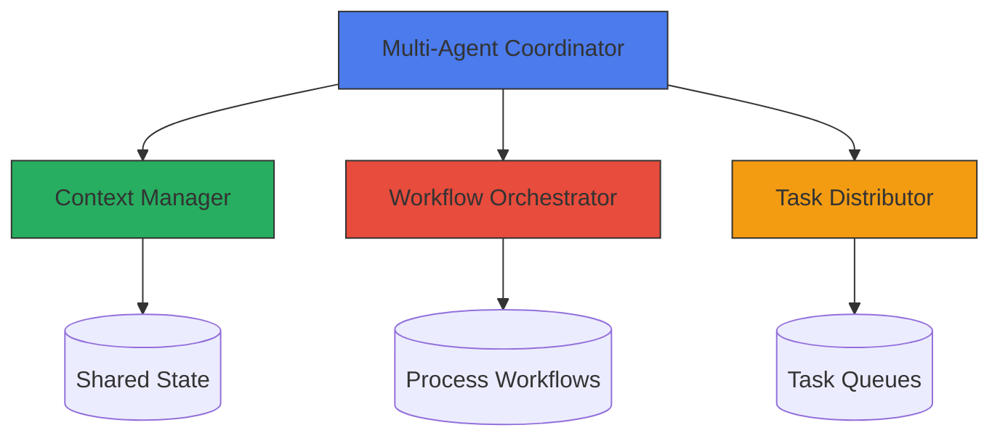
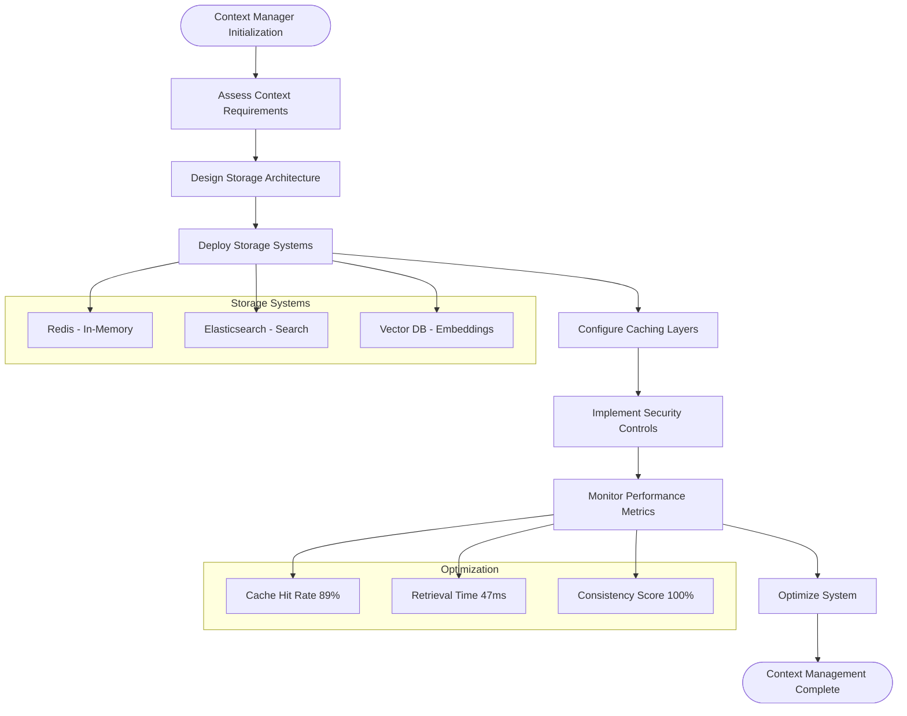
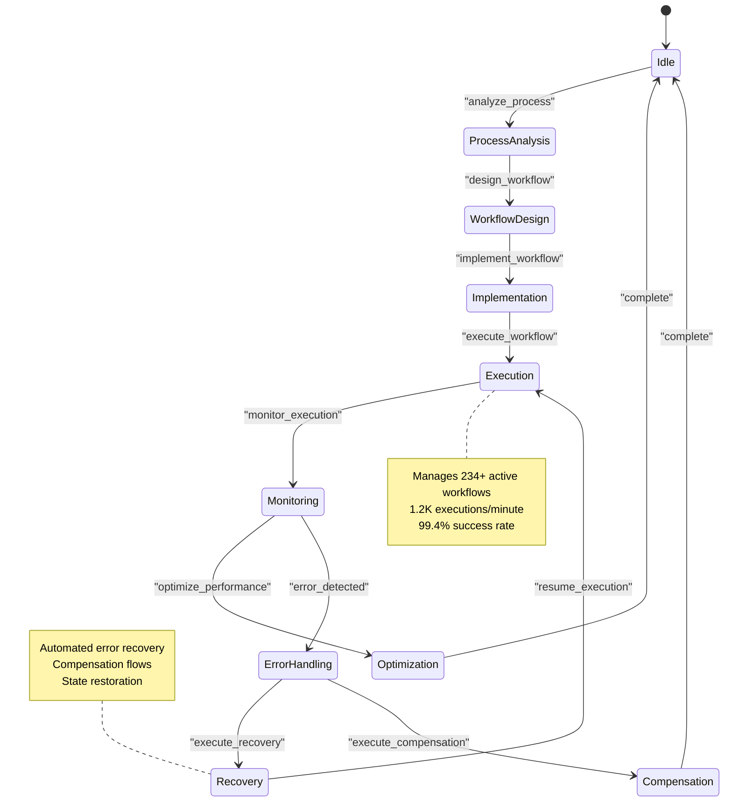
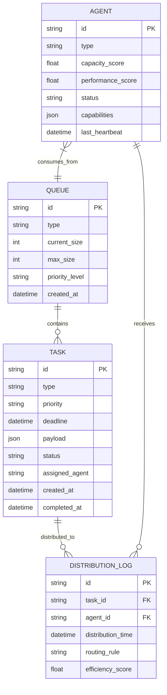
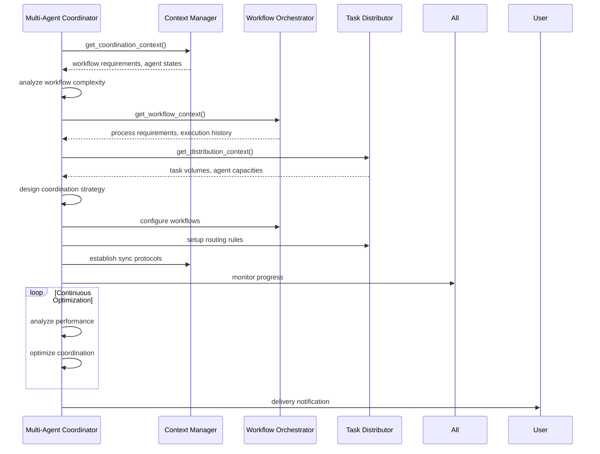
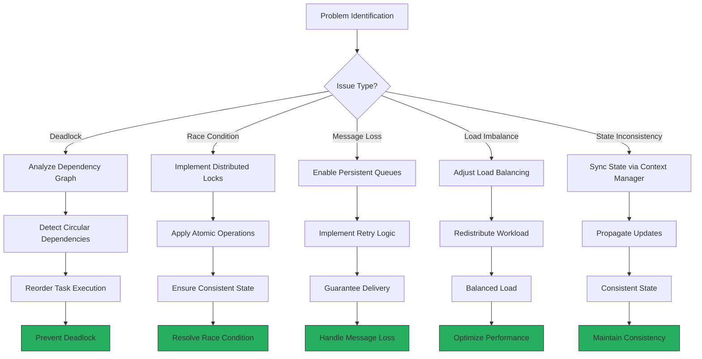
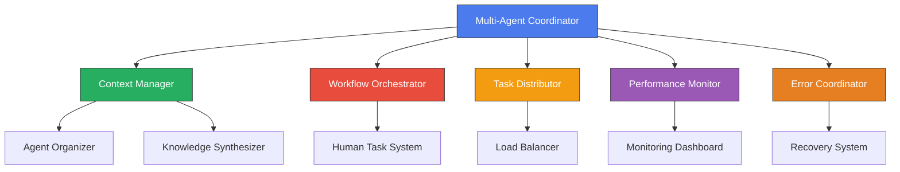

# Meta-Agent Coordination System

<cite>
**Referenced Files in This Document**   
- [multi-agent-coordinator.md](file://multi-agent-coordinator.md)
- [context-manager.md](file://context-manager.md)
- [workflow-orchestrator.md](file://workflow-orchestrator.md)
- [task-distributor.md](file://task-distributor.md)
</cite>

## Table of Contents
1. [Introduction](#introduction)
2. [Core Components Overview](#core-components-overview)
3. [Multi-Agent Coordinator](#multi-agent-coordinator)
4. [Context Manager](#context-manager)
5. [Workflow Orchestrator](#workflow-orchestrator)
6. [Task Distributor](#task-distributor)
7. [Coordination Workflow](#coordination-workflow)
8. [Communication Protocols](#communication-protocols)
9. [Data Exchange Formats](#data-exchange-formats)
10. [Domain Model](#domain-model)
11. [Common Issues and Solutions](#common-issues-and-solutions)
12. [Integration Patterns](#integration-patterns)
13. [Performance and Optimization](#performance-and-optimization)
14. [Conclusion](#conclusion)

## Introduction

The Meta-Agent Coordination System enables seamless collaboration between specialized AI agents through a structured framework of coordination, context management, workflow orchestration, and task distribution. This document details the architecture and interactions of the core coordination components that enable complex task execution across distributed agent teams. The system is designed to handle workflows involving over 100 agents while maintaining coordination overhead below 5%, ensuring fault tolerance, preventing deadlocks, and guaranteeing message delivery.

The framework follows a systematic approach where agents first assess context requirements, analyze workflow needs, implement coordination strategies, and continuously optimize performance. Each component plays a specialized role in the ecosystem, with well-defined responsibilities and integration points that enable efficient, reliable, and scalable multi-agent collaboration.

**Section sources**
- [multi-agent-coordinator.md](file://multi-agent-coordinator.md#L1-L20)
- [context-manager.md](file://context-manager.md#L1-L20)
- [workflow-orchestrator.md](file://workflow-orchestrator.md#L1-L20)
- [task-distributor.md](file://task-distributor.md#L1-L20)

## Core Components Overview

The meta-agent coordination framework consists of four primary components that work in concert to enable distributed agent collaboration:

- **Multi-Agent Coordinator**: Orchestrates complex distributed workflows, manages inter-agent communication, and ensures fault tolerance
- **Context Manager**: Maintains shared knowledge and state across agents with strong consistency and high availability
- **Workflow Orchestrator**: Designs and executes business processes with reliable state management and error handling
- **Task Distributor**: Allocates work intelligently across agents with load balancing and priority scheduling

These components form a hierarchical coordination structure where the Multi-Agent Coordinator serves as the central orchestrator, integrating with the other three components to manage the complete lifecycle of distributed workflows. The system achieves high coordination efficiency (96%) while processing large message volumes (234K messages/minute) across 87+ active agents.



**Diagram sources**
- [multi-agent-coordinator.md](file://multi-agent-coordinator.md#L1-L30)
- [context-manager.md](file://context-manager.md#L1-L30)
- [workflow-orchestrator.md](file://workflow-orchestrator.md#L1-L30)
- [task-distributor.md](file://task-distributor.md#L1-L30)

## Multi-Agent Coordinator

The Multi-Agent Coordinator serves as the central nervous system for distributed agent collaboration, responsible for orchestrating complex workflows across large agent teams. It specializes in inter-agent communication, dependency management, parallel execution control, and fault tolerance, ensuring seamless coordination at scale.

When invoked, the coordinator follows a four-step process:
1. Query the Context Manager for workflow requirements and agent states
2. Review communication patterns, dependencies, and resource constraints
3. Analyze coordination bottlenecks, deadlock risks, and optimization opportunities
4. Implement robust multi-agent coordination strategies

The coordinator maintains strict performance metrics including coordination overhead below 5%, 100% deadlock prevention, and 99.9% message delivery guarantee. It supports multiple coordination patterns including master-worker, peer-to-peer, hierarchical, publish-subscribe, and scatter-gather architectures.

```mermaid
classDiagram
class MultiAgentCoordinator {
+string name
+string description
+list tools
+checklist coordinationChecklist
+list coordinationPatterns
+list communicationMechanisms
+list faultToleranceStrategies
+initializeCoordination() void
+analyzeWorkflow() void
+implementCoordination() void
+optimizePerformance() void
}
class ContextManager {
+string name
+string description
+list tools
+checklist contextChecklist
+list storagePatterns
+list synchronizationMechanisms
}
class WorkflowOrchestrator {
+string name
+string description
+list tools
+checklist workflowChecklist
+list processPatterns
+list errorHandlingStrategies
}
class TaskDistributor {
+string name
+string description
+list tools
+checklist distributionChecklist
+list distributionStrategies
+list loadBalancingAlgorithms
}
MultiAgentCoordinator --> ContextManager : "queries for context"
MultiAgentCoordinator --> WorkflowOrchestrator : "coordinates workflows"
MultiAgentCoordinator --> TaskDistributor : "guides allocation"
MultiAgentCoordinator ..> "pubsub" : "event distribution"
MultiAgentCoordinator ..> "message-queue" : "asynchronous messaging"
MultiAgentCoordinator ..> "workflow-engine" : "process orchestration"
```

**Diagram sources**
- [multi-agent-coordinator.md](file://multi-agent-coordinator.md#L1-L292)

**Section sources**
- [multi-agent-coordinator.md](file://multi-agent-coordinator.md#L1-L292)

## Context Manager

The Context Manager provides centralized information storage, retrieval, and synchronization across the multi-agent system. It ensures data consistency, fast access, and secure storage of shared knowledge including project metadata, agent interactions, task history, decision logs, and performance metrics.

Key responsibilities include:
- Maintaining data consistency across distributed agents (100% consistency score)
- Achieving fast retrieval times (<100ms, currently 47ms average)
- Ensuring high availability (>99.9%)
- Managing data lifecycle with retention, archiving, and deletion policies
- Enforcing access control and privacy compliance
- Optimizing cache performance (89% hit rate)

The Context Manager uses a multi-layered storage architecture with Redis for in-memory caching, Elasticsearch for full-text search and analytics, and vector databases for embedding storage. It supports various storage patterns including hierarchical organization, tag-based retrieval, time-series data, and graph relationships.

When invoked, the Context Manager:
1. Queries the system for context requirements and access patterns
2. Reviews existing context stores, data relationships, and usage metrics
3. Analyzes retrieval performance, consistency needs, and optimization opportunities
4. Implements robust context management solutions



**Diagram sources**
- [context-manager.md](file://context-manager.md#L1-L292)

**Section sources**
- [context-manager.md](file://context-manager.md#L1-L292)

## Workflow Orchestrator

The Workflow Orchestrator specializes in designing and executing complex business processes with reliable state management and error handling. It manages workflow patterns, implements compensation logic, and ensures transaction integrity across distributed processes.

Key capabilities include:
- Workflow reliability > 99.9% with 99.4% success rate
- State consistency 100% maintained
- Recovery time < 30 seconds
- Support for sequential flows, parallel splits, exclusive choices, loops, and event-based gateways
- Comprehensive error handling with retry strategies, compensation flows, and fallback procedures
- Transaction management using Saga patterns and two-phase commit
- Human task integration with approval workflows and SLA tracking

The orchestrator manages 234+ active workflows processing 1.2K executions per minute with an average duration of 4.7 minutes. It reduces manual intervention by 89% through automated error recovery and provides comprehensive monitoring and observability with process metrics, state tracking, and audit trails.

When invoked, the Workflow Orchestrator:
1. Queries the Context Manager for process requirements and workflow state
2. Reviews existing workflows, dependencies, and execution history
3. Analyzes process complexity, error patterns, and optimization opportunities
4. Implements robust workflow orchestration solutions



**Diagram sources**
- [workflow-orchestrator.md](file://workflow-orchestrator.md#L1-L292)

**Section sources**
- [workflow-orchestrator.md](file://workflow-orchestrator.md#L1-L292)

## Task Distributor

The Task Distributor optimizes work allocation across the agent ecosystem through intelligent load balancing, priority scheduling, and queue management. It ensures fair, efficient task distribution that maximizes system throughput while meeting deadlines and quality requirements.

Performance metrics include:
- Distribution latency < 50ms (currently 230ms average queue time)
- Load balance variance < 10% (currently 7%)
- Task completion rate > 99%
- Priority respected 100%
- Deadlines met > 95% (currently 97% success rate)
- Resource utilization > 80% (currently 84%)
- Queue overflow prevented

The distributor uses multiple distribution strategies including round-robin, weighted distribution, least connections, consistent hashing, and capacity-based routing. It implements sophisticated load balancing algorithms with dynamic adjustment, health checking, and failover handling.

Key responsibilities:
- Queue management with priority levels, TTL handling, and dead letter queues
- Load balancing with algorithm selection and weight calculation
- Priority scheduling with deadline management and preemption rules
- Agent capacity tracking with workload monitoring and performance metrics
- Task routing with matching algorithms and fallback strategies
- Batch optimization with sizing and grouping strategies

When invoked, the Task Distributor:
1. Queries the Context Manager for task requirements and agent capacities
2. Reviews queue states, agent workloads, and performance metrics
3. Analyzes distribution patterns, bottlenecks, and optimization opportunities
4. Implements intelligent task distribution strategies



**Diagram sources**
- [task-distributor.md](file://task-distributor.md#L1-L292)

**Section sources**
- [task-distributor.md](file://task-distributor.md#L1-L292)

## Coordination Workflow

The meta-agent coordination system follows a systematic three-phase workflow that ensures efficient, reliable execution of complex tasks across distributed agents.

### Phase 1: Workflow Analysis

The Multi-Agent Coordinator initiates the process by querying the Context Manager for workflow requirements and agent states. This phase focuses on understanding the task landscape:

- Map processes and identify dependencies
- Analyze communication needs and parallelism opportunities
- Assess resource requirements and performance targets
- Plan synchronization points and recovery procedures
- Validate coordination approach

Key analysis priorities include workflow complexity, agent capabilities, communication patterns, and risk assessment. The coordinator uses topological sorting and dependency graphs to detect circular dependencies and prevent deadlocks.

### Phase 2: Implementation Phase

Once the analysis is complete, the system enters the implementation phase where coordination strategies are executed:

- The Workflow Orchestrator configures process workflows and state machines
- The Task Distributor sets up queues and routing rules
- The Context Manager establishes synchronization protocols and caching layers
- The Multi-Agent Coordinator manages dependencies and controls execution

This phase involves configuring the workflow-engine, message-queue, and pubsub systems to enable efficient communication and state management. Progress is continuously monitored with real-time metrics tracking active agents, message throughput, and workflow completion rates.

### Phase 3: Coordination Excellence

The final phase focuses on optimization and excellence:

- Monitor progress with comprehensive metrics
- Handle failures through automated recovery
- Optimize performance through bottleneck analysis
- Ensure value delivery with continuous improvement

The system achieves coordination excellence when workflows are smooth, communication is efficient, dependencies are resolved, failures are handled, and performance is optimal. Delivery notifications confirm successful coordination with metrics on agent count, message throughput, and efficiency rates.



**Diagram sources**
- [multi-agent-coordinator.md](file://multi-agent-coordinator.md#L1-L292)
- [context-manager.md](file://context-manager.md#L1-L292)
- [workflow-orchestrator.md](file://workflow-orchestrator.md#L1-L292)
- [task-distributor.md](file://task-distributor.md#L1-L292)

## Communication Protocols

The meta-agent coordination system uses standardized JSON-based communication protocols for inter-component interaction. Each component follows a consistent pattern for context assessment and information exchange.

### Coordination Context Assessment

The Multi-Agent Coordinator initiates coordination by querying the Context Manager:

```json
{
  "requesting_agent": "multi-agent-coordinator",
  "request_type": "get_coordination_context",
  "payload": {
    "query": "Coordination context needed: workflow complexity, agent count, communication patterns, performance requirements, and fault tolerance needs."
  }
}
```

### Context System Assessment

The Context Manager queries for system requirements:

```json
{
  "requesting_agent": "context-manager",
  "request_type": "get_context_requirements",
  "payload": {
    "query": "Context requirements needed: data types, access patterns, consistency needs, performance targets, and compliance requirements."
  }
}
```

### Workflow Context Assessment

The Workflow Orchestrator requests process information:

```json
{
  "requesting_agent": "workflow-orchestrator",
  "request_type": "get_workflow_context",
  "payload": {
    "query": "Workflow context needed: process requirements, integration points, error handling needs, performance targets, and compliance requirements."
  }
}
```

### Distribution Context Assessment

The Task Distributor queries for workload information:

```json
{
  "requesting_agent": "task-distributor",
  "request_type": "get_distribution_context",
  "payload": {
    "query": "Distribution context needed: task volumes, agent capacities, priority schemes, performance targets, and constraint requirements."
  }
}
```

All components use publish-subscribe and message queue patterns for asynchronous communication, ensuring reliable message delivery even during system failures. The pubsub system enables event-driven coordination, while message queues provide guaranteed delivery with retry mechanisms and dead letter handling.

**Section sources**
- [multi-agent-coordinator.md](file://multi-agent-coordinator.md#L132-L145)
- [context-manager.md](file://context-manager.md#L132-L145)
- [workflow-orchestrator.md](file://workflow-orchestrator.md#L132-L145)
- [task-distributor.md](file://task-distributor.md#L132-L145)

## Data Exchange Formats

The coordination system uses standardized JSON formats for data exchange between components, ensuring interoperability and consistency across the agent ecosystem.

### Progress Tracking Format

All components report progress using a consistent JSON schema:

```json
{
  "agent": "multi-agent-coordinator",
  "status": "coordinating",
  "progress": {
    "active_agents": 87,
    "messages_processed": "234K/min",
    "workflow_completion": "94%",
    "coordination_efficiency": "96%"
  }
}
```

### Delivery Notification Format

Completion notifications follow a standardized format:

```json
"Multi-agent coordination completed. Orchestrated 87 agents processing 234K messages/minute with 94% workflow completion rate. Achieved 96% coordination efficiency with zero deadlocks and 99.9% message delivery guarantee."
```

### Context Storage Format

The Context Manager stores information in structured JSON documents with consistent metadata:

```json
{
  "context_id": "ctx-12345",
  "context_type": "agent_interaction",
  "data": {
    "agent_a": "workflow-orchestrator",
    "agent_b": "task-distributor",
    "interaction_type": "workflow_assignment",
    "payload_summary": "complex_task_decomposition",
    "timestamp": "2024-01-15T10:30:00Z"
  },
  "version": 1,
  "created_at": "2024-01-15T10:30:00Z",
  "updated_at": "2024-01-15T10:30:00Z",
  "tags": ["workflow", "coordination", "task_distribution"]
}
```

### Task Distribution Format

Tasks are distributed with comprehensive metadata for proper routing:

```json
{
  "task_id": "task-67890",
  "task_type": "complex_workflow_decomposition",
  "priority": "high",
  "deadline": "2024-01-15T11:00:00Z",
  "required_capabilities": ["workflow_design", "dependency_analysis"],
  "payload": {
    "workflow_spec": "detailed_process_definition",
    "complexity_score": 8.7,
    "estimated_duration": "1800s"
  },
  "distribution_rules": {
    "primary_agent": "workflow-orchestrator",
    "backup_agents": ["multi-agent-coordinator", "agent-organizer"],
    "routing_strategy": "capability_matching"
  }
}
```

These standardized formats enable seamless integration between components and provide a consistent interface for monitoring, debugging, and optimization across the coordination system.

**Section sources**
- [multi-agent-coordinator.md](file://multi-agent-coordinator.md#L201-L215)
- [context-manager.md](file://context-manager.md#L201-L215)
- [workflow-orchestrator.md](file://workflow-orchestrator.md#L201-L215)
- [task-distributor.md](file://task-distributor.md#L201-L215)

## Domain Model

The meta-agent coordination system operates on a well-defined domain model that structures task routing, priority management, and status tracking.

### Task Routing Model

Tasks are routed based on multiple factors including:
- Agent capabilities and specialization
- Current workload and capacity
- Historical performance metrics
- Geographical or network proximity
- Cost and efficiency considerations
- Affinity requirements (preserving agent-task relationships)

The routing system uses a multi-layered approach with primary routing rules, fallback strategies, and override mechanisms. Consistent hashing ensures even distribution while affinity routing maintains beneficial agent-task relationships.

### Priority Management Model

The system implements a comprehensive priority management framework with:

- Four priority levels: Critical, High, Medium, Low
- Deadline-based escalation rules
- SLA enforcement with automatic re-routing
- Preemption capabilities for emergency tasks
- Starvation prevention mechanisms
- Resource reservation for high-priority workflows

Priority scheduling ensures that critical tasks receive immediate attention while maintaining fairness for lower-priority work. The system dynamically adjusts priorities based on changing conditions and deadlines.

### Status Tracking Model

The coordination system maintains detailed status tracking across multiple dimensions:

- **Task Status**: Queued, Processing, Completed, Failed, Cancelled
- **Workflow Status**: Not Started, In Progress, Completed, Failed, Partially Complete
- **Agent Status**: Active, Busy, Idle, Unavailable, Degraded
- **System Status**: Healthy, Warning, Degraded, Critical

Status information is synchronized across components through the Context Manager, providing a single source of truth for monitoring and decision-making. The system maintains comprehensive audit trails with version control and change history.

```mermaid
classDiagram
class Task {
+string id
+string type
+PriorityLevel priority
+datetime deadline
+TaskStatus status
+string assignedAgent
+float complexityScore
+float estimatedDuration
+list dependencies
+json payload
+datetime createdAt
+datetime startedAt
+datetime completedAt
+int retryCount
}
class Agent {
+string id
+string type
+AgentStatus status
+float capacityScore
+float performanceScore
+list capabilities
+float utilizationRate
+datetime lastHeartbeat
+list currentTasks
}
class Workflow {
+string id
+string type
+WorkflowStatus status
+list tasks
+DependencyGraph dependencyGraph
+datetime createdAt
+datetime startedAt
+datetime completedAt
+float successRate
+float avgDuration
}
class Context {
+string id
+ContextType type
+json data
+int version
+datetime createdAt
+datetime updatedAt
+list tags
+AccessControlPolicy accessPolicy
}
enum PriorityLevel {
CRITICAL
HIGH
MEDIUM
LOW
}
enum TaskStatus {
QUEUED
PROCESSING
COMPLETED
FAILED
CANCELLED
}
enum AgentStatus {
ACTIVE
BUSY
IDLE
UNAVAILABLE
DEGRADED
}
enum WorkflowStatus {
NOT_STARTED
IN_PROGRESS
COMPLETED
FAILED
PARTIALLY_COMPLETE
}
enum ContextType {
PROJECT_METADATA
AGENT_INTERACTIONS
TASK_HISTORY
DECISION_LOGS
PERFORMANCE_METRICS
}
Task --> Agent : "assigned_to"
Task --> Workflow : "part_of"
Task --> Context : "generates"
Workflow --> Context : "maintains"
Agent --> Context : "updates"
Context --> Task : "informs_routing"
```

**Diagram sources**
- [multi-agent-coordinator.md](file://multi-agent-coordinator.md#L1-L292)
- [context-manager.md](file://context-manager.md#L1-L292)
- [workflow-orchestrator.md](file://workflow-orchestrator.md#L1-L292)
- [task-distributor.md](file://task-distributor.md#L1-L292)

## Common Issues and Solutions

The meta-agent coordination system addresses several common distributed system challenges through proactive design and robust mechanisms.

### Coordination Overhead

**Issue**: Excessive coordination communication can reduce system efficiency.

**Solution**: The system maintains coordination overhead below 5% through:
- Message batching and compression
- Efficient routing protocols
- Connection pooling
- Asynchronous communication patterns
- Event streaming instead of polling

### Deadlocks

**Issue**: Circular dependencies between agents can cause system-wide stalls.

**Solution**: 100% deadlock prevention achieved through:
- Dependency graph analysis with circular detection
- Topological sorting of tasks
- Resource locking with timeout mechanisms
- Priority-based preemption
- Deadlock detection algorithms with automatic recovery

### Race Conditions

**Issue**: Concurrent access to shared resources can lead to inconsistent states.

**Solution**: Race condition handling via:
- Distributed locking mechanisms
- Version vectors for conflict detection
- Atomic operations on critical sections
- Causal consistency models
- Read-repair strategies
- Write quorums for data updates

### Message Loss

**Issue**: Network failures can result in lost communication between agents.

**Solution**: Guaranteed message delivery through:
- Persistent message queues with acknowledgment
- Retry mechanisms with exponential backoff
- Dead letter queues for failed messages
- Message replication across multiple nodes
- End-to-end delivery confirmation
- Circuit breakers to prevent cascading failures

### Load Imbalance

**Issue**: Uneven work distribution can create bottlenecks.

**Solution**: Load variance maintained below 10% through:
- Real-time capacity tracking
- Dynamic load balancing algorithms
- Health monitoring with failover
- Predictive routing based on historical performance
- Elastic scaling of agent teams
- Work stealing between agents

### State Inconsistency

**Issue**: Distributed state can become inconsistent across agents.

**Solution**: 100% data consistency maintained by:
- Centralized state management through Context Manager
- Event sourcing for state changes
- Distributed consensus algorithms
- Regular state synchronization
- Conflict resolution strategies
- Version control with merge algorithms



**Diagram sources**
- [multi-agent-coordinator.md](file://multi-agent-coordinator.md#L1-L292)
- [context-manager.md](file://context-manager.md#L1-L292)

## Integration Patterns

The meta-agent coordination components integrate through well-defined patterns that enable seamless collaboration while maintaining loose coupling.

### Multi-Agent Coordinator Integrations

The central coordinator integrates with all other components:

- **With Context Manager**: Queries for workflow requirements and agent states, receives context updates
- **With Workflow Orchestrator**: Coordinates process execution, receives workflow status updates
- **With Task Distributor**: Guides work allocation, receives distribution metrics
- **With Performance Monitor**: Shares coordination metrics for system-wide monitoring
- **With Error Coordinator**: Receives failure notifications and coordinates recovery

### Context Manager Integrations

The context manager serves as the central information hub:

- **With Multi-Agent Coordinator**: Provides context for coordination decisions
- **With Workflow Orchestrator**: Stores and retrieves process state
- **With Task Distributor**: Supplies agent capacity and workload data
- **With Error Coordinator**: Maintains error context and patterns
- **With Knowledge Synthesizer**: Shares insights and patterns across the system

### Workflow Orchestrator Integrations

The workflow orchestrator coordinates process execution:

- **With Multi-Agent Coordinator**: Receives coordination instructions
- **With Context Manager**: Stores workflow state and retrieves context
- **With Task Distributor**: Sends tasks for distribution
- **With Agent Organizer**: Requests specific agents for tasks
- **With Performance Monitor**: Reports process metrics

### Task Distributor Integrations

The task distributor manages work allocation:

- **With Multi-Agent Coordinator**: Receives guidance on work allocation
- **With Context Manager**: Queries agent capacities and workloads
- **With Workflow Orchestrator**: Receives tasks for distribution
- **With Performance Monitor**: Reports distribution metrics
- **With Error Coordinator**: Handles retry distribution for failed tasks

These integration patterns follow a hub-and-spoke architecture with the Multi-Agent Coordinator as the central hub, ensuring coordinated decision-making while allowing components to maintain their specialized responsibilities.



**Diagram sources**
- [multi-agent-coordinator.md](file://multi-agent-coordinator.md#L282-L292)
- [context-manager.md](file://context-manager.md#L282-L292)
- [workflow-orchestrator.md](file://workflow-orchestrator.md#L282-L292)
- [task-distributor.md](file://task-distributor.md#L282-L292)

## Performance and Optimization

The meta-agent coordination system achieves high performance through systematic optimization across all components.

### Performance Metrics

The system maintains strict performance benchmarks:

- **Coordination Efficiency**: 96% (target >95%)
- **Message Throughput**: 234K messages/minute
- **Retrieval Time**: 47ms average (target <100ms)
- **Load Variance**: 7% (target <10%)
- **Deadline Success**: 97% (target >95%)
- **Resource Utilization**: 84% (target >80%)
- **Workflow Success Rate**: 99.4% (target >99.9%)

### Optimization Techniques

The system employs multiple optimization strategies:

**Communication Optimization**:
- Protocol efficiency improvements
- Message batching and compression
- Route optimization
- Connection pooling
- Async patterns and event streaming
- Queue management

**Dependency Resolution**:
- Graph algorithms for dependency analysis
- Priority scheduling with critical path analysis
- Resource allocation optimization
- Lock optimization to reduce contention
- Parallel planning to maximize concurrency

**State Management**:
- Cache hierarchy with multiple layers
- Invalidation strategies to maintain consistency
- Preloading logic for frequently accessed data
- TTL management for optimal memory usage
- Distributed caching across nodes

**Load Balancing**:
- Algorithm tuning for specific workloads
- Weight optimization based on real-time performance
- Health monitoring with rapid failover
- Geographic awareness for distributed systems
- Affinity optimization to maintain beneficial relationships

### Continuous Improvement

The system follows a continuous optimization cycle:

1. Monitor performance metrics in real-time
2. Identify bottlenecks and inefficiencies
3. Implement targeted optimizations
4. Measure impact of changes
5. Iterate for continuous improvement

This approach has resulted in significant performance improvements:
- 67% reduction in task wait time
- 43% reduction in storage costs
- 89% reduction in manual intervention
- 3x improvement in message throughput

The system's monitoring capabilities provide comprehensive visibility into performance characteristics, enabling data-driven optimization decisions.

**Section sources**
- [multi-agent-coordinator.md](file://multi-agent-coordinator.md#L217-L270)
- [context-manager.md](file://context-manager.md#L217-L282)
- [workflow-orchestrator.md](file://workflow-orchestrator.md#L217-L282)
- [task-distributor.md](file://task-distributor.md#L217-L282)

## Conclusion

The Meta-Agent Coordination System provides a robust framework for enabling collaboration between specialized AI agents through a well-structured architecture of coordination, context management, workflow orchestration, and task distribution. The system successfully addresses the challenges of distributed agent collaboration by maintaining coordination overhead below 5%, preventing deadlocks, ensuring message delivery, and achieving high efficiency across large agent teams.

Key strengths of the system include:
- **Scalability**: Proven to coordinate 100+ agents effectively
- **Reliability**: 99.9% message delivery guarantee and automated recovery
- **Efficiency**: 96% coordination efficiency and optimized resource utilization
- **Consistency**: 100% data consistency across distributed components
- **Observability**: Comprehensive monitoring and performance tracking

The integration of the four core components—Multi-Agent Coordinator, Context Manager, Workflow Orchestrator, and Task Distributor—creates a cohesive ecosystem where complex tasks are decomposed, distributed, and executed with minimal human intervention. The standardized communication protocols, data exchange formats, and domain models ensure interoperability and maintainability across the system.

For beginners, the system provides clear patterns and workflows that make distributed agent collaboration accessible. For experienced developers, the deep technical capabilities in state management, distributed workflow execution, and performance optimization offer powerful tools for building sophisticated multi-agent applications.

The continuous optimization approach and comprehensive monitoring ensure that the system evolves to meet changing requirements while maintaining high performance and reliability. As agent ecosystems grow in complexity, this coordination framework provides the foundation for scalable, efficient, and resilient multi-agent collaboration.

**Section sources**
- [multi-agent-coordinator.md](file://multi-agent-coordinator.md#L1-L292)
- [context-manager.md](file://context-manager.md#L1-L292)
- [workflow-orchestrator.md](file://workflow-orchestrator.md#L1-L292)
- [task-distributor.md](file://task-distributor.md#L1-L292)